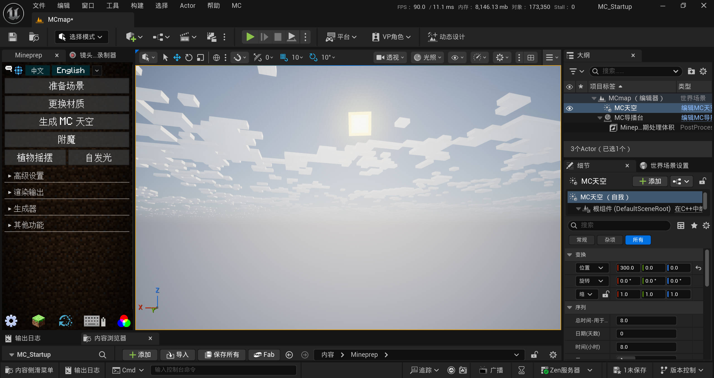

# Unreal-Mineprep

中文 | [**English**](./README_EN.md) | [**繁體中文**](./README_ZH-Hant.md)

✨这是一个正在开发中的UE5插件，继承了 [Blender MCprep](https://theduckcow.com/dev/blender/mcprep/) 的实用功能，并加入一些新的资产，为制作MC动画带来便利

*本插件与Minecraft、MCprep官方没有直接联系，在其建议下插件名称由Unreal MCprep更改为Unreal Mineprep，以避免混淆（0.3及之前的版本已经归档，就不做修改了）。

> 目前还没写使用教程 •ࡇ• —— 在v1.0正式发布前，插件主要供内部使用，不考虑兼容性和潜在的 ~~bug~~ 特性。如果你没有虚幻引擎，可以去Release里下载打包好的内容示例，体验一下插件功能

## 安装方法（适用于0.4+版本）
1、下载Mineprep文件夹，放至虚幻引擎工程文件的content目录下（不要放在其他路径）。  

2、开启以下虚幻引擎插件：
- Python Editor Script Plugin
- Movie Render Queue
- Movie Render Queue Additional Render Passes
- OpenColorlO (OCIO)
- Apple Prores Media
- NiagaraFluids
- Motion Trajectory
- Motion Warping
- Pose Search
- Animation Warping
- Animation Locomotion Library
- Chooser
- Deformer Graph
- Text 3D
- Metasound
- PhysicsControl
- Procedural Content Generation Framework (PCG)
- Mover（当前版本非必须）
- Take Recoder（当前版本非必须）
- Chaos Flesh（当前版本非必须）
- Motion Design（当前版本非必须）

重启虚幻引擎，右键Mineprep蓝图，点击“运行编辑器控件”，此时插件的大部分功能已经可以使用了！

3、下载并安装 [TApython](https://github.com/cgerchenhp/UE_TAPython_Plugin_Release) 和 [DLSS](https://developer.nvidia.com/rtx/dlss/get-started) 以使用植物摇摆等更多功能。这俩需要手动安装，对新手来说会比较麻烦（回忆一下你第一次给MC装模组的情景，装Forge、Fabric等前置插件还是有点困难的。~~哦你说你玩的是基岩版那没事了~~）以后会简化安装流程！

4、下载 [Blender](https://www.blender.org/download/) 并安装 [MCprep](https://theduckcow.com/dev/blender/mcprep/) 插件，然后在Mineprep面板配置Blender路径，以使用放置方块和物品的功能。

5、如果要渲染视频，记得点击插件面板的“初始化视频渲染”然后重启。注意，我们用到了 [ffmpeg](https://ffmpeg.org/download.html) 进行视频编码，它的存放路径也就是你的工程文件路径不能有中文。（点击“实验性功能”并重启，还可以解锁双目立体全景渲染，用不到的话就不用点它）

## 生物
- Mineprep提供了MC原版生物模型，可以通过生成器面板放置；有骨骼网格体和自动化NPC两种类型
- 目前支持的生物有：猪、牛、羊、马（驴、骡、僵尸马、骷髅马）、僵尸、尸壳、溺尸、骷髅、凋灵骷髅、流浪者、沼骸、猪灵、猪灵蛮兵、掠夺者、卫道士、铁傀儡
- “Steve”和“Alex”表示可以更换皮肤的通用玩家模型
- 更多内容正在更新中

## 语言本地化
- Mineprep提供了可拓展的多语言支持，目前插件面板最为完善，有中文/英文/繁体中文，参考MC Java版的标准化译名进行翻译
- 更多内容正在更新中

## 开源协议
- 在制作插件时，我原来用的是GPL-3.0协议，但是发现虚幻引擎源码的用户协议和开源许可证不兼容 (*´･д･)? 所以这里就先不放License文件了。省流的话就是：
- 在大部分情况下，你可以免费使用本插件。
>UE5.4对年收入超过100万美元的影视创作者按席位收费，显然我们不会达到收费门槛hhh（UE5.3及之前甚至不对影视行业收费，但是引擎内容不支持向下兼容，最新的Mineprep只能用于高版本）
- Github上不放开源协议默认为私有，也就是你不能改插件拿去卖钱。在包含引擎源码和官方素材的情况下，UE5的用户协议与开源许可证不兼容。自己改完自己用是可以的
> 热知识: 开源≠公开源代码≠免费，比如你能在Github上找到虚幻引擎源代码，但是它用的是Epic Games自己的用户协议。开源好像是依赖于那个License文件的
- 在这里感谢所有引用到的软件和插件，包括Unreal Engine，Minecraft，Blender，MCprep，FFmpeg，TApython，DLSS等，使用相关内容时也可以去看看它们的要求———例如MCprep要求你拥有正版的Minecraft，虚幻引擎官方素材只能在虚幻引擎中使用。
- 以后考虑做一个Mineprep Lite，只留下准备场景、更换材质等核心功能，没有官方素材和引擎源码。这样安装会简单很多，也能放GPL-3.0协议了

## 版本更新

#### 25w01a
- 新的一年，来一次实用的大更新
- 【实验性功能】材质关键帧按钮  
  - 点击材质参数右边的按钮即可在时间线上添加关键帧！极大简化了操作流程
  - 需要开启Virtual Production Utilities插件。参数面板会展示材质实例中所有打勾的参数
  - 目前支持静态网格体、骨骼网格体的基础材质，以及浮点、向量和纹理贴图三种参数类型
- 更新了附魔组件，能在编辑器中实时显示自定义附魔了，还可以添加材质关键帧
- FPV飞行摄像机现已支持手柄，但是手感一般，按键可能会大改。
  - 左摇杆↑↓:前进/后退，←→:横滚
  - 左摇杆↑↓:俯仰，←→:左右偏航
  - 左扳机下降，右扳机上升
  - 按下左右摇杆急刹

#### 24w52a
- 今年的最后一次快照更新！
- 新增了大量实验性功能，很快就会集成到插件面板中。
  - 用python非侵入式调用C++函数，即使实验性功能损坏，也不会影响原有功能
  - 包括调整编辑器UI缩放，设置预览摄像机窗口，获取鼠标下的文本，启用Tick多线程等内容
  - 在/Plugins/Mineprep内容 文件夹中新增`Mineprep自定义快捷键`蓝图，其中有多个自定义事件。第一个会在后台每隔一段时间（默认0.5s）自动触发，时间间隔可以用控制台命令 Mineprep.TickInterval 设置
  - 新增10个可自定义的快捷键。按键绑定储存在偏好设置的Mineprep条目下，执行的操作保存在“Mineprep自定义快捷键”蓝图中
  - UE4有一个官方的新手教程插件，很可惜它停止更新了。这是个好东西，我把其中一部分功能修好了，以后说不定能添加一些MC动画教程（嗯，应该是1.0版本之后的事了）
- 修复了“nDisplay3D摄像机组”的左右眼视角问题
- 重写了大部分“准备场景”的功能。未来会对常见的实心方块使用单面材质，修复距离场碰撞箱问题，避免粒子穿模。
- 优化了第三人称运动匹配角色（高级运动匹配NPC）的脚步声音效，当没有物理材质时，会尝试从普通材质名判断方块种类。
- 再次优化了编辑器Tick和构造函数相关问题，摇臂摄像机、导轨摄像机等预设素材能在编辑器中正常缓动和追踪目标了。借助Livelink组件，这次是真正实现了编辑器内Tick
- 使用“线程安全更新动画”优化了动画蓝图的性能

#### 24w51a
- 最新发现，方块体积云在场景捕获中颜色异常，需要改进3D摄像机组。为此，我使用UE官方的插件，初步制作了`nDisplay3D摄像机组`,`nDisplay3D渲染配置`。
  - 新方法的显存占用受画质影响较大，推荐使用极高画质，节约显存
  - 分别输出左眼和右眼的图像序列帧，这正好符合达芬奇的3D视频同步模式。
  - 理论上，它能使用两张显卡同时渲染

#### 24w50a
- 修改了所有随机数生成方法，使多次渲染的结果一致
  - 可以在MC导播台设置随机种子
  - NPC生物会从导播台拿随机数
  - 粒子系统在生成时会指定一个随机种子
- 把mineprep_config.ini修改为Mineprep_config.txt，使用json保存更多数据类型，并优化了读取语言翻译的方法
- 我们成功在虚幻引擎编辑器内开启了HDR显示模式！很快会集成到插件面板中。目前优化了HDR渲染输出的lut（轴心0 对比度1.22），使其更符合编辑器内显示效果。
- 优化了调色示波器，在HDR显示模式下会采样指数增长的坐标轴（0，1，10，100，1000，10000），与达芬奇的示波器类似。由于Rec 2100 PQ 的最大亮度为1000nit，示波器会在3/4处截断。
- 修复了放置模型、生物时位置经常不在视图中心的bug。如果放置多个同名模型，会自动添加1、2、3等后缀名以示区分
- 可以在MC导播台初步设置自定义按键映射了
> 小故事：我很快会买一个没有小键盘的轻薄本，自定义按键映射就是为它设计的(～￣▽￣)～ 新笔记本的屏幕很好，这周成功测试了用moonlight串流HDR画面，通过ipv6连上家里的电脑，以后就可以远程制作HDR视频了！不过嘛，寒假里会把它带到国外用，大概是不能远程联机了，那么轻薄本能否带动虚幻引擎的光线追踪呢...

#### 24w49a
- 这两周在多个方面有了重大发现，从安装到使用再到渲染，每一环节都会变得更加方便！
- 用后期处理链图重做了移轴模糊，提升预览质量，支持HDR渲染，还有光圈散景效果。现在所有摄像机的后期模糊由MC导播台统一控制。
- MC导播台可以设置“全局重力”，支持关键帧动画
- 软引用改造基本完成，插件启动速度加快至1~2秒
- 新增方块体积云，源自Nostalgia光影，蓬松柔软又不失方块本色（我最喜欢的体积云！）
- 优化了渲染时的显存占用，普通情况下减少2-3G，双目立体全景渲染能减少8G
> 那么究竟优化了什么地方呢...不知道 (*´･д･)?! UE5似乎会检测MoviePipelineGameMode这个字符串，我从它继承了一个子类，不改功能只改名字，显存占用就明显减少了。目前看来没啥问题
- 好消息！有办法在蓝图中访问更多变量了，很快就能支持在插件面板设置双目立体全景渲染（仍然是实验性功能），之后也不需要把UE5_HDR.cude复制到D盘了。更重要的是，不需要TApython就能使用植物摇摆功能，0.4正式版有望减少前置插件
- 新增`调色示波器`，在编辑器中实时显示直方图、分量图、波形图。很快会修改插件面板，添加更多模块。
- 初步制作了自定义按键映射

#### 24w47a
- 新增了一键渲染按钮——导出视频最简单的一集！
- **一键渲染**  
  `前提`：初始化视频渲染  
  `对象`：当前关卡+打开的根级序列+Mineprep自定义渲染预设  
  `效果`：更新渲染配置，然后直接开始渲染
> 小故事：我一开始用蓝图做这个功能，怎么做都会闪退 X﹏X 上网一查，有人说用python可以解决问题。于是，我重新写了几乎一样的程序......你猜怎么着，它真的不闪退了！
- 继续使用软引用优化插件启动速度，目前已经节约了超过500MB内存。
- 折叠了Readme的快照部分，默认展示大版本更新

#### 24w46a
- 完善了“MC摄像机”的移轴模糊功能
  - 使用后期模糊替代原有景深，可用于正交渲染
  - 能够在水平和竖直方向旋转聚焦平面，沿斜线模糊
  - 将“衰减”设为负数，可以让中间模糊、两边清晰
  - 最终渲染质量比视图预览更高。目前适配了3D渲染，但不支持HDR和全景。
- 修复了软引用未能起到优化作用的bug（还需额外添加异步加载节点），底层重构继续进行中
- “准备场景”功能即将大改——首先，我们会检测选中的模型、材质、纹理有没有重复，在某些情况下大幅提升性能；其次，每个参数都可以通过双击文本来单独运行（比如启用碰撞、重载粗糙度等），具有更高的可控性；最后，修复骨骼网格体和文件夹中网格体一直被忽略的bug

#### 24w45a
- 新增`MC摄像机`，在细节面板可以设置视野、光圈、聚焦距离等参数，之后会以此为模板更新其他的摄像机。高级设置里还可更改透视模式为正交，启用移轴模糊（正在开发中）
- 我们正在给自定义变量添加工具提示，将鼠标放在变量名上即可显示详细信息；同时添加了英语版本作为语言本地化更新的一部分
- 新增一个适用于光线追踪半透明的水材质
- UE5.5就要发布了，Mineprep 0.4将是最后一个支持5.4的版本！在此之前，我们将继续推进底层重构，首先是通过软引用优化插件的启动速度
> 插件面板当前的所有依赖性都是硬引用，会在启动时全部加载到内存中。如果使用软引用，就只会在调用时加载了！

#### 24w44a
- 修复了一些摄像机预设以非16:9分辨率渲染时产生黑框的问题。在编辑器中，它们开启了“约束宽高比”，便于预览可视区域。此次更新后会在渲染时自动解除。
- 为基础人模添加根骨骼碰撞箱，修复了移动“拖拽布偶史蒂夫”时产生大量警告的问题
- 修复了“堆放方块”丢失默认贴图的问题
- 尝试优化方块云、太阳和月亮的材质，用于光线追踪半透明
- 初步制作了起身功能，在后续更新中，当生物瘫痪倒地后，它们能站起来恢复动画
- 初步制作了名为`Mineprep`的uplugin插件，上传到`MC_Startup/Plugins`路径中。把它放到工程文件根目录/Plugins文件夹下，可以自动开启前置插件，简化安装流程

#### 24w43a
- 修复了“缓动导轨摄像机”无法在时间线上预览缓动效果的bug
- 修复了“第三人称运动匹配角色”（高级运动匹配NPC）对手持物品打关键帧无法更换模型的bug
> 是的，UE的变量不会自动与属性关联，这在很长一段时间里只能靠强制刷新构造函数来解决。但是，我刚刚得知，创建一个名为 *Set变量名* 的函数，就能被时间线自动调用了！更多相关bug即将被修复
- 修复了“MC导播台”在同时发出多个命令（按tag搜索actor时），延迟并非最短时间的bug
- 修复了重启虚幻引擎，“MC导播台”没有应用预览画质和帧数上限的bug
- “MC天空”新增“散射分布（各向异性）”属性，数值越大，光源附近的雾越浓，需要开启体积雾才能生效
- 重新制作了`同步玩家摄像机`，可以修改缓动程度，并为之后动态切换角色做好准备
- 初步制作了蜘蛛群粒子模板

#### 0.4-pre2

- 新的里程碑！我们将这几个月的成果投入实际生产，制作了动画视频《史诗级动作优化2》，并带来了许多细节优化和bug修复
- 新增`MC导播台`，与Mineprep后期处理体积一起生成，作为场景的基础模块
  - 在细节面板中，可以分别控制预览画质、预览帧率上限和渲染画质，优化性能或提升质量（所有渲染预设已不再使用过场动画质量设置，转而由MC导播台控制）。预览画质默认为“3+ 极高”，渲染画质默认为“4 影视级”。如果电脑性能较弱，建议把预览画质改为“2 高（快速lumen）”；如果想要减少渲染时的闪烁和残影，进一步提高质量，可以把渲染画质改为“4+ 影视级（增强lumen）”
  - MC导播台可以在时间线上添加事件关键帧，向全场广播命令，例如批量开关灯光、切换NPC动作、开始跑步跳跃等。它能重载信号源位置（指定坐标<指定actor<按tag搜索actor）、调整信号最大传播距离（值为负数则从外向内收缩）、设置传播速度来模拟延迟，还能修改不同命令的专有参数。启用debug后会显示最大传播距离的球体形状
  - 未来，还将添加切换玩家摄像机、动态修改后期处理效果等功能。
- “第三人称运动匹配角色”和NPC生物添加了更多控制方式
  - 新增自定义键控动画，取代了旧版切换表情的功能，并下放至所有NPC。在细节面板指定至多3段动作和3段表情，用键盘1-3切换动作，4-6切换表情。动作还能设置“混合时间”、“播放动作时禁用移动输入”和“NPC循环播放动作1”。如果要产生位移，请确保动作片段具有根运动；特别地，第三人称运动匹配角色需要添加UE_或UEFN_前缀，将动作用于重定向前的官方人模，否则将直接应用于MC人模（没有位移）。
  - 现在能从时间线上调用跳跃、跑步、切换动画、断肢、瘫痪等事件了！（后者属于“小键盘物理事件”，通过指定按键名来触发，默认为0，即瘫痪）
- 生成器面板新增`堆放方块`、`背景生物散布器`，使用PCG插件来程序化生成大量模型
  - 堆放方块默认生成5x5x1的草方块，可以设置悬空放置或自定义曲线区域。默认情况下，它将根据碰撞箱自动吸附到地面上。你可以修改方块模型，例如在地上铺满顶层雪。还可以设置第二种方块和两者的比例，添加偏移或随机旋转。注意，堆放方块没有面剔除，它的性能不适合超大场景。
  - 背景生物散布器将在自定义曲线区域内生成猪、牛、羊、马NPC，可以修改种类、密度等参数。为提高性能，所有简单动物NPC在默认情况下关闭了物理动画交互。
- “附加组件”不再局限于最后选中的actor，一部分功能会应用于所有符合条件的对象了！新增`灯光遥控`，一键添加遥控组件至所有选中的光源（不含日光和天空大气），使其能够被MC导播台批量控制。
> 这个功能是为UE5.5而准备的，新的Megalights大幅提高了性能，能承载成百上千的灯光，宣传片里点亮整个场景的镜头看起来超帅 \~\\(≥▽≤)/\~
- “摇臂摄像机”也有缓动功能了
- 优化了生物模型尤其是手部的碰撞箱
- 新增`小爆炸晃动`、`大爆炸晃动`、`镜头缓慢晃动`
- 新增`流体化自碰撞粒子`
- 其他功能子面板的“辉光”板块新增`卷积辉光`、`卷积散射`，效果更加柔和；“动态模糊”板块新增`FPS`（此帧率越低，快门时间越长，模糊效果越大）；“光程”板块新增`光线追踪半透明（未优化）`，此功能可以改善水和云的光影效果，但有时会带来噪点和bug，之后慢慢优化
- 修复了马的皮肤UV映射问题
- 在“Blender扩展资源”文件夹中上传了新增生物的FBX模型
- 0.4-pre2没有内容示例，预计在寒假更新0.4正式版
- *小故事：这个版本的主题叫“足迹与故事”，按照最初的计划有两次大更新 —— “足迹”指运动匹配，“故事”指镜头语言，分别对应0.4-pre1和0.4正式版。至于0.4-pre2，是趁着暑假给插件来了个底层重构，现在看看，新东西倒也不少。接下来一段时间，会重点更新摄像机和运镜方面的内容啦~*

 📜展开快照 

  
#### 24w39a
- “第三人称运动匹配角色”和NPC生物现已支持切换重力方向，可以飞檐走壁，在墙和天花板上移动了！
  - 细节面板的高级设置中有初始重力方向，默认为(0,0,-1)
  - 使用键鼠操控角色时，可以按小键盘的“+”改变重力，新方向垂直于面前的平面向内
  - 新功能产生了许多~~bug~~特性，先不列出来了，等下慢慢修......倒挂在天花板上还好一点，墙上的问题比较多，目前尝试锁定头部旋转并关闭生物之间的RVO避障
- 新增官方宣传片风格的走路和跑步动画
- 猪、牛、羊默认关闭物理交互，因为跑步时碰撞箱有点问题
- “第三人称运动匹配角色”新增头发选项，有身前和身后两种样式，支持自定义皮肤（需要内层皮肤有头发纹理）。同时，派生出“第三人称运动匹配玩家”和“Alex长发大眼睛高级NPC”两个子类，前者用于游戏模式，不在父类调整参数了；后者用于生成器，使用MC_Head_Eyes及其眨眼表情动画
- 新增`动态体积雾`，可调整浓度、缩放、颜色、运动速度和方向。现在，放置“MC天空”和体积雾/体积光时会检测对方是否存在，自动打开体积设置并将雾浓度保持在0.015以上。
- 新增`缓动导轨摄像机`，预先将摄像机绑定到导轨上，通过拉曲线编辑移动路径。运动时还会有缓动跟随效果，使镜头平滑、稳定。这个和摇臂摄像机不一样，只有在游戏/渲染中才能使摄像机追踪目标，在时间线上刷新构造函数会丢失缓动效果。***0.4正式版（24w43a）已修复此问题！***
- 开放了“HDR静帧_2K_avif”的部分参数，在UE渲染面板的右下角可以看到它们，重载分辨率、暖场帧和渲染的帧数。

#### 24w38a
- 本周带来了HDR渲染、语言本地化以及多个方面的重大更新
- 新增`牛`、`羊`两种生物
- 物理交互动画使用Physical Animation组件重做，现在“物理交互时锁定双脚”选项已更新为`局部禁用物理模拟`,可以自己添加所需骨骼；人形生物默认锁定两脚，猪羊牛马锁定四脚。
- 其他功能子面板的“色彩管理”选项下新增`EV100`，可设置自动曝光的上下限，对手动曝光没有影响
  - 这个好像是摄影那边的术语，操作逻辑有点怪，在暗处减小最小值可以提高亮度，在亮处减小最大值也是提高亮度。
  - 示例1：在夜晚增大最小值，可降低环境亮度，防止自动曝光变得像白天一样亮
  - 示例2：在洞穴和峡谷中，可减小最小值，提高亮度，光影质感会很不错，先是山有小口，仿佛若有光...复行数十步，豁然开朗
- “MC天空”有了白天、清晨、夜晚、浓雾四个预设，可以多次点击“生成MC天空”按钮来切换，优化了日夜交替时的天空颜色
  - 前二者EV100 Min=-3，后二者EV100 Min=0，清晨和浓雾默认启用了`体积雾（丁达尔光）`选项，对性能消耗比较大
- 新增`丁达尔体积光`预设，可通过生成器放置到场景中，有聚光灯/面光/点光三个选项，可设置亮度、颜色、光束变化速度等参数。需要环境中有体积雾
> 在详细阅读了虚幻引擎官方文档后，我发现HDR渲染（启用OCIO后）会自动禁用色调曲线，结果相当于相机拍摄的RAW素材...难怪色彩比视图中差了很多！终于，在历经了半年的探索后，新一代HDR渲染方案来了
- 通过一级调色还原lut极大改进了HDR渲染的色彩；渲染输出模块新增AV1视频编码、线性颜色选项和`HDR静帧_2K_avif`影片图渲染预设。
  - AV1需要很新的显卡（比如40系）才支持硬件加速，一般用H265就行，我看ffmpeg支持AV1就顺便把它加进来了(ノ´・ω・`)ノ
  - 在视频编码阶段，会通过`UE5_HDR.cube`文件对HDR画面进行调色。这是一个3D lut，用达芬奇制作，旨在还原色彩，参数也比较简单：第一个节点对比度1.25 轴心0.05；第二个节点对比度1.05 HDR色轮highlight 0.05
- `HDR静帧_2K_avif`采用了UE5.4新的影片图渲染功能，需要在渲染队列点击“替换为图（实验性）”找到它。
  - 只渲染时间线最开始的1帧（之前会有30帧暖场），使用2560*1440分辨率，输出avif图片，采用Rec2100 PQ色彩变换和还原lut
  - 出于技术原因，目前不能从Mineprep插件面板修改其中的参数，必须写死文件路径和文件名。因此在初始化视频渲染时会把“UE5_HDR.cube”复制到D盘根目录。
  - avif可以看作单帧av1，这里使用通用的cpu编码，不过貌似会把输出日志当报错信息弹出...总之在文件夹里能看到成功渲染的图片
> Windows建议使用chrome浏览器查看avif，记得要开启HDR显示；苹果原生支持avif（但是不支持av1视频），亮度会随屏幕亮度而明显变化
- HDR_2K_exr渲染预设更改为`【线性】2K_exr`，双目立体全景渲染从exr更改为`【实验性】VR_3D-FTB_8K_jpg`
  - 带着Rec2100 PQ的“Raw” exr太少见了，通常用的是线性和ACES；另外单独渲染序列帧是没有调色的，所以双目立体全景渲染退回jpg了（双击点进去也能改回exr输出）。
- 新增`HDRI全景贴图_8K_exr`渲染预设，使用8640*4320分辨率，输出单帧全景图（没有暖场），采用线性色彩变换和DWAA压缩的exr编码。
- 完善了语言本地化系统，新增对繁体中文的支持，为更多语言预留了扩展空间，详见Readme的“语言本地化”板块（正在编写中）

#### 24w37a
- `骷髅`，`凋灵骷髅`，`流浪者`，`沼骸`，`猪`，`马`，`铁傀儡`现已加入Mineprep！
  - 这些生物有专用皮肤，与普通玩家皮肤不兼容。它们依然使用的是同一套骨骼，但是身体尺寸不一样，因此有单独的动画库。如果要在不同生物之间迁移动画，建议使用自动重定向。
  - 从“简单运动匹配NPC”派生出`简单动物NPC`作为四脚生物的父类
  - 骷髅、流浪者和沼骸的NPC手持弓，凋灵骷髅手持石剑
  - 马包括多种颜色和`驴`、`骡`、`僵尸马`、`骷髅马`的皮肤。
- 新增`MC_Head_Eyes`头部模型，有着两格大眼睛，可以添加表情动画
- 第三人称运动匹配角色（高级运动匹配NPC）添加了`披风贴图`和`披风/鞘翅`选项，0表示禁用，1是MC原版披风，2是布料模拟披风，3是鞘翅（暂未实装）。默认的贴图是MC15周年苦力怕披风，其中包含了鞘翅的纹理，更换时应该使用同样规格的贴图。
> 由于虚幻引擎的特性，布料模拟只能与具有简单碰撞的Worldstatic物体进行交互
- 所有NPC都能设置潜行/走路/跑步速度了，并添加了`面向玩家/目标`选项，可以自动转头面向附近的角色
- 优化了“MC天空”的性能和方块云夜晚闪烁问题，现在可以在时间线上制作关键帧动画，新增光照强度、柔和阴影、体积光、雾气等控制参数
- 初步制作了自定义眼睛材质和边缘高光材质

#### 24w36a
- 本周对生物和NPC系统进行了大翻新，使用继承父类的方法整合了许多资源，引入物理交互动画。
- 在头身分离绑定的基础上，重做了第三人称运动匹配角色，派生出`高级运动匹配NPC`；重做了简单运动匹配NPC，派生出各种生物子类。
- 所有生物在细节面板可开启`物理交互（纠正穿模）`和`物理交互时锁定双脚`选项，运动时身体能与环境和其他生物碰撞交互。
  - 只有在游戏/渲染时能进行物理交互，编辑器视图不可见
  - 目前有一个~~bug~~特性，局部断肢会导致上半身全部萎掉 (ﾟД ﾟ;) 因此玩家控制的第三人称运动匹配角色默认关闭物理交互，NPC默认开启。
- 新增`猪灵`，`猪灵蛮兵`，`卫道士`，`掠夺者`及相关动作库。
  - 在放置NPC时，猪灵默认手持金剑，猪灵蛮兵手持金斧，卫道士手持铁斧，掠夺者手持弩。
  - 猪灵的耳朵会自动摆动，灾厄村民多了一个控制鼻子的骨骼，但各种生物的表情动画有待更新
- 新增路标引导NPC功能：在细节面板添加场景中的物体作为路标，NPC会依次前往这些路标；勾选“循环”后，会从最后一个路标返回第一个路标，重新开始
- 又修复了模块化绑定的腿部朝向bug...平时我没动它来着，好像是UE版本更新出的问题
- 彻底修复了“摇臂摄像机”和“3D摄像机组”无法在编辑器视口更新关键帧动画的bug。插件面板的“强制刷新构造函数”按钮现已弃用。

#### 24w35a
- 0.4-pre2将对插件进行大翻新，本周已经开始底层重构了！注意新版本与旧版本不兼容，而且无法通过替换单个文件的方式来更新特定资产
- 插件根目录文件夹由MCprep改名为Mineprep（已经修了很多损坏的依赖项了，希望不要出bug qwq）
- 插件面板的按钮增加了撤销功能，可以按Ctrl+Z撤销，Ctrl+Y恢复。准备场景、更换材质等部分按钮暂时还无法撤销
- 插件子面板被拆分为单独的控件，再整合到Mineprep面板中（主要是提升开发时的流畅度，对使用者没有影响......希望不要出bug qwq）
- 整个生物模型和角色系统将大改。目前添加了`头身分离绑定基础生物模型`，可以自由搭配身体和头颅，例如MC_Body+MC_Head就相当于MocapCarrier。在时间线上制作动画时，能够分离控制动作和表情，不需要把表情的插槽名称改为“f”了。
- 新的模型修复了权重绘制的bug，断头之后继续向前跑，身体不会被拉伸

#### 0.4-pre1

- 新的里程碑(*・ω・)ﾉ 我们在这一周修复了大量bug并带来几个新功能，稍后将上传打包的exe示例文件，包含0.3和0.4-pre1的所有内容，作为正式的Release发布
- mcprep_data.json已更新至1.21版本，与刚刚发布的MCprep 3.6同步。默认资源包尚未更新
- 插件面板的“启用碰撞”选项旁边添加了`复杂碰撞`选项，默认开启，之前的准备场景也都在用复杂碰撞；如果要进行物理模拟，请关闭此选项，再对选中物品使用准备场景。此外还增加了三个新功能：
- **重载材质**  
  `对象`：视口选中项  
  `效果`：搜索单个静态网格体或包含骨骼网格体组件的蓝图，把所有材质替换为你指定的材质。若没有指定材质，则不会替换。  
  `可选项`：材质、覆层材质、物理材质
- **处理录制的动画**  
  `对象`：打开的关卡序列  
  `效果`：搜索时间线上的“第三人称运动匹配角色”，寻找录制的动画，尝试修复旋转问题。（这个bug终于被我找到了，由于MC人模是在运行时重定向到官方运动匹配角色，所以会记录两次关键帧动画，把MC人模的旋转清零能在一定程度上解决空转镜头的问题）。
> 以下是第一个实验性功能，也是第一个包含C++代码的内容。  
> 上周刚发现官方隐藏的VR+3D渲染功能，这周就迫不及待地想要端上来力 -- 请谨慎使用实验性功能，按下按钮后会先弹出一个详细的介绍与警告，需要确认才能运行
- **实验性功能**  
  `前提`：UE版本5.4，操作系统Windows（否则需要在打开工程文件时从源代码编译插件，尚不清楚是否需要Visual Studio）  
  `对象`：Movie Render Queue Additional Render Passes插件  
  `效果`：将改写后的新插件解压并移动至工程文件根目录的Plugins文件夹下，重新启动时会优先从这里加载插件。全景渲染中的Stereo、Eye Separation和Eye Convergence Distance选项已经解锁，可以输出双目立体全景渲染，其他渲染预设不受影响。暂未将其加入插件面板的自定义渲染配置。  
  `可选项`：是/否
- 新的渲染预设`【实验性】VR_3D-FTB_8K_HDR_exr`，需要开启实验性功能  
  - 使用8640*8640分辨率，输出上下并列的Full Top-Bottom全景序列帧，采用Rec2100 PQ色彩变换和DWAA压缩的exr编码。既然要做这么高规格的渲染，那各项参数都拉满吧
  - 一帧约35MB，需要约40G的显存+共享内存......这真不是普通电脑能带的动的qwq（exr已经比png小很多了）
- 继续修复渲染预设和人物碰撞bug
- “光程”面板新增了`漫反射增强`滑条，可以增加间接光照明强度
- 现在可以场景中放置多个“软体史蒂夫”了
- “FPV飞行模式”的反转鼠标Y轴快捷键改为Tab
- “第三人称运动匹配角色” 添加了自动爬墙的选项（即两格高方块），默认开启；可以在运行时按Tab关闭
- “第三人称运动匹配角色”和“简单运动匹配NPC”都有了手持物品槽，还可以通过小键盘按键开启物理模拟。  
  “0”-全身瘫痪  “.”-开/关重力  “2”-物品脱手   
  “4”-断左臂  “1”-断左腿  
  “6”-断右臂  “3”-断右腿  
  “8”-断头  “5”-全身断开  
  - 使用镜头试拍录制器记录动画时，如果要扔出手持物品，请添加“Nearby Spawned Actors”，之后需要在时间线中手动指定扔出物品的模型。这是目前最好的办法，因为直接让原物品脱手会发生抖动，生成新物品反而比较稳定。
> 以上快捷键可能需要打开小键盘的Num Lock
- 生物的细节面板新增了“NPC跑步跟随目标”选项和几个原版跑步动画。
- 新增“待机-跟随AI控制器”
- 尝试修复镜头试拍录制器无法录制角色摄像机旋转的bug。
  - FPV飞行摄像机一直都能录制旋转
  - MC第一人称摄像机现在能录制除了镜头晃动以外的旋转
  - 而第三人称运动匹配角色比较麻烦，要用生成器放置一个`同步角色摄像机`，再添加到录制面板里，它会同步并记录玩家摄像机的旋转。如果录制的动画有几帧卡顿，那么就把这几个关键帧删掉，平滑过渡。渲染器记得切换时间线绑定的摄像机。
- “MC天空”现在可以设置云的移动方向和速度，同时增大了光照的级联阴影距离，使过渡更平滑
- “准备场景”会根据方块名称来添加音效物理材质了。现在有grass，gravel(dirt)，sand，snow，stone，wood六类，没有匹配成功都视作石头。“第三人称运动匹配角色”在上面行走时会播放对应的脚步声音效。注意，整个音频渲染模块还在早期开发阶段，目前只能听个响
- 新增`光滑物理材质`，`弹性物理材质`，和之前的“高摩擦力物理材质”一起影响开启了模拟物理的对象。
- 取消了“可交互2D水面”的材质接口，因为水材质需要专门的模块才能绘制波浪，随便换一个不管用。同时将它的碰撞对象从Actor改为组件，修复了碰撞失效的bug
- 修复“灯光排除”对内部组件无效的bug
- “LOD&Nanite”功能的“2x增强网格体距离场”和“启用Nanite”选项在默认状态下禁用，这俩运行起来特别卡，感觉第一个关闭阴影更实用一些
- 插件面板弹出框现已支持英语，Github Readme也翻译了一部分英语 —— 是的，你点最顶上那个English按钮不会跳到404页面了，最古老的bug终于被修复了!

 📜展开快照 

#### 24w30a
- Mineprep 0.4-pre1就要发布了，这是最后一次快照更新，加入新功能并修复bug~
- **强制刷新构造函数**  
  `对象`：最后一个视口选中项  
  `效果`：每隔一段时间刷新选中的物体，使其在编辑器中不断更新状态。如果帧数下降，可以勾选“中止”打断程序运行。例如，之前摇臂摄像机的关键帧动画不能触发追踪模块，现在可以使用此功能强制刷新了。  
  `可选项`：时长(s)，间隔(s)，中止(勾选框)
- 修改了所有骨骼的碰撞设置，修复穿模和面部扭曲的bug
- 新增`软体史蒂夫`，使用骨骼模拟物理+Niagara变形制作而成，目前只能在场景中放置一个实例，之后会继续更新。
> 我们还尝试用Chaos Flesh做软体模拟，但是bug更多了，暂时不会加入插件面板
- 新增`下雪粒子`
- 新增`MC文字`，需要开启Text 3D插件，放置到场景中可以修改文本、颜色等属性。
- 在视频渲染模块中添加了“-tag:v hvc1”。H.265分为hev1和hvc1两种模式，苹果不支持之前默认的hev1，现在指定为hvc1。
- 全景渲染预设的DLSS Quality已更改为DLAA，能显著提升质量，同时将横向采样数改为4、横向视野设置为120°，渲染前采用10帧显式暖场帧，以节约显存并加快速度。
> 好消息：官方为全景渲染插件做了3D输出功能；坏消息：不知为何它被隐藏起来了，需要修改插件源码才能启用。目前Mineprep不包含C++模块，我们考虑在0.4pre-1之后加入新功能，也许就能输出VR+3D+HDR的超高规格视频了！
- “MCprep自定义渲染配置”改名为“Mineprep自定义渲染配置”，同时修改预设分辨率，“VR全景_4K”改为4320x2160（因为4K又叫2160p，通常以短边为基准），“VR全景_8K”改为8640x4320
- 修复了暖场帧、HDR视频编码等bug

#### 24w29a
- 本周更新了放置生物功能和NPC运动系统，旧版运动匹配角色也重生啦。在背景中放几个生物，无需编辑动画，它们就能动起来，给场景增添几分生机 ╰ \*°▽°\* ╯
- “放置生物”现已实装，具体参见24w28a介绍。目前支持的生物包括之前的所有人模 + 僵尸、尸壳、溺尸
- 修复了“MC_UE模块化绑定”的左臂凸起和腿部旋转问题
- 新增了AI控制器和相关的黑板、任务模块，可以让NPC生物自行游荡或跟随目标。若在场景中放置了导航网格体，它们会跟着导航走。
- 旧版运动匹配角色重新启用，更名为`简单运动匹配NPC`。它具有AI控制器，运行游戏或渲染时会自己走动。新增了MC原版玩家和僵尸的动作库
- 新增`下雨粒子`，运行在GPU上，可以实时生成大范围降雨，模拟MC原版风格的雨滴和水花。
- “附加组件”新增添加标签功能。`“collider” tag`会对物体及其所有组件添加碰撞标签，可以与水交互。`“通用跟踪目标” tag`会添加标签与AI感知刺激源组件，使该物体成为NPC跟随的目标

#### 24w28a
- 本周更新了“生成MC天空”，“放置生物”，“预设素材”和多个新功能！可以在生成器面板放置生物（暂未实装）、粒子、摄像机、传送门等各种素材了
- **生成MC天空**  
  `对象`：MC天空  
  `效果`：清除场景中的默认光照和大气，添加“MC天空”蓝图。它具有方块形状的云、太阳和月亮，可以更改时间、角度等设置。之后会继续更新  
- **放置生物**  
  `对象`：选定的生物  
  `效果`：尝试在屏幕中心15m内检测地面，如果检测到了就把生物放到地面上，没有就放在前方的空中。放置的生物是从基本骨骼或蓝图角色衍生而来，更换其皮肤、动画库、AI控制器等属性。对于骨骼网格体，会把缩放设置为0.95并添加“collider” tag；对于NPC生物，会随机设置旋转。  
  `可选项`：生物名称(支持多语言)，过滤名称  
- **预设素材**  
  `对象`：选定的蓝图  
  `效果`：尝试在屏幕中心15m内检测地面，如果检测到了就把预设素材放到地面上，没有就放在前方的空中。  
  `可选项`：蓝图名称(支持多语言)，过滤名称  
- 新增了`末影粒子`，`爆炸粒子`。末影粒子必须要通过“附加组件”绑定到生物或模型上，向外持续散发紫色粒子。爆炸粒子则是在一瞬间产生TNT爆炸效果，可以单独放置或绑定
- 点击语言选项前面的图标，可以直接打开“语言本地化_language_localization.csv”文件
- 渲染输出名称前面有了重置按钮。点一下会自动更新为“{时间线名称}\_{分辨率}\_{帧率}\_[是否HDR]\_[是否VR]\_[3D({瞳距}mm,{视场}°,[是否FSBS])]”。若未打开时间线则不会更新
- 绑定3D摄像机组会自动添加到时间线

#### 24w27a
- 本周对插件的多个方面进行了更新，包括人物模型、3D渲染、生成器、语言本地化等内容
- 修复了所有人物模型（除模块化绑定外）左臂弯曲会略微凸起的问题
- 最近发现Blender的形态键可以导出到虚幻引擎！由此可以制作直角弯曲的四肢以及表情变形动画。除模块化绑定外，所有人模都已经添加了变形目标(即形态键)，稍后会制作动画蓝图。
- 新人模 `MC_Bent`  
  - 骨架与MocapCarrier相同，四肢具有形态键，通过动画蓝图的驱动器实时变形，实现直角弯曲。
  - 小臂和小腿锁定了Y轴和Z轴的旋转，小腿X轴旋转限制在75°以内
  - *形态键可能导致材质法向出现问题，目前没有完美的修复方法，有时会出现异常的光滑/阴影。更换材质时建议添加微弱的自发光
- 以上模型的FBX文件已更新到“Blender扩展资源”文件夹中
- 语言本地化更新：借助python脚本，现在能从csv文件中实时读取文字，不需要导入为表格了
- 生成器面板新增 `附加组件` 按钮，之后还会制作 `放置生物` 和 `预设素材`。它们的选项框具有多语言支持，放置的东西也会重命名
- **附加组件**  
  `对象`：最后一个视口选中项  
  `效果`：把选定的物品绑定到对象上。可能是直接添加为组件，也可能是在场景中生成新物品，比如最新的“3D摄像机组”  
  `可选项`：物品名(支持多语言)，过滤名称
- 修复了渲染输出面板和渲染预设的一些bug。现在渲染前会有30帧暖场帧，中途取消不会跳过视频编码了
- 新增 `3D（FSBS）自定义渲染配置` ，`3D摄像机组` 蓝图，插件面板的 `红蓝3D叠加输出` 选项
  - 当你按照普通的流程制作了一个镜头后，可以快速输出3D视频：首先选中当前摄像机，然后在生成器面板使用“附加组件”绑定3D摄像机组，接着在渲染输出面板设置参数，最后使用“3D（FSBS）自定义渲染配置”导出视频，这样就搞定了
  - 默认输出是左右眼画面并排的Full Side By Side格式，横向分辨率变为2倍，适合后期调色、合成苹果的空间视频。勾选“红蓝3D叠加输出”后，会生成目标分辨率的滤色视频，适合带上3D眼睛观看。
  - 支持HDR，不支持全景渲染和Alpha通道，采样数恒为1，渲染压力为普通视频的2~3倍。**始终建议在插件面板修改渲染参数，最终画面的色彩可能会有些许不同**
  - 3D摄像机组可以设置“目标摄像机”，“用tag获取摄像机”，“瞳距（mm）”，“预览时捕获每帧”，“预览分辨率（默认540p）”。放置到场景中后，会展示左右眼分别看到的画面和红蓝3D叠加画面。它会自动绑定到选中的摄像机，修改焦距、后期处理配置等参数。绑定函数首先在场景中搜索具有tag的物品（默认tag为“3D”），把它设置为目标摄像机。如果没有，读取你选定的目标摄像机（值为空则在场景中寻找摄像机）。目标摄像机如果是普通摄像机/电影摄像机/包含摄像机的蓝图，就会与之同步；如果目标摄像机是个模型，就只会绑定旋转和位移。
> 时间轴摄像机和镜头试拍录制器记录的动画会在关卡开始时刷新，因此只绑定目标摄像机会丢失对象。建议添加tag“3D”，或者使用“附加组件”功能，一键配置目标摄像机和tag

> 3D渲染需要记录左右眼画面，性能消耗大。视图卡顿的话可以关闭“预览时捕获每帧”

#### 24w26a
- 我们重新设计了插件面板并添加了许多新功能
  - 插件面板从MCprep改名为Mineprep，包含`高级设置`，`渲染输出`，`生成器`，`其他功能`四个子版块
  - “高级设置”里会显示`材质包路径`，默认为MC原版材质，已经包含在“插件贴图”文件夹中。当点击“更换材质”功能时，会写入你所选择的材质包文件夹；如果中途取消，会终止程序并回到默认材质。你也可以手动输入材质包路径。
  - 当你配置了Blender路径并安装MCprep插件后，可以使用“生成器”的`放置方块`、`放置物品`功能，远程调用Blender获取模型然后摆放到场景中。名称从材质包中加载，所以会显示英文名。
  - “其他功能”包含原来的灯光排除、LOD&Nanite功能；新增了`辉光`、`动态模糊`、`光程`、`色彩管理`选项，能够像Blender一样快速调整画面效果。它会首先在场景中生成一个“Mineprep后期处理体积”（如果已经有了，就读取其中的值），范围是无限，优先级是9（高于普通的后期处理体积），然后设置里面的参数。
- **放置方块**  
  `前提`：安装Blender和其中的MCprep插件，配置Blender与材质包路径  
  `对象`：选定的方块（来自材质包）  
  `效果`：导入并放置选定的方块。首先会在工程文件根目录创建一个空的cache文件夹，然后在后台启动Blender，发送一串命令，远程调用MCprep生成方块，导出FBX模型到cache文件夹中，最后导入虚幻引擎。若4秒内没有检测到模型，程序会终止。导入后先尝试在屏幕中心15m内检测地面，如果检测到了就把方块放到地面上，没有就放在前方的空中。  
  `可选项`：方块名，材质包路径，过滤名称  

- **放置物品**  
  `前提`：安装Blender和其中的MCprep插件，配置Blender与材质包路径  
  `对象`：选定的物品（来自材质包）  
  `效果`：导入并放置选定的物品。大致流程同上，在Blender中生成模型时会把厚度设置为0.075然后应用实体化修改器  
  `可选项`：物品名，材质包路径，过滤名称

- **过滤名称**  
  `前提`：材质包路径有效  
  `对象`：生成器的所有选项框  
  `效果`：根据你输入的名称，筛选出包含这些字符的选项。尽管“放置方块”的单词之间有下划线，过滤名称时请使用空格隔开

- **辉光**  
  `对象`：Mineprep后期处理体积  
  `效果`：实时更新辉光强度和阈值。当取消勾选时退回到UE5默认辉光设置，同时也会保留修改后的值  
  `可选项`：强度、阈值

- **动态模糊**  
  `对象`：Mineprep后期处理体积  
  `效果`：实时更新动态模糊强度和最大值。当取消勾选时退回到UE5默认设置，同时也会保留修改后的值  
  `可选项`：强度、最大值
> 注意，动态模糊仅在游戏和渲染模式下可见，视图编辑器好像没效果

- **光程**  
  `前提`：在项目设置里开启lumen硬件光线追踪  
  `对象`：Mineprep后期处理体积  
  `效果`：把光线光照模式改为“反射的命中光照”，实时更新反射次数和折射次数。这可以用于镜子的多重反射。当取消勾选时退回到UE5默认设置，同时也会保留修改后的值  
  `可选项`：反射次数、折射次数

- **色彩管理**  
  `对象`：Mineprep后期处理体积  
  `效果`：启用自动曝光时把曝光补偿设置为1，关闭自动曝光时把曝光补偿设置为11；实时更新曝光补偿、阴影对比度、高光对比度。当取消勾选时退回到UE5默认设置，同时也会保留修改后的值  
  `可选项`：自动曝光（勾选框）、曝光补偿、阴影对比度、高光对比度

#### 24w25a
- 0.4版本的第一个快照！虚幻引擎官方发布了运动匹配示例场景，我们很快移植到了MC角色上
- 旧版运动匹配蓝图已弃用，暂时保留在依赖文件夹里。取而代之的是新版`第三人称运动匹配角色`。
  - 可以像MC一样用WASD移动角色、shift潜行、ctrl加速、空格跳跃等等。
  - 角色具有运动匹配功能，会自动从动画库中挑选合适的动画播放，通过运行时重定向把动画应用于MC人模。
  - 默认皮肤是官方宣传片材质的史蒂夫
  - 新增：正面自动跨上1格高方块，侧面自动跳上1格高方块，自动翻越1格高栅栏，按空格还可攀爬1.5~2.5格高方块
  - 新增：用键盘“1”，“2”，“3”切换表情，默认播放眨眼动画。这些动画片段可以在类默认值里更改。
  - 新增：鼠标右键聚焦，中键居中人物。这是官方运动匹配附带的功能，以后可能会更改。
> 注意，镜头试拍录制器似乎无法单独录制镜头旋转。不建议在人物静止时旋转视角。
- 根据MCprep官方的建议，插件名称由Unreal MCprep更改为Unreal Mineprep，以避免混淆。Github主页很好改名，但是动插件文件夹会出一堆bug，之后再试试qwq

### 0.3 : 多彩世界

- 0.3正式版现已发布！本次更新的主题为“多彩世界”，和0.2版本相比，加入了大量新功能与资源素材，我们用其制作了动画短片《史蒂夫之梦》。来看一看最后更新的内容吧：
- **优化安装流程，减少对其他插件的依赖**。之前的版本必须借助TApython才能运行，否则整个蓝图都会报错。现在只有“植物摇摆”功能依赖TApython，而且它不影响其他功能。具体来说，我们用python自带的filedialog替代了“更换材质”的选择文件夹弹窗，用UE自带的“显示消息对话”节点替代了右下角提示弹窗。
- **修复大量bug，提高稳定性**。 “准备场景”在搜索材质中的纹理贴图时，会判断对象是否为空来避免闪退，最多向前查找三层。“更换材质”会先删除原来的材质节点（删的更干净了），再连接新材质。动画纹理能对粗糙度和法线贴图进行处理了。
- “准备场景”新增`渐变动画纹理`选项，可以使动画材质平滑过渡。
- “LOD & Nanite”新增`投射阴影`选项，可以批量关闭选中项的阴影。在导入超过1000万面的特大场景后，阴影渲染会使帧数明显下降。不妨在编辑场景时关闭一部分模型的阴影，渲染前再打开。
- 新增`滚动方块`，把它拖放到场景中，设置方向、重力、速度，可以在运行时滚起来
- 整理了插件结构，现在有一个“材质”文件夹。更新了Github页面对插件的介绍。
- 我们计划跳过0.3 Demo内容示例，等下次0.4-pre1一起发布。下个版本的主题暂定为“足迹与故事”，将会制作生物、动画这方面的内容。

 📜展开快照 

#### 24w22a
- 本周没有更新，因为我们正在全力制作新的动画视频《史蒂夫之梦》！过几天就能发布啦，祝MC15周年生日快乐（托更了好久hh）

#### 24w21a
- 新增`摇臂摄像机`，预先把电影摄像机绑定到摇臂上，拖入场景即可使用。开启“希区柯克变焦”功能后，摄像机将自动追踪摇臂底座，根据摇臂长度缩放焦距。
> 和单独的摄像机相比，电影摄像机组件缺少追踪模块，因此用蓝图实现了类似功能。遗憾的是和追踪相关的关键帧动画不会在视图中更新，需要进入游戏模式或者渲染才能看到。***0.4版本（24w36a）已彻底解决此问题！***
- 优化了传送门材质，可以调整纹理和色相，增加了传送门的整体缩放变量

#### 24w20a
- 新增`曲线引导粒子`，由样条线和粒子系统组成，粒子会沿着曲线运动。拖放到场景中之后，选中一个控制点并按住Alt移动，即可挤出新的控制点。
- 修改了所有粒子系统，开放材质或网格体接口，现在可以在细节面板里编辑这些参数了。
- 新增表情动画蓝图，目前处于测试阶段，附带了两个表情。直接把动画蓝图拖放到场景中，在两个轨道中添加身体和表情的动画，然后右键把表情的插槽名称改为“f”，即可分离控制。
- Nvidia宣布将在一个月内更新DLSS插件！这意味这我们可以迁移到UE5.4了，Unreal MCprep 0.3正式版即将推出~

#### 24w19a
- 新增`Demo`分支，存放打包的exe文件，并发布到release里。Git LFS传大文件有好多坑啊啊啊，我最后选择了分卷压缩(doge
- 优化了飞行模式的手感，现在转向回正后不会漂移，按"\\"可以反转鼠标Y轴
- 调整了所有游戏模式的摄像机光圈，可以在更大范围内设置景深了
- 优化了可交互3D水面的渲染，减少颗粒感
- 修改了MC_FaceX和MC_Slim_FaceX的脸部骨骼，为接下来的高级表情控制功能做准备

#### 0.3-pre1
- 第一个预览版本，进行了大量优化并修复了不少bug！稍后将上传打包的exe文件，供没有虚幻引擎的用户体验插件。以下是新功能
- **自发光**  
  `对象`：视口选中项/资产文件夹  
  `效果`：使选中的材质发光，可以分别控制照亮场景的强度和自身亮度  
  `可选项`：照明强度，自身亮度
- **灯光排除**  
  `对象`：视口选中项  
  `效果`：批量分配选中对象的灯光组。只有同一组的灯光才能照亮同一组的物体。默认灯光组是1  
  `可选项`：灯光组 [1，2，3]
- **LOD&Nanite**  
  `对象`：视口选中项/资产文件夹  
  `效果`：开启对应选项后，可提高网格体距离场分辨率至2倍（有利于GPU碰撞检测），开启Nanite并将回退目标的三角形百分比设置为100%（保持原先碰撞箱）  
  `可选项`：2x增强网格体距离场，启用Nanite
> 不清楚这是什么功能？那就最好不要动它哦。MC的Distant Horizon模组特别棒，我也试了试UE5的Nanite优化 —— 虽然帧率显著提升，但方块变成多边形了，一言难尽。2x增强网格体距离场会逐步加重负担，导致帧率下降，建议不要给整个场景使用，应该搭建小的辅助碰撞模型。哦对了，这俩玩意儿加载时间特别长，一不小心还会闪退TAT
- 改进了自定义附魔的实现方法，现在可以在物体面板看到附魔组件了
- 大改视频渲染模块：虚幻引擎默认的ffmpeg编码模式是concat，会导致重复帧和卡顿，拖慢编码速度。现在采用默认的input，极大加快N卡处理png序列帧的速度，视频也变流畅了！
  - 两个mp4渲染配置文件的默认硬件选项从Intel GPU改为Nvidia GPU
  - 插件面板增加了帧率和视频名称的选项
  - 新增以下两个渲染预设，需要开启UE自带的*Apple Prores Media* 插件，无需插件的初始化功能。这个格式编解码速度快，但windows自带播放器是不认的，而且体积很大。
  - `Prores_2K_mov（UE内置插件）`使用2560x1440分辨率，直接输出Prores422LT编码的mov视频，无需渲染结束后的等待。
  - `Prores4444_2K_透明mov（内置插件）`使用2560x1440分辨率，直接输出Prores4444编码的mov视频，还能包含Alpha通道，生成透明免抠视频。    
- 更新了飞行模式，手感大大提升。现在按鼠标左/右/中键都可以急刹，并且效果会叠加。按鼠标侧键可以加速俯仰。我们收集了许多内测建议，将陆陆续续改进。
- 准备场景增加了“启用碰撞”选项
- 更换材质能自动处理动画贴图了
- 新增了UE“建筑可视化”示例里的高质量水材质
- 优化了传送门和落叶粒子。“VFX传送门”可以使用立方体渲染目标的全景贴图，保持高性能的同时带来透视效果，目前还不能传送。
- 新增`可交互2D水面`，`可交互3D水池`，`粒子自碰撞`，都是使用Niagara GPU的高性能粒子系统。
- 新增`场景初始化`蓝图，拖放到场景中设置画质和最高帧率
- 正在制作一个示例文件，展示Unreal MCprep的各种功能，打包后供没有虚幻引擎的用户体验。

 📜展开快照 

#### 24w17b
- 新增了`第三人称运动匹配模式`
  - 可以像MC一样用WASD移动角色、shift潜行、ctrl加速、空格跳跃等等。
  - 角色具有运动匹配功能，会自动从动画库中挑选合适的动画播放
  - 目前从Mixamo中下载了几个动作，包含前后左右的行走和跑步，仅供测试使用。再过几个月，UE5.4会发布一个官方示例文件，里面包含上百个高质量动画。我们已经做好了准备，到时候可以快速迁移到这个角色上——然后就能实时录制动画了！
> *此功能需要UE5.4的Motion trajectory插件
- 新增了从UE5和Mixamo人模到MocapCarrier的重定向器。推荐用这个功能替代自动重定向，因为原来的运动速度不一样，经过调试之后将根骨骼的位移x1.5就好多了。
> 注意，Mixamo下载的动画不带根骨骼，启用根运动会出错。我通过[Mixamo Converter](https://terribilisstudio.fr/?section=MC)对其进行转换，然后重定向。另外Mixamo Converter只认Mixamo网站的标准模型。
- 重命名：`MC玩家摄像机 & MC玩家模式`已更名为`MC第一人称摄像机 & MC第一人称模式`，`飞行模式`已更名为`FPV飞行模式`
- 改进了飞行模式，现在按鼠标左右键可以急刹，上升/下降的速度会随飞行速度而变化。

#### 24w17a
- 一大批MC人模正在接近 —— 借助动作捕捉和游戏模式，减轻k帧的工作量，加快动画制作流程！先来看看目前做好的通用模型吧
- 更新了插件结构，*Blender_export.py* 和新的FBX人模放在*Blender扩展资源* 文件夹下。这些FBX模型具有广泛的兼容性，可以导入Blender、UE、Mixamo（在线动作捕捉素材库）、Cascadeur（AI辅助动画软件，可用于视频动捕）等各种软件。MCprep的*生物模型rigs* 文件夹里已经包含了导入UE5.4并经过优化的模型。
- `MocapCarrier`（简称MC）
  - 最基础的模型，自带Steve的粗胳膊皮肤。
  - 下面的高级人模都设置了骨骼兼容，可以直接使用MocapCarrier的动画，无需重定向。如果要用其他动作捕捉软件，推荐用它作为载体，这就是MocapCarrier名字的由来
- `MC_Slim`  
  - 骨架与MocapCarrier相同，自带Alex的细胳膊皮肤。
- `MC_FaceX`  
  - 在MocapCarrier基础上，添加了脸部骨骼，可单独设置嘴巴、眉毛、左眼、右眼、眼白的材质。
  - 脸部不打算做动捕或者高级绑定了，稍后会制作动画库，准备一些常用素材；也可以自己k帧。
- `MC_Slim_FaceX`  
  - 在MC_Slim基础上，添加了脸部骨骼，可单独设置嘴巴、眉毛、左眼、右眼、眼白的材质。
- `MC_模块化绑定`  
  - 在MocapCarrier基础上，调整了腿部骨骼轴向，配置了UE5.4的模块化绑定功能。
  - 把它拖放到场景中，你会直接进入动画模式，能对各个关节进行k帧，腿部和身体有IK绑定。  
  > 不过...应该没人会在虚幻引擎中手搓动画吧（づ￣3￣）づ 以上人模主打一个动作捕捉工作流程，要k帧也可以去Blender或者Cascadeur，所以就只给MocapCarrier做了模块化绑定，其他的不搞了，展示一下新功能就行。模块化绑定的IK控制器需要很奇特的骨骼朝向，不然会变成小短腿，这个bug修了好久

#### 24w16a
- 更新了两个游戏模式，现在可以像玩MC一样用键盘移动/飞行啦。开启UE5自带的 *Take Recorder* 插件后，还能通过 *镜头试拍录制器* 记录运动轨迹，实时运镜。最简单的使用方法是修改 *世界场景设置* 里的 *游戏模式重载* ，不需要拖放蓝图，直接运行游戏就行。
- `MC第一人称摄像机 & MC第一人称模式`  
  - WASD移动，shift潜行，ctrl加速，空格跳跃
  - 包含自动跳跃、潜行防掉、视野缩放等特性
- `飞行摄像机（Do_a_barrel_roll）& 飞行模式`
  - MC有一个超棒的鞘翅模组叫Do a barrel roll，可以像FPV无人机一样做空中机动，我参考他的按键设置制作了飞行模式（目前是初稿，以后可能有修改）
  - WS前进/后退，AD左右偏航，鼠标左右移动横滚，前后移动俯仰
  - 空格上升，shift下降，ctrl加速前进，z加速后退
- *小故事：我本来没有做炸机的程序，但是撞上东西后自带奇妙效果，还特别好玩 (ﾉ･ω･)ﾉ 应该是弹簧臂组件的特性*

#### 24w15b
- 添加了落叶粒子（niagara）和传送门（立方体渲染目标）的基础模板
- 整理了插件结构，可以拖放到场景中的素材都保存在`MC蓝图资源`文件夹下

#### 24w15a
- 更新了一键附魔功能
- **附魔**  
  `对象`：视口选中项  
  `效果`：将附魔材质添加到选中物体的覆层材质  
  `可选项`：祛魔 - 清除覆层材质  
  - 自定义附魔 [颜色，速度，缩放，透明度] - 添加一个组件，在运行时创建动态材质实例，修改以上参数  
  > · 由于动态材质实例的特性，只有开始游戏和渲染时才能看到效果  
  > · 与植物摇摆一起使用会有穿模bug
  

#### 24w14b
- 更新了插件面板的UI文本绑定，为后续更新和多语言支持带来便利。现在所有名称记录在`语言本地化_language_localization.csv`文件中，可以很方便地编辑，然后导入虚幻引擎变成表格，在插件运行时加载。

#### 24w14a
- 重新整理了插件结构，所有虚幻引擎相关内容都在MCprep文件夹里，丢到工程文件的Content目录下就可以使用了
- 从这个版本起，不需要安装Easy File Dialog作为前置插件了，选择文件夹的功能由TApython提供
- 制作了2个视频渲染预设和1个自定义配置文件，可以通过插件面板修改。我们终于实现了在虚幻引擎中快速导出视频的方法——甚至还能导出HDR视频！先来看看全新的“自定义渲染配置”功能吧
- **预设**（选项框）  
  `对象`：MCprep自定义渲染配置/插件面板细节参数  
  `效果`：选择一个渲染预设，加载到“MCprep自定义渲染配置”和插件面板细节参数  
  `可选项`：(Intel)2K.mp4, (Intel)HDR_2K.mp4, 2K.png, ACES_2K.exr, HDR_2K.exr, VR全景_8K.png
- **初始化视频渲染**  
  `对象`：DefaultEngine.ini  
  `效果`：如果要导出视频，需要进行初始化并重启工程文件（一个工程只需一次初始化）。它会解压ffmpeg压缩包，把ffmpeg.exe的路径添加到项目设置中，并修改一些编码参数
- **打开输出文件夹**  
  `对象`：/Saved/MovieRenders  
  `效果`：打开默认输出文件夹。如果路径名称包含中文等特殊字符，会弹出一个警告。此时你可以渲染图片序列帧，但不能用ffmpeg导出视频！建议使用纯英文路径
- **更新渲染配置**  
  `对象`：MCprep自定义渲染配置  
  `效果`：将细节面板的参数载入到“MCprep自定义渲染配置”中，你可以在渲染时调用它。  
  `可选项`：（可以使用预设或手动修改）
  - 输出图片序列帧格式 [png, jpg, exr]  
  - 分辨率 [1080p, 2K, 4K, VR全景_4K, VR全景_8K]
  - 空间采样数、时间采样数
  - 色彩管理 [普通(sRGB), HDR(Rec2100 PQ), ACEScg]
  - 全景渲染（勾选框）
  - 输出视频（勾选框）
  - 视频编码 [H.264, H.265]
  - 硬件加速 [CPU(慢), Nvidia GPU, Intel GPU, AMD GPU]
  - 色度抽样 [yuv420p, yuv422p, yuv444p, yuv420p10le, yuv422p10le, yuv444p10le]
  - 质量 [低, 中, 高, 极高]
  - 是HDR视频（勾选框）
> 如果不清楚某个选项最好不要动它！错误的搭配会导致视频颜色怪异甚至无法播放，不过windows自带的播放器比较差，yuv444都放不出来(*￣︿￣)。显卡编码比cpu快得多，这两年的intel核显就已经很强了，强烈推荐用显卡。另外把png编码成视频的速度远慢于jpg和exr。

  下面是两个新的视频编码预设
- `Nvidia_2K_mp4`使用2560x1440分辨率，输出png序列帧，通过ffmpeg编码为10bit H265的mp4视频。默认编码器是Nvidia的hevc_nvenc  
  注：把8bit素材编码为10bit视频，实测下来真的能减少色彩断层！
- `Nvidia_HDR_2K_mp4`使用 *HDR_2K_exr* 的预设，通过ffmpeg编码为10bit H265的mp4视频，带Rec2100 PQ静态元数据。默认编码器是Nvidia的hevc_nvenc
- *小故事：我测试插件时使用最高质量视频编码，导出后仍然有色彩断层，这是怎么回事呢...？哦原来我在用笔记本远程连接台式机，网络传输压画质了hhh*

#### 24w13b
- 制作了4个渲染预设和1个OCIO色彩管理文件。（没有渲染预设前，我会优先选择录屏，毕竟UE5比起blender最大的优势就是速度快嘛。以下渲染配置都是1个采样，不使用路径追踪，有N卡的用户强烈推荐安装DLSS！）  
- `2K_png`是之前常用的渲染设置，使用2560x1440分辨率并输出png序列帧。若安装了DLSS插件，还会使用DLAA。  
- `ACES_2K_exr`使用2560x1440分辨率和ACEScg色彩变换，输出DWAA压缩的exr序列帧。若安装了DLSS插件，还会使用DLAA。这个需要在达芬奇等专业后期软件里剪辑，可以转换成其他色彩空间。  
- `HDR_2K_exr`使用2560x1440分辨率和Rec2100PQ色彩变换，输出DWAA压缩的exr序列帧。若安装了DLSS插件，还会使用DLAA。这个需要在支持HDR和exr的后期软件里剪辑，比如PR和达芬奇。  
- `VR全景_8K_png`使用7680x3840分辨率，输出png序列帧。必须开启虚幻引擎自带的Movie Render Queue Additional Render Passes插件并关闭项目设置里的自动曝光。若安装了DLSS插件，还会使用DLSS Quality。注意全景图需要很高的分辨率才会看起来清晰，而且尺寸要是2:1。默认设置使用横8纵3的拼接模式，速度超慢还占显存（目测24G都不够用），我试验后改成横5纵3，配合DLSS 16G勉强够用。如果电脑带不动可以降分辨率，但是4K会比8K糊得多。

#### 24w13a
- 在弄坏了两次插件后，我准备定期更新github，既能作为备份也能推进开发。不如...就学mojang一周发一个快照吧
- 添加了Readme简介，记录了0.1 0.2两个分支版本
- 制作了用于附魔的覆层材质和用于动画序列帧的材质函数

### 0.2
- 小插件有图形化界面啦~通过右键运行编辑器工具控件即可调出插件面板。下面是已实现的功能和可选参数
- **准备场景**  
  `对象`：视口选中项/资产文件夹  
  `效果`：批量优化材质、贴图和碰撞箱。修改模型碰撞复杂度为“将复杂碰撞用作简单碰撞”；修改材质混合模式为“已遮罩”，启用“双面”，连接Alpha通道，将高光贴图反转后连接到粗糙度；修改纹理贴图的过滤器为“最近”，如果不是法线贴图再把压缩设置改为“用户界面2D（RGBA）”  
  `可选项`：重载材质属性（金属度，高光度，粗糙度）
  
- **更换材质**  
  `前提`：安装UE5的Easy File Dialog插件。*0.3版本已不再需要前置插件*  
  `对象`：视口选中项/资产文件夹  
  `效果`：批量更换贴图（支持PBR材质包，但不支持CTM连接纹理），同时调用“准备场景”中的优化材质功能。运行时会弹出资源管理器，让你选择一个MC材质包解压后的文件夹。  
  `可选项`：重载材质属性（金属度，高光度，粗糙度） 

- **植物摇摆**  
  `前提`：安装UE5的TApython插件  
  `对象`：视口选中项/资产文件夹  
  `效果`：让选中的对象随风摇摆。在材质中创建simple grass wind节点并连接到全局位置偏移  
  `可选项`：摇摆幅度，摇摆速度

- **启动Blender**  
  `效果`：把你的Blender.exe文件路径复制到框中（建议直接复制到插件的默认值），点一下图标即可打开blender。以后还会添加更多功能

- *小故事：~~怎么会有人把自己的插件搞坏了两次啊qwq~~ 我想把插件复制到另一个工程文件里，一不小心按了ctrl+x剪贴，又一不小心按了ctrl+z撤销，然后它 ...原地消失了！  
  尝试恢复文件无果后，我只好从头再做一遍，不过这次有了更好看的UI界面和更整齐的蓝图节点，为后续更新打下了基础*

### 0.1
- 最早的版本，写了两个python文件，`Blender_export.py`可以在blender中批量处理mcprep优化过的材质，使贴图能够导出到OBJ/FBX中。`unreal_mcprep.py`则是在虚幻引擎里批量优化材质、贴图和碰撞箱。
- *小故事：当时我随便给文件起了个名字，好像叫test.py，结果一不小心把它覆写掉了，痛失插件qwq。后来我重写了代码，把它传到github上做备份，Unreal MCprep从此诞生了！*
