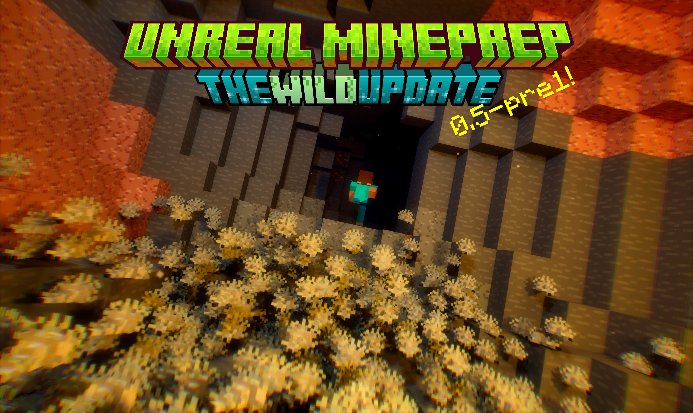

# Unreal-Mineprep

中文 | [**English**](./README_English.md) | [**繁體中文**](./README_繁體中文.md)

✨这是一个正在开发中的UE5插件，继承了 [Blender MCprep](https://theduckcow.com/dev/blender/mcprep/) 的实用功能，并加入一些新的资产，为制作MC动画带来便利


*本插件与Minecraft、MCprep官方没有直接联系，在其建议下插件名称由Unreal MCprep更改为Unreal Mineprep，以避免混淆（0.3及之前的版本已经归档，就不做修改了）。

在v1.0正式发布前，插件主要供内部使用，可能存在兼容性问题和潜在的 ~~bug~~ 特性。之后会逐步修复并写一些使用教程（但这应该是很久以后的事了）

## 安装方法

### ① 使用安装包（推荐，适用于0.4+版本）
**1、下载Mineprep插件，建议保存在纯英文路径下。**  
- 你可以在右侧的`Releases`部分下载较为稳定的大版本；或者点击上面的绿色`Code`按钮 -> `Download Zip`，下载最新快照版本。

**2、解压安装包，使用Blender打开里面的`Mineprep_installer.blend`文件。**
- Unreal Mineprep是在Blender MCprep的基础上开发的，部分功能会远程调用MCprep里的函数。如果你是Blender用户那就好极了！
- 如果你没有Blender，可以前往[Blender官网](https://www.blender.org/download/)下载，建议选择"Windows Portable"版本，无需安装，解压即用。当然也可以在[Steam](https://store.steampowered.com/app/365670/Blender/)等其他平台下载。
- 此外，我们还推荐你在Blender中安装[MCprep插件](https://theduckcow.com/dev/blender/mcprep/)。

**3、点击▶️运行脚本，会弹出菜单和安装引导**
- 目前提供了`创建新的工程文件`和`安装至现有工程`两个选项，还可以选择实验性功能、插件设置等内容。然后就能一键安装了。

### ② 手动安装
需要复制Mineprep内容文件夹+修改项目设置，稍后会更新详细步骤

<details>
<summary> 查看安装时修改的文件 </summary>

```
工程文件
  ├── Config
  │     ├── Windows
  │     │     └── WindowsEngine.ini
  │     ├── DefaultEditor.ini
  │     ├── DefaultEngine.ini
  │     └── DefaultInput.ini
  ├── Content
  │     └── Mineprep
  ├── Plugins
  │     ├── Mineprep (*)
  │     ├── InlineMaterialInstance*
  │     ├── MoviePipelineMaskRenderPass*
  │     └── TemplateSequence*

*表示可选的实验性功能
(*)表示有普通/实验性两个版本
```

</details>

<details>
<summary> [推荐] 安装DLSS </summary>

非常建议N卡用户安装DLSS，能提升性能、提高画质、节约显存

1、前往[https://developer.nvidia.com/rtx/dlss#getstarted](https://developer.nvidia.com/rtx/dlss#getstarted)，在“DLSS 4 Plugin for Unreal Engine”板块下载对应的插件版本

2、解压后，复制Plugins文件夹里的子文件夹 到虚幻引擎插件目录的Marketplace文件夹中，如下所示:

**从解压后的DLSS插件文件夹**
```
Plugins
  ├── DLSS
  ├── DLSSMoviePipelineSupport
  └── ...
```
**到虚幻引擎插件文件夹**

```
Engine
  ├── Plugins
  │     ├── Marketplace
  │     │     ├── DLSS ⬅
  │     │     ├── DLSSMoviePipelineSupport ⬅
  │     │     └── ...
  │     └── ...
  └── ...
```
没有Marketplace文件夹的话自己新建一个

3、打开工程文件，在左上角-编辑-插件 里搜索DLSS，启用`NVIDIA
DLSS
Super Resolution/Ray Reconstruction/DLAA`和`Movie Render Queue DLSS/DLAA Support`，重启引擎

安装成功后，你可以在MC导播台中调整DLSS挡位。

> 渲染动画时只能使用DLSS和光线重构，用不了帧生成，所以启用上面两个插件就够了

</details>


## 兼容性
Mineprep 0.5 使用Windows+UE5.7开发。

安装包和插件的非实验性功能理论上是跨平台的，并且支持更高的引擎版本，但是尚未经过测试。

> [!WARNING]  
> 实验性功能完全不支持其他平台和引擎版本，必须重新编译才能使用。请勿在mac上勾选，否则工程文件打都打不开，一上来就报错！！

另外，插件附带了windows版的ffmpeg用于视频编码。mac用户目前需要手动下载并在安装时指定路径。当前所需版本为ffmpeg 8.0


## 生物
- Mineprep提供了MC原版生物模型，可以通过生成器面板放置
- 目前主要有骨骼网格体和自动化NPC两种类型，部分生物制作了顶点动画实例模型，用于大型群体粒子。所有生物都可以更换材质，两脚生物可以尝试添加IK绑定
- 当前版本支持：Steve/Alex玩家、猪、牛、羊、马（驴、骡、僵尸马、骷髅马）、僵尸、尸壳、溺尸、骷髅、凋灵骷髅、流浪者、沼骸、猪灵、猪灵蛮兵、掠夺者、卫道士、铁傀儡、蠹虫、末影螨、蜘蛛（洞穴蜘蛛）、村民、烈焰人、凋灵、疣猪兽、雪傀儡、狼、猫、悦灵、流浪商人、豹猫、恶魂、小恶魂、快乐恶魂、苦力怕
- 更多内容正在更新中

## 语言本地化
Mineprep提供了可拓展的多语言翻译，目前支持中文/英文/繁体中文
- **安装包**会根据Blender的偏好设置选择语言。本地化内容以字典的形式写在代码中，参见[Mineprep_installer.blend](./Mineprep_installer.blend)或[Mineprep_installer.py](Blender扩展资源/Mineprep_installer.py)
- **插件面板**上方有选择语言的按钮，在启动时会根据UE的偏好设置选择语言。本地化内容保存在[语言本地化_language_localization.csv](./Mineprep/插件贴图/语言本地化_language_localization.csv) 和 [变量显示名_VariableDisplayNames.csv](./Mineprep/插件贴图/变量显示名_VariableDisplayNames.csv)中。

更多内容正在更新中

## 开源协议
- 在制作插件时，我原来用的是GPL-3.0协议，但是现在包含了虚幻引擎的官方示例+源代码，它们好像和开源许可证不兼容 (*´･д･)? 所以这里就先不放License文件了。
- 在大部分情况下，你可以免费使用本插件。(UE5.3及更早的版本不向影视创作者收费，UE5.4开始对年收入超过100万美元的用户按席位收费，显然我们不会达到收费门槛hhh)  
具体参见[Epic Games的用户协议](https://www.unrealengine.com/zh-CN/eula)
- 以后考虑做一个Mineprep Lite，只留下准备场景、更换材质等核心功能，没有官方素材和引擎源码。这样安装会简单很多，也能放GPL-3.0协议了
- 同时，Mineprep引用了许多第三方插件和资源，在此向他们表示感谢。我们在[ResourceLicenses](./Readme素材/ResourceLicenses)文件夹中收录了一些许可证和作者留言。如有遗漏可以拉一个Pull Request进行补充


## 版本更新

#### 26w06a
- 本周大幅改进了远景地形生成器，添加了水面，公开了许多参数，能够使用自定义`地形纹理`来控制地形的高度、植被密度和水域了
  - 平原、山脉和水面的高度会根据边界框自动缩放，通过`平原/山脉/水面高度偏移`这个参数调整相对值，勾选`低洼处填充水面`或者使用地形纹理来生成水
  - 地形纹理的RGB通道分别对应高度/植被密度/水域，通常在0~1之间，也支持小于0或大于1的值  
  · R>0升高地面，R<0降低地面  
  · G>0增加植被，G<0减少植被  
  · B=1时直接转换为水域，0<B<1时对地形高度进行插值，如果最后的地表高度低于河面，才会生成水
  - 提供了4组参数用于调整地形纹理：`高度/植被/河流偏移` `高度/植被/河流缩放` `高度/植被/河流乘方` `高度/植被/河流模糊`，每一个都是4D向量，分别对应RGBA通道
  - 默认在GPU上生成地形，速度非常快，便于调整参数。但是GPU地形经常会从编辑器中消失，渲染开始时需要花几帧时间重新生成地形。取消勾选“在GPU上生成”，则会传回稳定的CPU模型，不过生成速度很慢。
> 如果用普通的图片作为地形纹理，说不定有意想不到的惊喜！试试虚幻引擎自带的各种贴图吧，比如 3DMotionGraphicsThumbnail 这张图片生成的效果还挺好看的

> 我目前没找到什么比较好的画图工具，虚幻引擎虽然有一个网格体绘制模式，里面能画纹理贴图，但它真的好难用 ╯︿╰
- 新增`苦力怕`及其NPC生物
- 改进了LabPBR材质，现在会从高光贴图中读取次表面散射，植物摇摆不会自动添加次表面散射了
- 修复了一些动画序列造成头部异常旋转的bug
- 将MC摄像机的根组件替换为骨骼网格体，也就是说可以像生物一样制作骨骼动画了
- UE 5.7 的关卡序列似乎有bug，对内部组件打关键帧会因中文名而闪退，目前把生物的头部重命名为Head
- 媒体抠像播放器已更新Substrate材质
- 清理了一些旧资产
- 【实验性功能】材质参数面板新增📄按钮，点击复制一份新的材质
- 【实验性功能】按Ctrl+Alt+9 交换选中项的位置


#### 26w05a
- 本周我们将MCprep的Mesh Swap功能带入虚幻引擎，这是盼望已久的最后一个核心功能！
- `更换模型（实例化）`
  - 位于导入世界的按钮下面，目前有`分割不相邻方块的距离`、`分割为独立的Actors`、`自发光光源`、`生成辅助灯光`四个参数
  - 点击后把大模型（灯笼、火把等离散的方块）拆成小块，每一块都能单独移动或删除，同时支持还原为大模型
  - 拆分后显著提升了自发光照明效果，还有一键生成辅助灯光的功能
  - 实际上，拆出来的是动态网格体，不是实例化网格体。暂时不支持GPU距离场碰撞箱，也不能对它使用准备场景
- 导播台新增`自定义控制台变量`，公开了许多调整画质的参数。比如，最新的r.MegaLights.ScreenTraces.MaxDistance 15减少了屏幕空间追踪距离，缓解阴影闪烁问题
- MC天空现在会把时间保存到本地文件里，重启后自动读取，比之前更可靠
- 优化了方块体积云，增大了视野范围，远处有淡出效果
- 4级动态材质和插件面板新增`覆层贴图`，`覆层颜色`，`Stencil覆层贴图遮罩`参数
- 拓展了材质系统，正在制作新的生物皮肤材质，用于多层贴图和更好的2D表情动画
- 修复了准备场景有时因空纹理而闪退的bug

#### 26w04a
- 本周材质大更新基本完成~ 清理了旧程序和旧参数
- 插件面板新增两行自定义材质参数，可以手动输入参数名
- 应用材质参数时有三个目标类型：`方块（静态网格体）`、`生物（骨骼网格体）`、`覆层材质`，默认勾选前两个。覆层材质是新添加的类型，暂时不支持关键帧
- 准备场景时，会自动判断黑白贴图再应用颜色，始终对单个小方块使用“简单与复杂”碰撞
- 修复了低分辨率贴图在一定距离处变模糊的问题
- 安装插件时，会把引擎时间码修改为60fps。这将用于镜头试拍录制器和新的防掉帧保护功能
- 方块、基础生物模型和NPC生物新增`骑乘者`参数，可以快速让一个对象骑在另一个对象上
  - 每次添加新的乘客，会在`骑乘骨骼位`中寻找空位，然后把乘客附加到该骨骼上，使用指定的动画
  - 勾选`分离(取消骑乘)`会解绑该乘客。再次点击取消勾选会重新绑定，相当于刷新乘客状态
  - 附加乘客时，会自动禁用两者之间的碰撞，防止穿模后抽搐
  - 瘫痪会向上传递，也就是坐骑和乘客全部摔倒。断肢不会传递，最好不要让骑的骨骼断开
  - 目前，不支持让NPC骑在别的对象上
- 为方块添加了“瘫痪”事件，相当于开始物理模拟
- 点击两次基础生物模型的“物理Ⅰ”、“物理Ⅱ”、“物理Ⅲ”、“物理Ⅴ”按钮，会切换到瘫痪状态
- 新增`拴绳`，包含绳子、拴绳结和物理约束
  - 绳子是视觉效果，会和场景碰撞，但不会影响场景中的其他对象
  - 物理约束则是实际的链接，可以悬挂或牵引正在物理模拟中的对象。它会以牵引端为圆心进行约束（相当于悬挂），如果要牵引，建议把牵引端先放在对象身上，运行时再拉出来。
  - 可以把绳子和物理约束绑定到不同的骨骼上
  - 目前制作了`弹簧`、`硬约束`、`软约束`三个快捷按钮
- 附加组件新增`拴绳`和`骑乘上一个选中项`功能
  - 选中多个对象时，使用“拴绳”会把其他对象栓到最后一个选中项上
  - 选中多个对象时，使用“骑乘上一个选中项”会叠高高，从后往前依次骑乘上一项
- 【实验性功能】右键细节面板中的材质参数，可以复制黏贴参数值和变量名了
- 【实验性功能】增强了本地化系统，能够修改引擎内置的文本了！在[变量显示名_VariableDisplayNames.csv](./Mineprep/插件贴图/变量显示名_VariableDisplayNames.csv)的第一列添加了Namespace，用于区分不同板块。勾选插件面板中的“朗读鼠标下文本”后，会在日志中打印读取到的本地化信息，然后把Namespace、Key和Source String复制到csv文件的前三列，就能自定义翻译文本了
- 【实验性功能】右键点击MC场景编辑器子面板的图标，可以直接进入此编辑器模式了
- 更新了MC场景编辑器的操作方式，更符合原版MC的样子了：
  - 移动鼠标将自动旋转视角。按住左Alt键停止自动旋转
  - 按TAB键切换为不自动旋转，此时需要按住鼠标中键才能旋转视角（类似于Blender）
  - 由于虚幻引擎的限制，十字准星也会随鼠标移动。按右Shift键在屏幕中间生成另一个十字准星
  - 按下鼠标左键/右键，能立即破坏/放置方块，而不是在松开鼠标时才生效
  - 长按或拖动鼠标左键/右键，可以连续破坏/放置方块
  - 修复了点击物品栏时并未切换对应方块的bug

#### 26w03a
- 重新设计了插件面板的材质参数，添加了大量新功能和参数行，每一行采用`🔲参数名【参数值】🔒🔗🔷`的格式，最顶上有`应用参数按钮📥`和`按等级过滤参数🔍`
  - **🔲**：勾选框，是否用于准备场景、更换材质和`应用参数按钮📥`。按住鼠标左键能批量刷选
  - **参数名**：点击后应用此参数至选中项。双击时应用参数并保存更改
  - **参数值**：有数值滑条和颜色这两种类型，右边有返回默认值的小箭头
  - **🔒**：点击后解锁数值滑条的滑动范围限制。另外，无论有没有解锁，都可以用键盘输入任意值。按住鼠标左键能批量刷选
  - **🔗**：实时同步，启用后修改参数值能实时应用于选中项。按住鼠标左键能批量刷选
  - **🔷**：关键帧按钮，左键对所有选中项添加关键帧，若参数名不存在则跳过。右键/中键会先应用参数值，再添加关键帧。
  - 右键“准备场景”等大按钮能过滤相关参数。折叠“高级设置”面板再展开会显示全部参数
  - “附魔”、“植物摇摆”、“半透明”、“自发光”始终会应用相关参数
  - 更多功能正在开发中，暂不考虑静态准备场景，未来会移除旧参数和相关程序
- 插件面板新增`半透明`按钮，点击后能把模型的材质转换为真正的半透明材质，适合染色玻璃、淡出消失等效果
  - 半透明材质基于原有的动态材质，也分1~4级，新增了`模糊`和`折射率`参数
  > Substrate材质让非光追半透明也有了模糊效果，但是它受粗糙度控制，直接使用会造成大部分方块变糊。因此，我们使用独立的“模糊”参数来控制模糊程度；粗糙度则是影响高光
  - 1级：接受漫反射光照，粗糙度直接减少高光度。不透明度被连接至Substrate覆盖权重，因此越透明的材质模糊上限越低。其他功能和普通的1级动态材质相同
  - 2级：在1级的基础上，接受镜面高光光照。没有“次表面颜色RGB+透射A”参数。其他功能和普通的2级动态材质相同
  - 3级：粗糙度被连接至Substrate第二粗糙度，用于模糊高光效果。其他功能和普通的3级动态材质相同
  - 4级：这一等级不再使用Substrate覆盖权重，而是添加了“次表面颜色RGB+透射A”参数，由SSS MFP（次表面散射平均自由程）控制透明度。不透明度则用于缩放SSS MFP，值为0不一定能让物体隐形。实际上，SSS MFP才是Substrate半透明的正确用法，能够充分体现模糊效果；假如未来Lumen能投射彩色半透明阴影，SSS MFP还会被用来控制阴影颜色。
  - 一般来说，方块的折射效果很差，不需要动折射率。开了光线追踪半透明后，效果会好一点，此时折射率>1才会有模糊效果。
  - 普通的方块或生物不需要半透明材质。用的多了会出现半透明排序问题，也就是各种奇怪的穿模。光线追踪半透明是最简单的解决方法，但是整个光影效果就变了，我通常很少使用
  - 目前，半透明材质都是单面的，不适合植物（双面的排序问题实在太多了⊙﹏⊙）
  - 对半透明材质使用“准备场景”就能变回普通材质了
- 4级动态材质新增`间接光照贴图`和`阴影贴图`，前者可以修改反射/折射/自发光照明的显示内容，后者可以修改阴影蒙板。比如说，让生物在镜子里显示另一种皮肤。默认不重载，也就是使用纹理贴图。
- 新增`淡出消失`模板序列，适合半透明材质
- 修复了DLSS选项失效的bug。现在默认启用光线重构，能大幅提升半透明阴影清晰度。修复了半透明阴影在远处消失的问题
- 修复了画质预设因为本地化翻译而损坏的bug。同时修改了画质预设选项，移除了4*和“反射为极高”，改为
  - 3- 极高（快速Lumen）
  - 3  极高
  - 3+ 极高（特调画质）
  - 4- 影视级
  - 4  影视级（特调画质）
  - 4+ 影视级（增强lumen）
> 有了DLSS光线重构后，反射更加清晰，我们决定始终使用高质量半透明反射。默认渲染画质变回 4 影视级（特调画质）。如果需要节约显存，3+ 极高（特调画质）也是不错的选择


#### 26w02a
- 所有实验性功能已升级至UE5.7！
  - 虚幻引擎制作了新的新手入门插件，不再需要旧版GuidedTutorials，已经将其从安装包中移除
  - 添加了新的实验性功能`扩展模板序列以支持双精度浮点和向量属性乘数`。这个早就做好了，在UE5.7中启用
  - 添加了新的实验性功能`为材质参数面板添加关键帧按钮和本地化翻译`。引擎内置的InlineMaterialInstance插件经过大改，材质参数面板不再闪退了，但是无法通过之前的方法添加关键帧按钮，于是我直接修改插件，并把它和本地化系统集成在一起
- 材质系统正在升级至Substrate！
  - 大部分材质的默认效果和以前保持一致，我们仍然沿用之前的“金属度”、“高光度”等参数，便于调整
  - Substrate带来了新的特性：现已支持LabPBR高光贴图的8种特殊金属F0；将高光度提高至>1可以进一步让材质变成镜子；次表面散射的透射A能更好地表示透光程度了
  - 然而，Substrate大幅增加了次表面散射的指令数，造成性能下降。于是，我们调整了1级动态材质，移除次表面散射，添加法线贴图，适用于大部分方块。现在，导入世界将使用1级动态材质来准备场景，生物也依旧使用1级动态材质。
- 观众人群已升级至UAF动画框架，大幅提高了在编辑器中的性能！
  - 使用方法和以前一样，继承了大部分功能，在必要时退回旧版动画蓝图
  - UAF目前不支持物理交互。使用冲击和断肢会自动瘫痪，然后退回动画蓝图
  - 切换动作暂不支持播放速率和初始位置，支持播放次数和自定义键控动画组
  - 额外旋转目前支持z轴的0~180°，和以前一样，设置为90表示面向x轴
  - 暂不支持在时间线上使用控制绑定，FK绑定也不行
- 改进了媒体抠像散布器，和观众人群散布器一样，可以重载动画，自适应面向目标
- UE 5.7 不能对许多数组变量打关键帧了。修复了受伤变红模板失效的问题。添加了破坏方块的模板序列
- “远景地形生成器”能投射光线追踪阴影了，而且性能提升了几十倍，在达到1800万方块上限前都能瞬间生成，极其震撼！！同时优化了内部的点生成器，现在完全运行在GPU上
- 修复了“简单跟随路径移动控制器”失效的bug
- 修复了无绑定渲染和DLSS冲突造成闪退的bug。另外，经过测试，UE5.7的DLSS光线重构没有渲染问题了

#### 0.5-pre3

<sup><i> 这是一张带 HDR增益图的 jpg封面！使用 HDR显示器或下载到手机上即可查看高动态范围效果 <br>
地图来自https://www.curseforge.com/minecraft/worlds/rtx-aio-map </i></summary>

Mineprep 0.5-pre3 是最后一个支持UE5.6的版本，带来了许多革命性的改进：
- 首次支持MC的LabPBR材质标准
- 首次使用正确的HDR渲染流程，提供更多图片/视频输出格式
- 首次使用UE原生的本地化系统，高效且动态地注入变量名
- 全新的NPC生物和统一粒子群体
- 全面适配Chaos场系统，用于全局力场、材质遮罩、动画偏移

需要注意的是，这个版本处于UE5.6和5.7的过渡阶段，许多新功能尚未在实际生产中进行测试。我们计划使用UE5.7制作新的动画视频。以下是最后两周的更新日志：
- 新增`全局力场`、`力场探测器`、`动画偏移场`、`材质遮罩场`、`角速度旋转场`。
  - 以上内容都使用Chaos场系统，只能在运行时生效，编辑器中没有效果。
  - 虚幻引擎提供了12种力场类型，包含整数场、小数场和向量场。向量场默认指向中心，可以勾选重设方向
  - 边界范围有球形、方形、平面一侧、全场四种类型
  - 可以设置力场强度、衰减并添加噪声
  - 可以分别启用“世界场”（影响粒子、材质）或“Chaos场”（影响物理模拟）
- 旧版径向力场仍然保留，它是唯一能在编辑器中生效的力场。优化了统计方法，提高性能并修复垃圾回收报错
- 粒子能在多帧轮流采样不同的向量场了。默认勾选了“线性力”，“线性速度”，“角速度”三个选项
- 为统一粒子群体制作了切换动画功能。
  - 目前，只有蜘蛛有静止和爬行两种动画，会根据速度自动切换，也可以使用“指定动画索引”参数来设置。
  - “动画偏移场”能控制一片区域的动画时刻。使用负数可以把粒子的随机动画偏移全部减到0，也就是整齐划一的动作
- “动态体积雾”可以采样材质遮罩场了，默认没有启用，需要修改材质参数
- 导播台新增`批量播片`事件，能对任意对象播放关卡序列或模板序列；基础生物模型和NPC生物也添加了各自的`播片`事件
  - 在“添加MC关卡序列”后面新增了`添加批量播片模板`菜单项，这是只有一个对象的关卡序列
  - 批量播片默认每0.05秒播放一批动画，且对关卡序列有特殊的优化，建议对大规模人群使用关卡序列而不是模板序列
  - 在模板中制作动画时，建议使用Additive相对偏移作为关键帧轨道
  - 播片不支持事件关键帧
- 制作了生物`受伤变红`的模板序列，可以在时间线上右键添加，也可以用于播片事件。
- 改进了“观众人群散布器”，添加了重载动画和皮肤的参数。默认状态不创建旋转组件，设置面向目标后请点击刷新按钮，即可正确面向目标
- 改进了“远景地形生成器”，现在会根据尺寸框的z轴缩放自动生成山脉，公开了“方块”、“在GPU上生成”、“启用植物摇摆”三个参数。注意，UE5.6无法投射光追阴影，等到UE5.7才有实用性
- “注入本地化变量名”转正了！相关按钮已经从顶部菜单栏移除，不再是实验性功能，而是在切换语言时自动运行。我们第一次使用了UE内置的polyglot本地化系统，且第一次翻译了枚举值。这能在25ms内注入1000条变量名，速度极快，无需编译。变量名保存在[变量显示名_VariableDisplayNames.csv](./Mineprep/插件贴图/变量显示名_VariableDisplayNames.csv)中
- 【实验性功能】按 Ctrl+Alt+? 可以查看当前所有自定义快捷键
- 改进了Megalights在渲染时的阴影质量和体积质量
- 使用纯函数和批量数组处理优化了许多蓝图程序的性能
- 为蜘蛛制作了首个Locomotor运动绑定
- 调整了初始的日光强度、环境光遮蔽和对比度参数
- 点击UI界面编辑器的“刷新”按钮，能自动更新编辑器中的SDR/HDR显示状态
- 修复了“从图片合成HDR增益图jpg”因为临时文件而报错的bug。注意，前两个文件名似乎需要纯英文。“渲染带HDR增益图的jpg”要等UE5.7才能解决色彩管理问题
- 修复了VR+3D渲染错误启用nDisplay输出的bug
- 修复了方块破碎模板的材质消失问题

<details>
<summary> 📜展开快照 </summary>

#### 25w51a
- 进一步完善统一粒子群体，利用纹理集合支持任意数量的皮肤和动画，打通不同生物模型之间的壁垒，新增了`萤火虫粒子`
  - 每一种用于粒子群体的生物都有专属数据集，里面包含模型、皮肤、动画、碰撞箱等参数。
  - 当前，一个粒子群体支持4个不同的数据集，也就是说，可以把蠹虫蜘蛛末影螨什么的全部混在一起，做一个大虫群了！
  - 细节面板中有多个模块，其中一部分是不同的运动模式，按需启用。当前有“粒子生成”，“模型”，“材质(模型/Sprite)”，“动画”，“碰撞检测”
，“行走”，“爬行”，“Boid模拟(鸟群/鱼群)”，“子粒子”和一些力场参数
  - 萤火虫粒子和媒体抠像粒子使用Sprite材质，而非普通的模型。可以勾选始终面向摄像机
  - 优化性能并修复了跳跃和碰撞箱的一些bug
> 纹理集合需要无绑定渲染，这个功能必须通过修改项目配置文件来启用，而且UE5.7的启用方法和UE5.6不一样。我试试把它们都放进安装包里
- 媒体抠像粒子集成了抠像缓存和粒子群体两个系统，现在需要手动指定`缓存帧数/更新帧率`和`缓存分辨率`，修复了缓存帧数超过30会失效的bug。新增`抖动遮罩模拟半透明`参数，默认勾选，能大幅提升性能，但会降低半透明部分的质量。
- 更改了生成器子面板按类型过滤的多选策略：左键点击多个类别（比如A、B），将同时检查A与B，而非之前的A或B

#### 25w50a
- 本周初步制作了`统一粒子群体`，之前的虫群粒子（蠹虫/末影螨）和蜘蛛群粒子已经合并到一起
  - 新一代粒子群体集成了各种运动方式，可以按需启用，也支持通过关键帧在运行时切换状态
  - 目前有行走、爬行和Boid模拟（将用于鸟群和鱼群）三种运动方式
  - 接下来的任务是改造动画系统，然后把媒体抠像粒子合并进来
- 材质新增`不透明R~G+B*A`参数，能够正确渲染染色玻璃了，也能制作模型的淡入淡出动画
  - 计算顺序从后往前，先把纹理贴图的不透明度乘以A，然后+B，最后判断是否在R~G范围内，小于R直接设置为透明，大于G直接设置为不透明
  - 目前使用抖动遮罩的方式模拟半透明效果，会产生噪点，而且在运动时有明显重影。UE5.7提供了一个拒绝TAA的材质节点，能大幅缓解重影问题。等更新UE5.7之后，还会使用Substrate材质制作真正的半透明玻璃
- 新增材质遮罩场，将“Stencil遮罩层”设为9可以采样全局力场作为遮罩。导播台新增`GPU力场精度`、`GPU力场距离`、`材质遮罩场类型`参数。默认精度32比较低，但提升精度会显著增加显存占用。
- 修复了IK绑定导致手部异常旋转的bug。现在，FK和IK都使用分层绑定，而且能叠加使用。做完动画后，可以点击细节面板面板中的`烘焙关键帧`按钮，一键烘焙动画
- 无时间线 直接从编辑器视角渲染动画时，添加了摄像机晃动效果
- 旧版随机种子已全部升级为新的“随机种子Seed”参数
- 优化了MC场景编辑器中基础方块的GPU距离场碰撞箱。双面材质似乎会破坏距离场，因此使用了一个专门的单面方块作为距离场替换网格体

#### 25w49a
MC即将迎来新的版本编号方法，下一次大更新不是1.22，不是2.0，而是... 26.1!（⊙ｏ⊙）  
至于Mineprep嘛，现在这个版本编号挺好的，那就继续用吧

- 本周NPC大改基本完成，新一代NPC不仅翻新了底层架构，而且继承了之前的所有功能，显著提升性能和交互体验。新增了 `蠹虫、末影螨、蜘蛛、洞穴蜘蛛、恶魂、快乐恶魂、小恶魂、烈焰人、凋灵、疣猪兽、雪傀儡、狼、猫、豹猫、悦灵` 对应的NPC生物，并带来了以下新功能：
  - 绝大多数参数都显示在细节面板的`NPC行为`部分，可以整体复制黏贴，比如把恶魂的行为复制给僵尸，让它飞起来。每个参数都有详细的工具提示
  - 新的`随机种子Seed`变量会自动设置初始值，点击右边的↩按钮能随机设置新的值，它和移动速度和单独列出，不包含在NPC行为中
  - NPC行为的第一个参数是`运动模式`，当前支持“无”、“行走”、“寻路网格体行走”（没有导航网格会自动退回行走）、“正在飞行”，未来会支持游泳。
  - `自动跳跃,攀爬,避障模式`进一步定义了行走模式，当前有“无”（撞墙会换方向走）、“跳跃”（大部分陆地生物的默认模式）、“攀爬”（蜘蛛的默认模式）、“上墙行走”（更真实的蜘蛛爬行/飞檐走壁，相当于自动改变重力方向）
  - 考虑到大规模人群的性能优化，NPC生物移动时会首先逐帧平滑移动旋转，然后调用自动化移动函数。`平滑移动旋转阈值`决定了切换到自动化移动函数的方向夹角，默认为0.1（弧度）。设置为0表示始终平滑移动旋转，这是飞行生物和高级NPC的默认设置
  - `旋转速度`有三个值，分别对本地XYZ轴的旋转速度。将前两个值设为0表示只能水平旋转，例如直立飞行
  - 目前NPC有待机、游荡、跟随、躲避四种基本状态；按目标点巡逻属于跟随状态。可以使用事件关键帧或导播台广播强制切换特定状态
  - 待机和到达跟随目标后支持随机播放动画，根据`待机随机播放动画索引`和`攻击随机播放动画索引`在自定义键控动画组中挑选
  - 要让NPC根据tag自动跟随/躲避目标，目前必须勾选`视觉/听觉/触觉感知`的视觉感知，感知半径暂时锁定在15m。然后，配置`跟随目标类->tag`和`躲避目标类->tag`（tag留空表示任意值），让NPC识别进入视野的目标
  - 物理交互动画和辅助碰撞箱现在默认关闭，按需启用
  - 更多参数信息请查看工具提示
> 高级NPC暂未支持全部功能，等UE5.7换了新的运动匹配官方示例再说。下周会检查各种旧功能以及基础生物模型的兼容性，最后开发一下统一粒子群体，Mineprep 0.5-pre3就能发布了
- `自定义键控动画组`是新一代用于游戏模式、NPC行为和事件关键帧的动画系统
  - 继承了先前的交互模式，依然可以按数字键播放动画，或者使用事件关键帧/导播台广播来播放
  - 每个索引代表一个动画组，支持多个动画
  - 默认情况是按顺序播放身体动作。通过重载特定动画索引的参数，可以配置表情动画、播放速度、缓入缓出等信息。手动输入`播放顺序`则能进行连播、随机播放、循环播放等行为。具体参见工具提示（待更新）：
  - <播放顺序> 留空表示按照0123...的正常顺序一个接一个播放；(012)表示从中随机挑选动画；[012]表示同时播放所有动画，通常用于身体和表情等不同部位的组合，将最后一个动画的结束时间作为整组时间。在两个动画之间添加"."表示间隔0.1秒，":" 表示间隔0.2秒，"/" 表示间隔0.5秒
- MC天空支持自定义背景贴图了！默认是Celestial Vault插件的银河系全景图。双击天空找到背景材质，调整里面的`背景天空亮度`就能看到了。
- 继续改进导入方块/导入物品相关程序
  - 把等待时间延长至5秒，解决第一次导入时 可能因初始化时间较长而失败的问题
  - 5秒后，强制关闭Blender后台进程
- 修复了远处透明材质因各向异性过滤出现异常条纹的问题
- 修复了MC场景编辑器不能按delete删除选中对象的问题


#### 25w48a
- 本周对NPC生物进行大改，这一改造已经陆陆续续持续了几周，预计能在25w49a基本完成。新一代NPC的底层架构从行为树转换为状态树，并添加了以下功能：
  -  支持飞行、攀爬等多种运动方式
  -  将更多的参数暴露在细节面板中，支持整体复制黏贴
  -  事件驱动的状态转换，可以通过关键帧和导播台广播来控制NPC行为
  -  提升性能
- 重新设计了新的“自定义键控动画组”，支持把多个动画组合在一起播放，通过简单的指令重载播放顺序，后续将与NPC集成到一起

#### 25w47a
- 通过混合最近点采样和各向异性过滤采样，大幅提升了远景材质的质量，减少模糊、闪烁和消失的问题
- 从3级动态材质开始，可以使用“单面”参数的小数部分略微挤出面，解决两个模型重叠时的闪烁问题；植物交互现在能用于大场景模型
- 改善MC天空重启后可能回到6:00的问题。现在应该能记录时间并刷新待保存状态。优化了方块云在夜晚的亮度
- 改进放置物品和放置方块的工作流程，当检测到错误时（未安装Blender、未安装MCprep、导入模型失败等）会弹出提示框，并修复了连点产生的bug
- 【实验性功能】更新快捷键Ctrl+Alt+5为显示选中对象的轮廓；按小键盘0切换摄像机视角时，若没有打开时间线，会自动检测选中的摄像机或场景中的摄像机
- 【实验性功能，将在UE5.7启用】扩展模板序列以支持双精度浮点和向量属性乘数。同时，UE5.7有了新的官方入门教程插件，旧版GuidedTutorials将被废弃

#### 25w46a
- UE5.7正式版发布了！我们计划在几周后升级引擎，目前为非实验性功能修复了一个新的菜单栏bug
- MCprep更新了3.6.2版本，我们同步了新的MC资源包(支持到1.21.10版本)，并修复了在Mineprep中调用放置方块/放置物品时的一些bug。新版MCprep适配了Blender5.0，放置方块时不会给每个面生成多余的材质了，更换纹理能也对放置的大部分方块生效。
- 准备场景的高级设置中新增`平直着色(重置法线)`选项
- 在MC场景编辑器子面板新增`导入世界`按钮，目前有OBJ(Mineways)，OBJ(jmc2obj)和FBX三个选项。这是第一次适配jmc2obj，之后还将逐步适配MiEx的usd模型
- 优化了导入模型的默认参数，OBJ模型会使用100倍缩放和90°旋转，从MC坐标系转换到UE坐标系；导入jmc2obj模型还会自动应用平直着色(重置法线)。右键按钮可以打开详细参数面板。
- MC天空新增`日/月光束遮挡+过渡`，`太阳泛光RGB+亮度A`和`月亮泛光RGB+亮度A`参数。太阳默认使用光束遮挡，月亮默认使用泛光，增强了体积光效应和氛围感。修复了月相在半夜变化的bug
- 使用视频编码或图像转码时新增`删除原图`参数。当前3D渲染有点问题，需要关闭删除原图，否则会报错

#### 25w45a
- 这几周的渲染流程大更新基本结束了。最后为3D渲染适配了视频编码和图像转码，新增以下四种格式
  - 两组独立输出
  - 左右并排 FSBS
  - 上下并列 FTB
  - 红蓝滤色
- 输出文件名可以添加子文件夹路径了，例如"MC/xxx"会先创建名为MC的文件夹，把输出结果保存到里面
- 插件设置子面板新增`渲染结束打开文件夹`（默认勾选）和 `渲染结束提示音`（默认为空）
- 在顶部菜单栏-MC-开发板块新增`渲染带HDR增益图的jpg`和`从图片合成HDR增益图jpg`按钮<sup>[仅支持Windows]</sup>，使用新版Movie Render Graph同时渲染SDR和HDR画面，然后使用libultrahdr合成带增益图的jpg图片。
> 目前能保证SDR画面和编辑器视口保持一致，但是无法应用HDR渲染亮度倍率，因此沿用之前的色彩校正方法，HDR增益图效果大约和r.HDR.Aces.SceneColorMultiplier=1.5差不多

> Movie Render Graph的暖场很慢，并且会运行游戏逻辑，我们在渲染开始时加快了自动曝光调整速度

> 暂不支持3D渲染、全景渲染和DLSS等功能。
- MC摄像机、摇臂摄像机、导轨摄像机新增`旋焦`参数，>0表示绕中心旋转的背景模糊，<0表示指向中心的径向模糊
- 准备场景现在会强制刷新纹理贴图，修复以往的模糊问题
- 改进了媒体抠像播放器和媒体抠像散布器，切换视频不再闪烁
- 修复了方块体积云与半透明材质之间的排序问题，在安装插件时启用bCompositeHeterogeneousVolumesWithTranslucency项目设置

#### 25w44a
- 改进渲染流程和预设文件，统一为"Mineprep自定义渲染配置"，移除了旧的配置和Mineprep3D摄像机组
- 渲染时会创建一个新的临时配置文件，向其中添加所需模块，这可以避免未安装DLSS弹出警告的问题
- H.264编码现在使用UE内置的视频编码器
- 整理了渲染输出子面板，新增`图片转码`功能，在不输出视频时也可以进一步处理图片。当前有以下选项：
  - 无
  - 动图.gif
  - 动图.webp
  - HDR/序列帧.png
  - HDR/动图.avif
  - HDR/动图.jxl
- 重置了渲染预设，默认为1080p+时间线帧率+高质量H.264编码，用于快速渲染。当前有以下选项：
  - 2K_120.mp4
  - 2K_120_HDR.mp4
  - 2K_透明_Prores.mov
  - 2K_3D.mp4
  - 4K_VR全景.mp4
  - 2K_HDR.png
  - 2K_HDR.exr
  - 512x512_动图.gif
  - 512x512_动图.webp
  - 默认
- 3D渲染支持景深了！渲染时会把当前摄像机的景深同步到Mineprep后期处理体积，通过全局景深影响nDisplay3D摄像机组，模糊程度可能略有不同。
- UI界面编辑器支持3D渲染了！nDisplay3D摄像机组新增`UI界面3D效果`参数，默认为1，调大可以增强左右眼偏移
- 验证了libultrahdr合成jpeg图片的可行性。我们使用达芬奇的Nvidia RTX Video HDR把往期封面图转换为Rec2100 PQ并导出为16-bit HDR png，然后用ultrahdr_app.exe把原图和新图合成为带HDR增益图的jpg，在各个平台上都有不错的观看效果。接下来考虑将其集成到渲染流程中
> 除了libultrahdr，我还尝试制作空间视频和实况照片，结果一个也没弄成，Windows一败涂地啊，安卓的标准又参差不齐，真就是Only Apple Can Do ｡ﾟヽ(ﾟ´Д`)ﾉﾟ。  
> 为了弥补遗憾，在图片转码那边添加了gif/webp/avif/jxl格式，后面两个算是战未来吧，目前不能用于剪辑，只能在有限的平台观看


#### 25w43a
- 所有生物已更换新版材质。方块材质新增`单面`参数，默认为0，表示双面渲染；设为1仅渲染正面（适合简单玻璃），设为-1仅渲染背面。
- 继续改进渲染输出流程，现在无需实验性功能或重启引擎就能更改输出的后缀名格式了
- H.265/AV1全面支持新的HDR编码方式，同时针对不同硬件编码器调整了色度抽样和质量参数
- 新增`Vulkan`硬件加速选项，支持H.264/H.265/AV1编码
- 安装插件或重新初始化时会通过OpenCV的OpenCL模块更加智能地识别显卡
- 第三版png标准支持HDR了，测试发现FFmpeg也能正确写入元数据！我们改进了启用HDR后的图片渲染功能，若勾选png，则会渲染exr并重新编码至16-bit Rec2100 PQ png。话说png序列帧能显示缩略图、能被达芬奇直接识别输入色彩空间，这不比exr好多了(～￣▽￣)～
- 【实验性功能】我们编译了[libultrahdr](https://github.com/google/libultrahdr)，用于制作带HDR增益图的jpg图片。ultrahdr_app.exe保存在ffmpeg.exe旁边。
  - 这是目前兼容性最好的格式，包含SDR和HDR两份数据，若显示器不支持HDR也能当成普通的jpg打开。
  - 初步测试，同时注入ISO和XMP元数据的HDR图片能被Windows、苹果和安卓成功识别
  - 我们参考[这个脚本](https://github.com/albertz/playground/blob/master/ultrahdr.py)把Readme中的图片转换成了带HDR增益图的jpg，看看有没有效果👀
  - 下一步计划是把它集成到Mineprep的渲染流程中。为了同时渲染SDR和HDR底图并应用各自的色调映射，需要新版Movie Render Graph，还要在渲染结束后单独调用ultrahdr_app.exe。这将是一个长期目标

#### 25w42a
- 本周大幅改进了PBR材质和HDR渲染流程，从根源上解决长期存在的问题，为后续版本更新以及UE5.7的Substrate材质打下坚实基础
- 重新设计材质参数和纹理贴图的解读方式，适配MC专用的LabPBR标准，并添加了4级动态材质用于视差凹凸效果
  - 近几年的MC纹理包普遍采用[LabPBR](https://shaderlabs.org/wiki/LabPBR_Material_Standard)标准，它把自发光蒙版、次表面散射、环境光遮蔽、高度图等诸多信息打包在高光贴图(_s)和法线贴图(_n)的不同通道中。现在，Mineprep能正确解读这些附加信息了！
  - 新版材质分1~4级，如下所示。（未来还会增加两种半透明材质，1-2级用于简单染色玻璃，3-4级用于模糊的磨砂玻璃，这需要新一代Substrate材质系统）
  - ① 用于生物皮肤的材质。包含以下参数：  
    Stencil遮罩层  
    发光亮度  
    照明强度  
    纹理颜色  
    次表面颜色RGB+透射A   
    金属/高光/粗糙/孔隙率   
    纹理贴图  
    高光贴图  
  - ② 用于方块的材质。添加了以下的额外参数：  
    法线强度  
    破碎程度  
    顶点颜色   
    单面  
    动画速度/步长/列数/渐变    
    法线贴图  
  - ③ 用于附魔和植物摇摆的材质。添加了以下的额外参数：  
    摇摆幅度  
    摇摆速度  
    交互强度  
    附魔缩放/速度/对比度/底色  
    附魔颜色  
  - ④ 用于视差凹凸的材质，需要法线贴图的Alpha通道包含高度信息+Megalights光追阴影，添加了以下的额外参数：  
    视差凹凸强度   
    视差精度
  - 新版材质减少了贴图数量，并通过强有力的if else跳转分支，在功能更多的同时 性能保持不变或更好。（不过虚幻引擎会统计所有分支的指令数，直接看着色器复杂度似乎较高，实测没有问题）
  - 现在可以在参数中设置是否启用渐变动画了，默认为渐变，“准备场景”会对火焰等特殊方块设置不渐变；动画播放速度已经统一，默认为1秒1张图；步长设置为负数表示往返循环，可以解决**静态岩浆**的突变问题；而**流动岩浆**把每一张图保存为2x2的重复块，设置步长4 列数2即可正常播放
  - 金属/高光/粗糙 设置为正数表示相乘，负数直接指定为绝对值。孔隙率将在Mineprep 0.6得到支持，用于积水湿度，目前没有效果
  - 发光亮度现在表示整体偏移量，默认是0。高光贴图的Alpha通道存放了自发光蒙版，若含有信息会自动发光。降低发光亮度至<0可以使它减弱，提升至>0则使整体变亮。新材质发光时会自动从“次表面”着色模型切换至默认光照
  - 各向异性和切线贴图已被移除（之前从未用过，在Substrate中还会增加材质复杂度）
  - 新材质专为MC设计，不建议对非MC模型使用“准备场景”！当前需要采样法线贴图的四个通道，会改变纹理采样器类型，和原材质不兼容。另外，MiEx会把LabPBR转换为常规PBR导出，这反而需要特殊处理了，未来会制作自动识别与导入模型的功能
  - 更多功能正在更新中，生物和方块即将更换新版材质。
- 彻底解决了HDR渲染颜色和编辑器视口不一致的问题，不再需要色彩校正。颜色子面板新增`HDR渲染亮度倍率`滑块，可以理解为HDR专用的曝光参数，初始值为2，比UE默认的1.5略高，使HDR画面变得明亮
> 终于，我解决了这个困扰一年的问题，泪目 ｡ﾟ(ﾟ´ω`ﾟ)ﾟ｡
>   
> [论坛中的这个讨论](https://forums.unrealengine.com/t/fixing-hdr-tonemapping-errors-darkened-image-and-wrong-colors/2544973)点出了问题的根源：UE5有一个控制台变量 r.HDR.Aces.SceneColorMultiplier，默认值是1.5，它会把编辑器视口的亮度x1.5，但是不影响渲染输出！！！难怪以前颜色不一致
>   
> 最简单的解决办法是把它改成1，但是这导致场景昏暗，上面那个帖子也说增加到3.25才比较好看。进一步研究发现，它的效果和后期处理体积的全局增益相同——因此，我们在导播台中添加了一个优先级更高的后期处理组件，渲染时检测到HDR就会自动启用，把Mineprep后期处理体积的全局增益和SceneColorMultiplier相乘。
- 调整了Mineprep后期处理体积的初始参数，现在会启用环境光遮蔽(强度0.5 距离50)和全局对比度1.05
- 发现了顶点动画的阴影问题所在：光线追踪目前无法投射正确的次表面阴影！把“次表面散射RGB+透射A”参数改为0，可以暂时解决Lumen光追在虫群粒子和PCG植物上投射错误阴影的问题。而Megalights有HZB屏幕空间追踪，这很大程度上缓解了错误的阴影，还能投射正确的视差凹凸阴影
    
#### 25w41a
- 双击MC天空的背景（即选中天空球组件），能够看到背景天空/方块云/方块体积云/体积云的材质，现在可以很方便地调整参数和制作关键帧动画了
- 继续改进渲染画质，增强反射和视野距离等参数；正式启用了Megalights的定向光源功能，显著提高了大场景的性能，在“光程”板块新增一个使用虚拟阴影贴图或退回lumen的按钮
> 尽管UE5.7的更新日志才提到Megalights支持定向光源，UE5.6已经有相关控制台变量了。当前，Lumen光追无法在实例化网格体（如虫群粒子）上投射正确的WPO阴影，Megalights是最直接、性能最好的解决方案。另外，远景地形生成器问题比较大，目前禁用了WPO顶点动画，需要使用虚拟阴影贴图或更新至UE5.7
- 新增`光照探测器`，能够探测空间中或表面上的光照强度，在视图中显示亮度和RGB分量。可以使用数学表达式把亮度值设置到其他对象上，默认参数是控制灯光亮度，在夜晚亮起。*注意亮度是一个不稳定的参数，不建议用于精确值
- 修复了Chaos破碎模板的方块材质问题

#### 25w40a
- 改进NPC生物的状态机动画，制作了 常规运动-潜行-游泳-飞行 的模板，为更多种类的运动方式打下基础
- 修复了一些自动跳跃和面向目标的bug
- 更新了“MC第一人称摄像机”，使用UE5.6的新版第一人称渲染模式，加入手持物品、身体模型和更多功能
  - 默认情况下显示右手，点击或长按鼠标左键可以挥动右手；身体在反射中可见，能够投射阴影。
  - 录制动画会记录第一人称视角和全身运动的所有关键帧。修改“身体部位可见性”可以决定要显示的部分
  - 优化了走路和跑步的摄像机晃动，更符合MC原版的样子
  - 未来，我们计划把MC场景编辑器和第一人称角色结合起来，实现动态放置、破坏、获取、切换方块
- 方块的物理破碎板块添加了`自定义切割位置+法向量`功能，能程序化切割**任意方块**，还支持直接录制动画！
  - 我们提供了几个“PM”开头的切割模板。切割次数根据模板名称变化，比如“PM切割小方块_2x2x2”可以改成3x3x3，随机切割则由随机种子决定
  - 性能不如原先的Chaos破碎预设，不要切太碎。如果使用了Chaos破碎预设，将忽略自定义切割
  - 禁用物理破碎需要清空破碎模板和自定义切割参数
- 在导播台的画质预设中加入了`4* 影视级（反射为极高+增强降噪）`选项，优化了lumen光线追踪相关参数，现已成为默认渲染画质。
- 其他功能子面板的“光程”和“环境光遮蔽”板块添加了`室内天空光照`参数，可以调节颜色和强度

#### 25w39a
- UE5.7预览版发布了，Mineprep 0.5-pre3将是最后一个支持UE5.6的版本！插件的非实验性功能已经为5.7做好适配，通过延迟初始化修复了python脚本运行失败的新问题。
- UI界面编辑器基本制作完成
  - 点击细节面板的按钮，可以添加文字或图像，上移或下移图层。*删除图层后需要手动点击刷新
  - 默认情况下使用相对缩放，修改渲染分辨率也能保持相近的图层大小。取消勾选“随分辨率自动缩放”，将使用绝对的像素大小
  - 在3D场景中双击图层，可以快速选中并移动、旋转、缩放它
  - 能够调整全局颜色/不透明度以及每个图层的参数，制作关键帧动画
  - 支持仅在边界框内显示，调整PostProcess组件的混合半径还可实现淡入淡出
> 暂不支持全景和3D渲染，未来估计也不会支持！话说，在后期剪辑时给全景/3D视频上字幕，好像也不简单啊 Σ(;ﾟдﾟ)  
> **0.5-pre3 (25w44a) 已支持3D渲染！**
- UI文本具有`导入字幕`按钮，可以导入srt文件为关键帧，或者从音视频中识别字幕
  - 通常来说，我们更推荐在剪辑软件中加字幕，直接在UE里做算是多了一种选择
  - 识别字幕使用FFmpeg 8.0调用whisper生成srt文件，保存在工程文件目录的cache文件夹下。
  - Mineprep附带了ggml-base-q8_0.bin作为默认的小模型，如果想要更好的效果，可以在[whisper仓库](https://huggingface.co/ggerganov/whisper.cpp/tree/main)下载ggml-large-v3-turbo-q8_0.bin等更大的模型，放至/Content/Mineprep/Render/models/whisper目录下
- 使用UE5.6的官方示例重做了第三人称运动匹配角色，同时重新设计模块化的NPC
  - 修复了物理交互造成闪退的bug。现在可以为骨骼配置任意数量的不同物理参数集了
  - 增强了跳跃检测功能，可以在空中抓住墙壁爬上去了！录制关键帧动画时，也不再会生成一堆临时碰撞箱了
  - 官方提供了新的冲刺模式，目前分配给按键"Z"
  - 更多功能正在制作中，预计会下放给普通NPC生物

#### 25w38a
- 为方块模型添加了`物理破碎`功能
  - 默认情况下破碎模板为空，设置为有效的模板即可启用Chaos物理破碎，可以碎成小方块或不规则形状
  - 性能 2x2小方块 > 碎石块 > 4x4小方块 > 6x6小方块 > 8x8小方块
  - 勾选初始模拟会随重力下落，否则受到撞击才破碎
  - 修改分级破碎阈值，可先碎成大块，再碎成小块（目前只分两级）
  - 当前仅支持六个面的标准方块，以及顶面/侧面/底面三种材质
  - 暂时无法录制关键帧动画，需要专用的Chaos缓存
- FFmpeg已经升级至8.0版本！新版注入HDR元数据的方式有变，我深入研究了色彩管理的细节，正在开发新一代渲染流程
  - 使用全新的命令编码H.265视频，其他格式也将陆陆续续改进
  - UE5_HDR.cube已经废弃，不再需要lut进行视频编码时的调色，而是通过后期处理材质在色调映射后power 0.85，直接模拟这一调色过程。现在，只导出exr序列帧不编码视频，也可以在达芬奇中手动指定输入颜色空间为Rec.2100 PQ来还原编辑器中的颜色。
- 初步制作了`UI界面编辑器`
  - 终于，我们有了兼容HDR的UI渲染器！UE内置的渲染管线是把sRGB UI直接叠加到最终图像上，绕过Filmic色调映射，但未考虑HDR输出。在普通的SDR渲染时，我们仍然遵循这一流程。
  - 而在HDR渲染时，没有色调映射，只有色彩空间转换。因此，我们通过后期处理材质将Linear Rec.709 UI直接注入色调映射前的场景颜色，随场景一起转换到HDR颜色空间，得到了正确的显示效果。需要注意的是，当前最晚只能在泛光前注入，也就是UI会受到辉光的影响。
  - UI界面编辑器旨在提供动态添加文本和图像的功能，可以在3D场景中预览和编辑、制作关键帧动画，未来还将支持导入字幕
  - UI界面的缩放取决于渲染分辨率，需要在摄像机视口中查看，否则会拉伸


#### 25w37a
- 本次更新对整个插件的文件层级进行了大调整。由于PCG HLSL节点在中文路径下会报错，不得不做出以下更改：
  - “MC蓝图资源”文件夹改名为“MC_Blueprint"
  - 各大类从“依赖”文件夹中提取出来
  
  最终，“/Mineprep/MC蓝图资源/依赖/PCG/” 变为 “/Mineprep/MC_Blueprint/PCG/”。未来将会进一步整理文件，使资源路径简洁清晰。同时又要debug了...
- 初步制作`远景地形生成器`，在GPU上高效生成MC地形。目前实现了基本的石头-泥土-草方块-草的生成+内部方块剔除，未来将和场景交互，扩展现有模型的边界。目前局限性较多，不支持光线追踪阴影，更多功能要等UE5.7更新
- 粒子现已支持Chaos力场。这是虚幻引擎官方提供的全局力场，有更丰富的功能，但是不能在编辑器内预览，只能在运行时使用。旧版径向力场仍然保留
- MC摄像机、摇臂摄像机、导轨摄像机添加了`交叉叠化`转场功能。这是首个混合两边画面的转场，先从原摄像机过渡到缓存，再从缓存过渡到新摄像机，在编辑器内以低分辨率预览（需要进入摄像机视图查看转场过程）。可以调整缓动曲线和时长。中间的空当需要与镜头切换对齐
- 遥控灯光不再需要提前添加组件了，导播台广播时会自动识别灯光
- 优化了导播台批量广播参数，可以在时间线上方便地修改信号源和目标类了。勾选debug后，能更好地显示信号传播过程
> 事件关键帧的参数：数组，不行。结构体包装的数组，行。Actor数组，不能改。软引用数组，能改。这什么抽象用法啊喂(ﾟДﾟ≡ﾟдﾟ)!?

</details>

#### 0.5-pre2


Mineprep 0.5-pre2带来了生物模型大改的阶段性成果，同时也新增了许多媒体播放和后期合成的素材，我们用其制作了猫meme《捡到一只快乐小恶魂》
> 需要注意的是，这个版本由于升级到UE5.6的产生了新的bug（例如MC像素文字损坏、第三人称运动匹配角色开启物理交互后闪退），目前通过禁用部分设置来避免问题，最终的修复需要等Mineprep 0.5正式版发布

- 新增 `村民`、`烈焰人`、`凋灵`、`疣猪兽`、`雪傀儡`、`狼`、`猫`、`悦灵`、`流浪商人`、`豹猫` 、`恶魂`、`小恶魂`、`快乐恶魂` 的模型
  - 其中，村民和流浪商人包含NPC版本
  - 村民有特制的材质，通过更改纹理贴图来切换职业和生物群系
- 所有生物模型配置了骨骼级别的重定向设置。人与动物可以共用动画片段，效果比之前更好。清理了许多旧的动画片段，制作了新的动画片段
- 观众人群散布器完成第一阶段开发工作，可以设置随机皮肤和随机动作
- 新增 `营火`、`营火烟雾粒子`、`爆装备粒子`、`爱心粒子`、`喷溅药水粒子`
- 新增 `监控摄像机`，能捕获画面并写入渲染目标纹理贴图，显示在别处。目前有三种模式：“默认(可递归)”，“后处理(带景深)”，“背景透明”。
- 修改了材质参数，新增`顶点颜色`，在准备场景时自动识别，值设为1会读取不同生物群系的植物颜色，适用于从MiEx导出的usd模型。"[着色模型] 1默认/2次表面"已弃用，改为原来的`照明强度`, ≥0使用次表面，<0取绝对值然后使用默认光照
> 虚幻引擎的自发光很迷 (╯°口°)╯ 有的模型用次表面能发光，有的仅支持默认光照。有的模型只能在次表面下调节照明强度，换默认光照又不行了。总之发光亮度和照明强度的各种组合都可以试试
- "放置物品"旁边新增了`选择透明图片，导入为3D模型`的按钮，同样是远程调用Blender的MCprep插件功能
- "MC摄像机"，"摇臂摄像机"，"导轨摄像机"新增了`初始化跳过缓动`选项，在编辑器视图和渲染刚开始时禁用缓动，立即移至所需位置。新增`硬切`按钮，用于在时间线上切换摄像机，这是第一个转场功能。
- "内存预加载"和"注入本地化变量名"现在会在后台异步加载资源，提升流畅度
- 更新了“摇晃振动弹跳轨道”，能根据起始帧计算当前时刻，并添加了更多预设
- "媒体抠像播放器"在切换不同素材时会保持高度一致，将"拉伸图像"设为0可自定义缩放。新增`是像素贴图`选项和一些动画片段预设
- `录制子面板`新增许多参数：使用当前时间线、创建副本、直接录制动画到对象上、每个对象创建子序列、录制帧率、录制前倒计时、游戏模式。录制后会自动处理动画片段，修复了破坏方块时录制粒子的bug
- 顶部MC菜单栏新增一套渲染模式：  
①保存渲染设置并切换空关卡  
②从空关卡渲染动画(节约显存)
- 更新了其他功能子面板的辉光参数，普通模式和卷积模式分别设置阈值和倍率
- 【实验性功能】新增更多编辑器快捷键，例如Ctrl+Alt+7显示对象并打关键帧，Ctrl+Alt+Shift+7隐藏对象并打关键帧。具体可在自定义按键子面板中查看
- 导播台添加了沿-Z轴吸附的按钮，修复了碰撞检测bug
- 降低了Mineprep后期处理体积的默认暗角强度，加快了曝光调节速度
- 修复了骷髅皮肤的UV问题
- 修复了"遮罩层"显示框未能正确缩放的bug
- 修复了"丁达尔体积光"光束不发散的问题
- 修复了"VFX下界传送门"从倾斜角度观看时出现的问题
- 修复了材质和摄像机晃动未正确加载的bug
- 修复了静态模型绑定父级失败的bug，现在会修改为可移动
- 修复了准备场景的碰撞箱bug，现在能正确禁用碰撞

<details>
<summary> 📜展开快照 </summary>

#### 25w29a
- 媒体抠像播放器（以及散布器、粒子）新增“导入视频”快捷按钮，导入的视频保存在/mc/media文件夹下，会自动创建时间线轨道和媒体纹理
- 生成器面板新增两个过滤器类别，分别表示力场和工具
- 修复了放置生物错误的bug，之前的名称搜索算法会把猪当作猪灵
- 材质遮罩参数的小数位有了三个新功能
  - x.25 表示仅在遮罩后方显示
  - x.5 表示在遮罩前方（或无遮罩时）显示。可以用来制作走出传送门的效果
  - x.75 表示模型在任意遮罩层后面的部分都会投射阴影

#### 25w28a
- 新增`媒体抠像散布器`和`媒体抠像粒子`，用于高性能、大批量播放视频素材
  - 二者都有三个材质槽位，第一个用于抠像缓存，第二个用于描边阴影等后期效果缓存，第三个是共享的最终显示材质
  - 媒体抠像散布器会整齐划一地播放视频。每个实例可以单独编辑
  - 媒体抠像粒子支持缓存先前帧，让不同的粒子有不同的时间差量，陆陆续续播放视频。注意，缓存帧过多会占用大量显存
  - 更多功能正在开发中
- 新增`简单跟随路径控制器`，用于快速、高性能地移动方块或普通生物模型（不能用于NPC或物理模拟）
  - 选中场景中的对象，使用附加组件绑定一个“简单跟随路径控制器”。之后可以在控制器中添加或删除受控对象。附加组件时如果有选中的控制器，会直接更新它，不再创建新控制器
  - 移动路径是预先计算的。目前可以各自跟随曲线运动，整体沿曲线方向运动，或者自己设置目标点
  - 移动时可以保持旋转或面向移动方向。由于生物模型的初始旋转角偏了90°，在细节面板新增了“运行时额外旋转”变量，设置为(0,-90)可修正偏差
- 改进了部分撤销提示，内容更详细
- 马_NPC现在根据随机种子选择皮肤

#### 25w27a
- 基础生物模型新增`FK绑定`、`IK绑定`、`物理绑定`、`运动绑定`的快捷按钮
  - FK绑定：所有生物都能使用的通用绑定，可操控每个骨骼，制作关键帧动画。点击按钮会添加分层绑定，叠加到现有动画片段上，和其他控制绑定兼容
  - IK绑定：使用UE5的模块化绑定，例如移动手可以带动肘和肩的旋转，目前适用于两脚生物，不能叠加，会重载现有动画
  - 物理绑定：UE5.6的新功能，在编辑器中也能生效的物理交互动画，能与自身骨骼碰撞，不与环境碰撞。理论上适用于所有生物，无需分层叠加到现有动画片段上
  - 运动绑定：正在开发中，使用UE5.6的locomotor，为多足生物自动生成行走动画
- 在摇晃弹跳振动轨道中制作了更多预设
- 右键插件面板底部的“MC场景编辑器按钮”，会先判断当前模式，如果是默认选择模式，才会切换到自定义工具模式，否则返回默认选择模式

#### 25w26a
- 新增`恶魂`，`快乐恶魂`，`小恶魂`的模型和待机动画。三者可以共用动画，快乐恶魂和小恶魂可以共享材质（这两个是双层皮肤，恶魂是单层）
- 生物模型添加了“物理Ⅰ”、“物理Ⅱ”、“物理Ⅲ”、“物理Ⅴ”、“禁用物理交互”的快捷按钮，用于调整物理交互强度，在运行时生效
- 媒体抠像播放器新增许多快捷按钮，例如“绿幕”、“蓝幕”、“阴影”、“自发光”等
- 大部分方块和生物材质都支持读取遮罩了
- 专用的“遮罩层”actor现在可分别设置正面和背面的遮罩，多个遮罩层叠加时默认使用最前方的遮罩，新增“用作可叠加遮罩”，“未设置遮罩时清除后方遮罩”选项框。
- 右键场景中的对象，在“脚本化Actor行为”新增了`用作遮罩层`功能

#### 25w25a
- 新增`媒体抠像播放器`及后期合成相关素材（MC 1.21.6 发布了，最近很有灵感，来做个快乐恶魂的猫meme！）
  - 媒体抠像播放器是骨骼网格体平面，可以拉伸变形，像生物一样制作动画片段
  - 有两个材质槽位，第一个包含绿幕抠像和调色参数，第二个包含描边、阴影、边缘高光等参数
  - 默认情况下接受场景光照，勾选“保持原色”后将显示原图
  - 在普通的lumen光追下效果最好，启用Megalights后无法投射阴影，启用光线追踪半透明会失去边缘高光
- 新增`遮罩层`，可以让物体仅显示在特定遮罩中（后期剪辑的实用功能get，配合灯光排除能做出更棒的“4D场景”！），后续会改进所有方块和生物的材质
  - 总共有8个遮罩层，支持同时写入多个遮罩。默认为单面，可以在材质参数中启用双面
  - 对于应用遮罩的物体，在材质参数中调整“遮罩层”，逐位过滤遮罩。0为不启用，正数在遮罩内显示（例如12表示遮罩层1和2的重叠区域），负数在遮罩外显示（比如-1表示排除遮罩1），如果要同时接受和排除遮罩，用0分割（比如1203表示在遮罩层1、2内+3的外面才显示）
  - 实际上，任意物体都可以作为遮罩层，在细节面板里开启自定义深度后调整自定义模板的数值即可。不过这里涉及位掩码运算，之后会在插件面板的生成器板块做点更简单的预设
- 新增`简单倒角覆层材质`，使用附加组件添加到模型上，使边缘变得圆滑。目前是屏幕空间效果，对折到背后的面无效。
- 使用镜头试拍录制器，结束后能自动打开关卡序列并运行“处理录制的动画”了！点击插件面板下方新增的录制按钮，可以快速录制场景中选中的对象。新功能有许多bug，正在慢慢修复中


#### 25w24a
- 所有实验性功能已更新至UE5.6！修复了双目立体全景渲染拼接错误的bug
- 清理了许多旧的生物模型，优化了不同尺寸骨架的兼容性，修复动画素材，为两足生物制作了新的模块化IK绑定
- 优化了动画蓝图，NPC支持在时间线上使用动作片段，基础生物模型也能像NPC一样使用事件关键帧切换动作。
  - 动画优先级为：基础动画（循环播放/NPC运动）< 时间线动作片段 < 切换动作的事件 < 瘫痪起身
  - 基础生物模型会循环播放默认动作片段，可设置速度和时间偏移，能与时间线的其他动作混入混出。另外，物理模拟前不会启用Tick，提升了性能
- 新增`观众人群散布器`，使用从基础生物模型派生出的专用观众模型，可以根据种子随机挑选皮肤和动作，面向特定目标。性能经过优化，在默认状态下能以60fps带动1000个人；支持各类事件，能用导播台批量控制
- 修复了UE5.6更新带来的部分问题：优化方块体积云的颜色，启用新版光线追踪半透明
- 缓解了MC天空在午夜月亮位置会瞬移的问题。
- 加快了默认情况下自动曝光的调整速度，在明暗场景中快速切换更流畅
- 插件面板底部新增两个图标
  - `MC场景编辑器按钮`：【实验性功能】左键显示信息，右键切换至自定义工具模式
  - `录制按钮`：正在开发中，左键显示信息，右键使用镜头试拍录制器记录关键帧动画
- 虚幻引擎似乎不会在编辑器中进行垃圾回收，时间久了一运行游戏就会卡几秒。因此我们在插件的部分功能中手动触发垃圾回收，如放置模型和方块，打开输出文件夹，弹出提示框后等等。这些功能受到卡顿的影响较少
- 【实验性功能】按Ctrl+Alt+3隐藏/显示工具栏图标的文字名称，按Ctrl+Alt+4隐藏/显示蓝图创建的组件
- 新增`动态设计效应器`，选中场景中的模型，点击附加组件或Ctrl+Alt+5即可快速绑定Free Placement克隆器和效应器，默认效果是让范围外的方块逐渐缩小下移消失（实验性功能的自定义快捷键经常有所变动，之后会单独开一个板块来记录）

#### 25w23a
- UE5.6正式发布了，这是最后一个老版本快照更新！
- 修改了各种生物的骨骼，在UE5.6中可直接使用新的模块化绑定。不过原先的动画素材和物理资产出了问题，需要慢慢修复
- 简单NPC和基础生物模型经过修改，提供头身一体、无手持物品的简化版本
- 简单NPC的状态机动画投入使用了（实际上，目前只用了混合空间，没有状态机）
  - 首先按照风格分为三类：默认动画、官方宣传片、动作捕捉。可以在细节面板中快速更改动画风格
  - 每一种风格都可填充所需动画，设置相关属性。有四档移动类型可供选择
  - 在曲线中配置移动速度和移动类型的对应关系
  - 如果同一移动类型有多个动画，会根据它们的随机挑选权重和生物的随机种子进行挑选。此功能为之后的人群模拟而设计
- 自定义键控动画经过修改，可以添加任意数量的动画，然后配置按键序号、动作/表情、缓入缓出等属性，适用于简单NPC和高级NPC。原先的 1 2 3 4 5 6 切换动画快捷键依然生效
- 清理了一部分老旧的模型和动画

#### 25w22a
- 继续制作状态机动画。目前发现旧的动画片段有首尾循环等诸多问题，即将和生物模型一起大改
> 我们，马上，就能，升级引擎版本了！！

> 近日浏览UE5.6的更新路线图，发现nDisplay支持DLSS了 (话说以前不支持的吗∑(￣□￣;)...诶不对，DLSS通常要晚几个月发布，怎么已经用上了，难道有内鬼？！）于是自己尝试编译了一下，还真成功了！现在万事具备，只待正式版发布，UE5.6带来了大量新功能、新界面和性能优化，非常适合制作动画

#### 25w21a
- 初步制作了`MC状态机动画蓝图`，将用于简单NPC，适合虫子、鸟、鱼等非两脚生物；同时这是一个轻量级的程序，在大型人群中比运动匹配有着更好的性能。
- 初步制作了`摇晃弹跳振动轨道`，这是一个通用的时间线轨道，附带多种快捷预设，能为所有对象添加位移、旋转或缩放动画
- 初步制作了`粒子环境碰撞箱`，提供最高精度的GPU碰撞，旨在解决距离场精度低、远处会消失的问题， 为新的大型人群粒子做好准备
- 缓解了虫群粒子（蠹虫）由于距离场碰撞精度低而平地起跳的bug

</details>

#### 0.5-pre1

Mineprep 0.5的第一个预览版来了，全新动画《捅了银鱼窝了》现已发布！
> 这可能是最后一个支持UE5.5的版本——我们将在不久后升级引擎，非实验性功能已适配UE5.6。
- 虫群粒子新增全局粒子间碰撞功能，有“写入”和“读取”两个选项，会消耗更多的显卡性能和显存
- 蠹虫、末影螨、蜘蛛（洞穴蜘蛛）的普通模型已加入放置生物功能中，NPC需要等未来进一步修改
- 改进了语言本地化模块，现在会在打开插件面板或切换语言时从csv文件生成pickle缓存，删除空格，提升读取速度。各板块前面都添加了属性列，比如用于放置生物/预设素材/附加组件板块的类型过滤器
- 生成器面板新增10种`类型过滤器`，左键选择此类，中键仅选择此类，右键排除此类。放置生物选项右边还添加了`尝试放置生物宝宝`按钮
- 【实验性功能】快捷键面板增加了`编辑器快捷键`绑定条目，可以自由添加或修改快捷键，更加方便了！
- 修改了NPC的辅助碰撞箱，根据细节面板中的参数动态生成，还可以使用head.ear_l等语句为其他部位绑定碰撞箱，详情参见工具提示。辅助碰撞箱已经下放至普通模型。“背景生物散布器”默认情况下会禁用碰撞箱以提高性能。
- 第三人称运动匹配角色（高级运动匹配NPC）现在自带用于粒子和材质的全局力场
- 新增`灰尘粒子`
- 新增`MC_Head_Face2D`和2D表情皮肤材质，完全由材质参数控制表情动画。更多功能正在开发中，未来将适用于所有生物
- 默认MC资源包现在放在安装包中，安装时不再拷贝，而是提供文件地址链接，大幅提升安装速度
- 修复了放置方块和物品时由于资产命名冲突而失败的bug

<details>
<summary> 📜展开快照 </summary>

#### 25w17a
- 改进和完善了MC场景编辑器：
  - 用鼠标中键获取方块时，会先在物品栏中查找已有方块，如果没有的话就在空格子里创建方块，如果没有空格子才会替换当前方块。更符合MC的操作逻辑了
  - 获取大地图模型方块时会根据面朝向解析植物，斜面（如草、花、甘蔗等）将使用草的模型，添加对应材质，自带植物摇摆
- “植物摇摆”新增`交互强度`选项，可与生物或力场交互，被排斥开来。当前只能用于单个草的模型，不适用于导入的大地图模型
- 重新设计了全局力场，能够与粒子和材质交互，当前最多支持64个力场，可以通过调整“Niagara全局变量渲染目标”的尺寸来增大上限。（注意：数量过多性能较差）
- 使用“附加组件”功能可向任意对象添加`粒子/材质力场`组件，写入全局力场
- 新增`距离场碰撞箱包裹器`，为GPU粒子生成精度较高的环境碰撞箱。使用时需要拖动它与场景中的方块对齐。
- 新增`超弹性物理材质`，拥有1.5倍弹力，在物理模拟时会越弹越高，可以当粘液块用
- 修复了“曲线引导粒子”附加到其他对象上时粒子消失的bug。在粒子参数中可以指定其他曲线了

#### 25w16a
- 本周制作了里程碑式的新功能：MC场景编辑器！并且对粒子系统等功能进行了重大更新
- `MC场景编辑器`
  - 像玩MC一样在虚幻引擎中放置、破坏、获取方块，四处移动，编辑场景！
  - 点击左上角的：“选择模式”->脚本化工具模式，即可看到MC场景编辑器按钮
  - 进入场景编辑器后，用WASD移动，Shift/Q下降，空格/E上升，Ctrl加速。按住右键拖动鼠标以旋转视角
  - 滚动鼠标滚轮/按1~9/左键点击切换物品栏。长按物品栏可以拖动。在细节面板中，可以设置方块数组、物品栏缩放、格子数量等参数
  - 左键破坏方块（或选中非方块模型，按delete删除）
  - 右键放置方块，自动根据视角在水平方向上旋转
  - 中键获取方块，会尝试解析模型、把动态材质保存为材质实例。对于单个方块的小模型，直接获取它；对于导入地图后的大模型或者非MC模型，获取鼠标下的材质，用它新建一个方块。
  - 方块的坐标和大小使用相对于导播台的变换，可以为小数。MC导播台现在有一个黄色的方块模型，在渲染时会自动隐藏。导入地图后，把MC导播台拖到上方，先按END键吸附到地面，再去细节面板里点击按钮沿X轴和y轴吸附到边上，使参考方块与场景对齐。这样放置的方块也会与场景对齐。缩放导播台后，新放置的方块会随之缩放。
  - 可以撤销和恢复操作
  - 可以使用镜头试拍录制器录制放置和破坏方块的操作（需要添加方块和附近生成的actor作为录制对象）模拟运行编辑器场景时，破坏方块有破碎动画和粒子特效，时长可在细节面板中修改，录制后需要点击“处理录制的动画”
- 在时间线工具栏中添加了“🛠️”按钮，点击处理录制的动画
- 录制动画时，第三人称运动匹配角色扔出的手持物品也能自动记录模型了！
- 所有粒子系统在细节面板中添加了三个按钮：创建`生命周期轨道`、`缓存轨道`、`触发器轨道`。
  - 第一个功能最常用，打开时间线后，点击按钮，会在当前帧添加Niagara系统生命周期轨道，粒子会从这一帧开始播放，根据帧数进行确定性渲染。
  - 对于下雪粒子等需要一段时间才能飘落的粒子，可以把生命周期轨道向前拖，计算一段时间后的状态。
  - 如果需要倒放粒子动画，建议烘焙缓存。如果需要多次触发，可使用触发器轨道打关键帧。
- 在MC导播台中，可以设置`重载材质时间`  
  值为0时不重载，材质动画自动播放  
  值>0，使用此作为全局材质时间  
  值<0，将绝对值和材质自动播放的时间相加
- 右键场景中的对象，在“脚本化Actor行为”栏目下添加了`简单描边`功能。
- 优化了导播台广播事件的性能，最大传播范围作为参数下放到每个对象上。
- 修复了基础方块模型的一些材质bug

#### 25w15a
- 本周对核心功能进行了大更新：准备场景、更换材质、附魔、植物摇摆、自发光可以使用全新的动态材质了！运行速度大幅提升！你可以在细节面板中快速修改参数，破坏方块，以及使用实验性功能一键打关键帧。这些操作可以撤销，不影响原有材质
- 在插件面板的高级设置中，有动态级别滑条，0为原来的静态材质，1、2、3为动态材质。默认值设为2
  - ① 用于生物皮肤的材质。包含以下参数：  
    [着色模型] 1默认/2次表面  
    发光亮度  
    次表面颜色RGB+不透明度A  
    纹理颜色  
    金属/高光/粗糙/各向异性  
    纹理贴图  
    自发光蒙版  
  - ② 用于方块的材质。添加了以下的额外参数：  
    法线强度  
    破碎程度  
    动画速度/U缩放/V缩放  
    反转:纹理/金属/高光/粗糙  
    法线贴图  
    粗糙贴图   
    金属贴图  
    高光贴图
  - ③ 用于附魔和植物摇摆的材质（是的，两者可以兼容了！），性能开销最大。添加了以下的额外参数：  
    摇摆幅度  
    摇摆速度  
    附魔缩放/速度/对比度/底色  
    附魔颜色  
    切线贴图  
- 使用准备场景等功能时，会自动应用单面/双面材质、渐变动画纹理等选项。
- 使用更换材质功能时，可以从材质包中自动读取自发光蒙版了（仅限动态准备材质）
- 双击某个具体参数，会自动判断静态和动态材质进行处理。双击“静态材质”，可以退回模型的默认材质。
- 我还尝试给细节面板的参数和关键帧按钮添加工具提示，但是目前有些bug，需要折叠面板再展开才能刷新出来，鼠标悬停时显示提示。
> 材质参数面板是虚幻引擎的实验性功能，好像挺容易闪退的，希望官方速速修复bug
- 新增`可破坏方块`，拥有“破坏”事件，触发时播放破坏方块的动画和粒子效果，可以在导播台批量触发。之后会添加更多功能。
- 改进了顶点动画材质，慢放时可以平滑插值。

#### 25w14a
> MC大电影上映了，老玩家第一时间就去观影~ 还记得最早听说电影的消息是在初中，经过好几次跳票，转眼间我都成大学生了。虽然剧情比较老套，但整体是挺欢乐的，Mojang憋了这么多年终于把电影拍完了！下周我大概能做完新的动画视频，希望之后能月更 (ﾉ>ω<)ﾉ  
> 至于Mineprep后续的更新嘛，大概率不会做电影这种写实风格，还是原版&材质包更合适
- 新增蜘蛛的顶点动画实例模型+洞穴蜘蛛的皮肤材质。
- 新增`蜘蛛群粒子`，将“模型二占比”参数设为1就是洞穴蜘蛛
- 修复了后期景深模糊和调色示波器。由于后期处理链图在UE5.5中坏掉了，不得不使用后期处理组件重做。目前加入了一个新功能，可以更改用于散景光斑的贴图，根据alpha通道确定背景虚化的光斑形状
- MC天空的普通方块云现已改为不透明材质，从根源上解决光线追踪半透明的问题
- 修改了准备材质等功能的处理对象——不再需要输入资产文件夹路径，而是获取内容浏览器中的选中项（包括单个资产和文件夹）

#### 25w13a
- 新增蠹虫的顶点动画实例模型。虫群粒子总体分为两类，一类是无视重力四处爬墙，一类是正常移动跳上方块
- 【实验性功能】“MC导播台”的全局重力已更改为三维向量。若没有安装实验性功能，会忽略xy轴，只调整z轴重力大小
- 新增`径向力场`，给范围内的对象持续施加引力和斥力，可选择线性衰减或常量力。通过“冲击”事件能施加瞬时冲量，可同时瘫痪生物。调整作用于粒子系统的倍率，可以把自身注册到全局力场，影响粒子系统。目前最多支持8个全局力场
- 大改粒子系统，创建了“MC粒子总类”和“MC粒子组件总类”。未来，所有粒子可以通过导播台修改全局重力，也可以被径向力场影响。
- 【实验性功能】粒子参数旁边有关键帧按钮了！点击即可在时间线上添加关键帧

#### 25w12a
- 新版`MC天空`基本制作完成，在保留原先功能的基础上带来了更好的画质
  - 视口顶部有一个`时刻`按钮，点进去可以快速调整当前时间
  - 在细节面板中可的分别调整天数和小时，然后点击“总时间-用于关键帧”右边的按钮制作关键帧动画
  - 现在有3种云可供选择：①方块云 ②方块体积云 ③体积云（UE5.5新版体积云明显好看多了）
  - 优化了方块太阳和方块月亮在云雾后面和光线追踪半透明下的显示效果
  - 自动曝光大幅改进，默认的EV100参数同时适用于白天和夜晚，HDR渲染也更好看了
- 继续制作几个月前的蜘蛛群粒子，目前实现了爬墙功能，并制作了首个顶点动画实例模型（末影螨）

#### 25w11a
- Mineprep 0.5的主题暂定为“荒野更新”，主要目标是制作更多的生物和高性能NPC群体
- 实验性功能已全部更新至UE5.5
- MC天空即将大改，使用虚幻引擎新提供的Day Sequence插件作为模板

</details>

### 0.4 : 足迹与故事

0.4版本正式发布了！这是一个重大更新，包含了许多新功能和改进，也是最后一个支持UE5.4的版本。
快来看看有哪些新功能吧


- 以上是精彩集锦，更多内容参见下方的快照。
- 从这个版本起，我们不在Releases中发布内容示例场景，而是打包当前库，下载解压后能看到安装包和各种资源。（之后考虑在其他地方发布内容示例和精简版插件）

<details>
<summary> 📜展开快照 </summary>

#### 0.4-RC1
- 这是0.4版本的最后一次内容更新！安装包已经准备就绪
- 新增`脚步粒子`,在生物跑步或落地时根据地面材质产生粒子效果。第三人称运动匹配角色（高级运动匹配NPC）自带脚步粒子，你也可以使用“附加组件”按钮把它添加到其他对象上。
- 新增四肢硬直的`MC_Straight_Body`、`MC_Straight_Slim_Body`，和胳膊与腿分成两截的`MC_Segment_Body`、`MC_Segment_Slim_Body`四种基础生物模型。
- 为所有生物添加了根碰撞箱，修复了开启物理模拟后弹出警告的bug
- 所有生物与NPC都有了在倒地后起身的功能。点击小键盘0能够在瘫痪和起身之间切换。你也可以使用事件关键帧进行控制、重载起身动画。
- 所有生物都有了动态材质，可以调整颜色等属性，开启实验性功能后还能一键添加材质关键帧。
- 表情动画预设使用统一的形态键动画，可以兼容不同模型了
- 修复了一部分因改变重力方向产生的bug。简单NPC能正确地在墙上随机移动和跟随目标了。第三人称运动匹配角色的bug仍然比较多
- 现在每个生物都有了自己的随机种子，实现更精细的控制。你可以在MC导播台修改或刷新全局随机种子。
- 准备材质的“次表面散射”精简为一个RGBA颜色参数，其中RGB决定颜色，A决定次表面不透明度。同时修复了一些bug
- 大改并统一了摄像机的功能和参数。“MC摄像机”、“摇臂摄像机”和“导轨摄像机”现在可以设置平滑移动/旋转、视野、光圈、画面尺寸和遮幅、追踪目标、聚焦目标/正交/自动希区柯克变焦、后期移轴模糊和局部模糊。
- 修复了大量录制动画的bug和闪退问题。“MC第一人称摄像机”能录制摄像机晃动了，结束后需要点击插件面板“处理录制的动画”按钮。“第三人称运动匹配玩家”能直接记录摄像机运动了，无需同步玩家摄像机
- MC导播台新增DLSS/FSR选项，安装相关插件后，可以设置超分辨率、光线重构（目前视图预览和渲染似乎不一致）和帧生成（仅限独立窗口游戏模式，不支持渲染）
- MC导播台批量调用事件的参数有所变更，现在信号源是Actor数组，目标是Actor类数组，有利于过滤对象、提升性能
- 改进了渲染输出面板
  - 可以同时输出一帧画面的多种格式jpg/png/exr（含DWAA压缩和不压缩两种格式）
  - 画面分辨率可以动态从语言本地化表格中加载，并且应用于场景中的摄像机。目前有以下预设：  
  1080p #1920x1080  
  2K #2560x1440  
  4K #3840x2160  
  VR_4K (2:1) #4096x2048  
  VR_8K (2:1) #8192x4096  
  DCI_2K (1.89:1) #2048x1080  
  DCI_4K (1.89:1) #4096x2160  
  老电影 4:3 #1920x1440  
  宽屏 2.39:1 #3440x1440  
  竖屏 9:16 #1080x1920
  - 新增Prores视频编码选项，使用虚幻引擎自带插件，跳过序列帧直接输出视频。极高画质（Prores4444）支持透明度；但是不支持HDR
  - Mineprep 3D摄像机组即将弃用，现在点击渲染输出面板的`3D`勾选框，会自动生成nDisplay 3D摄像机组。可以一键渲染3D动画，分别输出左右眼的Prores视频或序列帧
  - 初步添加了`渲染音频`选项（但是虚幻引擎自带功能非常简陋，没什么可选的，有时还会产生bug）
  - 可以自动应用MC导播台的DLSS/FSR预设
- 顶部菜单栏新增一些调试和开发功能。安装实验性功能后，点击**顶部菜单栏-MC-开发-注入本地化变量名**，可以翻译细节面板中的变量和函数名称！
- 新增多种MC字体，包括Minecraft-Five，Minecraft-Seven，Minecraft-Ten，Unifont，Standard Galactic Alphabet，illageralt，可以在“MC像素文字(3D)”中使用
- 优化了光追半透明下的水材质
- 放置方块和物品时会自动把“移动性”设为“可移动”
- 预设素材新增`局部调色蒙版(2D)`、`局部调色区域(3D)`、`空物体(路标)`。安装实验性功能后，可以使用Ctrl+Alt+0快速放置空物体；附加组件新增绑定父级至最后选中项，即之前的Ctrl+Alt+P快捷键
- 好消息：UE5.5.4终于修复了中文文件夹层级错乱的bug！泪目！！！DLSS也支持UE5.5了，总算可以更新了！Mineprep 0.4 将会是最后一个支持UE5.4的版本

#### 25w05a
- 插件安装包制作完成！Mineprep 0.4很快就能发布了
> 0.5版本很可能会继续使用UE5.4开发，因为UE5.5出现了中文文件夹层级错乱的bug，一直到现在也没修好 qwq
- 添加了几个快捷键（实验性功能），与Blender非常相似：
  - F12  渲染图片
  - Ctrl+F12  渲染视频
  - 小键盘0  进入摄像机视图
  - Ctrl+Alt+小键盘0  将摄像机移动到当前位置并进入摄像机视角
  - 快速绑定父级的快捷键从Ctrl+Alt+0更改为Ctrl+Alt+P（Ctrl+P已被虚幻引擎占用）
- “一键渲染”功能在未打开时间线时，会在视口位置使用`临时摄像机`进行渲染；渲染图片和视频能自动适配SDR/HDR了
- 顶部菜单栏回来了，在`MC`菜单下有渲染图片、渲染视频、打开输出文件夹和重启插件面板的按钮
- 通过添加“DoNotRecord”标签，可以让镜头试拍录制器跳过特定组件。现在NPC生物不会录制额外的碰撞箱了，能提高性能并精简轨道

#### 25w04a
- 插件安装包来了！用Blender打开`Mineprep_installer.blend`文件，运行脚本，即可根据指引快速创建工程文件，或者把Mineprep安装到已有的工程文件中。安装时可以挑选实验性功能、修改插件设置、指定ffmpeg路径。更多内容正在开发中。
- 【实验性功能】可以选择mp4或mov作为视频输出格式
- 初步添加了和macOS相关的模块，例如视频编码的Apple GPU选项、yuva420p色度抽样选项（用于带Alpha通道的透明H.265视频）
> 由于我没有mac，暂时无法测试这些功能是否有效（¯﹃¯）
- 底部工具栏新增`自定义按键菜单`，可以修改按键映射并保存到本地
- 修复了快捷键Ctrl+Alt+0 切换新旧Gizmo小工具失效的bug。第一次使用时可能会弹出编辑器偏好设置窗口
- 改进了语言本地化的加载方式，这次应该是最简洁的形态了

#### 25w03a
- 插件面板底部新增工具栏，把鼠标移至图标上即可弹出新的菜单；点击图标可以锁定/隐藏菜单
- `插件设置菜单`
  - 点击`重新初始化插件`按钮，可以加载偏好设置、初始化视频渲染（部分操作需要实验性功能或重启）。
  - 这里记录了全局设置，比如`UI界面缩放`（实验性功能），`朗读鼠标下文本`（实验性功能），`内存预加载`（打开插件时把所有资源加载到内存中，启动慢但运行更流畅）
- `颜色设置菜单`
  - 这里可以开启HDR显示输出，调整编辑器HDR亮度，打开调色示波器，调整波形图的采样步长和亮度
- 方块体积云现已集成到“MC天空”中
- 新增两个快捷键（实验性功能）：
  - Ctrl+Alt+0 切换新旧Gizmo小工具
  - Cltl+Alt+1 切换预览选中摄像机的窗口
- 生成器面板现已支持全语言搜索内容
- 插件面板选项框和事件关键帧轨道支持多语言翻译了

#### 25w02a
- 填坑了填坑了，插件面板底层改造终于完成了。准备场景等核心功能变得更加高效
- 右键点击大按钮，可以在高级设置中单独显示它的参数
- 双击特定的文本可以直接运行此项（将鼠标放在文本上，如果能双击，会弹出提示）
- 现在能在插件面板中直接控制“MC天空”的时间和太阳角度
- 更新了附魔材质的参数，取值范围更合理
- 【实验性功能】 在处理材质后会删除未使用的节点并刷新材质
- 现在可以像Blender一样用快捷键绑定父级了：
- **绑定父级**  
  `前提`：启用实验性功能   
  `对象`：绑定其它视口选中项 ——> 最后选中的Actor  
  `效果`：在视口中选择多个对象，触发此功能后会弹出一个面板，显示最后选中的Actor+所有组件+骨骼名称，你可以把其他选中的对象绑定到具体的组件或骨骼上。  
  `可选项`：绑定目标  
  `快捷键`：默认为Ctrl+Alt+0。可在偏好设置中更改。
- 修复了半透明材质无法投射阴影的bug

#### 25w01a
- 新的一年，来一次实用的大更新~
- 【实验性功能】材质关键帧按钮  
  - 点击材质参数右边的按钮即可在时间线上添加关键帧！极大简化了操作流程
  - 需要开启Virtual Production Utilities插件。参数面板会展示材质实例中所有打勾的参数
  - 目前支持静态网格体、骨骼网格体的基础材质，以及浮点、向量和纹理贴图三种参数类型
- 更新了附魔组件，能在编辑器中实时显示自定义附魔了，还可以添加材质关键帧
- “准备场景”新增次表面散射参数
- FPV飞行摄像机现已支持手柄，但是手感一般，按键可能会大改。
  - 左摇杆↑↓:前进/后退，←→:横滚
  - 右摇杆↑↓:俯仰，←→:左右偏航
  - 左扳机下降，右扳机上升
  - 按下左右摇杆急刹

#### 24w52a
- 今年的最后一次快照更新！
- 新增了大量实验性功能，很快就会集成到插件面板中。
  - 用python非侵入式调用C++函数，即使实验性功能损坏，也不会影响原有功能
  - 包括调整编辑器UI缩放，设置预览摄像机窗口，获取鼠标下的文本，启用Tick多线程等内容
  - 在/Plugins/Mineprep内容 文件夹中新增`Mineprep自定义快捷键`蓝图，其中有多个自定义事件。第一个会在后台每隔一段时间（默认0.5s）自动触发，时间间隔可以用控制台命令 Mineprep.TickInterval 设置
  - 新增10个可自定义的快捷键。按键绑定储存在偏好设置的Mineprep条目下，执行的操作保存在“Mineprep自定义快捷键”蓝图中
  - UE4有一个官方的新手教程插件，很可惜它停止更新了。这是个好东西，我把其中一部分功能修好了，以后说不定能添加一些MC动画教程（嗯，应该是1.0版本之后的事了）
- 修复了“nDisplay3D摄像机组”的左右眼视角问题
- 重写了大部分“准备场景”的功能。未来会对常见的实心方块使用单面材质，修复距离场碰撞箱问题，避免粒子穿模。
- 优化了第三人称运动匹配角色（高级运动匹配NPC）的脚步声音效，当没有物理材质时，会尝试从普通材质名判断方块种类。
- 再次优化了编辑器Tick和构造函数相关问题，摇臂摄像机、导轨摄像机等预设素材能在编辑器中正常缓动和追踪目标了。借助Livelink组件，这次是真正实现了编辑器内Tick
- 使用“线程安全更新动画”优化了动画蓝图的性能

#### 24w51a
- 最新发现，方块体积云在场景捕获中颜色异常，需要改进3D摄像机组。为此，我使用UE官方的插件，初步制作了`nDisplay3D摄像机组`,`nDisplay3D渲染配置`。
  - 新方法的显存占用受画质影响较大，推荐使用极高画质，节约显存
  - 分别输出左眼和右眼的图像序列帧，这正好符合达芬奇的3D视频同步模式。
  - 理论上，它能使用两张显卡同时渲染

#### 24w50a
- 修改了所有随机数生成方法，使多次渲染的结果一致
  - 可以在MC导播台设置随机种子
  - NPC生物会从导播台拿随机数
  - 粒子系统在生成时会指定一个随机种子
- 把mineprep_config.ini修改为Mineprep_config.txt，使用json保存更多数据类型，并优化了读取语言翻译的方法
- 我们成功在虚幻引擎编辑器内开启了HDR显示模式！很快会集成到插件面板中。目前优化了HDR渲染输出的lut（轴心0 对比度1.22），使其更符合编辑器内显示效果。
- 优化了调色示波器，在HDR显示模式下会采样指数增长的坐标轴（0，1，10，100，1000，10000），与达芬奇的示波器类似。由于Rec 2100 PQ 的最大亮度为1000nit，示波器会在3/4处截断。
- 修复了放置模型、生物时位置经常不在视图中心的bug。如果放置多个同名模型，会自动添加1、2、3等后缀名以示区分
- 可以在MC导播台初步设置自定义按键映射了
> 小故事：我很快会买一个没有小键盘的轻薄本，自定义按键映射就是为它设计的(～￣▽￣)～ 新笔记本的屏幕很好，这周成功测试了用moonlight串流HDR画面，通过ipv6连上家里的电脑，以后就可以远程制作HDR视频了！不过嘛，寒假里会把它带到国外用，大概是不能远程联机了，那么轻薄本能否带动虚幻引擎的光线追踪呢...

#### 24w49a
- 这两周在多个方面有了重大发现，从安装到使用再到渲染，每一环节都会变得更加方便！
- 用后期处理链图重做了移轴模糊，提升预览质量，支持HDR渲染，还有光圈散景效果。现在所有摄像机的后期模糊由MC导播台统一控制。
- MC导播台可以设置“全局重力”，支持关键帧动画
- 软引用改造基本完成，插件启动速度加快至1~2秒
- 新增方块体积云，源自Nostalgia光影，蓬松柔软又不失方块本色（我最喜欢的体积云！）
- 优化了渲染时的显存占用，普通情况下减少2-3G，双目立体全景渲染能减少8G
> 那么究竟优化了什么地方呢...不知道 (*´･д･)?! UE5似乎会检测MoviePipelineGameMode这个字符串，我从它继承了一个子类，不改功能只改名字，显存占用就明显减少了。目前看来没啥问题
- 好消息！有办法在蓝图中访问更多变量了，很快就能支持在插件面板设置双目立体全景渲染（仍然是实验性功能），之后也不需要把UE5_HDR.cude复制到D盘了。更重要的是，不需要TApython就能使用植物摇摆功能，0.4正式版有望减少前置插件
- 新增`调色示波器`，在编辑器中实时显示直方图、分量图、波形图。很快会修改插件面板，添加更多模块。
- 初步制作了自定义按键映射

#### 24w47a
- 新增了一键渲染按钮——导出视频最简单的一集！
- **一键渲染**  
  `前提`：初始化视频渲染  
  `对象`：当前关卡+打开的根级序列+Mineprep自定义渲染预设  
  `效果`：更新渲染配置，然后直接开始渲染
> 小故事：我一开始用蓝图做这个功能，怎么做都会闪退 X﹏X 上网一查，有人说用python可以解决问题。于是，我重新写了几乎一样的程序......你猜怎么着，它真的不闪退了！
- 继续使用软引用优化插件启动速度，目前已经节约了超过500MB内存。
- 折叠了Readme的快照部分，默认展示大版本更新

#### 24w46a
- 完善了“MC摄像机”的移轴模糊功能
  - 使用后期模糊替代原有景深，可用于正交渲染
  - 能够在水平和竖直方向旋转聚焦平面，沿斜线模糊
  - 将“衰减”设为负数，可以让中间模糊、两边清晰
  - 最终渲染质量比视图预览更高。目前适配了3D渲染，但不支持HDR和全景。
- 修复了软引用未能起到优化作用的bug（还需额外添加异步加载节点），底层重构继续进行中
- “准备场景”功能即将大改——首先，我们会检测选中的模型、材质、纹理有没有重复，在某些情况下大幅提升性能；其次，每个参数都可以通过双击文本来单独运行（比如启用碰撞、重载粗糙度等），具有更高的可控性；最后，修复骨骼网格体和文件夹中网格体一直被忽略的bug

#### 24w45a
- 新增`MC摄像机`，在细节面板可以设置视野、光圈、聚焦距离等参数，之后会以此为模板更新其他的摄像机。高级设置里还可更改透视模式为正交，启用移轴模糊（正在开发中）
- 我们正在给自定义变量添加工具提示，将鼠标放在变量名上即可显示详细信息；同时添加了英语版本作为语言本地化更新的一部分
- 新增一个适用于光线追踪半透明的水材质
- UE5.5就要发布了，Mineprep 0.4将是最后一个支持5.4的版本！在此之前，我们将继续推进底层重构，首先是通过软引用优化插件的启动速度
> 插件面板当前的所有依赖性都是硬引用，会在启动时全部加载到内存中。如果使用软引用，就只会在调用时加载了！

#### 24w44a
- 修复了一些摄像机预设以非16:9分辨率渲染时产生黑框的问题。在编辑器中，它们开启了“约束宽高比”，便于预览可视区域。此次更新后会在渲染时自动解除。
- 为基础人模添加根骨骼碰撞箱，修复了移动“拖拽布偶史蒂夫”时产生大量警告的问题
- 修复了“堆放方块”丢失默认贴图的问题
- 尝试优化方块云、太阳和月亮的材质，用于光线追踪半透明
- 初步制作了起身功能，在后续更新中，当生物瘫痪倒地后，它们能站起来恢复动画
- 初步制作了名为`Mineprep`的uplugin插件，上传到`MC_Startup/Plugins`路径中。把它放到工程文件根目录/Plugins文件夹下，可以自动开启前置插件，简化安装流程

#### 24w43a
- 修复了“缓动导轨摄像机”无法在时间线上预览缓动效果的bug
- 修复了“第三人称运动匹配角色”（高级运动匹配NPC）对手持物品打关键帧无法更换模型的bug
> 是的，UE的变量不会自动与属性关联，这在很长一段时间里只能靠强制刷新构造函数来解决。但是，我刚刚得知，创建一个名为 *Set变量名* 的函数，就能被时间线自动调用了！更多相关bug即将被修复
- 修复了“MC导播台”在同时发出多个命令（按tag搜索actor时），延迟并非最短时间的bug
- 修复了重启虚幻引擎，“MC导播台”没有应用预览画质和帧数上限的bug
- “MC天空”新增“散射分布（各向异性）”属性，数值越大，光源附近的雾越浓，需要开启体积雾才能生效
- 重新制作了`同步玩家摄像机`，可以修改缓动程度，并为之后动态切换角色做好准备
- 初步制作了蜘蛛群粒子模板

</details>

#### 0.4-pre2

- 新的里程碑！我们将这几个月的成果投入实际生产，制作了动画视频《史诗级动作优化2》，并带来了许多细节优化和bug修复
- 新增`MC导播台`，与Mineprep后期处理体积一起生成，作为场景的基础模块
  - 在细节面板中，可以分别控制预览画质、预览帧率上限和渲染画质，优化性能或提升质量（所有渲染预设已不再使用过场动画质量设置，转而由MC导播台控制）。预览画质默认为“3+ 极高”，渲染画质默认为“4 影视级”。如果电脑性能较弱，建议把预览画质改为“2 高（快速lumen）”；如果想要减少渲染时的闪烁和残影，进一步提高质量，可以把渲染画质改为“4+ 影视级（增强lumen）”
  - MC导播台可以在时间线上添加事件关键帧，向全场广播命令，例如批量开关灯光、切换NPC动作、开始跑步跳跃等。它能重载信号源位置（指定坐标<指定actor<按tag搜索actor）、调整信号最大传播距离（值为负数则从外向内收缩）、设置传播速度来模拟延迟，还能修改不同命令的专有参数。启用debug后会显示最大传播距离的球体形状
  - 未来，还将添加切换玩家摄像机、动态修改后期处理效果等功能。
- “第三人称运动匹配角色”和NPC生物添加了更多控制方式
  - 新增自定义键控动画，取代了旧版切换表情的功能，并下放至所有NPC。在细节面板指定至多3段动作和3段表情，用键盘1-3切换动作，4-6切换表情。动作还能设置“混合时间”、“播放动作时禁用移动输入”和“NPC循环播放动作1”。如果要产生位移，请确保动作片段具有根运动；特别地，第三人称运动匹配角色需要添加UE_或UEFN_前缀，将动作用于重定向前的官方人模，否则将直接应用于MC人模（没有位移）。
  - 现在能从时间线上调用跳跃、跑步、切换动画、断肢、瘫痪等事件了！（后者属于“小键盘物理事件”，通过指定按键名来触发，默认为0，即瘫痪）
- 生成器面板新增`堆放方块`、`背景生物散布器`，使用PCG插件来程序化生成大量模型
  - 堆放方块默认生成5x5x1的草方块，可以设置悬空放置或自定义曲线区域。默认情况下，它将根据碰撞箱自动吸附到地面上。你可以修改方块模型，例如在地上铺满顶层雪。还可以设置第二种方块和两者的比例，添加偏移或随机旋转。注意，堆放方块没有面剔除，它的性能不适合超大场景。
  - 背景生物散布器将在自定义曲线区域内生成猪、牛、羊、马NPC，可以修改种类、密度等参数。为提高性能，所有简单动物NPC在默认情况下关闭了物理动画交互。
- “附加组件”不再局限于最后选中的actor，一部分功能会应用于所有符合条件的对象了！新增`灯光遥控`，一键添加遥控组件至所有选中的光源（不含日光和天空大气），使其能够被MC导播台批量控制。
> 这个功能是为UE5.5而准备的，新的Megalights大幅提高了性能，能承载成百上千的灯光，宣传片里点亮整个场景的镜头看起来超帅 \~\\(≥▽≤)/\~
- “摇臂摄像机”也有缓动功能了
- 优化了生物模型尤其是手部的碰撞箱
- 新增`小爆炸晃动`、`大爆炸晃动`、`镜头缓慢晃动`
- 新增`流体化自碰撞粒子`
- 其他功能子面板的“辉光”板块新增`卷积辉光`、`卷积散射`，效果更加柔和；“动态模糊”板块新增`FPS`（此帧率越低，快门时间越长，模糊效果越大）；“光程”板块新增`光线追踪半透明（未优化）`，此功能可以改善水和云的光影效果，但有时会带来噪点和bug，之后慢慢优化
- 修复了马的皮肤UV映射问题
- 在“Blender扩展资源”文件夹中上传了新增生物的FBX模型
- 0.4-pre2没有内容示例，预计在寒假更新0.4正式版
- *小故事：这个版本的主题叫“足迹与故事”，按照最初的计划有两次大更新 —— “足迹”指运动匹配，“故事”指镜头语言，分别对应0.4-pre1和0.4正式版。至于0.4-pre2，是趁着暑假给插件来了个底层重构，现在看看，新东西倒也不少。接下来一段时间，会重点更新摄像机和运镜方面的内容啦~*

<details>
<summary> 📜展开快照 </summary>
  
#### 24w39a
- “第三人称运动匹配角色”和NPC生物现已支持切换重力方向，可以飞檐走壁，在墙和天花板上移动了！
  - 细节面板的高级设置中有初始重力方向，默认为(0,0,-1)
  - 使用键鼠操控角色时，可以按小键盘的“+”改变重力，新方向垂直于面前的平面向内
  - 新功能产生了许多~~bug~~特性，先不列出来了，等下慢慢修......倒挂在天花板上还好一点，墙上的问题比较多，目前尝试锁定头部旋转并关闭生物之间的RVO避障
- 新增官方宣传片风格的走路和跑步动画
- 猪、牛、羊默认关闭物理交互，因为跑步时碰撞箱有点问题
- “第三人称运动匹配角色”新增头发选项，有身前和身后两种样式，支持自定义皮肤（需要内层皮肤有头发纹理）。同时，派生出“第三人称运动匹配玩家”和“Alex长发大眼睛高级NPC”两个子类，前者用于游戏模式，不在父类调整参数了；后者用于生成器，使用MC_Head_Eyes及其眨眼表情动画
- 新增`动态体积雾`，可调整浓度、缩放、颜色、运动速度和方向。现在，放置“MC天空”和体积雾/体积光时会检测对方是否存在，自动打开体积设置并将雾浓度保持在0.015以上。
- 新增`缓动导轨摄像机`，预先将摄像机绑定到导轨上，通过拉曲线编辑移动路径。运动时还会有缓动跟随效果，使镜头平滑、稳定。这个和摇臂摄像机不一样，只有在游戏/渲染中才能使摄像机追踪目标，在时间线上刷新构造函数会丢失缓动效果。***0.4正式版（24w43a）已修复此问题！***
- 开放了“HDR静帧_2K_avif”的部分参数，在UE渲染面板的右下角可以看到它们，重载分辨率、暖场帧和渲染的帧数。

#### 24w38a
- 本周带来了HDR渲染、语言本地化以及多个方面的重大更新
- 新增`牛`、`羊`两种生物
- 物理交互动画使用Physical Animation组件重做，现在“物理交互时锁定双脚”选项已更新为`局部禁用物理模拟`,可以自己添加所需骨骼；人形生物默认锁定两脚，猪羊牛马锁定四脚。
- 其他功能子面板的“色彩管理”选项下新增`EV100`，可设置自动曝光的上下限，对手动曝光没有影响
  - 这个好像是摄影那边的术语，操作逻辑有点怪，在暗处减小最小值可以提高亮度，在亮处减小最大值也是提高亮度。
  - 示例1：在夜晚增大最小值，可降低环境亮度，防止自动曝光变得像白天一样亮
  - 示例2：在洞穴和峡谷中，可减小最小值，提高亮度，光影质感会很不错，先是山有小口，仿佛若有光...复行数十步，豁然开朗
- “MC天空”有了白天、清晨、夜晚、浓雾四个预设，可以多次点击“生成MC天空”按钮来切换，优化了日夜交替时的天空颜色
  - 前二者EV100 Min=-3，后二者EV100 Min=0，清晨和浓雾默认启用了`体积雾（丁达尔光）`选项，对性能消耗比较大
- 新增`丁达尔体积光`预设，可通过生成器放置到场景中，有聚光灯/面光/点光三个选项，可设置亮度、颜色、光束变化速度等参数。需要环境中有体积雾
> 在详细阅读了虚幻引擎官方文档后，我发现HDR渲染（启用OCIO后）会自动禁用色调曲线，结果相当于相机拍摄的RAW素材...难怪色彩比视图中差了很多！终于，在历经了半年的探索后，新一代HDR渲染方案来了
- 通过一级调色还原lut极大改进了HDR渲染的色彩；渲染输出模块新增AV1视频编码、线性颜色选项和`HDR静帧_2K_avif`影片图渲染预设。
  - AV1需要很新的显卡（比如40系）才支持硬件加速，一般用H265就行，我看ffmpeg支持AV1就顺便把它加进来了(ノ´・ω・`)ノ
  - 在视频编码阶段，会通过`UE5_HDR.cube`文件对HDR画面进行调色。这是一个3D lut，用达芬奇制作，旨在还原色彩，参数也比较简单：第一个节点对比度1.25 轴心0.05；第二个节点对比度1.05 HDR色轮highlight 0.05
- `HDR静帧_2K_avif`采用了UE5.4新的影片图渲染功能，需要在渲染队列点击“替换为图（实验性）”找到它。
  - 只渲染时间线最开始的1帧（之前会有30帧暖场），使用2560*1440分辨率，输出avif图片，采用Rec2100 PQ色彩变换和还原lut
  - 出于技术原因，目前不能从Mineprep插件面板修改其中的参数，必须写死文件路径和文件名。因此在初始化视频渲染时会把“UE5_HDR.cube”复制到D盘根目录。
  - avif可以看作单帧av1，这里使用通用的cpu编码，不过貌似会把输出日志当报错信息弹出...总之在文件夹里能看到成功渲染的图片
> Windows建议使用chrome浏览器查看avif，记得要开启HDR显示；苹果原生支持avif（但是不支持av1视频），亮度会随屏幕亮度而明显变化
- HDR_2K_exr渲染预设更改为`【线性】2K_exr`，双目立体全景渲染从exr更改为`【实验性】VR_3D-FTB_8K_jpg`
  - 带着Rec2100 PQ的“Raw” exr太少见了，通常用的是线性和ACES；另外单独渲染序列帧是没有调色的，所以双目立体全景渲染退回jpg了（双击点进去也能改回exr输出）。
- 新增`HDRI全景贴图_8K_exr`渲染预设，使用8640*4320分辨率，输出单帧全景图（没有暖场），采用线性色彩变换和DWAA压缩的exr编码。
- 完善了语言本地化系统，新增对繁体中文的支持，为更多语言预留了扩展空间，详见Readme的“语言本地化”板块（正在编写中）

#### 24w37a
- `骷髅`，`凋灵骷髅`，`流浪者`，`沼骸`，`猪`，`马`，`铁傀儡`现已加入Mineprep！
  - 这些生物有专用皮肤，与普通玩家皮肤不兼容。它们依然使用的是同一套骨骼，但是身体尺寸不一样，因此有单独的动画库。如果要在不同生物之间迁移动画，建议使用自动重定向。
  - 从“简单运动匹配NPC”派生出`简单动物NPC`作为四脚生物的父类
  - 骷髅、流浪者和沼骸的NPC手持弓，凋灵骷髅手持石剑
  - 马包括多种颜色和`驴`、`骡`、`僵尸马`、`骷髅马`的皮肤。
- 新增`MC_Head_Eyes`头部模型，有着两格大眼睛，可以添加表情动画
- 第三人称运动匹配角色（高级运动匹配NPC）添加了`披风贴图`和`披风/鞘翅`选项，0表示禁用，1是MC原版披风，2是布料模拟披风，3是鞘翅（暂未实装）。默认的贴图是MC15周年苦力怕披风，其中包含了鞘翅的纹理，更换时应该使用同样规格的贴图。
> 由于虚幻引擎的特性，布料模拟只能与具有简单碰撞的Worldstatic物体进行交互
- 所有NPC都能设置潜行/走路/跑步速度了，并添加了`面向玩家/目标`选项，可以自动转头面向附近的角色
- 优化了“MC天空”的性能和方块云夜晚闪烁问题，现在可以在时间线上制作关键帧动画，新增光照强度、柔和阴影、体积光、雾气等控制参数
- 初步制作了自定义眼睛材质和边缘高光材质

#### 24w36a
- 本周对生物和NPC系统进行了大翻新，使用继承父类的方法整合了许多资源，引入物理交互动画。
- 在头身分离绑定的基础上，重做了第三人称运动匹配角色，派生出`高级运动匹配NPC`；重做了简单运动匹配NPC，派生出各种生物子类。
- 所有生物在细节面板可开启`物理交互（纠正穿模）`和`物理交互时锁定双脚`选项，运动时身体能与环境和其他生物碰撞交互。
  - 只有在游戏/渲染时能进行物理交互，编辑器视图不可见
  - 目前有一个~~bug~~特性，局部断肢会导致上半身全部萎掉 (ﾟД ﾟ;) 因此玩家控制的第三人称运动匹配角色默认关闭物理交互，NPC默认开启。
- 新增`猪灵`，`猪灵蛮兵`，`卫道士`，`掠夺者`及相关动作库。
  - 在放置NPC时，猪灵默认手持金剑，猪灵蛮兵手持金斧，卫道士手持铁斧，掠夺者手持弩。
  - 猪灵的耳朵会自动摆动，灾厄村民多了一个控制鼻子的骨骼，但各种生物的表情动画有待更新
- 新增路标引导NPC功能：在细节面板添加场景中的物体作为路标，NPC会依次前往这些路标；勾选“循环”后，会从最后一个路标返回第一个路标，重新开始
- 又修复了模块化绑定的腿部朝向bug...平时我没动它来着，好像是UE版本更新出的问题
- 彻底修复了“摇臂摄像机”和“3D摄像机组”无法在编辑器视口更新关键帧动画的bug。插件面板的“强制刷新构造函数”按钮现已弃用。

#### 24w35a
- 0.4-pre2将对插件进行大翻新，本周已经开始底层重构了！注意新版本与旧版本不兼容，而且无法通过替换单个文件的方式来更新特定资产
- 插件根目录文件夹由MCprep改名为Mineprep（已经修了很多损坏的依赖项了，希望不要出bug qwq）
- 插件面板的按钮增加了撤销功能，可以按Ctrl+Z撤销，Ctrl+Y恢复。准备场景、更换材质等部分按钮暂时还无法撤销
- 插件子面板被拆分为单独的控件，再整合到Mineprep面板中（主要是提升开发时的流畅度，对使用者没有影响......希望不要出bug qwq）
- 整个生物模型和角色系统将大改。目前添加了`头身分离绑定基础生物模型`，可以自由搭配身体和头颅，例如MC_Body+MC_Head就相当于MocapCarrier。在时间线上制作动画时，能够分离控制动作和表情，不需要把表情的插槽名称改为“f”了。
- 新的模型修复了权重绘制的bug，断头之后继续向前跑，身体不会被拉伸

</details>

#### 0.4-pre1

- 新的里程碑(*・ω・)ﾉ 我们在这一周修复了大量bug并带来几个新功能，稍后将上传打包的exe示例文件，包含0.3和0.4-pre1的所有内容，作为正式的Release发布
- mcprep_data.json已更新至1.21版本，与刚刚发布的MCprep 3.6同步。默认资源包尚未更新
- 插件面板的“启用碰撞”选项旁边添加了`复杂碰撞`选项，默认开启，之前的准备场景也都在用复杂碰撞；如果要进行物理模拟，请关闭此选项，再对选中物品使用准备场景。此外还增加了三个新功能：
- **重载材质**  
  `对象`：视口选中项  
  `效果`：搜索单个静态网格体或包含骨骼网格体组件的蓝图，把所有材质替换为你指定的材质。若没有指定材质，则不会替换。  
  `可选项`：材质、覆层材质、物理材质
- **处理录制的动画**  
  `对象`：打开的关卡序列  
  `效果`：搜索时间线上的“第三人称运动匹配角色”，寻找录制的动画，尝试修复旋转问题。（这个bug终于被我找到了，由于MC人模是在运行时重定向到官方运动匹配角色，所以会记录两次关键帧动画，把MC人模的旋转清零能在一定程度上解决空转镜头的问题）。
> 以下是第一个实验性功能，也是第一个包含C++代码的内容。  
> 上周刚发现官方隐藏的VR+3D渲染功能，这周就迫不及待地想要端上来力 -- 请谨慎使用实验性功能，按下按钮后会先弹出一个详细的介绍与警告，需要确认才能运行
- **实验性功能**  
  `前提`：UE版本5.4，操作系统Windows（否则需要在打开工程文件时从源代码编译插件，尚不清楚是否需要Visual Studio）  
  `对象`：Movie Render Queue Additional Render Passes插件  
  `效果`：将改写后的新插件解压并移动至工程文件根目录的Plugins文件夹下，重新启动时会优先从这里加载插件。全景渲染中的Stereo、Eye Separation和Eye Convergence Distance选项已经解锁，可以输出双目立体全景渲染，其他渲染预设不受影响。暂未将其加入插件面板的自定义渲染配置。  
  `可选项`：是/否
- 新的渲染预设`【实验性】VR_3D-FTB_8K_HDR_exr`，需要开启实验性功能  
  - 使用8640*8640分辨率，输出上下并列的Full Top-Bottom全景序列帧，采用Rec2100 PQ色彩变换和DWAA压缩的exr编码。既然要做这么高规格的渲染，那各项参数都拉满吧
  - 一帧约35MB，需要约40G的显存+共享内存......这真不是普通电脑能带的动的qwq（exr已经比png小很多了）
- 继续修复渲染预设和人物碰撞bug
- “光程”面板新增了`漫反射增强`滑条，可以增加间接光照明强度
- 现在可以场景中放置多个“软体史蒂夫”了
- “FPV飞行模式”的反转鼠标Y轴快捷键改为Tab
- “第三人称运动匹配角色” 添加了自动爬墙的选项（即两格高方块），默认开启；可以在运行时按Tab关闭
- “第三人称运动匹配角色”和“简单运动匹配NPC”都有了手持物品槽，还可以通过小键盘按键开启物理模拟。  
  “0”-全身瘫痪  “.”-开/关重力  “2”-物品脱手   
  “4”-断左臂  “1”-断左腿  
  “6”-断右臂  “3”-断右腿  
  “8”-断头  “5”-全身断开  
  - 使用镜头试拍录制器记录动画时，如果要扔出手持物品，请添加“Nearby Spawned Actors”，之后需要在时间线中手动指定扔出物品的模型。这是目前最好的办法，因为直接让原物品脱手会发生抖动，生成新物品反而比较稳定。***【自0.5-pre1（25w16a）起，不需要手动指定模型了，会自动记录】***
> 以上快捷键可能需要打开小键盘的Num Lock
- 生物的细节面板新增了“NPC跑步跟随目标”选项和几个原版跑步动画。
- 新增“待机-跟随AI控制器”
- 尝试修复镜头试拍录制器无法录制角色摄像机旋转的bug。
  - FPV飞行摄像机一直都能录制旋转
  - MC第一人称摄像机现在能录制除了镜头晃动以外的旋转【0.4正式版已有录制摄像机晃动的方法！】
  - 而第三人称运动匹配角色比较麻烦，要用生成器放置一个`同步角色摄像机`，再添加到录制面板里，它会同步并记录玩家摄像机的旋转。如果录制的动画有几帧卡顿，那么就把这几个关键帧删掉，平滑过渡。渲染器记得切换时间线绑定的摄像机。【0.4正式版已修复此bug！】
- “MC天空”现在可以设置云的移动方向和速度，同时增大了光照的级联阴影距离，使过渡更平滑
- “准备场景”会根据方块名称来添加音效物理材质了。现在有grass，gravel(dirt)，sand，snow，stone，wood六类，没有匹配成功都视作石头。“第三人称运动匹配角色”在上面行走时会播放对应的脚步声音效。注意，整个音频渲染模块还在早期开发阶段，目前只能听个响
- 新增`光滑物理材质`，`弹性物理材质`，和之前的“高摩擦力物理材质”一起影响开启了模拟物理的对象。
- 取消了“可交互2D水面”的材质接口，因为水材质需要专门的模块才能绘制波浪，随便换一个不管用。同时将它的碰撞对象从Actor改为组件，修复了碰撞失效的bug
- 修复“灯光排除”对内部组件无效的bug
- “LOD&Nanite”功能的“2x增强网格体距离场”和“启用Nanite”选项在默认状态下禁用，这俩运行起来特别卡，感觉第一个关闭阴影更实用一些
- 插件面板弹出框现已支持英语，Github Readme也翻译了一部分英语 —— 是的，你点最顶上那个English按钮不会跳到404页面了，最古老的bug终于被修复了!

<details>
<summary> 📜展开快照 </summary>

#### 24w30a
- Mineprep 0.4-pre1就要发布了，这是最后一次快照更新，加入新功能并修复bug~
- **强制刷新构造函数**  
  `对象`：最后一个视口选中项  
  `效果`：每隔一段时间刷新选中的物体，使其在编辑器中不断更新状态。如果帧数下降，可以勾选“中止”打断程序运行。例如，之前摇臂摄像机的关键帧动画不能触发追踪模块，现在可以使用此功能强制刷新了。  
  `可选项`：时长(s)，间隔(s)，中止(勾选框)
- 修改了所有骨骼的碰撞设置，修复穿模和面部扭曲的bug
- 新增`软体史蒂夫`，使用骨骼模拟物理+Niagara变形制作而成，目前只能在场景中放置一个实例，之后会继续更新。
> 我们还尝试用Chaos Flesh做软体模拟，但是bug更多了，暂时不会加入插件面板
- 新增`下雪粒子`
- 新增`MC文字`，需要开启Text 3D插件，放置到场景中可以修改文本、颜色等属性。
- 在视频渲染模块中添加了“-tag:v hvc1”。H.265分为hev1和hvc1两种模式，苹果不支持之前默认的hev1，现在指定为hvc1。
- 全景渲染预设的DLSS Quality已更改为DLAA，能显著提升质量，同时将横向采样数改为4、横向视野设置为120°，渲染前采用10帧显式暖场帧，以节约显存并加快速度。
> 好消息：官方为全景渲染插件做了3D输出功能；坏消息：不知为何它被隐藏起来了，需要修改插件源码才能启用。目前Mineprep不包含C++模块，我们考虑在0.4pre-1之后加入新功能，也许就能输出VR+3D+HDR的超高规格视频了！
- “MCprep自定义渲染配置”改名为“Mineprep自定义渲染配置”，同时修改预设分辨率，“VR全景_4K”改为4320x2160（因为4K又叫2160p，通常以短边为基准），“VR全景_8K”改为8640x4320
- 修复了暖场帧、HDR视频编码等bug

#### 24w29a
- 本周更新了放置生物功能和NPC运动系统，旧版运动匹配角色也重生啦。在背景中放几个生物，无需编辑动画，它们就能动起来，给场景增添几分生机 ╰ \*°▽°\* ╯
- “放置生物”现已实装，具体参见24w28a介绍。目前支持的生物包括之前的所有人模 + 僵尸、尸壳、溺尸
- 修复了“MC_UE模块化绑定”的左臂凸起和腿部旋转问题
- 新增了AI控制器和相关的黑板、任务模块，可以让NPC生物自行游荡或跟随目标。若在场景中放置了导航网格体，它们会跟着导航走。
- 旧版运动匹配角色重新启用，更名为`简单运动匹配NPC`。它具有AI控制器，运行游戏或渲染时会自己走动。新增了MC原版玩家和僵尸的动作库
- 新增`下雨粒子`，运行在GPU上，可以实时生成大范围降雨，模拟MC原版风格的雨滴和水花。
- “附加组件”新增添加标签功能。`“collider” tag`会对物体及其所有组件添加碰撞标签，可以与水交互。`“通用跟踪目标” tag`会添加标签与AI感知刺激源组件，使该物体成为NPC跟随的目标

#### 24w28a
- 本周更新了“生成MC天空”，“放置生物”，“预设素材”和多个新功能！可以在生成器面板放置生物（暂未实装）、粒子、摄像机、传送门等各种素材了
- **生成MC天空**  
  `对象`：MC天空  
  `效果`：清除场景中的默认光照和大气，添加“MC天空”蓝图。它具有方块形状的云、太阳和月亮，可以更改时间、角度等设置。之后会继续更新  
- **放置生物**  
  `对象`：选定的生物  
  `效果`：尝试在屏幕中心15m内检测地面，如果检测到了就把生物放到地面上，没有就放在前方的空中。放置的生物是从基本骨骼或蓝图角色衍生而来，更换其皮肤、动画库、AI控制器等属性。对于骨骼网格体，会把缩放设置为0.95并添加“collider” tag；对于NPC生物，会随机设置旋转。  
  `可选项`：生物名称(支持多语言)，过滤名称  
- **预设素材**  
  `对象`：选定的蓝图  
  `效果`：尝试在屏幕中心15m内检测地面，如果检测到了就把预设素材放到地面上，没有就放在前方的空中。  
  `可选项`：蓝图名称(支持多语言)，过滤名称  
- 新增了`末影粒子`，`爆炸粒子`。末影粒子必须要通过“附加组件”绑定到生物或模型上，向外持续散发紫色粒子。爆炸粒子则是在一瞬间产生TNT爆炸效果，可以单独放置或绑定
- 点击语言选项前面的图标，可以直接打开“语言本地化_language_localization.csv”文件
- 渲染输出名称前面有了重置按钮。点一下会自动更新为“{时间线名称}\_{分辨率}\_{帧率}\_[是否HDR]\_[是否VR]\_[3D({瞳距}mm,{视场}°,[是否FSBS])]”。若未打开时间线则不会更新
- 绑定3D摄像机组会自动添加到时间线

#### 24w27a
- 本周对插件的多个方面进行了更新，包括人物模型、3D渲染、生成器、语言本地化等内容
- 修复了所有人物模型（除模块化绑定外）左臂弯曲会略微凸起的问题
- 最近发现Blender的形态键可以导出到虚幻引擎！由此可以制作直角弯曲的四肢以及表情变形动画。除模块化绑定外，所有人模都已经添加了变形目标(即形态键)，稍后会制作动画蓝图。
- 新人模 `MC_Bent`  
  - 骨架与MocapCarrier相同，四肢具有形态键，通过动画蓝图的驱动器实时变形，实现直角弯曲。
  - 小臂和小腿锁定了Y轴和Z轴的旋转，小腿X轴旋转限制在75°以内
  - *形态键可能导致材质法向出现问题，目前没有完美的修复方法，有时会出现异常的光滑/阴影。更换材质时建议添加微弱的自发光
- 以上模型的FBX文件已更新到“Blender扩展资源”文件夹中
- 语言本地化更新：借助python脚本，现在能从csv文件中实时读取文字，不需要导入为表格了
- 生成器面板新增 `附加组件` 按钮，之后还会制作 `放置生物` 和 `预设素材`。它们的选项框具有多语言支持，放置的东西也会重命名
- **附加组件**  
  `对象`：最后一个视口选中项  
  `效果`：把选定的物品绑定到对象上。可能是直接添加为组件，也可能是在场景中生成新物品，比如最新的“3D摄像机组”  
  `可选项`：物品名(支持多语言)，过滤名称
- 修复了渲染输出面板和渲染预设的一些bug。现在渲染前会有30帧暖场帧，中途取消不会跳过视频编码了
- 新增 `3D（FSBS）自定义渲染配置` ，`3D摄像机组` 蓝图，插件面板的 `红蓝3D叠加输出` 选项
  - 当你按照普通的流程制作了一个镜头后，可以快速输出3D视频：首先选中当前摄像机，然后在生成器面板使用“附加组件”绑定3D摄像机组，接着在渲染输出面板设置参数，最后使用“3D（FSBS）自定义渲染配置”导出视频，这样就搞定了
  - 默认输出是左右眼画面并排的Full Side By Side格式，横向分辨率变为2倍，适合后期调色、合成苹果的空间视频。勾选“红蓝3D叠加输出”后，会生成目标分辨率的滤色视频，适合带上3D眼睛观看。
  - 支持HDR，不支持全景渲染和Alpha通道，采样数恒为1，渲染压力为普通视频的2~3倍。**始终建议在插件面板修改渲染参数，最终画面的色彩可能会有些许不同**
  - 3D摄像机组可以设置“目标摄像机”，“用tag获取摄像机”，“瞳距（mm）”，“预览时捕获每帧”，“预览分辨率（默认540p）”。放置到场景中后，会展示左右眼分别看到的画面和红蓝3D叠加画面。它会自动绑定到选中的摄像机，修改焦距、后期处理配置等参数。绑定函数首先在场景中搜索具有tag的物品（默认tag为“3D”），把它设置为目标摄像机。如果没有，读取你选定的目标摄像机（值为空则在场景中寻找摄像机）。目标摄像机如果是普通摄像机/电影摄像机/包含摄像机的蓝图，就会与之同步；如果目标摄像机是个模型，就只会绑定旋转和位移。
> 时间轴摄像机和镜头试拍录制器记录的动画会在关卡开始时刷新，因此只绑定目标摄像机会丢失对象。建议添加tag“3D”，或者使用“附加组件”功能，一键配置目标摄像机和tag

> 3D渲染需要记录左右眼画面，性能消耗大。视图卡顿的话可以关闭“预览时捕获每帧”

#### 24w26a
- 我们重新设计了插件面板并添加了许多新功能
  - 插件面板从MCprep改名为Mineprep，包含`高级设置`，`渲染输出`，`生成器`，`其他功能`四个子版块
  - “高级设置”里会显示`材质包路径`，默认为MC原版材质，已经包含在“插件贴图”文件夹中。当点击“更换材质”功能时，会写入你所选择的材质包文件夹；如果中途取消，会终止程序并回到默认材质。你也可以手动输入材质包路径。
  - 当你配置了Blender路径并安装MCprep插件后，可以使用“生成器”的`放置方块`、`放置物品`功能，远程调用Blender获取模型然后摆放到场景中。名称从材质包中加载，所以会显示英文名。
  - “其他功能”包含原来的灯光排除、LOD&Nanite功能；新增了`辉光`、`动态模糊`、`光程`、`色彩管理`选项，能够像Blender一样快速调整画面效果。它会首先在场景中生成一个“Mineprep后期处理体积”（如果已经有了，就读取其中的值），范围是无限，优先级是9（高于普通的后期处理体积），然后设置里面的参数。
- **放置方块**  
  `前提`：安装Blender和其中的MCprep插件，配置Blender与材质包路径  
  `对象`：选定的方块（来自材质包）  
  `效果`：导入并放置选定的方块。首先会在工程文件根目录创建一个空的cache文件夹，然后在后台启动Blender，发送一串命令，远程调用MCprep生成方块，导出FBX模型到cache文件夹中，最后导入虚幻引擎。若4秒内没有检测到模型，程序会终止。导入后先尝试在屏幕中心15m内检测地面，如果检测到了就把方块放到地面上，没有就放在前方的空中。  
  `可选项`：方块名，材质包路径，过滤名称  

- **放置物品**  
  `前提`：安装Blender和其中的MCprep插件，配置Blender与材质包路径  
  `对象`：选定的物品（来自材质包）  
  `效果`：导入并放置选定的物品。大致流程同上，在Blender中生成模型时会把厚度设置为0.075然后应用实体化修改器  
  `可选项`：物品名，材质包路径，过滤名称

- **过滤名称**  
  `前提`：材质包路径有效  
  `对象`：生成器的所有选项框  
  `效果`：根据你输入的名称，筛选出包含这些字符的选项。尽管“放置方块”的单词之间有下划线，过滤名称时请使用空格隔开

- **辉光**  
  `对象`：Mineprep后期处理体积  
  `效果`：实时更新辉光强度和阈值。当取消勾选时退回到UE5默认辉光设置，同时也会保留修改后的值  
  `可选项`：强度、阈值

- **动态模糊**  
  `对象`：Mineprep后期处理体积  
  `效果`：实时更新动态模糊强度和最大值。当取消勾选时退回到UE5默认设置，同时也会保留修改后的值  
  `可选项`：强度、最大值
> 注意，动态模糊仅在游戏和渲染模式下可见，视图编辑器好像没效果

- **光程**  
  `前提`：在项目设置里开启lumen硬件光线追踪  
  `对象`：Mineprep后期处理体积  
  `效果`：把光线光照模式改为“反射的命中光照”，实时更新反射次数和折射次数。这可以用于镜子的多重反射。当取消勾选时退回到UE5默认设置，同时也会保留修改后的值  
  `可选项`：反射次数、折射次数

- **色彩管理**  
  `对象`：Mineprep后期处理体积  
  `效果`：启用自动曝光时把曝光补偿设置为1，关闭自动曝光时把曝光补偿设置为11；实时更新曝光补偿、阴影对比度、高光对比度。当取消勾选时退回到UE5默认设置，同时也会保留修改后的值  
  `可选项`：自动曝光（勾选框）、曝光补偿、阴影对比度、高光对比度

#### 24w25a
- 0.4版本的第一个快照！虚幻引擎官方发布了运动匹配示例场景，我们很快移植到了MC角色上
- 旧版运动匹配蓝图已弃用，暂时保留在依赖文件夹里。取而代之的是新版`第三人称运动匹配角色`。
  - 可以像MC一样用WASD移动角色、shift潜行、ctrl加速、空格跳跃等等。
  - 角色具有运动匹配功能，会自动从动画库中挑选合适的动画播放，通过运行时重定向把动画应用于MC人模。
  - 默认皮肤是官方宣传片材质的史蒂夫
  - 新增：正面自动跨上1格高方块，侧面自动跳上1格高方块，自动翻越1格高栅栏，按空格还可攀爬1.5~2.5格高方块
  - 新增：用键盘“1”，“2”，“3”切换表情，默认播放眨眼动画。这些动画片段可以在类默认值里更改。
  - 新增：鼠标右键聚焦，中键居中人物。这是官方运动匹配附带的功能，以后可能会更改。
> 注意，镜头试拍录制器似乎无法单独录制镜头旋转。不建议在人物静止时旋转视角。
- 根据MCprep官方的建议，插件名称由Unreal MCprep更改为Unreal Mineprep，以避免混淆。Github主页很好改名，但是动插件文件夹会出一堆bug，之后再试试qwq

</details>

### 0.3 : 多彩世界


- 0.3正式版现已发布！本次更新的主题为“多彩世界”，和0.2版本相比，加入了大量新功能与资源素材，我们用其制作了动画短片《史蒂夫之梦》。来看一看最后更新的内容吧：
- **优化安装流程，减少对其他插件的依赖**。之前的版本必须借助TApython才能运行，否则整个蓝图都会报错。现在只有“植物摇摆”功能依赖TApython，而且它不影响其他功能。具体来说，我们用python自带的filedialog替代了“更换材质”的选择文件夹弹窗，用UE自带的“显示消息对话”节点替代了右下角提示弹窗。
- **修复大量bug，提高稳定性**。 “准备场景”在搜索材质中的纹理贴图时，会判断对象是否为空来避免闪退，最多向前查找三层。“更换材质”会先删除原来的材质节点（删的更干净了），再连接新材质。动画纹理能对粗糙度和法线贴图进行处理了。
- “准备场景”新增`渐变动画纹理`选项，可以使动画材质平滑过渡。
- “LOD & Nanite”新增`投射阴影`选项，可以批量关闭选中项的阴影。在导入超过1000万面的特大场景后，阴影渲染会使帧数明显下降。不妨在编辑场景时关闭一部分模型的阴影，渲染前再打开。
- 新增`滚动方块`，把它拖放到场景中，设置方向、重力、速度，可以在运行时滚起来
- 整理了插件结构，现在有一个“材质”文件夹。更新了Github页面对插件的介绍。
- 我们计划跳过0.3 Demo内容示例，等下次0.4-pre1一起发布。下个版本的主题暂定为“足迹与故事”，将会制作生物、动画这方面的内容。

<details>
<summary> 📜展开快照 </summary>

#### 24w22a
- 本周没有更新，因为我们正在全力制作新的动画视频《史蒂夫之梦》！过几天就能发布啦，祝MC15周年生日快乐（托更了好久hh）

#### 24w21a
- 新增`摇臂摄像机`，预先把电影摄像机绑定到摇臂上，拖入场景即可使用。开启“希区柯克变焦”功能后，摄像机将自动追踪摇臂底座，根据摇臂长度缩放焦距。
> 和单独的摄像机相比，电影摄像机组件缺少追踪模块，因此用蓝图实现了类似功能。遗憾的是和追踪相关的关键帧动画不会在视图中更新，需要进入游戏模式或者渲染才能看到。***0.4版本（24w36a）已彻底解决此问题！***
- 优化了传送门材质，可以调整纹理和色相，增加了传送门的整体缩放变量

#### 24w20a
- 新增`曲线引导粒子`，由样条线和粒子系统组成，粒子会沿着曲线运动。拖放到场景中之后，选中一个控制点并按住Alt移动，即可挤出新的控制点。
- 修改了所有粒子系统，开放材质或网格体接口，现在可以在细节面板里编辑这些参数了。
- 新增表情动画蓝图，目前处于测试阶段，附带了两个表情。直接把动画蓝图拖放到场景中，在两个轨道中添加身体和表情的动画，然后右键把表情的插槽名称改为“f”，即可分离控制。
- Nvidia宣布将在一个月内更新DLSS插件！这意味这我们可以迁移到UE5.4了，Unreal MCprep 0.3正式版即将推出~

#### 24w19a
- 新增`Demo`分支，存放打包的exe文件，并发布到release里。Git LFS传大文件有好多坑啊啊啊，我最后选择了分卷压缩(doge
- 优化了飞行模式的手感，现在转向回正后不会漂移，按"\\"可以反转鼠标Y轴
- 调整了所有游戏模式的摄像机光圈，可以在更大范围内设置景深了
- 优化了可交互3D水面的渲染，减少颗粒感
- 修改了MC_FaceX和MC_Slim_FaceX的脸部骨骼，为接下来的高级表情控制功能做准备

</details>

#### 0.3-pre1
- 第一个预览版本，进行了大量优化并修复了不少bug！稍后将上传打包的exe文件，供没有虚幻引擎的用户体验插件。以下是新功能
- **自发光**  
  `对象`：视口选中项/资产文件夹  
  `效果`：使选中的材质发光，可以分别控制照亮场景的强度和自身亮度  
  `可选项`：照明强度，自身亮度
- **灯光排除**  
  `对象`：视口选中项  
  `效果`：批量分配选中对象的灯光组。只有同一组的灯光才能照亮同一组的物体。默认灯光组是1  
  `可选项`：灯光组 [1，2，3]
- **LOD&Nanite**  
  `对象`：视口选中项/资产文件夹  
  `效果`：开启对应选项后，可提高网格体距离场分辨率至2倍（有利于GPU碰撞检测），开启Nanite并将回退目标的三角形百分比设置为100%（保持原先碰撞箱）  
  `可选项`：2x增强网格体距离场，启用Nanite
> 不清楚这是什么功能？那就最好不要动它哦。MC的Distant Horizon模组特别棒，我也试了试UE5的Nanite优化 —— 虽然帧率显著提升，但方块变成多边形了，一言难尽。2x增强网格体距离场会逐步加重负担，导致帧率下降，建议不要给整个场景使用，应该搭建小的辅助碰撞模型。哦对了，这俩玩意儿加载时间特别长，一不小心还会闪退TAT
- 改进了自定义附魔的实现方法，现在可以在物体面板看到附魔组件了
- 大改视频渲染模块：虚幻引擎默认的ffmpeg编码模式是concat，会导致重复帧和卡顿，拖慢编码速度。现在采用默认的input，极大加快N卡处理png序列帧的速度，视频也变流畅了！
  - 两个mp4渲染配置文件的默认硬件选项从Intel GPU改为Nvidia GPU
  - 插件面板增加了帧率和视频名称的选项
  - 新增以下两个渲染预设，需要开启UE自带的*Apple Prores Media* 插件，无需插件的初始化功能。这个格式编解码速度快，但windows自带播放器是不认的，而且体积很大。
  - `Prores_2K_mov（UE内置插件）`使用2560x1440分辨率，直接输出Prores422LT编码的mov视频，无需渲染结束后的等待。
  - `Prores4444_2K_透明mov（内置插件）`使用2560x1440分辨率，直接输出Prores4444编码的mov视频，还能包含Alpha通道，生成透明免抠视频。    
- 更新了飞行模式，手感大大提升。现在按鼠标左/右/中键都可以急刹，并且效果会叠加。按鼠标侧键可以加速俯仰。我们收集了许多内测建议，将陆陆续续改进。
- 准备场景增加了“启用碰撞”选项
- 更换材质能自动处理动画贴图了
- 新增了UE“建筑可视化”示例里的高质量水材质
- 优化了传送门和落叶粒子。“VFX传送门”可以使用立方体渲染目标的全景贴图，保持高性能的同时带来透视效果，目前还不能传送。
- 新增`可交互2D水面`，`可交互3D水池`，`粒子自碰撞`，都是使用Niagara GPU的高性能粒子系统。
- 新增`场景初始化`蓝图，拖放到场景中设置画质和最高帧率
- 正在制作一个示例文件，展示Unreal MCprep的各种功能，打包后供没有虚幻引擎的用户体验。

<details>
<summary> 📜展开快照 </summary>

#### 24w17b
- 新增了`第三人称运动匹配模式`
  - 可以像MC一样用WASD移动角色、shift潜行、ctrl加速、空格跳跃等等。
  - 角色具有运动匹配功能，会自动从动画库中挑选合适的动画播放
  - 目前从Mixamo中下载了几个动作，包含前后左右的行走和跑步，仅供测试使用。再过几个月，UE5.4会发布一个官方示例文件，里面包含上百个高质量动画。我们已经做好了准备，到时候可以快速迁移到这个角色上——然后就能实时录制动画了！
> *此功能需要UE5.4的Motion trajectory插件
- 新增了从UE5和Mixamo人模到MocapCarrier的重定向器。推荐用这个功能替代自动重定向，因为原来的运动速度不一样，经过调试之后将根骨骼的位移x1.5就好多了。
> 注意，Mixamo下载的动画不带根骨骼，启用根运动会出错。我通过[Mixamo Converter](https://terribilisstudio.fr/?section=MC)对其进行转换，然后重定向。另外Mixamo Converter只认Mixamo网站的标准模型。
- 重命名：`MC玩家摄像机 & MC玩家模式`已更名为`MC第一人称摄像机 & MC第一人称模式`，`飞行模式`已更名为`FPV飞行模式`
- 改进了飞行模式，现在按鼠标左右键可以急刹，上升/下降的速度会随飞行速度而变化。

#### 24w17a
- 一大批MC人模正在接近 —— 借助动作捕捉和游戏模式，减轻k帧的工作量，加快动画制作流程！先来看看目前做好的通用模型吧
- 更新了插件结构，*Blender_export.py* 和新的FBX人模放在*Blender扩展资源* 文件夹下。这些FBX模型具有广泛的兼容性，可以导入Blender、UE、Mixamo（在线动作捕捉素材库）、Cascadeur（AI辅助动画软件，可用于视频动捕）等各种软件。MCprep的*生物模型rigs* 文件夹里已经包含了导入UE5.4并经过优化的模型。
- `MocapCarrier`（简称MC）
  - 最基础的模型，自带Steve的粗胳膊皮肤。
  - 下面的高级人模都设置了骨骼兼容，可以直接使用MocapCarrier的动画，无需重定向。如果要用其他动作捕捉软件，推荐用它作为载体，这就是MocapCarrier名字的由来
- `MC_Slim`  
  - 骨架与MocapCarrier相同，自带Alex的细胳膊皮肤。
- `MC_FaceX`  
  - 在MocapCarrier基础上，添加了脸部骨骼，可单独设置嘴巴、眉毛、左眼、右眼、眼白的材质。
  - 脸部不打算做动捕或者高级绑定了，稍后会制作动画库，准备一些常用素材；也可以自己k帧。
- `MC_Slim_FaceX`  
  - 在MC_Slim基础上，添加了脸部骨骼，可单独设置嘴巴、眉毛、左眼、右眼、眼白的材质。
- `MC_模块化绑定`  
  - 在MocapCarrier基础上，调整了腿部骨骼轴向，配置了UE5.4的模块化绑定功能。
  - 把它拖放到场景中，你会直接进入动画模式，能对各个关节进行k帧，腿部和身体有IK绑定。  
  > 不过...应该没人会在虚幻引擎中手搓动画吧（づ￣3￣）づ 以上人模主打一个动作捕捉工作流程，要k帧也可以去Blender或者Cascadeur，所以就只给MocapCarrier做了模块化绑定，其他的不搞了，展示一下新功能就行。模块化绑定的IK控制器需要很奇特的骨骼朝向，不然会变成小短腿，这个bug修了好久【0.4正式版起使用自制IK绑定，将会适配更多生物】

#### 24w16a
- 更新了两个游戏模式，现在可以像玩MC一样用键盘移动/飞行啦。开启UE5自带的 *Take Recorder* 插件后，还能通过 *镜头试拍录制器* 记录运动轨迹，实时运镜。最简单的使用方法是修改 *世界场景设置* 里的 *游戏模式重载* ，不需要拖放蓝图，直接运行游戏就行。
- `MC第一人称摄像机 & MC第一人称模式`  
  - WASD移动，shift潜行，ctrl加速，空格跳跃
  - 包含自动跳跃、潜行防掉、视野缩放等特性
- `飞行摄像机（Do_a_barrel_roll）& 飞行模式`
  - MC有一个超棒的鞘翅模组叫Do a barrel roll，可以像FPV无人机一样做空中机动，我参考他的按键设置制作了飞行模式（目前是初稿，以后可能有修改）
  - WS前进/后退，AD左右偏航，鼠标左右移动横滚，前后移动俯仰
  - 空格上升，shift下降，ctrl加速前进，z加速后退
- *小故事：我本来没有做炸机的程序，但是撞上东西后自带奇妙效果，还特别好玩 (ﾉ･ω･)ﾉ 应该是弹簧臂组件的特性*

#### 24w15b
- 添加了落叶粒子（niagara）和传送门（立方体渲染目标）的基础模板
- 整理了插件结构，可以拖放到场景中的素材都保存在`MC蓝图资源`文件夹下

#### 24w15a
- 更新了一键附魔功能
- **附魔**  
  `对象`：视口选中项  
  `效果`：将附魔材质添加到选中物体的覆层材质  
  `可选项`：祛魔 - 清除覆层材质  
  - 自定义附魔 [颜色，速度，缩放，透明度] - 添加一个组件，在运行时创建动态材质实例，修改以上参数  
  > · 由于动态材质实例的特性，只有开始游戏和渲染时才能看到效果【0.4正式版（25w01a）已修复此问题！】  
  > · 与植物摇摆一起使用会有穿模bug【0.5-pre1（25w15a）新增的动态准备材质功能可解决此问题！】  
  

#### 24w14b
- 更新了插件面板的UI文本绑定，为后续更新和多语言支持带来便利。现在所有名称记录在`语言本地化_language_localization.csv`文件中，可以很方便地编辑，然后导入虚幻引擎变成表格，在插件运行时加载。

#### 24w14a
- 重新整理了插件结构，所有虚幻引擎相关内容都在MCprep文件夹里，丢到工程文件的Content目录下就可以使用了
- 从这个版本起，不需要安装Easy File Dialog作为前置插件了，选择文件夹的功能由TApython提供
- 制作了2个视频渲染预设和1个自定义配置文件，可以通过插件面板修改。我们终于实现了在虚幻引擎中快速导出视频的方法——甚至还能导出HDR视频！先来看看全新的“自定义渲染配置”功能吧
- **预设**（选项框）  
  `对象`：MCprep自定义渲染配置/插件面板细节参数  
  `效果`：选择一个渲染预设，加载到“MCprep自定义渲染配置”和插件面板细节参数  
  `可选项`：(Intel)2K.mp4, (Intel)HDR_2K.mp4, 2K.png, ACES_2K.exr, HDR_2K.exr, VR全景_8K.png
- **初始化视频渲染**  
  `对象`：DefaultEngine.ini  
  `效果`：如果要导出视频，需要进行初始化并重启工程文件（一个工程只需一次初始化）。它会解压ffmpeg压缩包，把ffmpeg.exe的路径添加到项目设置中，并修改一些编码参数
- **打开输出文件夹**  
  `对象`：/Saved/MovieRenders  
  `效果`：打开默认输出文件夹。如果路径名称包含中文等特殊字符，会弹出一个警告。此时你可以渲染图片序列帧，但不能用ffmpeg导出视频！建议使用纯英文路径
- **更新渲染配置**  
  `对象`：MCprep自定义渲染配置  
  `效果`：将细节面板的参数载入到“MCprep自定义渲染配置”中，你可以在渲染时调用它。  
  `可选项`：（可以使用预设或手动修改）
  - 输出图片序列帧格式 [png, jpg, exr]  
  - 分辨率 [1080p, 2K, 4K, VR全景_4K, VR全景_8K]
  - 空间采样数、时间采样数
  - 色彩管理 [普通(sRGB), HDR(Rec2100 PQ), ACEScg]
  - 全景渲染（勾选框）
  - 输出视频（勾选框）
  - 视频编码 [H.264, H.265]
  - 硬件加速 [CPU(慢), Nvidia GPU, Intel GPU, AMD GPU]
  - 色度抽样 [yuv420p, yuv422p, yuv444p, yuv420p10le, yuv422p10le, yuv444p10le]
  - 质量 [低, 中, 高, 极高]
  - 是HDR视频（勾选框）
> 如果不清楚某个选项最好不要动它！错误的搭配会导致视频颜色怪异甚至无法播放，不过windows自带的播放器比较差，yuv444都放不出来(*￣︿￣)。显卡编码比cpu快得多，这两年的intel核显就已经很强了，强烈推荐用显卡。另外把png编码成视频的速度远慢于jpg和exr。

  下面是两个新的视频编码预设
- `Nvidia_2K_mp4`使用2560x1440分辨率，输出png序列帧，通过ffmpeg编码为10bit H265的mp4视频。默认编码器是Nvidia的hevc_nvenc  
  注：把8bit素材编码为10bit视频，实测下来真的能减少色彩断层！
- `Nvidia_HDR_2K_mp4`使用 *HDR_2K_exr* 的预设，通过ffmpeg编码为10bit H265的mp4视频，带Rec2100 PQ静态元数据。默认编码器是Nvidia的hevc_nvenc
- *小故事：我测试插件时使用最高质量视频编码，导出后仍然有色彩断层，这是怎么回事呢...？哦原来我在用笔记本远程连接台式机，网络传输压画质了hhh*

#### 24w13b
- 制作了4个渲染预设和1个OCIO色彩管理文件。（没有渲染预设前，我会优先选择录屏，毕竟UE5比起blender最大的优势就是速度快嘛。以下渲染配置都是1个采样，不使用路径追踪，有N卡的用户强烈推荐安装DLSS！）  
- `2K_png`是之前常用的渲染设置，使用2560x1440分辨率并输出png序列帧。若安装了DLSS插件，还会使用DLAA。  
- `ACES_2K_exr`使用2560x1440分辨率和ACEScg色彩变换，输出DWAA压缩的exr序列帧。若安装了DLSS插件，还会使用DLAA。这个需要在达芬奇等专业后期软件里剪辑，可以转换成其他色彩空间。  
- `HDR_2K_exr`使用2560x1440分辨率和Rec2100PQ色彩变换，输出DWAA压缩的exr序列帧。若安装了DLSS插件，还会使用DLAA。这个需要在支持HDR和exr的后期软件里剪辑，比如PR和达芬奇。  
- `VR全景_8K_png`使用7680x3840分辨率，输出png序列帧。必须开启虚幻引擎自带的Movie Render Queue Additional Render Passes插件并关闭项目设置里的自动曝光。若安装了DLSS插件，还会使用DLSS Quality。注意全景图需要很高的分辨率才会看起来清晰，而且尺寸要是2:1。默认设置使用横8纵3的拼接模式，速度超慢还占显存（目测24G都不够用），我试验后改成横5纵3，配合DLSS 16G勉强够用。如果电脑带不动可以降分辨率，但是4K会比8K糊得多。

#### 24w13a
- 在弄坏了两次插件后，我准备定期更新github，既能作为备份也能推进开发。不如...就学mojang一周发一个快照吧
- 添加了Readme简介，记录了0.1 0.2两个分支版本
- 制作了用于附魔的覆层材质和用于动画序列帧的材质函数

</details>

### 0.2
- 小插件有图形化界面啦~通过右键运行编辑器工具控件即可调出插件面板。下面是已实现的功能和可选参数  
*自0.5-pre1(25w14a)起，资产文件夹路径已更改为内容浏览器选中项*
- **准备场景**  
  `对象`：视口选中项/资产文件夹  
  `效果`：批量优化材质、贴图和碰撞箱。修改模型碰撞复杂度为“将复杂碰撞用作简单碰撞”；修改材质混合模式为“已遮罩”，启用“双面”，连接Alpha通道，将高光贴图反转后连接到粗糙度；修改纹理贴图的过滤器为“最近”，如果不是法线贴图再把压缩设置改为“用户界面2D（RGBA）”  
  `可选项`：重载材质属性（金属度，高光度，粗糙度）
  
- **更换材质**  
  `前提`：安装UE5的Easy File Dialog插件。*0.3版本已不再需要前置插件*  
  `对象`：视口选中项/资产文件夹  
  `效果`：批量更换贴图（支持PBR材质包，但不支持CTM连接纹理），同时调用“准备场景”中的优化材质功能。运行时会弹出资源管理器，让你选择一个MC材质包解压后的文件夹。  
  `可选项`：重载材质属性（金属度，高光度，粗糙度） 

- **植物摇摆**  
  `前提`：安装UE5的TApython插件。 *0.4版本已不再需要前置插件，可能需要开启实验性功能刷新材质*  
  `对象`：视口选中项/资产文件夹  
  `效果`：让选中的对象随风摇摆。在材质中创建simple grass wind节点并连接到全局位置偏移  
  `可选项`：摇摆幅度，摇摆速度

- **启动Blender**  
  `效果`：把你的Blender.exe文件路径复制到框中（建议直接复制到插件的默认值），点一下图标即可打开blender。以后还会添加更多功能

- *小故事：~~怎么会有人把自己的插件搞坏了两次啊qwq~~ 我想把插件复制到另一个工程文件里，一不小心按了ctrl+x剪贴，又一不小心按了ctrl+z撤销，然后它 ...原地消失了！  
  尝试恢复文件无果后，我只好从头再做一遍，不过这次有了更好看的UI界面和更整齐的蓝图节点，为后续更新打下了基础*


### 0.1
- 最早的版本，写了两个python文件，`Blender_export.py`可以在blender中批量处理mcprep优化过的材质，使贴图能够导出到OBJ/FBX中。`unreal_mcprep.py`则是在虚幻引擎里批量优化材质、贴图和碰撞箱。
- *小故事：当时我随便给文件起了个名字，好像叫test.py，结果一不小心把它覆写掉了，痛失插件qwq。后来我重写了代码，把它传到github上做备份，Unreal MCprep从此诞生了！*
