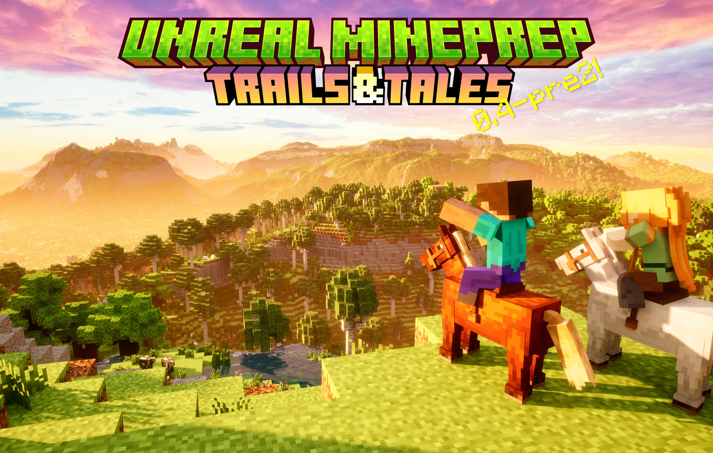
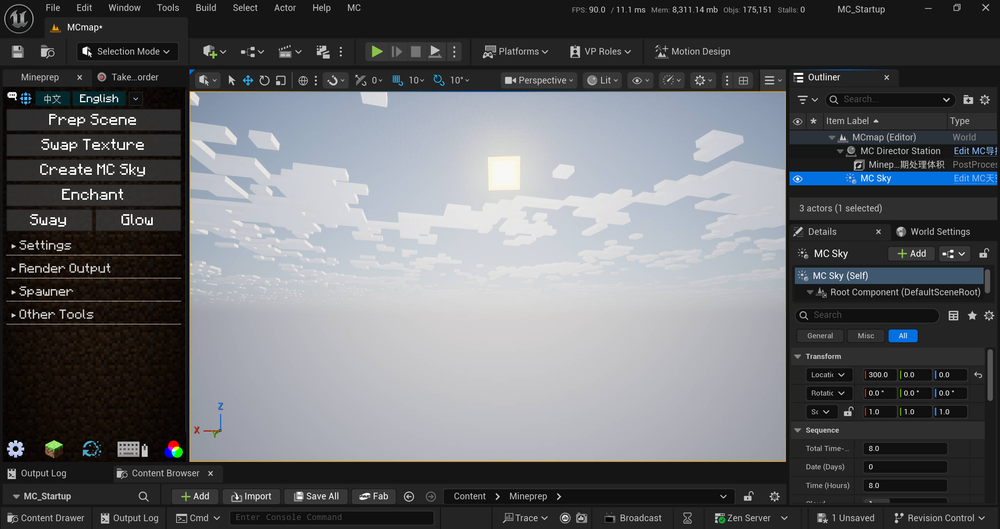

# Unreal-Mineprep

中文 | [**English**](./README_EN.md) | [**繁體中文**](./README_ZH-Hant.md)

✨这是一个正在开发中的UE5插件，继承了 [Blender MCprep](https://theduckcow.com/dev/blender/mcprep/) 的实用功能，并加入一些新的资产，为制作MC动画带来便利

*本插件与Minecraft、MCprep官方没有直接联系，在其建议下插件名称由Unreal MCprep更改为Unreal Mineprep，以避免混淆（0.3及之前的版本已经归档，就不做修改了）。  
在v1.0正式发布前，插件主要供内部使用，可能存在兼容性问题和潜在的 ~~bug~~ 特性。之后会逐步修复并写一些使用教程（但这应该是很久以后的事了）

## 安装方法（适用于0.4+版本）

### ① 使用安装包（推荐）
1、下载Mineprep插件，建议保存在纯英文路径下。  
- 你可以在右侧的`Releases`部分下载较为稳定的大版本；或者点击上面的绿色`Code`按钮 -> `Download Zip`，下载最新快照版本。

2、解压安装包，使用Blender打开里面的`Mineprep_installer.blend`文件。
> Unreal Mineprep是在Blender MCprep的基础上开发的，部分功能会远程调用MCprep里的函数。如果你是Blender用户那就好极了！
- 如果你没有Blender，可以前往[Blender官网](https://www.blender.org/download/)下载，建议选择"Windows Portable"版本，无需安装，解压即用。当然也可以在[Steam](https://store.steampowered.com/app/365670/Blender/)等其他平台下载。
- 此外，我们还推荐你在Blender中安装[MCprep插件](https://theduckcow.com/dev/blender/mcprep/)。

3、点击▶️运行脚本，会弹出菜单和安装引导，目前提供了`创建新的工程文件`和`安装至现有工程`两个选项，还可以选择实验性功能、插件设置等内容。然后就能一键安装了。

### ② 手动安装
需要复制Mineprep内容文件夹+修改项目设置，稍后会更新详细步骤

## 生物
- Mineprep提供了MC原版生物模型，可以通过生成器面板放置
- 目前有骨骼网格体和自动化NPC两种类型。所有生物都可以更换材质，两脚生物可以添加通用的IK绑定
- 当前版本支持：猪、牛、羊、马（驴、骡、僵尸马、骷髅马）、僵尸、尸壳、溺尸、骷髅、凋灵骷髅、流浪者、沼骸、猪灵、猪灵蛮兵、掠夺者、卫道士、铁傀儡
- 更多内容正在更新中

## 语言本地化
- Mineprep提供了可拓展的多语言翻译，目前支持中文/英文/繁体中文
  - **安装包**会根据Blender的偏好设置选择语言。本地化内容以字典的形式写在代码中，参见[Mineprep_installer.blend](./Mineprep_installer.blend)或[Mineprep_installer.py](Blender扩展资源/Mineprep_installer.py)
  - **插件面板**上方有选择语言的按钮，在启动时会根据UE的偏好设置选择语言。本地化内容保存在[语言本地化_language_localization.csv](./Mineprep/插件贴图/语言本地化_language_localization.csv)中
  - 安装实验性功能后，可以点击**顶部菜单栏-MC-开发-注入本地化变量名**，进一步翻译细节面板中的变量和函数。这是一个正在开发中的新功能。本地化内容保存在[变量显示名_VariableDisplayNames.csv](./实验性功能(C++)/Mineprep/Content/变量显示名_VariableDisplayNames.csv)中
- 更多内容正在更新中

## 开源协议
- 在制作插件时，我原来用的是GPL-3.0协议，但是现在包含了虚幻引擎的官方示例+源代码，它们好像和开源许可证不兼容 (*´･д･)? 所以这里就先不放License文件了。
- 在大部分情况下，你可以免费使用本插件。(UE5.3及更早的版本不向影视创作者收费，UE5.4开始对年收入超过100万美元的用户按席位收费，显然我们不会达到收费门槛hhh)  
具体参见[Epic Games的用户协议](https://www.unrealengine.com/zh-CN/eula)
- 以后考虑做一个Mineprep Lite，只留下准备场景、更换材质等核心功能，没有官方素材和引擎源码。这样安装会简单很多，也能放GPL-3.0协议了
- 同时，Mineprep引用了许多第三方插件和资源，在此向他们表示感谢。我们在[ResourceLicenses](./Readme素材/ResourcesLicenses)文件夹中收录了一些许可证和作者留言。如有遗漏可以拉一个Pull Request进行补充

# Unreal-Mineprep

English | [**中文**](./README.md) | [**繁體中文**](./README_ZH-Hant.md)

✨This is a UE5 plugin that inherits the practical features of [Blender MCprep](https://theduckcow.com/dev/blender/mcprep/), and adds some new assets to facilitate the creation of MC animations.

*This plugin is not affiliated with Minecraft or MCprep. Upon their suggestion, we changed the name from Unreal MCprep to Unreal Mineprep to avoid confusion (versions 0.3 and earlier have been archived so they remain unchanged).  
Before the official release of v1.0, the plugin is mainly for internal use, so there may be compatibility issues and potential ~~bugs~~ features. We will gradually fix them and write some tutorials (though it will be a long way off).

## Installation (for version 0.4+)

### ① Use the installer (recommended)
1. Download the Mineprep plugin, preferably save it in a pure English path.
- You can download more stable major versions in the `Releases` section on the right; or click the green `Code` button above -> `Download Zip` to download the latest snapshot version.

2. Unzip the installer and open the `Mineprep_installer.blend` file with Blender.
> Unreal Mineprep is developed based on Blender MCprep, and some functions will remotely call functions in MCprep. If you are a Blender user, that's great!
- If you don't have Blender, you can download it from the [Blender website](https://www.blender.org/download/). We recommend choosing the "Windows Portable" version, which does not require installation. Of course, you can also download it from other platforms such as [Steam](https://store.steampowered.com/app/365670/Blender/).

3. Click ▶️ to run the script, a menu and installation guide will pop up. Currently, there are two options: `Create a new project file` and `Install to an existing project`. You can also choose experimental features, plugin settings, etc. Then you can start the automatic installation.

### ② Manual installation
You need to copy the Mineprep content folder + modify the project settings. Detailed steps will be updated later.

## Mobs
- Mineprep provides Minecraft mobs which can be placed through the spawner panel.
- Currently, there are skeletal meshes and automated NPCs. All mobs can change materials, and humanoids can add universal IK bindings.
- Current version supports: pig, cow, sheep, horse (donkey, mule, zombie horse, skeleton horse), zombie, husk, drowned, skeleton, wither skeleton, stray, husk, piglin, piglin brute, pillager, vindicator, iron golem.
- More content is WIP.

## Localization
- Mineprep provides an extensible multi-language translation, currently supporting Chinese/English/Traditional
  - The **installer** will select the language based on Blender's preference settings. Localization content is written in the form of a dictionary in the code, see [Mineprep_installer.blend](./Mineprep_installer.blend) or [Mineprep_installer.py](Blender扩展资源/Mineprep_installer.py)
  - The **plugin panel** has a button to select the language, which will be selected based on UE's preference settings at startup. Localization content is saved in [语言本地化_language_localization.csv](./Mineprep/插件贴图/语言本地化_language_localization.csv)
  - After enabling experimental features, you can click **Top Menu-MC-Development-Inject Localization Variable Names** to further translate the variables and functions in the detail panel. This is a new feature under development. Localization content is saved in [变量显示名_VariableDisplayNames.csv](./实验性功能(C++)/Mineprep/Content/变量显示名_VariableDisplayNames.csv)
- More content is WIP

## License
- My plugin once used the GPL-3.0 license, but now it includes Unreal's example contents & source code, which seem to be incompatible with open-source licenses (*´･д･)? So currently I don't put any license file here.
- In most cases, you can use the plugin for free. (UE5.3 and earlier versions are free for video production; UE5.4 and later charge users with an annual income exceeding $1 million per seat. Obviously we won't reach the charging threshold hhh)
  - See [Epic Games' EULA](https://www.unrealengine.com/eula) for details
- In the future, we plan to make a lite version of Mineprep, which only retains core functions such as preparing scenes, changing materials, etc., without official assets and engine source code. This will make installation much simpler and allow the use of the GPL-3.0 license.
- At the same time, Mineprep references many third-party plugins and resources. We have included some licenses and author notes in the [ResourceLicenses](./Readme素材/ResourcesLicenses) folder. If there are omissions, you can submit a Pull Request to supplement them.

## Version Updates

#### 0.4-pre2

- A new milestone! We have put the results of the past few months into actual production, creating the video "Epic Animations 2" and bringing many detailed optimizations and bug fixes.
- Added `MC Director Station`, generated together with Mineprep post-processing volume as the basic module of the scene.
  - In the detail panel, you can separately control preview quality, preview FPS limit and rendering quality to optimize performance (all rendering presets no longer use cinematic quality settings, but are controlled by the MC Director Station). The default preview quality is "3+ Ultra High", and the default rendering quality is "4 Cinematic". If your computer performance is weak, it is recommended to change the preview quality to "2 High (Fast Lumen)"; if you want to reduce flickering and ghosting during rendering and further improve quality, you can change the rendering quality to "4+ Cinematic (Enhanced Lumen)".
  - The MC Director's Desk can add event keyframes on the timeline to broadcast commands to the entire scene, such as batch switching lights, switching NPC actions, starting running and jumping, etc. It can reload signal source positions (specified coordinates < specified actor < search actor by tag), adjust the maximum signal propagation distance (a negative value will shrink from the outside in), set the propagation speed to simulate delay, and modify the parameters of different commands. Enabling debug will display the sphere shape of the maximum distance.
  - In the future, we will add functions such as switching player cameras and dynamically modifying post-processing effects.
- "Motion matching player" and NPCs  have more control methods now.
  - Added custom keyboard animations to replace the old version of switching ficial expressions. It has extended to all NPCs. In the detail panel, you can choose up to 3 actions and 3 expressions, switch actions with keyboard keys 1-3, and switch expressions with keys 4-6. You can also set "blend time", "disable movement input while playing action", and "NPC loop play action 1". If you want movement offset, please ensure that the animation strip has root motion; specifically, the third-person motion matching character needs to add the prefix UE_ or UEFN_ to use the action for the official human model before retargeting, otherwise it will be directly applied to the MC model (no offset).
  - Now you can call events such as jumping, running, switching animations, dismemberment, paralysis, etc. from the timeline. (The latter belongs to the "numpad physical events", triggered by specifying the key name. The default value is 0, which means paralysis).
- The spawner panel adds `Pile up Blocks` and `Background Animal Scatter`, using the PCG plugin to procedurally place a large number of models.
  - Pile up Blocks by default generates  5x5x1 grass blocks, which can be set to be placed in mid-air or in a custom curved area. It can automatically snap to the ground based on the collision box. You can modify the block mesh, such as covering the ground with top layer snow. You can also set a second block and adjust the ratio between the two; add offsets or random rotations. Note that Pile up Blocks do not have face culling, so the performance is not good for very large scenes.
  - Background Animal Scatter will place pig, cow, sheep, and horse NPCs in a curved area. You can modify parameters such as species and density. To improve performance, all simple animal NPCs have turned off physical interactions  by default.
- "Attach" function in the spawner panel are no longer limited to the last selected actor. Some functions will be applied to all eligible objects. We added `Light Remote Controller`, which can attach remote control components to all selected light sources (excluding sunlight and sky atmosphere) with one click, allowing them to be batch controlled by the MC Director Station.
> This feature is prepared for UE5.5. With the help of "Megalights", it can greatly improve performance, supporting hundreds or thousands of lights. The shots lighting up the entire scene in the trailer look super cool \~\\(≥▽≤)/\~
- The "Crane Camera" also has smooth motion now.
- Optimized the collision boxes of mobs, especially their hands.
- Added `Small Explosion Shake`, `Large Explosion Shake`, `Slow Camera Shake`.
- Added `Fluid-style Collision Particles`.
- The "Glow" section of Other Tools panel adds `Convolution Bloom` and `Conv-dispersion`, making the bloom softer; the "Motion Blur" section adds `FPS` (the lower the frame rate, the longer the shutter time, and the greater the blur effect); the "Light Path" section adds `Ray Tracing Translucency (Unoptimized)`, which can improve light and shadows of water and clouds. But it sometimes leads to noise and bugs, which will be optimized later.
- Fixed the UV mapping of horse skins.
- Uploaded the FBX models of new mobs in the "Blender扩展资源" folder.
- 0.4-pre2 does not have demo scenes. The final release of 0.4 version is coming during the winter vacation.
- *Story: The theme of this version is called "Trails and Tails". According to our original plan, there are two major updates - "Trails" refers to motion matching (0.4-pre1), and "Tails" refers to camera language (0.4). So what about 0.4-pre2? It's actually a overhaul of the plugin during the summer vacation. Besides, we are glad to see many new features added to the plugin too. In the next few months, we will focus on updating camera and movements~*

#### 0.4-pre1

- New milestone (*・ω・)ﾉ We fixed a lot of bugs and added several new features this week. The packaged demo exe containing all the content from 0.3 and 0.4-pre1 will be uploaded later as a formal Release.
- mcprep_data.json has been updated to version 1.21, synchronized with the newly released MCprep 3.6. The default resource pack has not been updated yet.
- Added a `Complex` option next to the "Collision" option in the plugin panel, enabled by default. Previous prepared scenes also used complex collision; if you want to perform physical simulations, please disable this option and then use the prepared scene on the selected items. Additionally, three new functions have been added:
- **Replace Material**  
  `Modifies`: Viewport Selected   
  `Effect`: Searches for a single static mesh or a blueprint containing skeletal mesh components and replaces all materials with the specified material. If no material is specified, no replacement will occur.  
  `Options`: Material, Overlay, Physics
- **Process Recording**  
  `Modifies`: Opened sequencer  
  `Effect`: Searches for "Motion Matching Player" on the timeline, finds recorded animations, and attempts to fix rotation issues. (I finally found this bug. Since the MC rigs are redirected to the official motion matching character at runtime, it records keyframe animations twice. Resetting the MC rigs' rotation to zero can partially solve the issue of idle camera rotation).
> The following is the first experimental feature and the first one to include C++ code.  
> We discovered the hidden VR+3D rendering function last week and couldn't wait to bring it out this week -- please use experimental features with caution. A detailed introduction and warning will pop up before running, requiring confirmation to proceed.
- **Experimental**  
  `Requires`: UE version 5.4 + Windows system (Otherwise, it will try to recompile the plugin from source code when opening the project file, and it's currently unclear if Visual Studio is needed)  
  `Modifies`: Movie Render Queue Additional Render Passes plugin  
  `Effect`: Extracts the modified new plugin and moves it to the Plugins folder in the root directory of the project file. It will prioritize loading the plugin from here upon restart. The Stereo, Eye Separation, and Eye Convergence Distance options in panoramic rendering have been unlocked, allowing output of stereoscopic panoramic rendering. Other rendering presets are unaffected. It has not yet been added to the custom rendering configuration in the plugin panel.  
  `Options`: Yes/No
- New rendering preset `【实验性】VR_3D-FTB_8K_HDR_exr`, requires enabling experimental features  
  - Uses 8640*8640 resolution, outputs a Full-Top-Bottom panoramic sequence, adopts Rec2100 PQ color transformation, and DWAA compressed exr encoding. Since we're doing such high-spec rendering, let's max out all parameters.
  - Each frame is about 35MB, requiring about 40G of VRAM + shared memory... This is really not something an ordinary computer can handle qwq (exr is already much smaller than png).
- Continued fixing rendering preset and character collision bugs
- Added `Diffuse` slider to the "Light Path" panel, which can increase the intensity of indirect lighting
- Now you can place multiple "Soft Body Steve" in the scene
- The shortcut key for inverting the mouse Y-axis in "FPV Flight Mode" has been changed to Tab
- Added an option for automatic wall climbing (i.e., two-block high) to the "Motion Matching Player", enabled by default; can be disabled at runtime by pressing Tab
- Both "Motion Matching Player" and "Simple NPC" now have item slots and can enable physical simulation through the num pad.  
  "0" - Paralysis   "." - Toggle gravity   "2" - Drop item  
  "4" - Break left arm   "1" - Break left leg  
  "6" - Break right arm   "3" - Break right leg  
  "8" - Break head   "5" - Break Full body   
  - When recording animations using the camera recorder, if you want to throw the held item, add "Nearby Spawned Actors", and then manually specify the model of the thrown item on the timeline. This is currently the best method, as directly dropping the original item causes jitter, while spawning a new item is more stable.
> The above shortcuts may require enabling Num Lock on the num pad
- Added "NPC跑步跟随目标" (Run to Follow Target) option and several original running animations to the creature detail panel.
- Added "Idle-Follow AI Controller"
- Try fixing the bug where the Take Recorder can not record character camera rotation.
  - The FPV flying camera can always record rotation.
  - The MC first-person camera can now record rotation except for camera shake.
  - The motion matching player is more complicated. You need to place a `Sync Player Camera` through the spawner panel, then add it to the recording panel. It will sync and record the player's camera rotation. If the recorded animation has a few stutters, delete those keyframes and smooth the transition. Remember to switch the camera bound to the timeline before render.
- "MC Sky" can now set the direction and speed of cloud movement, and the cascade shadow distance of lighting has been increased for smoother transitions
- "Prep Scene" now adds sound effect physical materials based on block names. Currently, there are six types: grass, gravel (dirt), sand, snow, stone, and wood. Unmatched ones are considered stone. The "Motion Matching Player" will play corresponding footstep sound effects when walking on them. Note that the entire audio rendering module is still in early development, and currently, you can only hear the sound.
- Added `Smooth Physical Material`, `Elastic Physical Material`, and the previously existing "High Friction Physical Material" to affect objects with enabled physical simulation.
- Removed the material interface of "Interactive 2D Water Surface" because water materials require a dedicated module to render waves, and randomly changing one doesn't work. Also, changed its collision target from Actor to component, fixing the collision failure bug.
- Fixed the bug where "Light Linking" was ineffective for internal components
- The "2x Distance Field" and "Enable Nanite" options in the "LOD&Nanite" function are disabled by default, as they run very slowly. The first button to disable shadows seems more practical.
- The plugin panel pop-up now supports English, and part of the GitHub Readme has also been translated into English -- Yes, clicking the English button at the top won't lead to a 404 page anymore. The oldest bug has finally been fixed!

> [!NOTE]
> The remaining English translation is WIP
