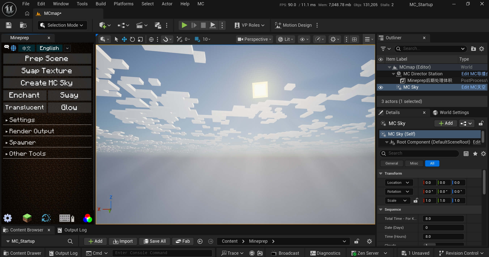
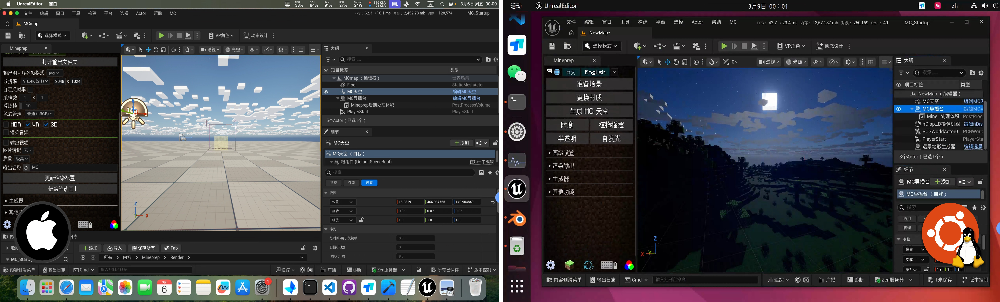
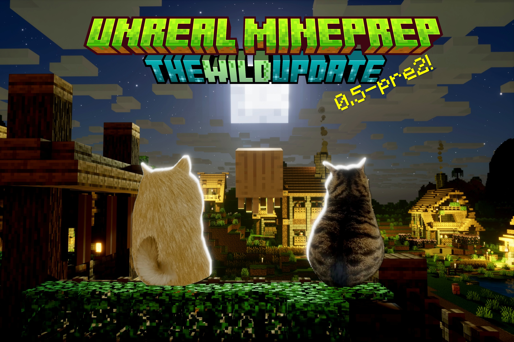
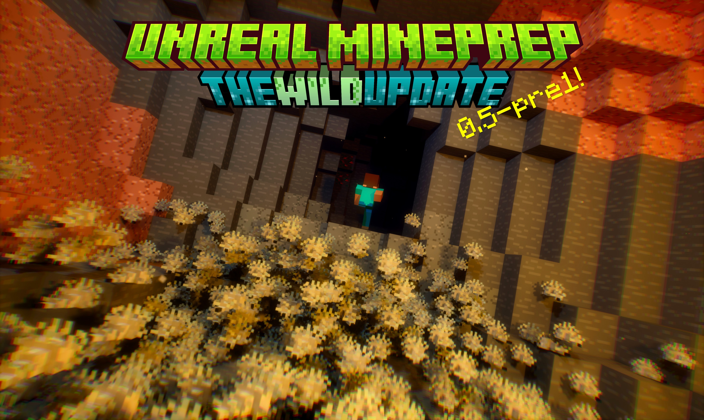
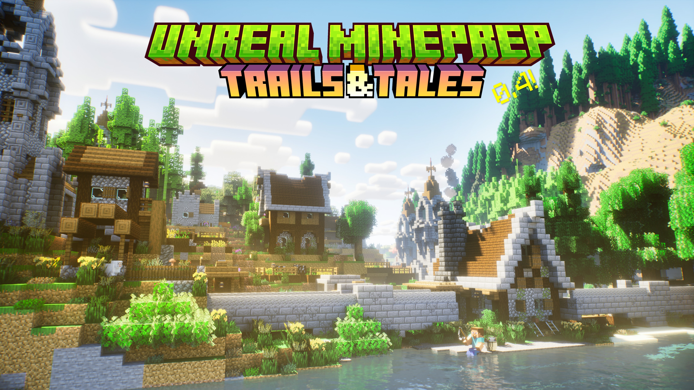
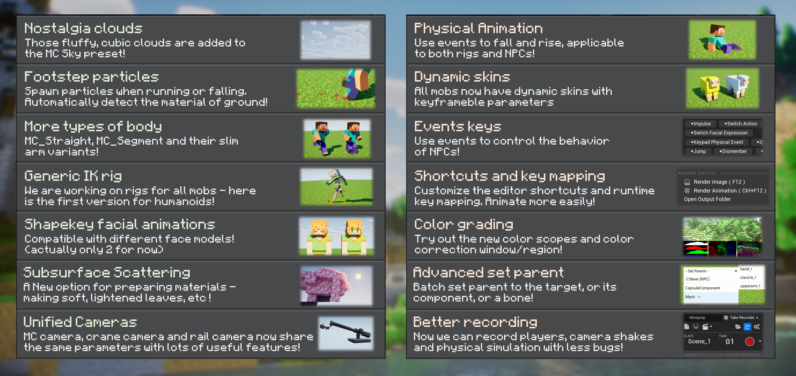
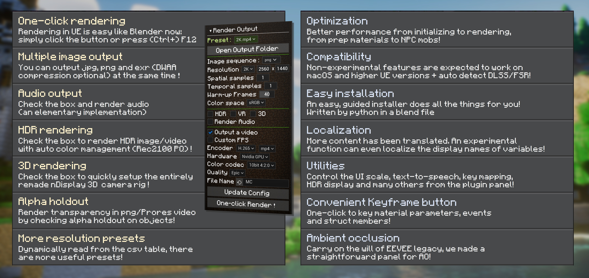
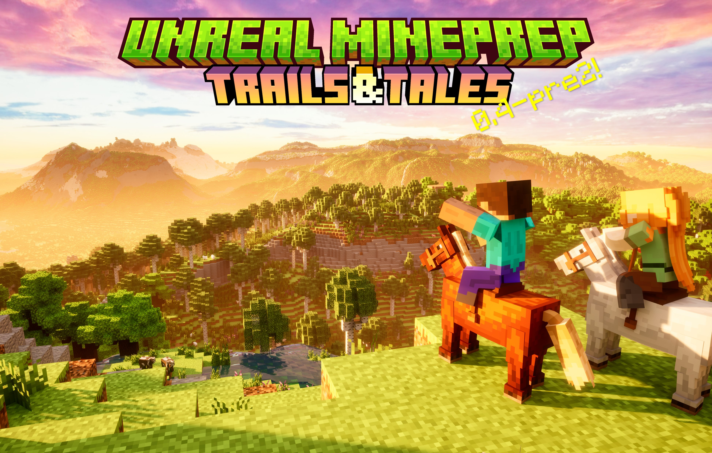
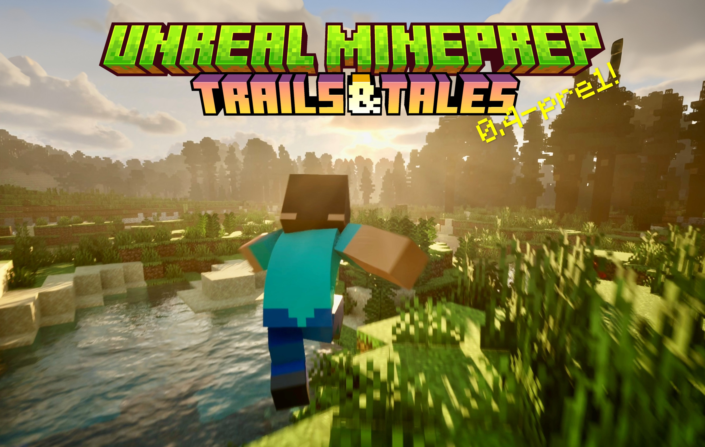

# Unreal-Mineprep

English | [**中文**](./README.md) | [**繁體中文**](./README_繁體中文.md)

✨This is a UE5 plugin that inherits the practical features of [Blender MCprep](https://theduckcow.com/dev/blender/mcprep/), and adds some new assets to facilitate the creation of MC animations.




*This plugin is not affiliated with Minecraft or MCprep. Upon their suggestion, we changed the name from Unreal MCprep to Unreal Mineprep to avoid confusion (versions 0.3 and earlier have been archived so they remain unchanged).

Before the official release of v1.0, the plugin is mainly for internal use. There might be compatibility issues and potential ~~bugs~~ features. We will gradually fix them and write some [tutorials (click to view)](https://github.com/piggestpig/Unreal-Mineprep/wiki).

[Mineprep Lite](https://github.com/piggestpig/Mineprep-Lite) is a lite version of this plugin, which is small in size, fast to download, and open source under the GPLv3 license. It contains 95% of the core features with a ~250MB zip file.

## Installation

### ① Using the Installer (Recommended, for version 0.4+)
1. Prerequisites: Install [Unreal Engine](https://www.unrealengine.com/en-US/download), [Blender](https://www.blender.org/download/), and the [MCprep](https://theduckcow.com/dev/blender/mcprep/) plugin.
> MacOS users also need to install [Xcode](https://developer.apple.com/xcode/) to launch Unreal Engine.

2. Download Mineprep, preferably save it in a pure English path.
> You can go to [Releases](https://github.com/piggestpig/Unreal-Mineprep/releases) -> Assets -> Source code (zip) to download the stable major versions.  
> Or click the green "Code" button above -> "Download ZIP" to download the latest snapshots.

3. Extract the plugin package and open the "Mineprep_installer.blend" file using Blender.

4. Click ▶️ to run the script. A menu and installation guide will pop up. Currently, it supports "Create a new UE project" or "Install to an existing project".
> You can select experimental features and modify plugin settings. The required space is between 500MB~2GB.

### ② Manual Installation
This requires manually copying the content folder and modifying project settings. Detailed steps will be updated later.

<details>
<summary> View files modified during installation </summary>

```
Project Directory
    ├── Config
    │     ├── Windows
    │     │     └── WindowsEngine.ini
    │     ├── DefaultEditor.ini
    │     ├── DefaultEngine.ini
    │     └── DefaultInput.ini
    ├── Content
    │     └── Mineprep
    ├── Plugins
    │     ├── Mineprep (*)
    │     ├── InlineMaterialInstance*
    │     └── MoviePipelineMaskRenderPass*


* Optional experimental features
(*) Both normal/experimental features are available
```

</details>

<details>
<summary> [Recommended] Install DLSS </summary>

It is highly recommended for NVIDIA users to install DLSS to improve performance, enhance image quality and save VRAM.

1. Go to [https://developer.nvidia.com/rtx/dlss#getstarted](https://developer.nvidia.com/rtx/dlss#getstarted), download the corresponding plugin version in the "DLSS 4 Plugin for Unreal Engine" section.

2. After extraction, copy the subfolders inside the Plugins folder to the Marketplace folder in the Unreal Engine plugins directory (as shown below):

**From extracted DLSS plugin folder**
```
Plugins
  ├── DLSS
  ├── DLSSMoviePipelineSupport
  └── ...
```
**To Unreal Engine plugins folder**

```
Engine
  ├── Plugins
  │     ├── Marketplace
  │     │     ├── DLSS ⬅
  │     │     ├── DLSSMoviePipelineSupport ⬅
  │     │     └── ...
  │     └── ...
  └── ...
```
If the Marketplace folder doesn't exist, create one by yourself.

3. Open the project, search for DLSS in the top-left toolbar -> Edit -> Plugins, enable `NVIDIA DLSS Super Resolution/Ray Reconstruction/DLAA` and `Movie Render Queue DLSS/DLAA Support`, then restart the engine.

After a successful installation, you can adjust DLSS settings in the MC Director Station.

> Only DLSS and Ray Reconstruction can be used when rendering animations (Frame Generation is not supported here), so enabling these two plugins is sufficient.

</details>


## System Requirements
Mineprep 0.5 is developed on Windows + UE5.7, and it's recommended to use this environment. Some features may not be available on other platforms or engine versions.

In addition to the minimum requirements in the [Unreal Engine Documentation](https://dev.epicgames.com/documentation/en-us/unreal-engine/hardware-and-software-specifications-for-unreal-engine), rendering animations requires higher specs and more VRAM:

| Recommended Specs | Reference Specs<sup>[1]</sup> |
| :--- | :--- |
| - GPU supporting Hardware Ray Tracing<sup>[2]</sup> <br>- 32GB+ RAM and 12GB+ VRAM<br>- SSD (Solid State Drive) | - CPU: i7-13700K<br>- RAM: 32GB*2 DDR5-6400MHz<br>- GPU: RTX 4080 (16GB)<br>- Storage: 2TB + 4TB PCIe 4.0 SSD |

<sup> [1] The computer we use for development and animation.  
[2] NVIDIA 20 series, AMD 6000 series, Intel Arc, or Apple M3 and above. </sup>


### Platform Compatibility

| *Mineprep 0.5* | Installer(Blender) | UE5.7 | Higher Engine Versions(5.8+) | Lower Engine Versions(5.6-) |
| :---: | :---: | :---: | :---: | :---: |
| Windows | ✅ | ✅ | ⚠️ | ❌ |
|   Mac   | ✅ | ✅* | ⚠️ | ❌ |
|  Linux  | ✅ | ✅* | ⚠️ | ❌ |


✅: Compatible, tested and fully functional  
ℹ️: Untested, theoretically should work  
⚠️: **Experimental features unavailable**, non-experimental features should work  
❌: Incompatible, cannot be used

> [!WARNING]  
> Do not check experimental features in incompatible environments (like higher engine versions), otherwise the project won't open and it will crash right at the start!!

<details>
<summary> *Show Specs Details </summary>


<sup><i> ↑ A group photo of Mineprep 0.5 running on MacOS and Linux </i></sup>

- The installer is a Python script written in Blender. It's theoretically cross-platform, but some details like os.startfile() are only available on Windows. We try to use fallbacks for these functions via command line.
- Non-experimental features of the plugin are UE5 Blueprint assets. Higher engine versions can be backward compatible with old assets, but lower engine versions cannot open new assets. If you have to use a lower engine version, please download earlier versions of Mineprep.
- Experimental features are C++ code and must be compiled for specific platforms and engine versions. Windows will be updated with every snapshot. Mac and Linux will only be updated with major version releases.
- Currently, physics interaction rigs cause crashes on Mac and Linux; this asset will be skipped during installation.
- Additionally, the plugin bundles FFmpeg for video encoding. You can also manually download FFmpeg and specify its path during installation. It is recommended to download the latest master build.

> ⚠️  
> MacOS has been tested with M4 Max (36GB) and M2 Max (32GB). Current issues are as follows:  
> · Although Hardware Ray Tracing and Megalights are usable, Alpha mask seems unsupported. VSM (Virtual Shadow Maps) is enabled by default  
> · Distant Landscape Generator performance is poor, several times slower than expected  
> · Interactive 3D Water Pool is highly unstable, causing severe self-collision  
> · Without super resolution plugins like DLSS, the engine's built-in TSR is used by default, resulting in severe ghosting and poor performance. An empty scene takes 6ms, even slower than ray tracing  
> · nDisplay is missing, so 3D stereoscopic rendering is unsupported. Preliminary 3D rendering functions are available only after installing experimental features  
> · Tkinter is missing, preventing those like shortcut summary panel from displaying  
> · MacOS can place files anywhere in a folder. After rendering, you may need to scroll down to see the video at the bottom  
> · The text sorting in the spawner subpanel is different from Windows, likely a python  issue. It doesn't influence the function anyway, so just treat it as a feature  
> · The Ctrl hotkey seems to become Cmd. I couldn't trigger any shortcuts during remote control, but it should be fine in local use

> ⚠️  
> Linux was tested briefly on a server with E5+64G+3090:  
> · Besides missing tkinter, no major issues were found for now  
> · E5 is just way too slow. Despite having 18 cores, compiling shaders took half an hour, and editor framerate was only 40-50fps (It's my first intuitive realization of the importance of single-core performance)  
> · Is anyone really using linux for animation?

> ⚠️  
> When using unofficial engine versions like NvRTX, experimental features are unavailable, though other features should work.  
> Unofficial versions typically require manual compilation. If your environment is set up, you can actually install experimental features and recompile as prompted when opening the project.  
> NvRTX 5.7 only supports Blendable GBuffer. Please check "Remote testing " during installation.

· Sufficient VRAM is the foundation for smooth operation. Rendering animations will consume additional VRAM. Windows (DX12) and MacOS can continue rendering using RAM/Disk when VRAM is exceeded, but at about 1/10 the speed. Exceeding VRAM on Vulkan will result in a direct crash.

· With the recommended RTX 4080 specs, editor framerates are typically between 60~120fps.

· Our commonly used render presets are `2K_120.mp4` and `2K_120_HDR.mp4`, using `4 Cinematic (Specially Tuned)`, enabling DLAA and DLSS Ray Reconstruction, with output frame rates around 10~30fps.


</details>


## Mobs
- Mineprep provides Minecraft mobs which can be placed through the spawner panel.
- Currently, there are skeletal meshes and automated NPCs. Some mobs have vertex-animated instance model for large crowd particles. All mobs can change materials, and humanoids may add universal IK bindings.
- Current version supports: Steve/Alex player, pig, cow, sheep, horse (donkey, mule, zombie horse, skeleton horse), zombie, husk, drowned, skeleton, wither skeleton, stray, bogged, piglin, piglin brute, pillager, vindicator, iron golem, silverfish, endermite, spider (cave spider), villager, blaze, wither, hoglin, snow golem, wolf, cat, allay, wandering trader, ocelot, ghast, ghastling, happy ghast, creeper, parrot, camel, camel husk, parched.
- More content is WIP.

## Localization
Mineprep provides extensible multi-language translation, currently supporting Chinese/English/Traditional Chinese.
- The **installer** will select the language based on Blender's preference settings. Localization content is written in the form of a dictionary in the code, see [Mineprep_installer.blend](./Mineprep_installer.blend) or [Mineprep_installer.py](Blender扩展资源/Mineprep_installer.py).
- The **Plugin Panel** has a language selection button at the top, which defaults to UE's preferences at startup. Localization is saved in [语言本地化_language_localization.csv](./Mineprep/插件贴图/语言本地化_language_localization.csv) and [变量显示名_VariableDisplayNames.csv](./Mineprep/插件贴图/变量显示名_VariableDisplayNames.csv).
- Particle parameters can only be translated if the first experimental feature `(Mineprep C++ Extensions)` is installed.  
- Material parameters can only be translated if the second experimental feature `(Add keyframe buttons and localization for material parameter panel)` is installed.
- The first experimental feature also provides custom shortcuts. You can press `Insert` to attempt translation of the text under the mouse cursor. If a match is found in the VariableDisplayNames CSV file, the text will be replaced.

More content is WIP.

## License
- Since the full version of Mineprep contains Unreal's example contents and source code, which are incompatible with open-source licenses, there is no individual License file here. [Mineprep Lite](https://github.com/piggestpig/Mineprep-Lite) is a lite version open-sourced under the GPLv3 license.
- In most cases, you can use this plugin for free. (UE 5.3 and earlier versions do not charge film creators. From UE 5.4, users with an annual revenue exceeding $1 million are charged per seat. Obviously, we won't hit that threshold hhh).  
See [Epic Games' EULA](https://www.unrealengine.com/en-US/eula) for details.
- Additionally, Mineprep incorporates many third-party plugins and resources, and we express our gratitude to their creators. We have included some licenses and author messages in the [ResourceLicenses](./Readme素材/ResourceLicenses) folder. If anything is omitted, feel free to open a Pull Request.


## Version Updates

### 0.5: The Wild Update


Mineprep 0.5 has been released! This is the first cross-platform version supporting Windows, MacOS, and Linux, with experimental features tailored for UE 5.7.

After more than a year of development, the plugin has received major updates across all aspects. We have produced 4 animations and achieved 10k followers!

You can head over to the [Mineprep Wiki](https://github.com/piggestpig/Unreal-Mineprep/wiki) for beginner tutorials, or join the discussion in the [Discussions area](https://github.com/piggestpig/Unreal-Mineprep/discussions). We have already implemented several improvements based on community feedback. Thank you all!

Let's see what's new:

<details>
<summary> All Core Features are implemented in the initial stage </summary>

- Mineprep 0.5 finally brings the `Import World` and `Swap Mesh (Instancing)` buttons, corresponding to MCprep's "OBJ world import" and "Mesh Swap" features.
- Furthermore, we are developing the Mineprep Python API inspired by Blender. With experimental features installed, you can access every button on the plugin panel via Python.

</details>

<details>
<summary> Support for Minecraft Materials with LabPBR standard  </summary>

- In recent years, most MC texture packs adopt the [LabPBR](https://shaderlabs.org/wiki/LabPBR_Material_Standard) standard. Mineprep now supports all its features except porosity!
- The new materials also offer practical features such as translucency, mask layers, ping-pong animations, and multi-layer mob skins.

<sup>*Porosity is used for wet effects during rainfall, which will be supported in Mineprep 0.6 (TBA Aquatic Update).</sup>

</details>

<details>
<summary> Procedurally Generated Minecraft Terrain </summary>

- `Distant Landscape Generator` and `Dynamic Landscape Particles` can efficiently generate MC terrain on the GPU! Their performance and development progress have far exceeded expectations, standing out as highlights of this update.
- The Mineprep 0.5 cover image was created using the Distant Landscape Generator.
- Our new animation *?!Bad Apple!?* utilizes the Dynamic Landscape Particles and is playable in real-time.

</details>

<details>
<summary> More Minecraft Mobs </summary>

- Added *Silverfish, Endermite, Spider, Cave Spider, Villager, Blaze, Wither, Hoglin, Snow Golem, Wolf, Cat, Allay, Wandering Trader, Ocelot, Ghast, Ghastling, Happy Ghast, Creeper, Parrot, Camel, Camel Husk, Parched*.
- Create animations using multiple methods: control rigs, physics interaction, batch-playing sequence, etc.
- Redesigned NPC mobs, supporting randomized skin spawns and more movement modes.
- Some mobs feature riding slots and can be stacked on top of each other.

</details>

<details>
<summary> Grand Unified Particles </summary>

- We designed a Minecraft particle template and updated most existing particle systems, providing unified basic parameters and utility features.
- Use `Global Particle Spawning Area` to generate particles at any location.
- Use `Global Force Field` and its derivations like "Particle Interaction Field" and "Anim Offset Field" to control particle systems.
- Use `Global ID` to summon sub-particles and link multiple systems together.
> Particle systems currently using this template include: *Rain, Snow, Splash Potion, Dust, Explosion, Loot Drop, Heart, Falling Leaves, Confetti, Self-Collision Particles, Unified Boid Particles (Bug Swarm, Spider Swarm, Bird Flock, Firefly, Media Keying Particles)*.

</details>

<details>
<summary> More Render Output Formats </summary>

> Since the engine's built-in H.264 and ProRes encoders are only available on Windows, we've vastly improved the FFmpeg encoding configurations to support MacOS, Linux, and advanced output formats.

- Video Encoding: H.264, H.265, AV1, ProRes
- Image Encoding: jpg, png, exr, gif, webp, avif, jxl
- Proper HDR color management workflow, supporting WYSIWYG rendering.
- More 3D Output formats
- Render layers

</details>

<details>
<summary> Improved User Experience </summary>

- Fixed numerous bugs and optimized performance; meanwhile, the material parameter panel in UE 5.7 no longer crashes, making this the most stable plugin version in recent days.
- The installer provides more options, allowing you to choose the lite version, display required space, lower default quality settings, etc.
- More localized translations in the plugin panel and preset assets.
- Work-in-progress beginner tutorials, see [Mineprep Wiki](https://github.com/piggestpig/Unreal-Mineprep/wiki).


#### 0.5-pre3

<sup><i> This is a jpg cover with HDR Gain Map! View the high dynamic range effect on an HDR display or downloading to your phone. <br>
Map from https://www.curseforge.com/minecraft/worlds/rtx-aio-map </i></sup>

Mineprep 0.5-pre3 is the last version supporting UE5.6, bringing many revolutionary features:
- First time to support MC's LabPBR material standard
- First time to have a proper HDR workflow, also providing more image/video output formats
- First time to use UE's native localization system, dynamically and efficiently injecting variable names
- Brand-new NPC system and Unified Boid Particles
- Full adaptation of Chaos Field System for global force fields, material masks, and animation offsets

Note: This version is in the transition phase between UE5.6 and 5.7, so many new features haven't been tested in real production yet. We plan to use UE5.7 to create new animation videos. Here are the final update logs from the last two weeks:
- Added `Global Force Field`, `Force Field Detector`, `Anim Offset Field`, `Material Mask Field`, `Angular Rotation Field`.
  - All of the above use the Chaos Field System and only work at runtime, with no effect in the editor.
  - Unreal Engine provides 12 types of force fields, including integer fields, scalar fields, and vector fields. Vector fields point to the center by default, and you can check "Reset Direction"
  - Boundary ranges include sphere, box, one-side of plane, and full scene
  - You can set force field strength, attenuation, and add noise to it
  - You can separately enable "World Field" (affects particles, materials) or "Chaos Field" (affects physics simulation)
- The legacy radial force field is still retained, as it's the only force field that works in the editor. We have optimized collection methods, improving performance and fixing garbage collection errors
- Particles can now sample different vector fields across multiple frames. "Linear Force", "Linear Velocity", and "Angular Velocity" are used by default
- Created animation switching functionality for unified boid particles
  - Currently, only spiders have idle and crawling animations, which will be automatically switched based on velocity. You can also use the "Specify Animation Index" parameter to set it manually.
  - "Animation Offset Field" can control the animation timing in an area. Using negative values can reduce all particles' random offsets to 0, resulting in synchronized actions
- "Dynamic Volumetric Fog" can now sample material mask fields. It is not enabled by default and requires modifying material parameters
- MC Director Station added `Batch Play Sequence` event, which can play level sequences or template sequences on any objects; basic mob models and NPC mobs also have their own `Play Sequence` events
  - Added `Add Batch Playing Sequence Template` menu item after "Add MC Level Sequence", which is a level sequence with only one target object
  - Batch Play Sequence by default plays a batch of animations every 0.05 seconds. It has special optimization for level sequences. It's recommended to use level sequences rather than template sequences for large crowds
  - When creating animations in templates, it's recommended to use Additive tracks for keyframes
  - Play Sequence does not support event keys
- Created a `Hurt Effect (Turn Red)` template sequence for mobs, which can be added by right-clicking on the track or used for Play Sequence events.
- Improved "Spectator Crowd Scatter", adding parameters for overriding animations and skins. By default, no rotation component is created. After setting the look-at target, you can click the refresh button to correctly face the target
- Improved "Distant Landscape Generator", which now automatically generates mountains based on the Z-scale of the bounding box. Exposed "Blocks", "Generate on GPU", and "Enable Plant Sway" parameters. Note that UE5.6 cannot cast ray-traced shadows, practical use will be available in UE5.7
- "Inject Localized Variable Names" is now used by default! Related buttons have been removed from the top menu bar and are no longer experimental features. They run automatically when switching languages. It's the first time that we use UE's built-in polyglot system for localization and the first time to translate enum values. It can inject 1000 texts within 25ms, which is super fast without compilation. Variable names are saved in [变量显示名_VariableDisplayNames.csv](./Mineprep/插件贴图/变量显示名_VariableDisplayNames.csv)
- [Experimental] Press Ctrl+Alt+? to view all current custom shortcuts
- Improved shadow quality and volumetric quality for Megalights during rendering
- Optimized performance of many blueprint programs using pure functions and batch array processing
- Created the first Locomotor rig for spiders
- Adjusted initial values of sun intensity, ambient occlusion, and color grading contrast
- Clicking the "Refresh" button in "UI Editor" can automatically update the SDR/HDR display in the editor
- Fixed the bug where "Compose HDR Gain Map jpg from Images" failed due to temporary files. Note that the first two filenames seem to require English names. "Render jpg with HDR Gain Map" needs to wait for UE5.7 to solve color management issues
- Fixed the bug where VR+3D rendering incorrectly enabled nDisplay output
- Fixed the issue where block destruction template materials disappeared


#### 0.5-pre2


Mineprep 0.5-pre2 carries out a phased overhaul of mobs and rigs, along with many new media playback and compositing assets. We have created a cat meme *Adopt a Happy Little Ghastling*.
> Note: This release has some new bugs due to upgrading to UE5.6 (such as broken MC Pixel Text and crashes when enabling physics interaction on motion matching players). We currently avoid them by disabling certain settings. Please wait for Mineprep 0.5 for fixes.

- Added models for `Villager`, `Blaze`, `Wither`, `Hoglin`, `Snow Golem`, `Wolf`, `Cat`, `Allay`, `Wandering Trader`, and `Ocelot`.
  - Among them, Villager and Wandering Trader include NPC versions.
  - Villagers have specialized materials that allow switching professions and biomes by changing texture maps.
- All mobs are configured with bone-level retargeting settings. Humans and animals can share animation sequences, with better results than before. Many old animations have been cleaned up, and new ones have been created.
- Spectator crowd scatter completes first-stage development, allowing random skin and action settings.
- Added `Campfire`, `Campfire Smoke Particles`, `Loot Drop Particles`, `Breeding-Heart Particles`, and `Splash Potion Particles`.
- Added `Monitor Camera`, which captures the scene and writes to a render target texture for display elsewhere. Currently supports three modes: "Default (Recursive)", "Post-Processing (with Depth of Field)", and "Transparent Background".
- Modified material parameters, added `Vertex Color`, which can be automatically applied during prep scene. By setting it to 1, the material will read biome colors for plants, suitable for USD models exported from MiEx. "[Shading Model] 1 Default/2 Subsurface" has been deprecated, changed to the original `Illumination Intensity`, ≥0 uses subsurface, <0 takes absolute value and uses default lighting.
> Unreal Engine's emissive is quite tricky (╯°口°)╯ Some models can glow with subsurface, some only support default lighting. Some models can only adjust illumination intensity in subsurface, but switching to default lighting doesn't work either. Anyway, try different combinations of emissive brightness and illumination intensity.
- Added a button `Select Transparent Image, Import as 3D Model` next to the "Item" spawner. It also needs remote function call to Blender MCprep.
- Added `Skip Smooth Motion for Initialization` option to "MC Camera", "Crane Camera", and "Rail Camera", which disables tweening at the start of editor view and rendering, immediately moving to the desired position. Added `Direct Cut` button for switching cameras on the timeline - this is the first one of the transition features.
- "Memory Preload" and "Inject Localized Variable Names" now load resources asynchronously in the background to improve smoothness.
- Updated "Shake Bounce Vibration Track", which calculates the current moment based on the starting frame and adds more presets.
- "Media Keying Player" maintains consistent height when switching between different assets, and allows custom scaling when "Stretch Image" is set to 0. Added `Is Pixel Texture` option and some animation presets.
- `Recording Subpanel` added many parameters: Use Current Timeline, Create Copy, Record Animation Directly to Objects, Create Subsequences per Object, Recording Frame Rate, Countdown Before Recording, and Game Mode. After recording, animation clips are automatically processed, fixing the bug of recording particles when destroying blocks.
- Added a new rendering mode to the "MC" menu on the top bar:  
① Save render settings and switch to empty level  
② Render animation from empty level (save VRAM)
- Updated glow parameters in the Other Tools subpanel, with separate threshold and multiplier settings for normal and convolution modes.
- [Experimental] Added more editor shortcuts, such as Ctrl+Alt+7 to show objects and add keyframes, Ctrl+Alt+Shift+7 to hide objects and add keyframes. See the custom key mapping subpanel for details.
- Added a snap to -Z axis button to the director station, fixed collision detection bugs.
- Lowered the default vignette intensity of Mineprep post-processing volume to speed up exposure adjustment.
- Fixed UV mapping issues with skeleton skins.
- Fixed the bug where the "Stencil Mask Layer" display box did not scale correctly.
- Fixed the issue where "God Rays Light" beams did not diverge.
- Fixed the issue where "VFX Nether Portal" appeared when viewed from an inclined angle.
- Fixed bugs where materials and camera shakes were not loaded correctly.
- Fixed the bug where attaching static meshes to parent failed. Now automatically changes to movable.
- Fixed the collision box bug in prep scene, now correctly disables collisions.


#### 0.5-pre1

The first preview version of Mineprep 0.5 is here, and the new animation "Silverfish Rush" has been released!
> This might be the last version supporting UE5.5—we'll be upgrading the engine soon, with non-experimental features already adapted for UE5.6.
- Swarm particles now have global inter-particle collision functionality with "write" and "read" options, which will consume more GPU performance and VRAM
- Regular models for silverfish, endermites, and spiders (cave spiders) have been added to the mob spawner, NPCs will be added in future updates
- Improved the language localization module, which now generates pickle cache from CSV files when opening the plugin panel or switching languages, removing spaces and improving loading speed. - - Filter property columns have been added to each section for mob spawner/preset materials/attachment components panel
- Added 10 `type filters` to the generator panel: left-click to select this type, middle-click to select only this type, right-click to exclude this type. A `Try spawn baby mobs` button has also been added next to the spawner options
- [Experimental] The shortcut panel now includes `editor shortcut` binding entries, allowing you to freely add or modify shortcuts for greater convenience!
- Modified NPC auxiliary collision boxes, which are now dynamically generated according to parameters in the details panel. You can also bind collision boxes to other parts using statements like head.ear_l, see tooltip for details. Auxiliary collision boxes are now available for regular models. "Background Animal Scatter" disables collision boxes by default to improve performance
- Third-person motion matching player (advanced NPCs) now come with the global force field for particles and materials
- Added `dust particles`
- Added `MC_Head_Face2D` and 2D facial skin materials, with facial animations completely controlled by material parameters. More features are in development and will be applicable to all mobs in the future
- The default MC resource pack is now included in the installer package. During installation, it's no longer copied but linked via file paths, significantly improving installation speed.
- Fixed a bug where placing blocks and items would fail due to asset naming conflicts


### 0.4 : Trails and Tails

The official release of v0.4 is here! This is a major update, including many new features and improvements, and is also the last version that supports UE5.4.  
Let's take a look at the new features:




- The above pictures are a brief summary. More content can be found in the update log of snapshots.
- Starting from this version, we will not publish demo scenes in the Releases section. Instead, we pack the current repository. After downloading and unzipping, you can see the installer and plugin resources. (We may publish demo scenes and Mineprep Lite somewhere else in the future)


#### 0.4-pre2

- A new milestone! We have put the results of the past few months into actual production, creating the video "Epic Animations 2" and bringing many detailed optimizations and bug fixes.
- Added `MC Director Station`, generated together with Mineprep post-processing volume as the basic module of the scene.
  - In the detail panel, you can separately control preview quality, preview FPS limit and rendering quality to optimize performance (all rendering presets no longer use cinematic quality settings, but are controlled by the MC Director Station). The default preview quality is "3+ Ultra High", and the default rendering quality is "4 Cinematic". If your computer performance is weak, it is recommended to change the preview quality to "2 High (Fast Lumen)"; if you want to reduce flickering and ghosting during rendering and further improve quality, you can change the rendering quality to "4+ Cinematic (Enhanced Lumen)".
  - The MC Director's Desk can add event keyframes on the timeline to broadcast commands to the entire scene, such as batch switching lights, switching NPC actions, starting running and jumping, etc. It can reload signal source positions (specified coordinates < specified actor < search actor by tag), adjust the maximum signal propagation distance (a negative value will shrink from the outside in), set the propagation speed to simulate delay, and modify the parameters of different commands. Enabling debug will display the sphere shape of the maximum distance.
  - In the future, we will add functions such as switching player cameras and dynamically modifying post-processing effects.
- "Motion matching player" and NPCs  have more control methods now.
  - Added custom keyboard animations to replace the old version of switching ficial expressions. It has extended to all NPCs. In the detail panel, you can choose up to 3 actions and 3 expressions, switch actions with keyboard keys 1-3, and switch expressions with keys 4-6. You can also set "blend time", "disable movement input while playing action", and "NPC loop play action 1". If you want movement offset, please ensure that the animation strip has root motion; specifically, the third-person motion matching character needs to add the prefix UE_ or UEFN_ to use the action for the official human model before retargeting, otherwise it will be directly applied to the MC model (no offset).
  - Now you can call events such as jumping, running, switching animations, dismemberment, paralysis, etc. from the timeline. (The latter belongs to the "numpad physical events", triggered by specifying the key name. The default value is 0, which means paralysis).
- The spawner panel adds `Pile up Blocks` and `Background Animal Scatter`, using the PCG plugin to procedurally place a large number of models.
  - Pile up Blocks by default generates  5x5x1 grass blocks, which can be set to be placed in mid-air or in a custom curved area. It can automatically snap to the ground based on the collision box. You can modify the block mesh, such as covering the ground with top layer snow. You can also set a second block and adjust the ratio between the two; add offsets or random rotations. Note that Pile up Blocks do not have face culling, so the performance is not good for very large scenes.
  - Background Animal Scatter will place pig, cow, sheep, and horse NPCs in a curved area. You can modify parameters such as species and density. To improve performance, all simple animal NPCs have turned off physical interactions  by default.
- "Attach" function in the spawner panel are no longer limited to the last selected actor. Some functions will be applied to all eligible objects. We added `Light Remote Controller`, which can attach remote control components to all selected light sources (excluding sunlight and sky atmosphere) with one click, allowing them to be batch controlled by the MC Director Station.
> This feature is prepared for UE5.5. With the help of "Megalights", it can greatly improve performance, supporting hundreds or thousands of lights. The shots lighting up the entire scene in the trailer look super cool \~\\(≥▽≤)/\~
- The "Crane Camera" also has smooth motion now.
- Optimized the collision boxes of mobs, especially their hands.
- Added `Small Explosion Shake`, `Large Explosion Shake`, `Slow Camera Shake`.
- Added `Fluid-style Collision Particles`.
- The "Glow" section of Other Tools panel adds `Convolution Bloom` and `Conv-dispersion`, making the bloom softer; the "Motion Blur" section adds `FPS` (the lower the frame rate, the longer the shutter time, and the greater the blur effect); the "Light Path" section adds `Ray Tracing Translucency (Unoptimized)`, which can improve light and shadows of water and clouds. But it sometimes leads to noise and bugs, which will be optimized later.
- Fixed the UV mapping of horse skins.
- Uploaded the FBX models of new mobs in the "Blender扩展资源" folder.
- 0.4-pre2 does not have demo scenes. The final release of 0.4 version is coming during the winter vacation.
- *Story: The theme of this version is called "Trails and Tails". According to our original plan, there are two major updates - "Trails" refers to motion matching (0.4-pre1), and "Tails" refers to camera language (0.4). So what about 0.4-pre2? It's actually a overhaul of the plugin during the summer vacation. Besides, we are glad to see many new features added to the plugin too. In the next few months, we will focus on updating camera and movements~*

#### 0.4-pre1

- New milestone (*・ω・)ﾉ We fixed a lot of bugs and added several new features this week. The packaged demo exe containing all the content from 0.3 and 0.4-pre1 will be uploaded later as a formal Release.
- mcprep_data.json has been updated to version 1.21, synchronized with the newly released MCprep 3.6. The default resource pack has not been updated yet.
- Added a `Complex` option next to the "Collision" option in the plugin panel, enabled by default. Previous prepared scenes also used complex collision; if you want to perform physical simulations, please disable this option and then use the prepared scene on the selected items. Additionally, three new functions have been added:
- **Replace Material**  
  `Modifies`: Viewport Selected   
  `Effect`: Searches for a single static mesh or a blueprint containing skeletal mesh components and replaces all materials with the specified material. If no material is specified, no replacement will occur.  
  `Options`: Material, Overlay, Physics
- **Process Recording**  
  `Modifies`: Opened sequencer  
  `Effect`: Searches for "Motion Matching Player" on the timeline, finds recorded animations, and attempts to fix rotation issues. (I finally found this bug. Since the MC rigs are redirected to the official motion matching character at runtime, it records keyframe animations twice. Resetting the MC rigs' rotation to zero can partially solve the issue of idle camera rotation).
> The following is the first experimental feature and the first one to include C++ code.  
> We discovered the hidden VR+3D rendering function last week and couldn't wait to bring it out this week -- please use experimental features with caution. A detailed introduction and warning will pop up before running, requiring confirmation to proceed.
- **Experimental**  
  `Requires`: UE version 5.4 + Windows system (Otherwise, it will try to recompile the plugin from source code when opening the project file, and it's currently unclear if Visual Studio is needed)  
  `Modifies`: Movie Render Queue Additional Render Passes plugin  
  `Effect`: Extracts the modified new plugin and moves it to the Plugins folder in the root directory of the project file. It will prioritize loading the plugin from here upon restart. The Stereo, Eye Separation, and Eye Convergence Distance options in panoramic rendering have been unlocked, allowing output of stereoscopic panoramic rendering. Other rendering presets are unaffected. It has not yet been added to the custom rendering configuration in the plugin panel.  
  `Options`: Yes/No
- New rendering preset `【实验性】VR_3D-FTB_8K_HDR_exr`, requires enabling experimental features  
  - Uses 8640*8640 resolution, outputs a Full-Top-Bottom panoramic sequence, adopts Rec2100 PQ color transformation, and DWAA compressed exr encoding. Since we're doing such high-spec rendering, let's max out all parameters.
  - Each frame is about 35MB, requiring about 40G of VRAM + shared memory... This is really not something an ordinary computer can handle qwq (exr is already much smaller than png).
- Continued fixing rendering preset and character collision bugs
- Added `Diffuse` slider to the "Light Path" panel, which can increase the intensity of indirect lighting
- Now you can place multiple "Soft Body Steve" in the scene
- The shortcut key for inverting the mouse Y-axis in "FPV Flight Mode" has been changed to Tab
- Added an option for automatic wall climbing (i.e., two-block high) to the "Motion Matching Player", enabled by default; can be disabled at runtime by pressing Tab
- Both "Motion Matching Player" and "Simple NPC" now have item slots and can enable physical simulation through the num pad.  
  "0" - Paralysis   "." - Toggle gravity   "2" - Drop item  
  "4" - Break left arm   "1" - Break left leg  
  "6" - Break right arm   "3" - Break right leg  
  "8" - Break head   "5" - Break Full body   
  - When recording animations using the camera recorder, if you want to throw the held item, add "Nearby Spawned Actors", and then manually specify the model of the thrown item on the timeline. This is currently the best method, as directly dropping the original item causes jitter, while spawning a new item is more stable.
> The above shortcuts may require enabling Num Lock on the num pad
- Added "NPC跑步跟随目标" (Run to Follow Target) option and several original running animations to the creature detail panel.
- Added "Idle-Follow AI Controller"
- Try fixing the bug where the Take Recorder can not record character camera rotation.
  - The FPV flying camera can always record rotation.
  - The MC first-person camera can now record rotation except for camera shake.
  - The motion matching player is more complicated. You need to place a `Sync Player Camera` through the spawner panel, then add it to the recording panel. It will sync and record the player's camera rotation. If the recorded animation has a few stutters, delete those keyframes and smooth the transition. Remember to switch the camera bound to the timeline before render.
- "MC Sky" can now set the direction and speed of cloud movement, and the cascade shadow distance of lighting has been increased for smoother transitions
- "Prep Scene" now adds sound effect physical materials based on block names. Currently, there are six types: grass, gravel (dirt), sand, snow, stone, and wood. Unmatched ones are considered stone. The "Motion Matching Player" will play corresponding footstep sound effects when walking on them. Note that the entire audio rendering module is still in early development, and currently, you can only hear the sound.
- Added `Smooth Physical Material`, `Elastic Physical Material`, and the previously existing "High Friction Physical Material" to affect objects with enabled physical simulation.
- Removed the material interface of "Interactive 2D Water Surface" because water materials require a dedicated module to render waves, and randomly changing one doesn't work. Also, changed its collision target from Actor to component, fixing the collision failure bug.
- Fixed the bug where "Light Linking" was ineffective for internal components
- The "2x Distance Field" and "Enable Nanite" options in the "LOD&Nanite" function are disabled by default, as they run very slowly. The first button to disable shadows seems more practical.
- The plugin panel pop-up now supports English, and part of the GitHub Readme has also been translated into English -- Yes, clicking the English button at the top won't lead to a 404 page anymore. The oldest bug has finally been fixed!

> [!NOTE]
> The remaining English translation is WIP
