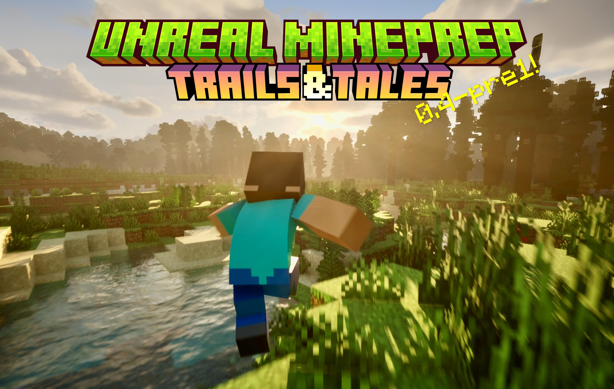

# Unreal-Mineprep

繁體中文 | [**中文**](README.md) | [**English**](./README_EN.md)

✨這是一個正在開發中的UE5插件，繼承了 [Blender MCprep](https://theduckcow.com/dev/blender/mcprep/) 的實用功能，並加入一些新的資產，爲製作MC動畫帶來便利

*本插件與Minecraft、MCprep官方沒有直接聯繫，在其建議下插件名稱由Unreal MCprep更改爲Unreal Mineprep，以避免混淆（0.3及之前的版本已經歸檔，就不做修改了）。

在v1.0正式發佈前，插件主要供內部使用，可能存在兼容性問題和潛在的 ~~bug~~ 特性。之後會逐步修復並寫一些使用教程（但這應該是很久以後的事了）

## 安裝方法（適用於0.4+版本）

### ① 使用安裝包（推薦）
#### 1、下載Mineprep插件，建議保存在純英文路徑下。  
- 你可以在右側的`Releases`部分下載較爲穩定的大版本；或者點擊上面的綠色`Code`按鈕 -> `Download Zip`，下載最新快照版本。

#### 2、解壓安裝包，使用Blender打開裏面的`Mineprep_installer.blend`文件。
- Unreal Mineprep是在Blender MCprep的基礎上開發的，部分功能會遠程調用MCprep裏的函數。如果你是Blender用戶那就好極了！
- 如果你沒有Blender，可以前往[Blender官網](https://www.blender.org/download/)下載，建議選擇"Windows Portable"版本，無需安裝，解壓即用。當然也可以在[Steam](https://store.steampowered.com/app/365670/Blender/)等其他平臺下載。
- 此外，我們還推薦你在Blender中安裝[MCprep插件](https://theduckcow.com/dev/blender/mcprep/)。

#### 3、點擊▶️運行腳本，會彈出菜單和安裝引導
- 目前提供了`創建新的工程文件`和`安裝至現有工程`兩個選項，還可以選擇實驗性功能、插件設置等內容。然後就能一鍵安裝了。

### ② 手動安裝
需要複製Mineprep內容文件夾+修改項目設置，稍後會更新詳細步驟

## 兼容性
Mineprep 0.4使用windows+UE5.4開發。

安裝包和插件的非實驗性功能理論上是跨平臺的，並且支持更高的引擎版本，但是尚未經過測試。

> [!WARNING]  
> 實驗性功能完全不支持其他平臺和引擎版本。請勿在安裝時勾選，否則工程文件打都打不開，一上來就報錯！！

另外，插件附帶了windows版的ffmpeg用於視頻編碼。mac用戶目前需要手動下載並在安裝時指定路徑

## 生物
- Mineprep提供了MC原版生物模型，可以通過生成器面板放置
- 目前有骨骼網格體和自動化NPC兩種類型。所有生物都可以更換材質，兩腳生物可以添加通用的IK綁定
- 當前版本支持：豬、牛、羊、馬（驢、騾、殭屍馬、骷髏馬）、殭屍、屍殼、溺屍、骷髏、凋零骷髏、流髑、沼骸、豬布林、豬布林蠻兵、掠奪者、衛道士、鐵巨人
- 更多內容正在更新中

## 語言本地化
Mineprep提供了可拓展的多語言翻譯，目前支持中文/英文/繁體中文
- **安裝包**會根據Blender的偏好設置選擇語言。本地化內容以字典的形式寫在代碼中，參見[Mineprep_installer.blend](./Mineprep_installer.blend)或[Mineprep_installer.py](Blender扩展资源/Mineprep_installer.py)
- **插件面板**上方有選擇語言的按鈕，在啓動時會根據UE的偏好設置選擇語言。本地化內容保存在[語言本地化_language_localization.csv](./Mineprep/插件贴图/语言本地化_language_localization.csv)中
- **安裝實驗性功能**之後，可以點擊**頂部菜單欄-MC-開發-注入本地化變量名**，進一步翻譯細節面板中的變量和函數。這是一個正在開發中的新功能。本地化內容保存在[變量顯示名_VariableDisplayNames.csv](./实验性功能(C++)/Mineprep/Content/变量显示名_VariableDisplayNames.csv)中

更多內容正在更新中

## 開源協議
- 在製作插件時，我原來用的是GPL-3.0協議，但是現在包含了虛幻引擎的官方示例+源代碼，它們好像和開源許可證不兼容 (*´･д･)? 所以這裏就先不放License文件了。
- 在大部分情況下，你可以免費使用本插件。(UE5.3及更早的版本不向影視創作者收費，UE5.4開始對年收入超過100萬美元的用戶按席位收費，顯然我們不會達到收費門檻hhh)  
具體參見[Epic Games的用戶協議](https://www.unrealengine.com/zh-CN/eula)
- 以後考慮做一個Mineprep Lite，只留下準備場景、更換材質等核心功能，沒有官方素材和引擎源碼。這樣安裝會簡單很多，也能放GPL-3.0協議了
- 同時，Mineprep引用了許多第三方插件和資源，在此向他們表示感謝。我們在[ResourceLicenses](./Readme素材/ResourceLicenses)文件夾中收錄了一些許可證和作者留言。如有遺漏可以拉一個Pull Request進行補充

## 版本更新

## 0.4 : 足跡與故事

0.4版本正式發佈了！這是一個重大更新，包含了許多新功能和改進，也是最後一個支持UE5.4的版本。
快來看看有哪些新功能吧

- 以上是精彩集錦，更多內容參見下方的快照。
- 從這個版本起，我們不在Releases中發佈內容示例場景，而是打包當前庫，下載解壓後能看到安裝包和各種資源。（之後考慮在其他地方發佈內容示例和精簡版插件）

 📜展开快照 

#### 0.4-RC1
- 這是0.4版本的最後一次內容更新！安裝包已經準備就緒
- 新增`腳步粒子`,在生物跑步或落地時根據地面材質產生粒子效果。第三人稱運動匹配角色（高級運動匹配NPC）自帶腳步粒子，你也可以使用“附加組件”按鈕把它添加到其他對象上。
- 新增四肢硬直的`MC_Straight_Body`、`MC_Straight_Slim_Body`，和胳膊與腿分成兩截的`MC_Segment_Body`、`MC_Segment_Slim_Body`四種基礎生物模型。
- 爲所有生物添加了根碰撞箱，修復了開啓物理模擬後彈出警告的bug
- 所有生物與NPC都有了在倒地後起身的功能。點擊小鍵盤0能夠在癱瘓和起身之間切換。你也可以使用事件關鍵幀進行控制、重載起身動畫。
- 所有生物都有了動態材質，可以調整顏色等屬性，開啓實驗性功能後還能一鍵添加材質關鍵幀。
- 表情動畫預設使用統一的形態鍵動畫，可以兼容不同模型了
- 修復了一部分因改變重力方向產生的bug。簡單NPC能正確地在牆上隨機移動和跟隨目標了。第三人稱運動匹配角色的bug仍然比較多
- 現在每個生物都有了自己的隨機種子，實現更精細的控制。你可以在MC導播臺修改或刷新全局隨機種子。
- 準備材質的“次表面散射”精簡爲一個RGBA顏色參數，其中RGB決定顏色，A決定次表面不透明度
- 大改並統一了攝像機的功能和參數。“MC攝像機”、“搖臂攝像機”和“導軌攝像機”現在可以設置平滑移動/旋轉、視野、光圈、畫面尺寸和遮幅、追蹤目標、聚焦目標/正交/自動希區柯克變焦、後期移軸模糊和局部模糊。
- 修復了大量錄製動畫的bug和閃退問題。“MC第一人稱攝像機”能錄製攝像機晃動了，結束後需要點擊插件面板“處理錄製的動畫”按鈕。“第三人稱運動匹配玩家”能直接記錄攝像機運動了，無需同步玩家攝像機
- MC導播臺新增DLSS/FSR選項，安裝相關插件後，可以設置超分辨率、光線重構（目前視圖預覽和渲染似乎不一致）和幀生成（僅限獨立窗口遊戲模式，不支持渲染）
- MC導播臺批量調用事件的參數有所變更，現在信號源是Actor數組，目標是Actor類數組，有利於過濾對象、提升性能
- 改進了渲染輸出面板
  - 可以同時輸出一幀畫面的多種格式jpg/png/exr（含DWAA壓縮和不壓縮兩種格式）
  - 畫面分辨率可以動態從語言本地化表格中加載，並且應用於場景中的攝像機。目前有以下預設：  
  1080p #1920x1080  
  2K #2560x1440  
  4K #3840x2160  
  VR_4K (2:1) #4096x2048  
  VR_8K (2:1) #8192x4096  
  DCI_2K (1.89:1) #2048x1080  
  DCI_4K (1.89:1) #4096x2160  
  老電影 4:3 #1920x1440  
  寬屏 2.39:1 #3440x1440  
  豎屏 9:16 #1080x1920
  - 新增Prores視頻編碼選項，使用虛幻引擎自帶插件，跳過序列幀直接輸出視頻。極高畫質（Prores4444）支持透明度；但是不支持HDR
  - Mineprep 3D攝像機組即將棄用，現在點擊渲染輸出面板的`3D`勾選框，會自動生成nDisplay 3D攝像機組。可以一鍵渲染3D動畫，分別輸出左右眼的Prores視頻或序列幀
  - 初步添加了`渲染音頻`選項（但是虛幻引擎自帶功能非常簡陋，沒什麼可選的，有時還會產生bug）
  - 可以自動應用MC導播臺的DLSS/FSR預設
- 頂部菜單欄新增一些調試和開發功能。安裝實驗性功能後，點擊**頂部菜單欄-MC-開發-注入本地化變量名**，可以翻譯細節面板中的變量和函數名稱！
- 新增多種MC字體，包括Minecraft-Five，Minecraft-Seven，Minecraft-Ten，Unifont，Standard Galactic Alphabet，illageralt，可以在“MC像素文字(3D)”中使用
- 優化了光追半透明下的水材質
- 好消息：我從GitHub上拉取引擎源碼，UE5.5.4即將修復中文文件夾層級錯亂的bug！淚目！！！DLSS4也支持UE5.5了，終於可以更新了！Mineprep 0.4 將會是最後一個支持UE5.4的版本

#### 25w05a
- 插件安裝包製作完成！Mineprep 0.4很快就能發佈了
> 0.5版本很可能會繼續使用UE5.4開發，因爲UE5.5出現了中文文件夾層級錯亂的bug，一直到現在也沒修好 qwq
- 添加了幾個快捷鍵（實驗性功能），與Blender非常相似：
  - F12  渲染圖片
  - Ctrl+F12  渲染視頻
  - 小鍵盤0  進入攝像機視圖
  - Ctrl+Alt+小鍵盤0  將攝像機移動到當前位置並進入攝像機視角
  - 快速綁定父級的快捷鍵從Ctrl+Alt+0更改爲Ctrl+Alt+P（Ctrl+P已被虛幻引擎佔用）
- “一鍵渲染”功能在未打開時間線時，會在視口位置使用`臨時攝像機`進行渲染；渲染圖片和視頻能自動適配SDR/HDR了
- 頂部菜單欄回來了，在`MC`菜單下有渲染圖片、渲染視頻、打開輸出文件夾和重啓插件面板的按鈕
- 通過添加“DoNotRecord”標籤，可以讓鏡頭試拍錄製器跳過特定組件。現在NPC生物不會錄製額外的碰撞箱了，能提高性能並精簡軌道

#### 25w04a
- 插件安裝包來了！用Blender打開`Mineprep_installer.blend`文件，運行腳本，即可根據指引快速創建工程文件，或者把Mineprep安裝到已有的工程文件中。安裝時可以挑選實驗性功能、修改插件設置、指定ffmpeg路徑。更多內容正在開發中。
- 【實驗性功能】可以選擇mp4或mov作爲視頻輸出格式
- 初步添加了和macOS相關的模塊，例如視頻編碼的Apple GPU選項、yuva420p色度抽樣選項（用於帶Alpha通道的透明H.265視頻）
> 由於我沒有mac，暫時無法測試這些功能是否有效（¯﹃¯）
- 底部工具欄新增`自定義按鍵菜單`，可以修改按鍵映射並保存到本地
- 修復了快捷鍵Ctrl+Alt+0 切換新舊Gizmo小工具失效的bug。第一次使用時可能會彈出編輯器偏好設置窗口
- 改進了語言本地化的加載方式，這次應該是最簡潔的形態了

#### 25w03a
- 插件面板底部新增工具欄，把鼠標移至圖標上即可彈出新的菜單；點擊圖標可以鎖定/隱藏菜單
- `插件設置菜單`
  - 點擊`重新初始化插件`按鈕，可以加載偏好設置、初始化視頻渲染（部分操作需要實驗性功能或重啓）。
  - 這裏記錄了全局設置，比如`UI界面縮放`（實驗性功能），`朗讀鼠標下文本`（實驗性功能），`內存預加載`（打開插件時把所有資源加載到內存中，啓動慢但運行更流暢）
- `顏色設置菜單`
  - 這裏可以開啓HDR顯示輸出，調整編輯器HDR亮度，打開調色示波器，調整波形圖的採樣步長和亮度
- 方塊體積雲現已集成到“MC天空”中
- 新增兩個快捷鍵（實驗性功能）：
  - Ctrl+Alt+0 切換新舊Gizmo小工具
  - Cltl+Alt+1 切換預覽選中攝像機的窗口
- 生成器面板現已支持全語言搜索內容
- 插件面板選項框和事件關鍵幀軌道支持多語言翻譯了

#### 25w02a
- 填坑了填坑了，插件面板底層改造終於完成了。準備場景等核心功能變得更加高效
- 右鍵點擊大按鈕，可以在高級設置中單獨顯示它的參數
- 雙擊特定的文本可以直接運行此項（將鼠標放在文本上，如果能雙擊，會彈出提示）
- 現在能在插件面板中直接控制“MC天空”的時間和太陽角度
- 更新了附魔材質的參數，取值範圍更合理
- 【實驗性功能】 在處理材質後會刪除未使用的節點並刷新材質
- 現在可以像Blender一樣用快捷鍵綁定父級了：
- **綁定父級**  
  `前提`：啓用實驗性功能   
  `對象`：綁定其它視口選中項 ——> 最後選中的Actor  
  `效果`：在視口中選擇多個對象，觸發此功能後會彈出一個面板，顯示最後選中的Actor+所有組件+骨骼名稱，你可以把其他選中的對象綁定到具體的組件或骨骼上。  
  `可選項`：綁定目標  
  `快捷鍵`：默認爲Ctrl+Alt+0。可在偏好設置中更改。
- 修復了半透明材質無法投射陰影的bug

#### 25w01a
- 新的一年，來一次實用的大更新~
- 【實驗性功能】材質關鍵幀按鈕  
  - 點擊材質參數右邊的按鈕即可在時間線上添加關鍵幀！極大簡化了操作流程
  - 需要開啓Virtual Production Utilities插件。參數面板會展示材質實例中所有打勾的參數
  - 目前支持靜態網格體、骨骼網格體的基礎材質，以及浮點、向量和紋理貼圖三種參數類型
- 更新了附魔組件，能在編輯器中即時顯示自定義附魔了，還可以添加材質關鍵幀
- “準備場景”新增次表面散射參數
- FPV飛行攝像機現已支持手柄，但是手感一般，按鍵可能會大改。
  - 左搖桿↑↓:前進/後退，←→:橫滾
  - 右搖桿↑↓:俯仰，←→:左右偏航
  - 左扳機下降，右扳機上升
  - 按下左右搖桿急剎

#### 24w52a
- 今年的最後一次快照更新！
- 新增了大量實驗性功能，很快就會集成到插件面板中。
  - 用python非侵入式調用C++函數，即使實驗性功能損壞，也不會影響原有功能
  - 包括調整編輯器UI縮放，設置預覽攝像機窗口，獲取鼠標下的文本，啓用Tick多線程等內容
  - 在/Plugins/Mineprep內容 文件夾中新增`Mineprep自定義快捷鍵`藍圖，其中有多個自定義事件。第一個會在後臺每隔一段時間（默認0.5s）自動觸發，時間間隔可以用控制檯命令 Mineprep.TickInterval 設置
  - 新增10個可自定義的快捷鍵。按鍵綁定儲存在偏好設置的Mineprep條目下，執行的操作保存在“Mineprep自定義快捷鍵”藍圖中
  - UE4有一個官方的新手教程插件，很可惜它停止更新了。這是個好東西，我把其中一部分功能修好了，以後說不定能添加一些MC動畫教程（嗯，應該是1.0版本之後的事了）
- 修復了“nDisplay3D攝像機組”的左右眼視角問題
- 重寫了大部分“準備場景”的功能。未來會對常見的實心方塊使用單面材質，修復距離場碰撞箱問題，避免粒子穿模。
- 優化了第三人稱運動匹配角色（高級運動匹配NPC）的腳步聲音效，當沒有物理材質時，會嘗試從普通材質名判斷方塊種類。
- 再次優化了編輯器Tick和構造函數相關問題，搖臂攝像機、導軌攝像機等預設素材能在編輯器中正常緩動和追蹤目標了。藉助Livelink組件，這次是真正實現了編輯器內Tick
- 使用“線程安全更新動畫”優化了動畫藍圖的性能

#### 24w51a
- 最新發現，方塊體積雲在場景捕獲中顏色異常，需要改進3D攝像機組。爲此，我使用UE官方的插件，初步製作了`nDisplay3D攝像機組`,`nDisplay3D渲染配置`。
  - 新方法的顯存佔用受畫質影響較大，推薦使用極高畫質，節約顯存
  - 分別輸出左眼和右眼的圖像序列幀，這正好符合達芬奇的3D視頻同步模式。
  - 理論上，它能使用兩張顯卡同時渲染

#### 24w50a
- 修改了所有隨機數生成方法，使多次渲染的結果一致
  - 可以在MC導播臺設置隨機種子
  - NPC生物會從導播臺拿隨機數
  - 粒子系統在生成時會指定一個隨機種子
- 把mineprep_config.ini修改爲Mineprep_config.txt，使用json保存更多數據類型，並優化了讀取語言翻譯的方法
- 我們成功在虛幻引擎編輯器內開啓了HDR顯示模式！很快會集成到插件面板中。目前優化了HDR渲染輸出的lut（軸心0 對比度1.22），使其更符合編輯器內顯示效果。
- 優化了調色示波器，在HDR顯示模式下會採樣指數增長的座標軸（0，1，10，100，1000，10000），與達芬奇的示波器類似。由於Rec 2100 PQ 的最大亮度爲1000nit，示波器會在3/4處截斷。
- 修復了放置模型、生物時位置經常不在視圖中心的bug。如果放置多個同名模型，會自動添加1、2、3等後綴名以示區分
- 可以在MC導播臺初步設置自定義按鍵映射了
> 小故事：我很快會買一個沒有小鍵盤的輕薄本，自定義按鍵映射就是爲它設計的(～￣▽￣)～ 新筆記本的屏幕很好，這周成功測試了用moonlight串流HDR畫面，通過ipv6連上家裏的電腦，以後就可以遠程製作HDR視頻了！不過嘛，寒假裏會把它帶到國外用，大概是不能遠程聯機了，那麼輕薄本能否帶動虛幻引擎的光線追蹤呢...

#### 24w49a
- 這兩週在多個方面有了重大發現，從安裝到使用再到渲染，每一環節都會變得更加方便！
- 用後期處理鏈圖重做了移軸模糊，提升預覽質量，支持HDR渲染，還有光圈散景效果。現在所有攝像機的後期模糊由MC導播臺統一控制。
- MC導播臺可以設置“全局重力”，支持關鍵幀動畫
- 軟引用改造基本完成，插件啓動速度加快至1~2秒
- 新增方塊體積雲，源自Nostalgia光影，蓬鬆柔軟又不失方塊本色（我最喜歡的體積雲！）
- 優化了渲染時的顯存佔用，普通情況下減少2-3G，雙目立體全景渲染能減少8G
> 那麼究竟優化了什麼地方呢...不知道 (*´･д･)?! UE5似乎會檢測MoviePipelineGameMode這個字符串，我從它繼承了一個子類，不改功能只改名字，顯存佔用就明顯減少了。目前看來沒啥問題
- 好消息！有辦法在藍圖中訪問更多變量了，很快就能支持在插件面板設置雙目立體全景渲染（仍然是實驗性功能），之後也不需要把UE5_HDR.cude複製到D盤了。更重要的是，不需要TApython就能使用植物搖擺功能，0.4正式版有望減少前置插件
- 新增`調色示波器`，在編輯器中即時顯示直方圖、分量圖、波形圖。很快會修改插件面板，添加更多模塊。
- 初步製作了自定義按鍵映射

#### 24w47a
- 新增了一鍵渲染按鈕——導出視頻最簡單的一集！
- **一鍵渲染**  
  `前提`：初始化視頻渲染  
  `對象`：當前關卡+打開的根級序列+Mineprep自定義渲染預設  
  `效果`：更新渲染配置，然後直接開始渲染
> 小故事：我一開始用藍圖做這個功能，怎麼做都會閃退 X﹏X 上網一查，有人說用python可以解決問題。於是，我重新寫了幾乎一樣的程序......你猜怎麼着，它真的不閃退了！
- 繼續使用軟引用優化插件啓動速度，目前已經節約了超過500MB內存。
- 摺疊了Readme的快照部分，默認展示大版本更新

#### 24w46a
- 完善了“MC攝像機”的移軸模糊功能
  - 使用後期模糊替代原有景深，可用於正交渲染
  - 能夠在水平和豎直方向旋轉聚焦平面，沿斜線模糊
  - 將“衰減”設爲負數，可以讓中間模糊、兩邊清晰
  - 最終渲染質量比視圖預覽更高。目前適配了3D渲染，但不支持HDR和全景。
- 修復了軟引用未能起到優化作用的bug（還需額外添加異步加載節點），底層重構繼續進行中
- “準備場景”功能即將大改——首先，我們會檢測選中的模型、材質、紋理有沒有重複，在某些情況下大幅提升性能；其次，每個參數都可以通過雙擊文本來單獨運行（比如啓用碰撞、重載粗糙度等），具有更高的可控性；最後，修復骨骼網格體和文件夾中網格體一直被忽略的bug

#### 24w45a
- 新增`MC攝像機`，在細節面板可以設置視野、光圈、聚焦距離等參數，之後會以此爲模板更新其他的攝像機。高級設置裏還可更改透視模式爲正交，啓用移軸模糊（正在開發中）
- 我們正在給自定義變量添加工具提示，將鼠標放在變量名上即可顯示詳細信息；同時添加了英語版本作爲語言本地化更新的一部分
- 新增一個適用於光線追蹤半透明的水材質
- UE5.5就要發佈了，Mineprep 0.4將是最後一個支持5.4的版本！在此之前，我們將繼續推進底層重構，首先是通過軟引用優化插件的啓動速度
> 插件面板當前的所有依賴性都是硬引用，會在啓動時全部加載到內存中。如果使用軟引用，就只會在調用時加載了！

#### 24w44a
- 修復了一些攝像機預設以非16:9分辨率渲染時產生黑框的問題。在編輯器中，它們開啓了“約束寬高比”，便於預覽可視區域。此次更新後會在渲染時自動解除。
- 爲基礎人模添加根骨骼碰撞箱，修復了移動“拖拽布偶史蒂夫”時產生大量警告的問題
- 修復了“堆放方塊”丟失默認貼圖的問題
- 嘗試優化方塊雲、太陽和月亮的材質，用於光線追蹤半透明
- 初步製作了起身功能，在後續更新中，當生物癱瘓倒地後，它們能站起來恢復動畫
- 初步製作了名爲`Mineprep`的uplugin插件，上傳到`MC_Startup/Plugins`路徑中。把它放到工程文件根目錄/Plugins文件夾下，可以自動開啓前置插件，簡化安裝流程

#### 24w43a
- 修復了“緩動導軌攝像機”無法在時間線上預覽緩動效果的bug
- 修復了“第三人稱運動匹配角色”（高級運動匹配NPC）對手持物品打關鍵幀無法更換模型的bug
> 是的，UE的變量不會自動與屬性關聯，這在很長一段時間裏只能靠強制刷新構造函數來解決。但是，我剛剛得知，創建一個名爲 *Set變量名* 的函數，就能被時間線自動調用了！更多相關bug即將被修復
- 修復了“MC導播臺”在同時發出多個命令（按tag搜索actor時），延遲並非最短時間的bug
- 修復了重啓虛幻引擎，“MC導播臺”沒有應用預覽畫質和幀數上限的bug
- “MC天空”新增“散射分佈（各向異性）”屬性，數值越大，光源附近的霧越濃，需要開啓體積霧才能生效
- 重新制作了`同步玩家攝像機`，可以修改緩動程度，併爲之後動態切換角色做好準備
- 初步製作了蜘蛛羣粒子模板

#### 0.4-pre2

- 新的里程碑！我們將這幾個月的成果投入實際生產，製作了動畫視頻《史詩級動作優化2》，並帶來了許多細節優化和bug修復
- 新增`MC導播臺`，與Mineprep後期處理體積一起生成，作爲場景的基礎模塊
  - 在細節面板中，可以分別控制預覽畫質、預覽幀率上限和渲染畫質，優化性能或提升質量（所有渲染預設已不再使用過場動畫質量設置，轉而由MC導播臺控制）。預覽畫質默認爲“3+ 極高”，渲染畫質默認爲“4 影視級”。如果電腦性能較弱，建議把預覽畫質改爲“2 高（快速lumen）”；如果想要減少渲染時的閃爍和殘影，進一步提高質量，可以把渲染畫質改爲“4+ 影視級（增強lumen）”
  - MC導播臺可以在時間線上添加事件關鍵幀，向全場廣播命令，例如批量開關燈光、切換NPC動作、開始跑步跳躍等。它能重載信號源位置（指定座標<指定actor<按tag搜索actor）、調整信號最大傳播距離（值爲負數則從外向內收縮）、設置傳播速度來模擬延遲，還能修改不同命令的專有參數。啓用debug後會顯示最大傳播距離的球體形狀
  - 未來，還將添加切換玩家攝像機、動態修改後期處理效果等功能。
- “第三人稱運動匹配角色”和NPC生物添加了更多控制方式
  - 新增自定義鍵控動畫，取代了舊版切換表情的功能，並下放至所有NPC。在細節面板指定至多3段動作和3段表情，用鍵盤1-3切換動作，4-6切換表情。動作還能設置“混合時間”、“播放動作時禁用移動輸入”和“NPC循環播放動作1”。如果要產生位移，請確保動作片段具有根運動；特別地，第三人稱運動匹配角色需要添加UE_或UEFN_前綴，將動作用於重定向前的官方人模，否則將直接應用於MC人模（沒有位移）。
  - 現在能從時間線上調用跳躍、跑步、切換動畫、斷肢、癱瘓等事件了！（後者屬於“小鍵盤物理事件”，通過指定按鍵名來觸發，默認爲0，即癱瘓）
- 生成器面板新增`堆放方塊`、`背景生物散佈器`，使用PCG插件來程序化生成大量模型
  - 堆放方塊默認生成5x5x1的草方塊，可以設置懸空放置或自定義曲線區域。默認情況下，它將根據碰撞箱自動吸附到地面上。你可以修改方塊模型，例如在地上鋪滿頂層雪。還可以設置第二種方塊和兩者的比例，添加偏移或隨機旋轉。注意，堆放方塊沒有面剔除，它的性能不適合超大場景。
  - 背景生物散佈器將在自定義曲線區域內生成豬、牛、羊、馬NPC，可以修改種類、密度等參數。爲提高性能，所有簡單動物NPC在默認情況下關閉了物理動畫交互。
- “附加組件”不再侷限於最後選中的actor，一部分功能會應用於所有符合條件的對象了！新增`燈光遙控`，一鍵添加遙控組件至所有選中的光源（不含日光和天空大氣），使其能夠被MC導播臺批量控制。
> 這個功能是爲UE5.5而準備的，新的Megalights大幅提高了性能，能承載成百上千的燈光，宣傳片裏點亮整個場景的鏡頭看起來超帥 \~\\(≥▽≤)/\~
- “搖臂攝像機”也有緩動功能了
- 優化了生物模型尤其是手部的碰撞箱
- 新增`小爆炸晃動`、`大爆炸晃動`、`鏡頭緩慢晃動`
- 新增`流體化自碰撞粒子`
- 其他功能子面板的“輝光”板塊新增`卷積輝光`、`卷積散射`，效果更加柔和；“動態模糊”板塊新增`FPS`（此幀率越低，快門時間越長，模糊效果越大）；“光程”板塊新增`光線追蹤半透明（未優化）`，此功能可以改善水和雲的光影效果，但有時會帶來噪點和bug，之後慢慢優化
- 修復了馬的皮膚UV映射問題
- 在“Blender擴展資源”文件夾中上傳了新增生物的FBX模型
- 0.4-pre2沒有內容示例，預計在寒假更新0.4正式版
- *小故事：這個版本的主題叫“足跡與故事”，按照最初的計劃有兩次大更新 —— “足跡”指運動匹配，“故事”指鏡頭語言，分別對應0.4-pre1和0.4正式版。至於0.4-pre2，是趁着暑假給插件來了個底層重構，現在看看，新東西倒也不少。接下來一段時間，會重點更新攝像機和運鏡方面的內容啦~*

 📜展開快照 

  
#### 24w39a
- “第三人稱運動匹配角色”和NPC生物現已支持切換重力方向，可以飛檐走壁，在牆和天花板上移動了！
  - 細節面板的高級設置中有初始重力方向，默認爲(0,0,-1)
  - 使用鍵鼠操控角色時，可以按小鍵盤的“+”改變重力，新方向垂直於面前的平面向內
  - 新功能產生了許多~~bug~~特性，先不列出來了，等下慢慢修......倒掛在天花板上還好一點，牆上的問題比較多，目前嘗試鎖定頭部旋轉並關閉生物之間的RVO避障
- 新增官方宣傳片風格的走路和跑步動畫
- 豬、牛、羊默認關閉物理交互，因爲跑步時碰撞箱有點問題
- “第三人稱運動匹配角色”新增頭髮選項，有身前和身後兩種樣式，支持自定義皮膚（需要內層皮膚有頭髮紋理）。同時，派生出“第三人稱運動匹配玩家”和“Alex長髮大眼睛高級NPC”兩個子類，前者用於遊戲模式，不在父類調整參數了；後者用於生成器，使用MC_Head_Eyes及其眨眼表情動畫
- 新增`動態體積霧`，可調整濃度、縮放、顏色、運動速度和方向。現在，放置“MC天空”和體積霧/體積光時會檢測對方是否存在，自動打開體積設置並將霧濃度保持在0.015以上。
- 新增`緩動導軌攝像機`，預先將攝像機綁定到導軌上，通過拉曲線編輯移動路徑。運動時還會有緩動跟隨效果，使鏡頭平滑、穩定。這個和搖臂攝像機不一樣，只有在遊戲/渲染中才能使攝像機追蹤目標，在時間線上刷新構造函數會丟失緩動效果。***0.4正式版（24w43a）已修復此問題！***
- 開放了“HDR靜幀_2K_avif”的部分參數，在UE渲染面板的右下角可以看到它們，重載分辨率、暖場幀和渲染的幀數。

#### 24w38a
- 本週帶來了HDR渲染、語言本地化以及多個方面的重大更新
- 新增`牛`、`羊`兩種生物
- 物理交互動畫使用Physical Animation組件重做，現在“物理交互時鎖定雙腳”選項已更新爲`局部禁用物理模擬`,可以自己添加所需骨骼；人形生物默認鎖定兩腳，豬羊牛馬鎖定四腳。
- 其他功能子面板的“色彩管理”選項下新增`EV100`，可設置自動曝光的上下限，對手動曝光沒有影響
  - 這個好像是攝影那邊的術語，操作邏輯有點怪，在暗處減小最小值可以提高亮度，在亮處減小最大值也是提高亮度。
  - 示例1：在夜晚增大最小值，可降低環境亮度，防止自動曝光變得像白天一樣亮
  - 示例2：在洞穴和峽谷中，可減小最小值，提高亮度，光影質感會很不錯，先是山有小口，彷彿若有光...復行數十步，豁然開朗
- “MC天空”有了白天、清晨、夜晚、濃霧四個預設，可以多次點擊“生成MC天空”按鈕來切換，優化了日夜交替時的天空顏色
  - 前二者EV100 Min=-3，後二者EV100 Min=0，清晨和濃霧默認啓用了`體積霧（丁達爾光）`選項，對性能消耗比較大
- 新增`丁達爾體積光`預設，可通過生成器放置到場景中，有聚光燈/面光/點光三個選項，可設置亮度、顏色、光束變化速度等參數。需要環境中有體積霧
> 在詳細閱讀了虛幻引擎官方文檔後，我發現HDR渲染（啓用OCIO後）會自動禁用色調曲線，結果相當於相機拍攝的RAW素材...難怪色彩比視圖中差了很多！終於，在歷經了半年的探索後，新一代HDR渲染方案來了
- 通過一級調色還原lut極大改進了HDR渲染的色彩；渲染輸出模塊新增AV1視頻編碼、線性顏色選項和`HDR靜幀_2K_avif`影片圖渲染預設。
  - AV1需要很新的顯卡（比如40系）才支持硬件加速，一般用H265就行，我看ffmpeg支持AV1就順便把它加進來了(ノ´・ω・`)ノ
  - 在視頻編碼階段，會通過`UE5_HDR.cube`文件對HDR畫面進行調色。這是一個3D lut，用達芬奇製作，旨在還原色彩，參數也比較簡單：第一個節點對比度1.25 軸心0.05；第二個節點對比度1.05 HDR色輪highlight 0.05
- `HDR靜幀_2K_avif`採用了UE5.4新的影片圖渲染功能，需要在渲染隊列點擊“替換爲圖（實驗性）”找到它。
  - 只渲染時間線最開始的1幀（之前會有30幀暖場），使用2560*1440分辨率，輸出avif圖片，採用Rec2100 PQ色彩變換和還原lut
  - 出於技術原因，目前不能從Mineprep插件面板修改其中的參數，必須寫死文件路徑和文件名。因此在初始化視頻渲染時會把“UE5_HDR.cube”複製到D盤根目錄。
  - avif可以看作單幀av1，這裏使用通用的cpu編碼，不過貌似會把輸出日誌當報錯信息彈出...總之在文件夾裏能看到成功渲染的圖片
> Windows建議使用chrome瀏覽器查看avif，記得要開啓HDR顯示；蘋果原生支持avif（但是不支持av1視頻），亮度會隨屏幕亮度而明顯變化
- HDR_2K_exr渲染預設更改爲`【線性】2K_exr`，雙目立體全景渲染從exr更改爲`【實驗性】VR_3D-FTB_8K_jpg`
  - 帶着Rec2100 PQ的“Raw” exr太少見了，通常用的是線性和ACES；另外單獨渲染序列幀是沒有調色的，所以雙目立體全景渲染退回jpg了（雙擊點進去也能改回exr輸出）。
- 新增`HDRI全景貼圖_8K_exr`渲染預設，使用8640*4320分辨率，輸出單幀全景圖（沒有暖場），採用線性色彩變換和DWAA壓縮的exr編碼。
- 完善了語言本地化系統，新增對繁體中文的支持，爲更多語言預留了擴展空間，詳見Readme的“語言本地化”板塊（正在編寫中）

#### 24w37a
- `骷髏`，`凋零骷髏`，`流髑`，`沼骸`，`豬`，`馬`，`鐵巨人`現已加入Mineprep！
  - 這些生物有專用皮膚，與普通玩家皮膚不兼容。它們依然使用的是同一套骨骼，但是身體尺寸不一樣，因此有單獨的動畫庫。如果要在不同生物之間遷移動畫，建議使用自動重定向。
  - 從“簡單運動匹配NPC”派生出`簡單動物NPC`作爲四腳生物的父類
  - 骷髏、流髑和沼骸的NPC手持弓，凋零骷髏手持石劍
  - 馬包括多種顏色和`驢`、`騾`、`殭屍馬`、`骷髏馬`的皮膚。
- 新增`MC_Head_Eyes`頭部模型，有着兩格大眼睛，可以添加表情動畫
- 第三人稱運動匹配角色（高級運動匹配NPC）添加了`披風貼圖`和`披風/鞘翅`選項，0表示禁用，1是MC原版披風，2是布料模擬披風，3是鞘翅（暫未實裝）。默認的貼圖是MC15週年苦力怕披風，其中包含了鞘翅的紋理，更換時應該使用同樣規格的貼圖。
> 由於虛幻引擎的特性，布料模擬只能與具有簡單碰撞的Worldstatic物體進行交互
- 所有NPC都能設置潛行/走路/跑步速度了，並添加了`面向玩家/目標`選項，可以自動轉頭面向附近的角色
- 優化了“MC天空”的性能和方塊雲夜晚閃爍問題，現在可以在時間線上製作關鍵幀動畫，新增光照強度、柔和陰影、體積光、霧氣等控制參數
- 初步製作了自定義眼睛材質和邊緣高光材質

#### 24w36a
- 本週對生物和NPC系統進行了大翻新，使用繼承父類的方法整合了許多資源，引入物理交互動畫。
- 在頭身分離綁定的基礎上，重做了第三人稱運動匹配角色，派生出`高級運動匹配NPC`；重做了簡單運動匹配NPC，派生出各種生物子類。
- 所有生物在細節面板可開啓`物理交互（糾正穿模）`和`物理交互時鎖定雙腳`選項，運動時身體能與環境和其他生物碰撞交互。
  - 只有在遊戲/渲染時能進行物理交互，編輯器視圖不可見
  - 目前有一個~~bug~~特性，局部斷肢會導致上半身全部萎掉 (ﾟД ﾟ;) 因此玩家控制的第三人稱運動匹配角色默認關閉物理交互，NPC默認開啓。
- 新增`豬布林`，`豬布林蠻兵`，`衛道士`，`掠奪者`及相關動作庫。
  - 在放置NPC時，豬布林默認手持金劍，豬布林蠻兵手持金斧，衛道士手持鐵斧，掠奪者手持弩。
  - 豬布林的耳朵會自動擺動，災厄村民多了一個控制鼻子的骨骼，但各種生物的表情動畫有待更新
- 新增路標引導NPC功能：在細節面板添加場景中的物體作爲路標，NPC會依次前往這些路標；勾選“循環”後，會從最後一個路標返回第一個路標，重新開始
- 又修復了模塊化綁定的腿部朝向bug...平時我沒動它來着，好像是UE版本更新出的問題
- 徹底修復了“搖臂攝像機”和“3D攝像機組”無法在編輯器視口更新關鍵幀動畫的bug。插件面板的“強制刷新構造函數”按鈕現已棄用。

#### 24w35a
- 0.4-pre2將對插件進行大翻新，本週已經開始底層重構了！注意新版本與舊版本不兼容，而且無法通過替換單個文件的方式來更新特定資產
- 插件根目錄文件夾由MCprep改名爲Mineprep（已經修了很多損壞的依賴項了，希望不要出bug qwq）
- 插件面板的按鈕增加了撤銷功能，可以按Ctrl+Z撤銷，Ctrl+Y恢復。準備場景、更換材質等部分按鈕暫時還無法撤銷
- 插件子面板被拆分爲單獨的控件，再整合到Mineprep面板中（主要是提升開發時的流暢度，對使用者沒有影響......希望不要出bug qwq）
- 整個生物模型和角色系統將大改。目前添加了`頭身分離綁定基礎生物模型`，可以自由搭配身體和頭顱，例如MC_Body+MC_Head就相當於MocapCarrier。在時間線上製作動畫時，能夠分離控制動作和表情，不需要把表情的插槽名稱改爲“f”了。
- 新的模型修復了權重繪製的bug，斷頭之後繼續向前跑，身體不會被拉伸

#### 0.4-pre1

- 新的里程碑(*・ω・)ﾉ 我們在這一週修復了大量bug並帶來幾個新功能，稍後將上傳打包的exe示例文件，包含0.3和0.4-pre1的所有內容，作爲正式的Release發佈
- mcprep_data.json已更新至1.21版本，與剛剛發佈的MCprep 3.6同步。默認資源包尚未更新
- 插件面板的“啓用碰撞”選項旁邊添加了`複雜碰撞`選項，默認開啓，之前的準備場景也都在用複雜碰撞；如果要進行物理模擬，請關閉此選項，再對選中物品使用準備場景。此外還增加了三個新功能：
- **重載材質**  
  `對象`：視口選中項  
  `效果`：搜索單個靜態網格體或包含骨骼網格體組件的藍圖，把所有材質替換爲你指定的材質。若沒有指定材質，則不會替換。  
  `可選項`：材質、覆層材質、物理材質
- **處理錄製的動畫**  
  `對象`：打開的關卡序列  
  `效果`：搜索時間線上的“第三人稱運動匹配角色”，尋找錄製的動畫，嘗試修復旋轉問題。（這個bug終於被我找到了，由於MC人模是在運行時重定向到官方運動匹配角色，所以會記錄兩次關鍵幀動畫，把MC人模的旋轉清零能在一定程度上解決空轉鏡頭的問題）。
> 以下是第一個實驗性功能，也是第一個包含C++代碼的內容。  
> 上週剛發現官方隱藏的VR+3D渲染功能，這周就迫不及待地想要端上來力 -- 請謹慎使用實驗性功能，按下按鈕後會先彈出一個詳細的介紹與警告，需要確認才能運行
- **實驗性功能**  
  `前提`：UE版本5.4，操作系統Windows（否則需要在打開工程文件時從源代碼編譯插件，尚不清楚是否需要Visual Studio）  
  `對象`：Movie Render Queue Additional Render Passes插件  
  `效果`：將改寫後的新插件解壓並移動至工程文件根目錄的Plugins文件夾下，重新啓動時會優先從這裏加載插件。全景渲染中的Stereo、Eye Separation和Eye Convergence Distance選項已經解鎖，可以輸出雙目立體全景渲染，其他渲染預設不受影響。暫未將其加入插件面板的自定義渲染配置。  
  `可選項`：是/否
- 新的渲染預設`【實驗性】VR_3D-FTB_8K_HDR_exr`，需要開啓實驗性功能  
  - 使用8640*8640分辨率，輸出上下並列的Full Top-Bottom全景序列幀，採用Rec2100 PQ色彩變換和DWAA壓縮的exr編碼。既然要做這麼高規格的渲染，那各項參數都拉滿吧
  - 一幀約35MB，需要約40G的顯存+共享內存......這真不是普通電腦能帶的動的qwq（exr已經比png小很多了）
- 繼續修復渲染預設和人物碰撞bug
- “光程”面板新增了`漫反射增強`滑條，可以增加間接光照明強度
- 現在可以場景中放置多個“軟體史蒂夫”了
- “FPV飛行模式”的反轉鼠標Y軸快捷鍵改爲Tab
- “第三人稱運動匹配角色” 添加了自動爬牆的選項（即兩格高方塊），默認開啓；可以在運行時按Tab關閉
- “第三人稱運動匹配角色”和“簡單運動匹配NPC”都有了手持物品槽，還可以通過小鍵盤按鍵開啓物理模擬。  
  “0”-全身癱瘓  “.”-開/關重力  “2”-物品脫手   
  “4”-斷左臂  “1”-斷左腿  
  “6”-斷右臂  “3”-斷右腿  
  “8”-斷頭  “5”-全身斷開  
  - 使用鏡頭試拍錄製器記錄動畫時，如果要扔出手持物品，請添加“Nearby Spawned Actors”，之後需要在時間線中手動指定扔出物品的模型。這是目前最好的辦法，因爲直接讓原物品脫手會發生抖動，生成新物品反而比較穩定。
> 以上快捷鍵可能需要打開小鍵盤的Num Lock
- 生物的細節面板新增了“NPC跑步跟隨目標”選項和幾個原版跑步動畫。
- 新增“待機-跟隨AI控制器”
- 嘗試修復鏡頭試拍錄製器無法錄製角色攝像機旋轉的bug。
  - FPV飛行攝像機一直都能錄製旋轉
  - MC第一人稱攝像機現在能錄製除了鏡頭晃動以外的旋轉【0.4正式版已有錄製攝像機晃動的方法！】
  - 而第三人稱運動匹配角色比較麻煩，要用生成器放置一個`同步角色攝像機`，再添加到錄製面板裏，它會同步並記錄玩家攝像機的旋轉。如果錄製的動畫有幾幀卡頓，那麼就把這幾個關鍵幀刪掉，平滑過渡。渲染器記得切換時間線綁定的攝像機。【0.4正式版已修復此bug！】
- “MC天空”現在可以設置雲的移動方向和速度，同時增大了光照的級聯陰影距離，使過渡更平滑
- “準備場景”會根據方塊名稱來添加音效物理材質了。現在有grass，gravel(dirt)，sand，snow，stone，wood六類，沒有匹配成功都視作石頭。“第三人稱運動匹配角色”在上面行走時會播放對應的腳步聲音效。注意，整個音頻渲染模塊還在早期開發階段，目前只能聽個響
- 新增`光滑物理材質`，`彈性物理材質`，和之前的“高摩擦力物理材質”一起影響開啓了模擬物理的對象。
- 取消了“可交互2D水面”的材質接口，因爲水材質需要專門的模塊才能繪製波浪，隨便換一個不管用。同時將它的碰撞對象從Actor改爲組件，修復了碰撞失效的bug
- 修復“燈光排除”對內部組件無效的bug
- “LOD&Nanite”功能的“2x增強網格體距離場”和“啓用Nanite”選項在默認狀態下禁用，這倆運行起來特別卡，感覺第一個關閉陰影更實用一些
- 插件面板彈出框現已支持英語，Github Readme也翻譯了一部分英語 —— 是的，你點最頂上那個English按鈕不會跳到404頁面了，最古老的bug終於被修復了!

 📜展開快照 

#### 24w30a
- Mineprep 0.4-pre1就要發佈了，這是最後一次快照更新，加入新功能並修復bug~
- **強制刷新構造函數**  
  `對象`：最後一個視口選中項  
  `效果`：每隔一段時間刷新選中的物體，使其在編輯器中不斷更新狀態。如果幀數下降，可以勾選“中止”打斷程序運行。例如，之前搖臂攝像機的關鍵幀動畫不能觸發追蹤模塊，現在可以使用此功能強制刷新了。  
  `可選項`：時長(s)，間隔(s)，中止(勾選框)
- 修改了所有骨骼的碰撞設置，修復穿模和麪部扭曲的bug
- 新增`軟體史蒂夫`，使用骨骼模擬物理+Niagara變形制作而成，目前只能在場景中放置一個實例，之後會繼續更新。
> 我們還嘗試用Chaos Flesh做軟體模擬，但是bug更多了，暫時不會加入插件面板
- 新增`下雪粒子`
- 新增`MC文字`，需要開啓Text 3D插件，放置到場景中可以修改文本、顏色等屬性。
- 在視頻渲染模塊中添加了“-tag:v hvc1”。H.265分爲hev1和hvc1兩種模式，蘋果不支持之前默認的hev1，現在指定爲hvc1。
- 全景渲染預設的DLSS Quality已更改爲DLAA，能顯著提升質量，同時將橫向採樣數改爲4、橫向視野設置爲120°，渲染前採用10幀顯式暖場幀，以節約顯存並加快速度。
> 好消息：官方爲全景渲染插件做了3D輸出功能；壞消息：不知爲何它被隱藏起來了，需要修改插件源碼才能啓用。目前Mineprep不包含C++模塊，我們考慮在0.4pre-1之後加入新功能，也許就能輸出VR+3D+HDR的超高規格視頻了！
- “MCprep自定義渲染配置”改名爲“Mineprep自定義渲染配置”，同時修改預設分辨率，“VR全景_4K”改爲4320x2160（因爲4K又叫2160p，通常以短邊爲基準），“VR全景_8K”改爲8640x4320
- 修復了暖場幀、HDR視頻編碼等bug

#### 24w29a
- 本週更新了放置生物功能和NPC運動系統，舊版運動匹配角色也重生啦。在背景中放幾個生物，無需編輯動畫，它們就能動起來，給場景增添幾分生機 ╰ \*°▽°\* ╯
- “放置生物”現已實裝，具體參見24w28a介紹。目前支持的生物包括之前的所有人模 + 殭屍、屍殼、溺屍
- 修復了“MC_UE模塊化綁定”的左臂凸起和腿部旋轉問題
- 新增了AI控制器和相關的黑板、任務模塊，可以讓NPC生物自行遊蕩或跟隨目標。若在場景中放置了導航網格體，它們會跟着導航走。
- 舊版運動匹配角色重新啓用，更名爲`簡單運動匹配NPC`。它具有AI控制器，運行遊戲或渲染時會自己走動。新增了MC原版玩家和殭屍的動作庫
- 新增`下雨粒子`，運行在GPU上，可以即時生成大範圍降雨，模擬MC原版風格的雨滴和水花。
- “附加組件”新增添加標籤功能。`“collider” tag`會對物體及其所有組件添加碰撞標籤，可以與水交互。`“通用跟蹤目標” tag`會添加標籤與AI感知刺激源組件，使該物體成爲NPC跟隨的目標

#### 24w28a
- 本週更新了“生成MC天空”，“放置生物”，“預設素材”和多個新功能！可以在生成器面板放置生物（暫未實裝）、粒子、攝像機、傳送門等各種素材了
- **生成MC天空**  
  `對象`：MC天空  
  `效果`：清除場景中的默認光照和大氣，添加“MC天空”藍圖。它具有方塊形狀的雲、太陽和月亮，可以更改時間、角度等設置。之後會繼續更新  
- **放置生物**  
  `對象`：選定的生物  
  `效果`：嘗試在屏幕中心15m內檢測地面，如果檢測到了就把生物放到地面上，沒有就放在前方的空中。放置的生物是從基本骨骼或藍圖角色衍生而來，更換其皮膚、動畫庫、AI控制器等屬性。對於骨骼網格體，會把縮放設置爲0.95並添加“collider” tag；對於NPC生物，會隨機設置旋轉。  
  `可選項`：生物名稱(支持多語言)，過濾名稱  
- **預設素材**  
  `對象`：選定的藍圖  
  `效果`：嘗試在屏幕中心15m內檢測地面，如果檢測到了就把預設素材放到地面上，沒有就放在前方的空中。  
  `可選項`：藍圖名稱(支持多語言)，過濾名稱  
- 新增了`末影粒子`，`爆炸粒子`。末影粒子必須要通過“附加組件”綁定到生物或模型上，向外持續散發紫色粒子。爆炸粒子則是在一瞬間產生TNT爆炸效果，可以單獨放置或綁定
- 點擊語言選項前面的圖標，可以直接打開“語言本地化_language_localization.csv”文件
- 渲染輸出名稱前面有了重置按鈕。點一下會自動更新爲“{時間線名稱}\_{分辨率}\_{幀率}\_[是否HDR]\_[是否VR]\_[3D({瞳距}mm,{視場}°,[是否FSBS])]”。若未打開時間線則不會更新
- 綁定3D攝像機組會自動添加到時間線

#### 24w27a
- 本週對插件的多個方面進行了更新，包括人物模型、3D渲染、生成器、語言本地化等內容
- 修復了所有人物模型（除模塊化綁定外）左臂彎曲會略微凸起的問題
- 最近發現Blender的形態鍵可以導出到虛幻引擎！由此可以製作直角彎曲的四肢以及表情變形動畫。除模塊化綁定外，所有人模都已經添加了變形目標(即形態鍵)，稍後會製作動畫藍圖。
- 新人模 `MC_Bent`  
  - 骨架與MocapCarrier相同，四肢具有形態鍵，通過動畫藍圖的驅動器即時變形，實現直角彎曲。
  - 小臂和小腿鎖定了Y軸和Z軸的旋轉，小腿X軸旋轉限制在75°以內
  - *形態鍵可能導致材質法向出現問題，目前沒有完美的修復方法，有時會出現異常的光滑/陰影。更換材質時建議添加微弱的自發光
- 以上模型的FBX文件已更新到“Blender擴展資源”文件夾中
- 語言本地化更新：藉助python腳本，現在能從csv文件中即時讀取文字，不需要導入爲表格了
- 生成器面板新增 `附加組件` 按鈕，之後還會製作 `放置生物` 和 `預設素材`。它們的選項框具有多語言支持，放置的東西也會重命名
- **附加組件**  
  `對象`：最後一個視口選中項  
  `效果`：把選定的物品綁定到對象上。可能是直接添加爲組件，也可能是在場景中生成新物品，比如最新的“3D攝像機組”  
  `可選項`：物品名(支持多語言)，過濾名稱
- 修復了渲染輸出面板和渲染預設的一些bug。現在渲染前會有30幀暖場幀，中途取消不會跳過視頻編碼了
- 新增 `3D（FSBS）自定義渲染配置` ，`3D攝像機組` 藍圖，插件面板的 `紅藍3D疊加輸出` 選項
  - 當你按照普通的流程製作了一個鏡頭後，可以快速輸出3D視頻：首先選中當前攝像機，然後在生成器面板使用“附加組件”綁定3D攝像機組，接着在渲染輸出面板設置參數，最後使用“3D（FSBS）自定義渲染配置”導出視頻，這樣就搞定了
  - 默認輸出是左右眼畫面並排的Full Side By Side格式，橫向分辨率變爲2倍，適合後期調色、合成蘋果的空間視頻。勾選“紅藍3D疊加輸出”後，會生成目標分辨率的濾色視頻，適合帶上3D眼睛觀看。
  - 支持HDR，不支持全景渲染和Alpha通道，採樣數恆爲1，渲染壓力爲普通視頻的2~3倍。**始終建議在插件面板修改渲染參數，最終畫面的色彩可能會有些許不同**
  - 3D攝像機組可以設置“目標攝像機”，“用tag獲取攝像機”，“瞳距（mm）”，“預覽時捕獲每幀”，“預覽分辨率（默認540p）”。放置到場景中後，會展示左右眼分別看到的畫面和紅藍3D疊加畫面。它會自動綁定到選中的攝像機，修改焦距、後期處理配置等參數。綁定函數首先在場景中搜索具有tag的物品（默認tag爲“3D”），把它設置爲目標攝像機。如果沒有，讀取你選定的目標攝像機（值爲空則在場景中尋找攝像機）。目標攝像機如果是普通攝像機/電影攝像機/包含攝像機的藍圖，就會與之同步；如果目標攝像機是個模型，就只會綁定旋轉和位移。
> 時間軸攝像機和鏡頭試拍錄製器記錄的動畫會在關卡開始時刷新，因此只綁定目標攝像機會丟失對象。建議添加tag“3D”，或者使用“附加組件”功能，一鍵配置目標攝像機和tag

> 3D渲染需要記錄左右眼畫面，性能消耗大。視圖卡頓的話可以關閉“預覽時捕獲每幀”

#### 24w26a
- 我們重新設計了插件面板並添加了許多新功能
  - 插件面板從MCprep改名爲Mineprep，包含`高級設置`，`渲染輸出`，`生成器`，`其他功能`四個子版塊
  - “高級設置”裏會顯示`材質包路徑`，默認爲MC原版材質，已經包含在“插件貼圖”文件夾中。當點擊“更換材質”功能時，會寫入你所選擇的材質包文件夾；如果中途取消，會終止程序並回到默認材質。你也可以手動輸入材質包路徑。
  - 當你配置了Blender路徑並安裝MCprep插件後，可以使用“生成器”的`放置方塊`、`放置物品`功能，遠程調用Blender獲取模型然後擺放到場景中。名稱從材質包中加載，所以會顯示英文名。
  - “其他功能”包含原來的燈光排除、LOD&Nanite功能；新增了`輝光`、`動態模糊`、`光程`、`色彩管理`選項，能夠像Blender一樣快速調整畫面效果。它會首先在場景中生成一個“Mineprep後期處理體積”（如果已經有了，就讀取其中的值），範圍是無限，優先級是9（高於普通的後期處理體積），然後設置裏面的參數。
- **放置方塊**  
  `前提`：安裝Blender和其中的MCprep插件，配置Blender與材質包路徑  
  `對象`：選定的方塊（來自材質包）  
  `效果`：導入並放置選定的方塊。首先會在工程文件根目錄創建一個空的cache文件夾，然後在後臺啓動Blender，發送一串命令，遠程調用MCprep生成方塊，導出FBX模型到cache文件夾中，最後導入虛幻引擎。若4秒內沒有檢測到模型，程序會終止。導入後先嚐試在屏幕中心15m內檢測地面，如果檢測到了就把方塊放到地面上，沒有就放在前方的空中。  
  `可選項`：方塊名，材質包路徑，過濾名稱  

- **放置物品**  
  `前提`：安裝Blender和其中的MCprep插件，配置Blender與材質包路徑  
  `對象`：選定的物品（來自材質包）  
  `效果`：導入並放置選定的物品。大致流程同上，在Blender中生成模型時會把厚度設置爲0.075然後應用實體化修改器  
  `可選項`：物品名，材質包路徑，過濾名稱

- **過濾名稱**  
  `前提`：材質包路徑有效  
  `對象`：生成器的所有選項框  
  `效果`：根據你輸入的名稱，篩選出包含這些字符的選項。儘管“放置方塊”的單詞之間有下劃線，過濾名稱時請使用空格隔開

- **輝光**  
  `對象`：Mineprep後期處理體積  
  `效果`：即時更新輝光強度和閾值。當取消勾選時退回到UE5默認輝光設置，同時也會保留修改後的值  
  `可選項`：強度、閾值

- **動態模糊**  
  `對象`：Mineprep後期處理體積  
  `效果`：即時更新動態模糊強度和最大值。當取消勾選時退回到UE5默認設置，同時也會保留修改後的值  
  `可選項`：強度、最大值
> 注意，動態模糊僅在遊戲和渲染模式下可見，視圖編輯器好像沒效果

- **光程**  
  `前提`：在項目設置裏開啓lumen硬件光線追蹤  
  `對象`：Mineprep後期處理體積  
  `效果`：把光線光照模式改爲“反射的命中光照”，即時更新反射次數和折射次數。這可以用於鏡子的多重反射。當取消勾選時退回到UE5默認設置，同時也會保留修改後的值  
  `可選項`：反射次數、折射次數

- **色彩管理**  
  `對象`：Mineprep後期處理體積  
  `效果`：啓用自動曝光時把曝光補償設置爲1，關閉自動曝光時把曝光補償設置爲11；即時更新曝光補償、陰影對比度、高光對比度。當取消勾選時退回到UE5默認設置，同時也會保留修改後的值  
  `可選項`：自動曝光（勾選框）、曝光補償、陰影對比度、高光對比度

#### 24w25a
- 0.4版本的第一個快照！虛幻引擎官方發佈了運動匹配示例場景，我們很快移植到了MC角色上
- 舊版運動匹配藍圖已棄用，暫時保留在依賴文件夾裏。取而代之的是新版`第三人稱運動匹配角色`。
  - 可以像MC一樣用WASD移動角色、shift潛行、ctrl加速、空格跳躍等等。
  - 角色具有運動匹配功能，會自動從動畫庫中挑選合適的動畫播放，通過運行時重定向把動畫應用於MC人模。
  - 默認皮膚是官方宣傳片材質的史蒂夫
  - 新增：正面自動跨上1格高方塊，側面自動跳上1格高方塊，自動翻越1格高柵欄，按空格還可攀爬1.5~2.5格高方塊
  - 新增：用鍵盤“1”，“2”，“3”切換表情，默認播放眨眼動畫。這些動畫片段可以在類默認值裏更改。
  - 新增：鼠標右鍵聚焦，中鍵居中人物。這是官方運動匹配附帶的功能，以後可能會更改。
> 注意，鏡頭試拍錄製器似乎無法單獨錄製鏡頭旋轉。不建議在人物靜止時旋轉視角。
- 根據MCprep官方的建議，插件名稱由Unreal MCprep更改爲Unreal Mineprep，以避免混淆。Github主頁很好改名，但是動插件文件夾會出一堆bug，之後再試試qwq

### 0.3 : 多彩世界

- 0.3正式版現已發佈！本次更新的主題爲“多彩世界”，和0.2版本相比，加入了大量新功能與資源素材，我們用其製作了動畫短片《史蒂夫之夢》。來看一看最後更新的內容吧：
- **優化安裝流程，減少對其他插件的依賴**。之前的版本必須藉助TApython才能運行，否則整個藍圖都會報錯。現在只有“植物搖擺”功能依賴TApython，而且它不影響其他功能。具體來說，我們用python自帶的filedialog替代了“更換材質”的選擇文件夾彈窗，用UE自帶的“顯示消息對話”節點替代了右下角提示彈窗。
- **修復大量bug，提高穩定性**。 “準備場景”在搜索材質中的紋理貼圖時，會判斷對象是否爲空來避免閃退，最多向前查找三層。“更換材質”會先刪除原來的材質節點（刪的更乾淨了），再連接新材質。動畫紋理能對粗糙度和法線貼圖進行處理了。
- “準備場景”新增`漸變動畫紋理`選項，可以使動畫材質平滑過渡。
- “LOD & Nanite”新增`投射陰影`選項，可以批量關閉選中項的陰影。在導入超過1000萬面的特大場景後，陰影渲染會使幀數明顯下降。不妨在編輯場景時關閉一部分模型的陰影，渲染前再打開。
- 新增`滾動方塊`，把它拖放到場景中，設置方向、重力、速度，可以在運行時滾起來
- 整理了插件結構，現在有一個“材質”文件夾。更新了Github頁面對插件的介紹。
- 我們計劃跳過0.3 Demo內容示例，等下次0.4-pre1一起發佈。下個版本的主題暫定爲“足跡與故事”，將會製作生物、動畫這方面的內容。

 📜展開快照 

#### 24w22a
- 本週沒有更新，因爲我們正在全力製作新的動畫視頻《史蒂夫之夢》！過幾天就能發佈啦，祝MC15週年生日快樂（託更了好久hh）

#### 24w21a
- 新增`搖臂攝像機`，預先把電影攝像機綁定到搖臂上，拖入場景即可使用。開啓“希區柯克變焦”功能後，攝像機將自動追蹤搖臂底座，根據搖臂長度縮放焦距。
> 和單獨的攝像機相比，電影攝像機組件缺少追蹤模塊，因此用藍圖實現了類似功能。遺憾的是和追蹤相關的關鍵幀動畫不會在視圖中更新，需要進入遊戲模式或者渲染才能看到。***0.4版本（24w36a）已徹底解決此問題！***
- 優化了傳送門材質，可以調整紋理和色相，增加了傳送門的整體縮放變量

#### 24w20a
- 新增`曲線引導粒子`，由樣條線和粒子系統組成，粒子會沿着曲線運動。拖放到場景中之後，選中一個控制點並按住Alt移動，即可擠出新的控制點。
- 修改了所有粒子系統，開放材質或網格體接口，現在可以在細節面板裏編輯這些參數了。
- 新增表情動畫藍圖，目前處於測試階段，附帶了兩個表情。直接把動畫藍圖拖放到場景中，在兩個軌道中添加身體和表情的動畫，然後右鍵把表情的插槽名稱改爲“f”，即可分離控制。
- Nvidia宣佈將在一個月內更新DLSS插件！這意味這我們可以遷移到UE5.4了，Unreal MCprep 0.3正式版即將推出~

#### 24w19a
- 新增`Demo`分支，存放打包的exe文件，併發布到release裏。Git LFS傳大文件有好多坑啊啊啊，我最後選擇了分卷壓縮(doge
- 優化了飛行模式的手感，現在轉向回正後不會漂移，按"\\"可以反轉鼠標Y軸
- 調整了所有遊戲模式的攝像機光圈，可以在更大範圍內設置景深了
- 優化了可交互3D水面的渲染，減少顆粒感
- 修改了MC_FaceX和MC_Slim_FaceX的臉部骨骼，爲接下來的高級表情控制功能做準備

#### 0.3-pre1
- 第一個預覽版本，進行了大量優化並修復了不少bug！稍後將上傳打包的exe文件，供沒有虛幻引擎的用戶體驗插件。以下是新功能
- **自發光**  
  `對象`：視口選中項/資產文件夾  
  `效果`：使選中的材質發光，可以分別控制照亮場景的強度和自身亮度  
  `可選項`：照明強度，自身亮度
- **燈光排除**  
  `對象`：視口選中項  
  `效果`：批量分配選中對象的燈光組。只有同一組的燈光才能照亮同一組的物體。默認燈光組是1  
  `可選項`：燈光組 [1，2，3]
- **LOD&Nanite**  
  `對象`：視口選中項/資產文件夾  
  `效果`：開啓對應選項後，可提高網格體距離場分辨率至2倍（有利於GPU碰撞檢測），開啓Nanite並將回退目標的三角形百分比設置爲100%（保持原先碰撞箱）  
  `可選項`：2x增強網格體距離場，啓用Nanite
> 不清楚這是什麼功能？那就最好不要動它哦。MC的Distant Horizon模組特別棒，我也試了試UE5的Nanite優化 —— 雖然幀率顯著提升，但方塊變成多邊形了，一言難盡。2x增強網格體距離場會逐步加重負擔，導致幀率下降，建議不要給整個場景使用，應該搭建小的輔助碰撞模型。哦對了，這倆玩意兒加載時間特別長，一不小心還會閃退TAT
- 改進了自定義附魔的實現方法，現在可以在物體面板看到附魔組件了
- 大改視頻渲染模塊：虛幻引擎默認的ffmpeg編碼模式是concat，會導致重複幀和卡頓，拖慢編碼速度。現在採用默認的input，極大加快N卡處理png序列幀的速度，視頻也變流暢了！
  - 兩個mp4渲染配置文件的默認硬件選項從Intel GPU改爲Nvidia GPU
  - 插件面板增加了幀率和視頻名稱的選項
  - 新增以下兩個渲染預設，需要開啓UE自帶的*Apple Prores Media* 插件，無需插件的初始化功能。這個格式編解碼速度快，但windows自帶播放器是不認的，而且體積很大。
  - `Prores_2K_mov（UE內置插件）`使用2560x1440分辨率，直接輸出Prores422LT編碼的mov視頻，無需渲染結束後的等待。
  - `Prores4444_2K_透明mov（內置插件）`使用2560x1440分辨率，直接輸出Prores4444編碼的mov視頻，還能包含Alpha通道，生成透明免摳視頻。    
- 更新了飛行模式，手感大大提升。現在按鼠標左/右/中鍵都可以急剎，並且效果會疊加。按鼠標側鍵可以加速俯仰。我們收集了許多內測建議，將陸陸續續改進。
- 準備場景增加了“啓用碰撞”選項
- 更換材質能自動處理動畫貼圖了
- 新增了UE“建築可視化”示例裏的高質量水材質
- 優化了傳送門和落葉粒子。“VFX傳送門”可以使用立方體渲染目標的全景貼圖，保持高性能的同時帶來透視效果，目前還不能傳送。
- 新增`可交互2D水面`，`可交互3D水池`，`粒子自碰撞`，都是使用Niagara GPU的高性能粒子系統。
- 新增`場景初始化`藍圖，拖放到場景中設置畫質和最高幀率
- 正在製作一個示例文件，展示Unreal MCprep的各種功能，打包後供沒有虛幻引擎的用戶體驗。

 📜展開快照 

#### 24w17b
- 新增了`第三人稱運動匹配模式`
  - 可以像MC一樣用WASD移動角色、shift潛行、ctrl加速、空格跳躍等等。
  - 角色具有運動匹配功能，會自動從動畫庫中挑選合適的動畫播放
  - 目前從Mixamo中下載了幾個動作，包含前後左右的行走和跑步，僅供測試使用。再過幾個月，UE5.4會發佈一個官方示例文件，裏面包含上百個高質量動畫。我們已經做好了準備，到時候可以快速遷移到這個角色上——然後就能即時錄製動畫了！
> *此功能需要UE5.4的Motion trajectory插件
- 新增了從UE5和Mixamo人模到MocapCarrier的重定向器。推薦用這個功能替代自動重定向，因爲原來的運動速度不一樣，經過調試之後將根骨骼的位移x1.5就好多了。
> 注意，Mixamo下載的動畫不帶根骨骼，啓用根運動會出錯。我通過[Mixamo Converter](https://terribilisstudio.fr/?section=MC)對其進行轉換，然後重定向。另外Mixamo Converter只認Mixamo網站的標準模型。
- 重命名：`MC玩家攝像機 & MC玩家模式`已更名爲`MC第一人稱攝像機 & MC第一人稱模式`，`飛行模式`已更名爲`FPV飛行模式`
- 改進了飛行模式，現在按鼠標左右鍵可以急剎，上升/下降的速度會隨飛行速度而變化。

#### 24w17a
- 一大批MC人模正在接近 —— 藉助動作捕捉和遊戲模式，減輕k幀的工作量，加快動畫製作流程！先來看看目前做好的通用模型吧
- 更新了插件結構，*Blender_export.py* 和新的FBX人模放在*Blender擴展資源* 文件夾下。這些FBX模型具有廣泛的兼容性，可以導入Blender、UE、Mixamo（在線動作捕捉素材庫）、Cascadeur（AI輔助動畫軟件，可用於視頻動捕）等各種軟件。MCprep的*生物模型rigs* 文件夾裏已經包含了導入UE5.4並經過優化的模型。
- `MocapCarrier`（簡稱MC）
  - 最基礎的模型，自帶Steve的粗胳膊皮膚。
  - 下面的高級人模都設置了骨骼兼容，可以直接使用MocapCarrier的動畫，無需重定向。如果要用其他動作捕捉軟件，推薦用它作爲載體，這就是MocapCarrier名字的由來
- `MC_Slim`  
  - 骨架與MocapCarrier相同，自帶Alex的細胳膊皮膚。
- `MC_FaceX`  
  - 在MocapCarrier基礎上，添加了臉部骨骼，可單獨設置嘴巴、眉毛、左眼、右眼、眼白的材質。
  - 臉部不打算做動捕或者高級綁定了，稍後會製作動畫庫，準備一些常用素材；也可以自己k幀。
- `MC_Slim_FaceX`  
  - 在MC_Slim基礎上，添加了臉部骨骼，可單獨設置嘴巴、眉毛、左眼、右眼、眼白的材質。
- `MC_模塊化綁定`  
  - 在MocapCarrier基礎上，調整了腿部骨骼軸向，配置了UE5.4的模塊化綁定功能。
  - 把它拖放到場景中，你會直接進入動畫模式，能對各個關節進行k幀，腿部和身體有IK綁定。  
  > 不過...應該沒人會在虛幻引擎中手搓動畫吧（づ￣3￣）づ 以上人模主打一個動作捕捉工作流程，要k幀也可以去Blender或者Cascadeur，所以就只給MocapCarrier做了模塊化綁定，其他的不搞了，展示一下新功能就行。模塊化綁定的IK控制器需要很奇特的骨骼朝向，不然會變成小短腿，這個bug修了好久【0.4正式版起使用自制IK綁定，將會適配更多生物】

#### 24w16a
- 更新了兩個遊戲模式，現在可以像玩MC一樣用鍵盤移動/飛行啦。開啓UE5自帶的 *Take Recorder* 插件後，還能通過 *鏡頭試拍錄製器* 記錄運動軌跡，即時運鏡。最簡單的使用方法是修改 *世界場景設置* 裏的 *遊戲模式重載* ，不需要拖放藍圖，直接運行遊戲就行。
- `MC第一人稱攝像機 & MC第一人稱模式`  
  - WASD移動，shift潛行，ctrl加速，空格跳躍
  - 包含自動跳躍、潛行防掉、視野縮放等特性
- `飛行攝像機（Do_a_barrel_roll）& 飛行模式`
  - MC有一個超棒的鞘翅模組叫Do a barrel roll，可以像FPV無人機一樣做空中機動，我參考他的按鍵設置製作了飛行模式（目前是初稿，以後可能有修改）
  - WS前進/後退，AD左右偏航，鼠標左右移動橫滾，前後移動俯仰
  - 空格上升，shift下降，ctrl加速前進，z加速後退
- *小故事：我本來沒有做炸機的程序，但是撞上東西后自帶奇妙效果，還特別好玩 (ﾉ･ω･)ﾉ 應該是彈簧臂組件的特性*

#### 24w15b
- 添加了落葉粒子（niagara）和傳送門（立方體渲染目標）的基礎模板
- 整理了插件結構，可以拖放到場景中的素材都保存在`MC藍圖資源`文件夾下

#### 24w15a
- 更新了一鍵附魔功能
- **附魔**  
  `對象`：視口選中項  
  `效果`：將附魔材質添加到選中物體的覆層材質  
  `可選項`：祛魔 - 清除覆層材質  
  - 自定義附魔 [顏色，速度，縮放，透明度] - 添加一個組件，在運行時創建動態材質實例，修改以上參數  
  > · 由於動態材質實例的特性，只有開始遊戲和渲染時才能看到效果【0.4正式版（25w01a）已修復此問題！】  
  > · 與植物搖擺一起使用會有穿模bug
  

#### 24w14b
- 更新了插件面板的UI文本綁定，爲後續更新和多語言支持帶來便利。現在所有名稱記錄在`語言本地化_language_localization.csv`文件中，可以很方便地編輯，然後導入虛幻引擎變成表格，在插件運行時加載。

#### 24w14a
- 重新整理了插件結構，所有虛幻引擎相關內容都在MCprep文件夾裏，丟到工程文件的Content目錄下就可以使用了
- 從這個版本起，不需要安裝Easy File Dialog作爲前置插件了，選擇文件夾的功能由TApython提供
- 製作了2個視頻渲染預設和1個自定義配置文件，可以通過插件面板修改。我們終於實現了在虛幻引擎中快速導出視頻的方法——甚至還能導出HDR視頻！先來看看全新的“自定義渲染配置”功能吧
- **預設**（選項框）  
  `對象`：MCprep自定義渲染配置/插件面板細節參數  
  `效果`：選擇一個渲染預設，加載到“MCprep自定義渲染配置”和插件面板細節參數  
  `可選項`：(Intel)2K.mp4, (Intel)HDR_2K.mp4, 2K.png, ACES_2K.exr, HDR_2K.exr, VR全景_8K.png
- **初始化視頻渲染**  
  `對象`：DefaultEngine.ini  
  `效果`：如果要導出視頻，需要進行初始化並重啓工程文件（一個工程只需一次初始化）。它會解壓ffmpeg壓縮包，把ffmpeg.exe的路徑添加到項目設置中，並修改一些編碼參數
- **打開輸出文件夾**  
  `對象`：/Saved/MovieRenders  
  `效果`：打開默認輸出文件夾。如果路徑名稱包含中文等特殊字符，會彈出一個警告。此時你可以渲染圖片序列幀，但不能用ffmpeg導出視頻！建議使用純英文路徑
- **更新渲染配置**  
  `對象`：MCprep自定義渲染配置  
  `效果`：將細節面板的參數載入到“MCprep自定義渲染配置”中，你可以在渲染時調用它。  
  `可選項`：（可以使用預設或手動修改）
  - 輸出圖片序列幀格式 [png, jpg, exr]  
  - 分辨率 [1080p, 2K, 4K, VR全景_4K, VR全景_8K]
  - 空間採樣數、時間採樣數
  - 色彩管理 [普通(sRGB), HDR(Rec2100 PQ), ACEScg]
  - 全景渲染（勾選框）
  - 輸出視頻（勾選框）
  - 視頻編碼 [H.264, H.265]
  - 硬件加速 [CPU(慢), Nvidia GPU, Intel GPU, AMD GPU]
  - 色度抽樣 [yuv420p, yuv422p, yuv444p, yuv420p10le, yuv422p10le, yuv444p10le]
  - 質量 [低, 中, 高, 極高]
  - 是HDR視頻（勾選框）
> 如果不清楚某個選項最好不要動它！錯誤的搭配會導致視頻顏色怪異甚至無法播放，不過windows自帶的播放器比較差，yuv444都放不出來(*￣︿￣)。顯卡編碼比cpu快得多，這兩年的intel核顯就已經很強了，強烈推薦用顯卡。另外把png編碼成視頻的速度遠慢於jpg和exr。

  下面是兩個新的視頻編碼預設
- `Nvidia_2K_mp4`使用2560x1440分辨率，輸出png序列幀，通過ffmpeg編碼爲10bit H265的mp4視頻。默認編碼器是Nvidia的hevc_nvenc  
  注：把8bit素材編碼爲10bit視頻，實測下來真的能減少色彩斷層！
- `Nvidia_HDR_2K_mp4`使用 *HDR_2K_exr* 的預設，通過ffmpeg編碼爲10bit H265的mp4視頻，帶Rec2100 PQ靜態元數據。默認編碼器是Nvidia的hevc_nvenc
- *小故事：我測試插件時使用最高質量視頻編碼，導出後仍然有色彩斷層，這是怎麼回事呢...？哦原來我在用筆記本遠程連接臺式機，網絡傳輸壓畫質了hhh*

#### 24w13b
- 製作了4個渲染預設和1個OCIO色彩管理文件。（沒有渲染預設前，我會優先選擇錄屏，畢竟UE5比起blender最大的優勢就是速度快嘛。以下渲染配置都是1個採樣，不使用路徑追蹤，有N卡的用戶強烈推薦安裝DLSS！）  
- `2K_png`是之前常用的渲染設置，使用2560x1440分辨率並輸出png序列幀。若安裝了DLSS插件，還會使用DLAA。  
- `ACES_2K_exr`使用2560x1440分辨率和ACEScg色彩變換，輸出DWAA壓縮的exr序列幀。若安裝了DLSS插件，還會使用DLAA。這個需要在達芬奇等專業後期軟件裏剪輯，可以轉換成其他色彩空間。  
- `HDR_2K_exr`使用2560x1440分辨率和Rec2100PQ色彩變換，輸出DWAA壓縮的exr序列幀。若安裝了DLSS插件，還會使用DLAA。這個需要在支持HDR和exr的後期軟件裏剪輯，比如PR和達芬奇。  
- `VR全景_8K_png`使用7680x3840分辨率，輸出png序列幀。必須開啓虛幻引擎自帶的Movie Render Queue Additional Render Passes插件並關閉項目設置裏的自動曝光。若安裝了DLSS插件，還會使用DLSS Quality。注意全景圖需要很高的分辨率纔會看起來清晰，而且尺寸要是2:1。默認設置使用橫8縱3的拼接模式，速度超慢還佔顯存（目測24G都不夠用），我試驗後改成橫5縱3，配合DLSS 16G勉強夠用。如果電腦帶不動可以降分辨率，但是4K會比8K糊得多。

#### 24w13a
- 在弄壞了兩次插件後，我準備定期更新github，既能作爲備份也能推進開發。不如...就學mojang一週發一個快照吧
- 添加了Readme簡介，記錄了0.1 0.2兩個分支版本
- 製作了用於附魔的覆層材質和用於動畫序列幀的材質函數

### 0.2
- 小插件有圖形化界面啦~通過右鍵運行編輯器工具控件即可調出插件面板。下面是已實現的功能和可選參數
- **準備場景**  
  `對象`：視口選中項/資產文件夾  
  `效果`：批量優化材質、貼圖和碰撞箱。修改模型碰撞複雜度爲“將複雜碰撞用作簡單碰撞”；修改材質混合模式爲“已遮罩”，啓用“雙面”，連接Alpha通道，將高光貼圖反轉後連接到粗糙度；修改紋理貼圖的過濾器爲“最近”，如果不是法線貼圖再把壓縮設置改爲“用戶界面2D（RGBA）”  
  `可選項`：重載材質屬性（金屬度，高光度，粗糙度）
  
- **更換材質**  
  `前提`：安裝UE5的Easy File Dialog插件。*0.3版本已不再需要前置插件*  
  `對象`：視口選中項/資產文件夾  
  `效果`：批量更換貼圖（支持PBR材質包，但不支持CTM連接紋理），同時調用“準備場景”中的優化材質功能。運行時會彈出資源管理器，讓你選擇一個MC材質包解壓後的文件夾。  
  `可選項`：重載材質屬性（金屬度，高光度，粗糙度） 

- **植物搖擺**  
  `前提`：安裝UE5的TApython插件。 *0.4版本已不再需要前置插件，可能需要開啓實驗性功能刷新材質*  
  `對象`：視口選中項/資產文件夾  
  `效果`：讓選中的對象隨風搖擺。在材質中創建simple grass wind節點並連接到全局位置偏移  
  `可選項`：搖擺幅度，搖擺速度

- **啓動Blender**  
  `效果`：把你的Blender.exe文件路徑複製到框中（建議直接複製到插件的默認值），點一下圖標即可打開blender。以後還會添加更多功能

- *小故事：~~怎麼會有人把自己的插件搞壞了兩次啊qwq~~ 我想把插件複製到另一個工程文件裏，一不小心按了ctrl+x剪貼，又一不小心按了ctrl+z撤銷，然後它 ...原地消失了！  
  嘗試恢復文件無果後，我只好從頭再做一遍，不過這次有了更好看的UI界面和更整齊的藍圖節點，爲後續更新打下了基礎*

### 0.1
- 最早的版本，寫了兩個python文件，`Blender_export.py`可以在blender中批量處理mcprep優化過的材質，使貼圖能夠導出到OBJ/FBX中。`unreal_mcprep.py`則是在虛幻引擎裏批量優化材質、貼圖和碰撞箱。
- *小故事：當時我隨便給文件起了個名字，好像叫test.py，結果一不小心把它覆寫掉了，痛失插件qwq。後來我重寫了代碼，把它傳到github上做備份，Unreal MCprep從此誕生了！*
