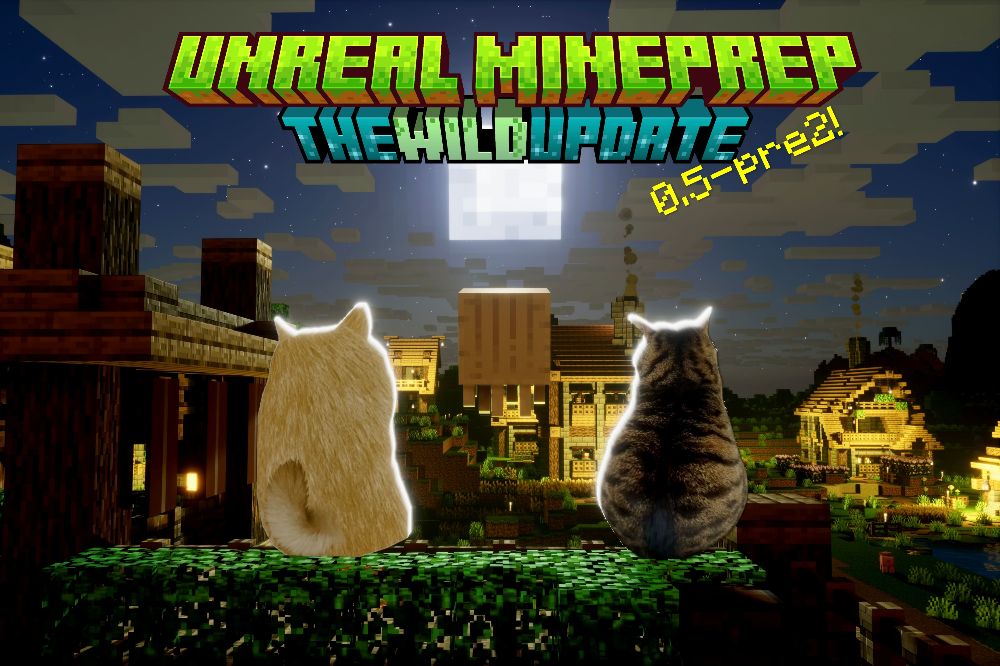
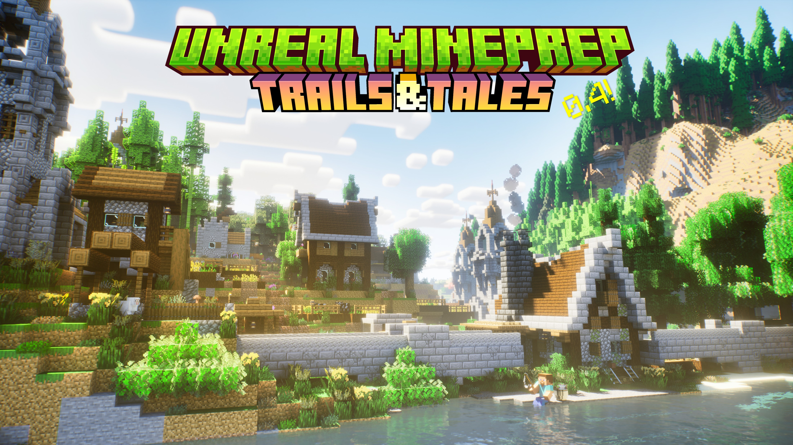
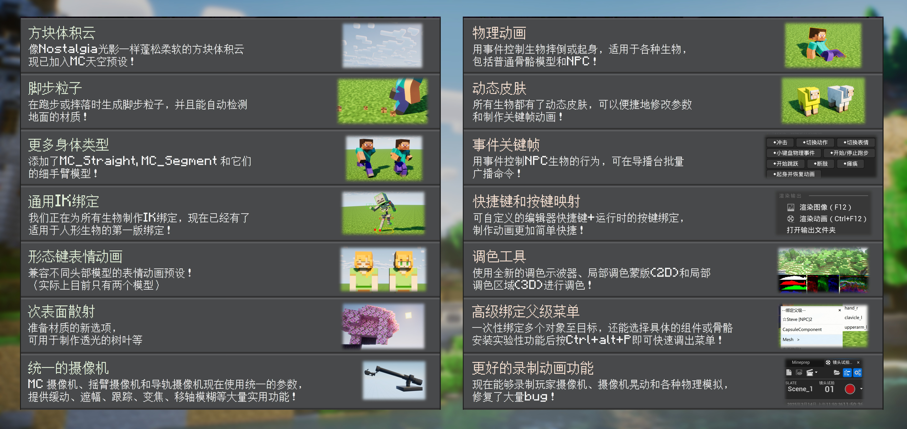

# Unreal-Mineprep

繁體中文 | [**English**](./README_EN.md) | [**中文**](./README.md)

✨這是一個正在開發中的UE5插件，繼承了 [Blender MCprep](https://theduckcow.com/dev/blender/mcprep/) 的實用功能，並加入一些新的資產，爲製作MC動畫帶來便利

*本插件與Minecraft、MCprep官方沒有直接聯繫，在其建議下插件名稱由Unreal MCprep更改爲Unreal Mineprep，以避免混淆（0.3及之前的版本已經歸檔，就不做修改了）。

在v1.0正式發佈前，插件主要供內部使用，可能存在兼容性問題和潛在的 ~~bug~~ 特性。之後會逐步修復並寫一些使用教程（但這應該是很久以後的事了）

## 安裝方法

### ① 使用安裝包（推薦，適用於0.4+版本）
**1、下載Mineprep插件，建議保存在純英文路徑下。**  
- 你可以在右側的`Releases`部分下載較爲穩定的大版本；或者點擊上面的綠色`Code`按鈕 -> `Download Zip`，下載最新快照版本。

**2、解壓安裝包，使用Blender打開裏面的`Mineprep_installer.blend`文件。**
- Unreal Mineprep是在Blender MCprep的基礎上開發的，部分功能會遠程調用MCprep裏的函數。如果你是Blender用戶那就好極了！
- 如果你沒有Blender，可以前往[Blender官網](https://www.blender.org/download/)下載，建議選擇"Windows Portable"版本，無需安裝，解壓即用。當然也可以在[Steam](https://store.steampowered.com/app/365670/Blender/)等其他平臺下載。
- 此外，我們還推薦你在Blender中安裝[MCprep插件](https://theduckcow.com/dev/blender/mcprep/)。

**3、點擊▶️運行腳本，會彈出菜單和安裝引導**
- 目前提供了`創建新的工程文件`和`安裝至現有工程`兩個選項，還可以選擇實驗性功能、插件設置等內容。然後就能一鍵安裝了。

### ② 手動安裝
需要複製Mineprep內容文件夾+修改項目設置，稍後會更新詳細步驟

## 兼容性
Mineprep 0.5-pre3 使用Windows+UE5.6開發。

安裝包和插件的非實驗性功能理論上是跨平臺的，並且支持更高的引擎版本，但是尚未經過測試。

> [!WARNING]  
> 實驗性功能完全不支持其他平臺和引擎版本，必須重新編譯才能使用。請勿在mac上勾選，否則工程文件打都打不開，一上來就報錯！！

另外，插件附帶了windows版的ffmpeg用於視頻編碼。mac用戶目前需要手動下載並在安裝時指定路徑。當前所需版本爲ffmpeg 8.0

## 生物
- Mineprep提供了MC原版生物模型，可以通過生成器面板放置
- 目前主要有骨骼網格體和自動化NPC兩種類型，部分生物製作了頂點動畫實例模型，用於大型羣體粒子。所有生物都可以更換材質，兩腳生物可以嘗試添加IK綁定
- 當前版本支持：Steve/Alex玩家、豬、牛、羊、馬（驢、騾、殭屍馬、骷髏馬）、喪屍(殭屍)、屍殼、溺屍(沉屍)、骷髏、凋零骷髏、流浪者(流髑)、沼骸、豬人(豬布林)、豬人(豬布林)蠻兵、掠奪者、衛道士、鐵魔像(鐵巨人)、蠹魚、終界蟎、蜘蛛（洞穴蜘蛛）、村民、烈焰使者、凋零、疣豬獸、雪人、狼、貓、悅靈、流浪商人、豹貓(山貓)、地獄幽靈、小幽靈、快樂幽靈
- 更多內容正在更新中

## 語言本地化
Mineprep提供了可拓展的多語言翻譯，目前支持中文/英文/繁體中文
- **安裝包**會根據Blender的偏好設置選擇語言。本地化內容以字典的形式寫在代碼中，參見[Mineprep_installer.blend](./Mineprep_installer.blend)或[Mineprep_installer.py](Blender扩展资源/Mineprep_installer.py)
- **插件面板**上方有選擇語言的按鈕，在啓動時會根據UE的偏好設置選擇語言。本地化內容保存在[語言本地化_language_localization.csv](./Mineprep/插件贴图/语言本地化_language_localization.csv) 和 [變量顯示名_VariableDisplayNames.csv](./实验性功能(C++)/Mineprep/Content/变量显示名_VariableDisplayNames.csv)中。

更多內容正在更新中

## 開源協議
- 在製作插件時，我原來用的是GPL-3.0協議，但是現在包含了虛幻引擎的官方示例+源代碼，它們好像和開源許可證不兼容 (*´･д･)? 所以這裏就先不放License文件了。
- 在大部分情況下，你可以免費使用本插件。(UE5.3及更早的版本不向影視創作者收費，UE5.4開始對年收入超過100萬美元的用戶按席位收費，顯然我們不會達到收費門檻hhh)  
具體參見[Epic Games的用戶協議](https://www.unrealengine.com/zh-CN/eula)
- 以後考慮做一個Mineprep Lite，只留下準備場景、更換材質等核心功能，沒有官方素材和引擎源碼。這樣安裝會簡單很多，也能放GPL-3.0協議了
- 同時，Mineprep引用了許多第三方插件和資源，在此向他們表示感謝。我們在[ResourceLicenses](./Readme素材/ResourceLicenses)文件夾中收錄了一些許可證和作者留言。如有遺漏可以拉一個Pull Request進行補充

## 版本更新

#### 0.5-pre3

<i> 這是一張帶 HDR增益圖的 jpg封面！使用 HDR顯示器或下載到手機上即可查看高動態範圍效果  
地圖來自https://www.curseforge.com/minecraft/worlds/rtx-aio-map </i>

Mineprep 0.5-pre3 是最後一個支持UE5.6的版本，帶來了許多革命性的改進：
- 首次支持MC的LabPBR材質標準
- 首次使用正確的HDR渲染流程，提供更多圖片/視頻輸出格式
- 首次使用UE原生的本地化系統，高效且動態地注入變量名
- 全新的NPC生物和統一粒子羣體
- 全面適配Chaos場系統，用於全局力場、材質遮罩、動畫偏移

需要注意的是，這個版本處於UE5.6和5.7的過渡階段，許多新功能尚未在實際生產中進行測試。我們計劃使用UE5.7製作新的動畫視頻。以下是最後兩週的更新日誌：
- 新增`全局力場`、`力場探測器`、`動畫偏移場`、`材質遮罩場`、`角速度旋轉場`。
  - 以上內容都使用Chaos場系統，只能在運行時生效，編輯器中沒有效果。
  - 虛幻引擎提供了12種力場類型，包含整數場、小數場和向量場。向量場默認指向中心，可以勾選重設方向
  - 邊界範圍有球形、方形、平面一側、全場四種類型
  - 可以設置力場強度、衰減並添加噪聲
  - 可以分別啓用“世界場”（影響粒子、材質）或“Chaos場”（影響物理模擬）
- 舊版徑向力場仍然保留，它是唯一能在編輯器中生效的力場。優化了統計方法，提高性能並修復垃圾回收報錯
- 粒子能在多幀輪流採樣不同的向量場了。默認勾選了“線性力”，“線性速度”，“角速度”三個選項
- 爲統一粒子羣體制作了切換動畫功能。
  - 目前，只有蜘蛛有靜止和爬行兩種動畫，會根據速度自動切換，也可以使用“指定動畫索引”參數來設置。
  - “動畫偏移場”能控制一片區域的動畫時刻。使用負數可以把粒子的隨機動畫偏移全部減到0，也就是整齊劃一的動作
- “動態體積霧”可以採樣材質遮罩場了，默認沒有啓用，需要修改材質參數
- 導播臺新增`批量播片`事件，能對任意對象播放關卡序列或模板序列；基礎生物模型和NPC生物也添加了各自的`播片`事件
  - 在“添加MC關卡序列”後面新增了`添加批量播片模板`菜單項，這是隻有一個對象的關卡序列
  - 批量播片默認每0.05秒播放一批動畫，且對關卡序列有特殊的優化，建議對大規模人羣使用關卡序列而不是模板序列
  - 在模板中製作動畫時，建議使用Additive相對偏移作爲關鍵幀軌道
  - 播片不支持事件關鍵幀
- 製作了生物`受傷變紅`的模板序列，可以在時間線上右鍵添加，也可以用於播片事件。
- 改進了“觀衆人羣散佈器”，添加了重載動畫和皮膚的參數。默認狀態不創建旋轉組件，設置面向目標後請點擊刷新按鈕，即可正確面向目標
- 改進了“遠景地形生成器”，現在會根據尺寸框的z軸縮放自動生成山脈，公開了“方塊”、“在GPU上生成”、“啓用植物搖擺”三個參數。注意，UE5.6無法投射光追陰影，等到UE5.7纔有實用性
- “注入本地化變量名”轉正了！相關按鈕已經從頂部菜單欄移除，不再是實驗性功能，而是在切換語言時自動運行。我們第一次使用了UE內置的polyglot本地化系統，且第一次翻譯了枚舉值。這能在25ms內注入1000條變量名，速度極快，無需編譯。變量名保存在[變量顯示名_VariableDisplayNames.csv](./Mineprep/插件貼圖/變量顯示名_VariableDisplayNames.csv)中
- 【實驗性功能】按 Ctrl+Alt+? 可以查看當前所有自定義快捷鍵
- 改進了Megalights在渲染時的陰影質量和體積質量
- 使用純函數和批量數組處理優化了許多藍圖程序的性能
- 爲蜘蛛製作了首個Locomotor運動綁定
- 調整了初始的日光強度、環境光遮蔽和對比度參數
- 點擊UI界面編輯器的“刷新”按鈕，能自動更新編輯器中的SDR/HDR顯示狀態
- 修復了“從圖片合成HDR增益圖jpg”因爲臨時文件而報錯的bug。注意，前兩個文件名似乎需要純英文。“渲染帶HDR增益圖的jpg”要等UE5.7才能解決色彩管理問題
- 修復了VR+3D渲染錯誤啓用nDisplay輸出的bug
- 修復了方塊破碎模板的材質消失問題

 📜展開快照 

#### 25w51a
- 進一步完善統一粒子羣體，利用紋理集合支持任意數量的皮膚和動畫，打通不同生物模型之間的壁壘，新增了`螢火蟲粒子`
  - 每一種用於粒子羣體的生物都有專屬數據集，裏面包含模型、皮膚、動畫、碰撞箱等參數。
  - 當前，一個粒子羣體支持4個不同的數據集，也就是說，可以把蠹魚蜘蛛終界蟎什麼的全部混在一起，做一個大蟲羣了！
  - 細節面板中有多個模塊，其中一部分是不同的運動模式，按需啓用。當前有“粒子生成”，“模型”，“材質(模型/Sprite)”，“動畫”，“碰撞檢測”
，“行走”，“爬行”，“Boid模擬(鳥羣/魚羣)”，“子粒子”和一些力場參數
  - 螢火蟲粒子和媒體摳像粒子使用Sprite材質，而非普通的模型。可以勾選始終面向攝像機
  - 優化性能並修復了跳躍和碰撞箱的一些bug
> 紋理集合需要無綁定渲染，這個功能必須通過修改項目配置文件來啓用，而且UE5.7的啓用方法和UE5.6不一樣。我試試把它們都放進安裝包裏
- 媒體摳像粒子集成了摳像緩存和粒子羣體兩個系統，現在需要手動指定`緩存幀數/更新幀率`和`緩存分辨率`，修復了緩存幀數超過30會失效的bug。新增`抖動遮罩模擬半透明`參數，默認勾選，能大幅提升性能，但會降低半透明部分的質量。
- 更改了生成器子面板按類型過濾的多選策略：左鍵點擊多個類別（比如A、B），將同時檢查A與B，而非之前的A或B

#### 25w50a
- 本週初步製作了`統一粒子羣體`，之前的蟲羣粒子（蠹魚/終界蟎）和蜘蛛羣粒子已經合併到一起
  - 新一代粒子羣體集成了各種運動方式，可以按需啓用，也支持通過關鍵幀在運行時切換狀態
  - 目前有行走、爬行和Boid模擬（將用於鳥羣和魚羣）三種運動方式
  - 接下來的任務是改造動畫系統，然後把媒體摳像粒子合併進來
- 材質新增`不透明R~G+B*A`參數，能夠正確渲染染色玻璃了，也能製作模型的淡入淡出動畫
  - 計算順序從後往前，先把紋理貼圖的不透明度乘以A，然後+B，最後判斷是否在R~G範圍內，小於R直接設置爲透明，大於G直接設置爲不透明
  - 目前使用抖動遮罩的方式模擬半透明效果，會產生噪點，而且在運動時有明顯重影。UE5.7提供了一個拒絕TAA的材質節點，能大幅緩解重影問題。等更新UE5.7之後，還會使用Substrate材質製作真正的半透明玻璃
- 新增材質遮罩場，將“Stencil遮罩層”設爲9可以採樣全局力場作爲遮罩。導播臺新增`GPU力場精度`、`GPU力場距離`、`材質遮罩場類型`參數。默認精度32比較低，但提升精度會顯著增加顯存佔用。
- 修復了IK綁定導致手部異常旋轉的bug。現在，FK和IK都使用分層綁定，而且能疊加使用。做完動畫後，可以點擊細節面板面板中的`烘焙關鍵幀`按鈕，一鍵烘焙動畫
- 無時間線 直接從編輯器視角渲染動畫時，添加了攝像機晃動效果
- 舊版隨機種子已全部升級爲新的“隨機種子Seed”參數
- 優化了MC場景編輯器中基礎方塊的GPU距離場碰撞箱。雙面材質似乎會破壞距離場，因此使用了一個專門的單面方塊作爲距離場替換網格體

#### 25w49a
MC即將迎來新的版本編號方法，下一次大更新不是1.22，不是2.0，而是... 26.1!（⊙ｏ⊙）  
至於Mineprep嘛，現在這個版本編號挺好的，那就繼續用吧

- 本週NPC大改基本完成，新一代NPC不僅翻新了底層架構，而且繼承了之前的所有功能，顯著提升性能和交互體驗。新增了 `蠹魚、終界蟎、蜘蛛、洞穴蜘蛛、地獄幽靈、快樂幽靈、小幽靈、烈焰使者、凋零、疣豬獸、雪人、狼、貓、豹貓(山貓)、悅靈` 對應的NPC生物，並帶來了以下新功能：
  - 絕大多數參數都顯示在細節面板的`NPC行爲`部分，可以整體複製黏貼，比如把地獄幽靈的行爲複製給喪屍(殭屍)，讓它飛起來。每個參數都有詳細的工具提示
  - 新的`隨機種子Seed`變量會自動設置初始值，點擊右邊的↩按鈕能隨機設置新的值，它和移動速度和單獨列出，不包含在NPC行爲中
  - NPC行爲的第一個參數是`運動模式`，當前支持“無”、“行走”、“尋路網格體行走”（沒有導航網格會自動退回行走）、“正在飛行”，未來會支持游泳。
  - `自動跳躍,攀爬,避障模式`進一步定義了行走模式，當前有“無”（撞牆會換方向走）、“跳躍”（大部分陸地生物的默認模式）、“攀爬”（蜘蛛的默認模式）、“上牆行走”（更真實的蜘蛛爬行/飛檐走壁，相當於自動改變重力方向）
  - 考慮到大規模人羣的性能優化，NPC生物移動時會首先逐幀平滑移動旋轉，然後調用自動化移動函數。`平滑移動旋轉閾值`決定了切換到自動化移動函數的方向夾角，默認爲0.1（弧度）。設置爲0表示始終平滑移動旋轉，這是飛行生物和高級NPC的默認設置
  - `旋轉速度`有三個值，分別對本地XYZ軸的旋轉速度。將前兩個值設爲0表示只能水平旋轉，例如直立飛行
  - 目前NPC有待機、遊蕩、跟隨、躲避四種基本狀態；按目標點巡邏屬於跟隨狀態。可以使用事件關鍵幀或導播臺廣播強制切換特定狀態
  - 待機和到達跟隨目標後支持隨機播放動畫，根據`待機隨機播放動畫索引`和`攻擊隨機播放動畫索引`在自定義鍵控動畫組中挑選
  - 要讓NPC根據tag自動跟隨/躲避目標，目前必須勾選`視覺/聽覺/觸覺感知`的視覺感知，感知半徑暫時鎖定在15m。然後，配置`跟隨目標類->tag`和`躲避目標類->tag`（tag留空表示任意值），讓NPC識別進入視野的目標
  - 物理交互動畫和輔助碰撞箱現在默認關閉，按需啓用
  - 更多參數信息請查看工具提示
> 高級NPC暫未支持全部功能，等UE5.7換了新的運動匹配官方示例再說。下週會檢查各種舊功能以及基礎生物模型的兼容性，最後開發一下統一粒子羣體，Mineprep 0.5-pre3就能發佈了
- `自定義鍵控動畫組`是新一代用於遊戲模式、NPC行爲和事件關鍵幀的動畫系統
  - 繼承了先前的交互模式，依然可以按數字鍵播放動畫，或者使用事件關鍵幀/導播臺廣播來播放
  - 每個索引代表一個動畫組，支持多個動畫
  - 默認情況是按順序播放身體動作。通過重載特定動畫索引的參數，可以配置表情動畫、播放速度、緩入緩出等信息。手動輸入`播放順序`則能進行連播、隨機播放、循環播放等行爲。具體參見工具提示（待更新）：
  - <播放順序> 留空表示按照0123...的正常順序一個接一個播放；(012)表示從中隨機挑選動畫；[012]表示同時播放所有動畫，通常用於身體和表情等不同部位的組合，將最後一個動畫的結束時間作爲整組時間。在兩個動畫之間添加"."表示間隔0.1秒，":" 表示間隔0.2秒，"/" 表示間隔0.5秒
- MC天空支持自定義背景貼圖了！默認是Celestial Vault插件的銀河系全景圖。雙擊天空找到背景材質，調整裏面的`背景天空亮度`就能看到了。
- 繼續改進導入方塊/導入物品相關程序
  - 把等待時間延長至5秒，解決第一次導入時 可能因初始化時間較長而失敗的問題
  - 5秒後，強制關閉Blender後臺進程
- 修復了遠處透明材質因各向異性過濾出現異常條紋的問題
- 修復了MC場景編輯器不能按delete刪除選中對象的問題

#### 25w48a
- 本週對NPC生物進行大改，這一改造已經陸陸續續持續了幾周，預計能在25w49a基本完成。新一代NPC的底層架構從行爲樹轉換爲狀態樹，並添加了以下功能：
  -  支持飛行、攀爬等多種運動方式
  -  將更多的參數暴露在細節面板中，支持整體複製黏貼
  -  事件驅動的狀態轉換，可以通過關鍵幀和導播臺廣播來控制NPC行爲
  -  提升性能
- 重新設計了新的“自定義鍵控動畫組”，支持把多個動畫組合在一起播放，通過簡單的指令重載播放順序，後續將與NPC集成到一起

#### 25w47a
- 通過混合最近點採樣和各向異性過濾採樣，大幅提升了遠景材質的質量，減少模糊、閃爍和消失的問題
- 從3級動態材質開始，可以使用“單面”參數的小數部分略微擠出面，解決兩個模型重疊時的閃爍問題；植物交互現在能用於大場景模型
- 改善MC天空重啓後可能回到6:00的問題。現在應該能記錄時間並刷新待保存狀態。優化了方塊雲在夜晚的亮度
- 改進放置物品和放置方塊的工作流程，當檢測到錯誤時（未安裝Blender、未安裝MCprep、導入模型失敗等）會彈出提示框，並修復了連點產生的bug
- 【實驗性功能】更新快捷鍵Ctrl+Alt+5爲顯示選中對象的輪廓；按小鍵盤0切換攝像機視角時，若沒有打開時間線，會自動檢測選中的攝像機或場景中的攝像機
- 【實驗性功能，將在UE5.7啓用】擴展模板序列以支持雙精度浮點和向量屬性乘數。同時，UE5.7有了新的官方入門教程插件，舊版GuidedTutorials將被廢棄

#### 25w46a
- UE5.7正式版發佈了！我們計劃在幾周後升級引擎，目前爲非實驗性功能修復了一個新的菜單欄bug
- MCprep更新了3.6.2版本，我們同步了新的MC資源包(支持到1.21.10版本)，並修復了在Mineprep中調用放置方塊/放置物品時的一些bug。新版MCprep適配了Blender5.0，放置方塊時不會給每個面生成多餘的材質了，更換紋理能也對放置的大部分方塊生效。
- 準備場景的高級設置中新增`平直着色(重置法線)`選項
- 在MC場景編輯器子面板新增`導入世界`按鈕，目前有OBJ(Mineways)，OBJ(jmc2obj)和FBX三個選項。這是第一次適配jmc2obj，之後還將逐步適配MiEx的usd模型
- 優化了導入模型的默認參數，OBJ模型會使用100倍縮放和90°旋轉，從MC座標系轉換到UE座標系；導入jmc2obj模型還會自動應用平直着色(重置法線)。右鍵按鈕可以打開詳細參數面板。
- MC天空新增`日/月光束遮擋+過渡`，`太陽泛光RGB+亮度A`和`月亮泛光RGB+亮度A`參數。太陽默認使用光束遮擋，月亮默認使用泛光，增強了體積光效應和氛圍感。修復了月相在半夜變化的bug
- 使用視頻編碼或圖像轉碼時新增`刪除原圖`參數。當前3D渲染有點問題，需要關閉刪除原圖，否則會報錯

#### 25w45a
- 這幾周的渲染流程大更新基本結束了。最後爲3D渲染適配了視頻編碼和圖像轉碼，新增以下四種格式
  - 兩組獨立輸出
  - 左右並排 FSBS
  - 上下並列 FTB
  - 紅藍濾色
- 輸出文件名可以添加子文件夾路徑了，例如"MC/xxx"會先創建名爲MC的文件夾，把輸出結果保存到裏面
- 插件設置子面板新增`渲染結束打開文件夾`（默認勾選）和 `渲染結束提示音`（默認爲空）
- 在頂部菜單欄-MC-開發板塊新增`渲染帶HDR增益圖的jpg`和`從圖片合成HDR增益圖jpg`按鈕[僅支持Windows]，使用新版Movie Render Graph同時渲染SDR和HDR畫面，然後使用libultrahdr合成帶增益圖的jpg圖片。
> 目前能保證SDR畫面和編輯器視口保持一致，但是無法應用HDR渲染亮度倍率，因此沿用之前的色彩校正方法，HDR增益圖效果大約和r.HDR.Aces.SceneColorMultiplier=1.5差不多

> Movie Render Graph的暖場很慢，並且會運行遊戲邏輯，我們在渲染開始時加快了自動曝光調整速度

> 暫不支持3D渲染、全景渲染和DLSS等功能。
- MC攝像機、搖臂攝像機、導軌攝像機新增`旋焦`參數，>0表示繞中心旋轉的背景模糊，<0表示指向中心的徑向模糊
- 準備場景現在會強制刷新紋理貼圖，修復以往的模糊問題
- 改進了媒體摳像播放器和媒體摳像散佈器，切換視頻不再閃爍
- 修復了方塊體積雲與半透明材質之間的排序問題，在安裝插件時啓用bCompositeHeterogeneousVolumesWithTranslucency項目設置

#### 25w44a
- 改進渲染流程和預設文件，統一爲"Mineprep自定義渲染配置"，移除了舊的配置和Mineprep3D攝像機組
- 渲染時會創建一個新的臨時配置文件，向其中添加所需模塊，這可以避免未安裝DLSS彈出警告的問題
- H.264編碼現在使用UE內置的視頻編碼器
- 整理了渲染輸出子面板，新增`圖片轉碼`功能，在不輸出視頻時也可以進一步處理圖片。當前有以下選項：
  - 無
  - 動圖.gif
  - 動圖.webp
  - HDR/序列幀.png
  - HDR/動圖.avif
  - HDR/動圖.jxl
- 重置了渲染預設，默認爲1080p+時間線幀率+高質量H.264編碼，用於快速渲染。當前有以下選項：
  - 2K_120.mp4
  - 2K_120_HDR.mp4
  - 2K_透明_Prores.mov
  - 2K_3D.mp4
  - 4K_VR全景.mp4
  - 2K_HDR.png
  - 2K_HDR.exr
  - 512x512_動圖.gif
  - 512x512_動圖.webp
  - 默認
- 3D渲染支持景深了！渲染時會把當前攝像機的景深同步到Mineprep後期處理體積，通過全局景深影響nDisplay3D攝像機組，模糊程度可能略有不同。
- UI界面編輯器支持3D渲染了！nDisplay3D攝像機組新增`UI界面3D效果`參數，默認爲1，調大可以增強左右眼偏移
- 驗證了libultrahdr合成jpeg圖片的可行性。我們使用達芬奇的Nvidia RTX Video HDR把往期封面图轉換爲Rec2100 PQ並導出爲16-bit HDR png，然後用ultrahdr_app.exe把原圖和新圖合成爲帶HDR增益圖的jpg，在各個平臺上都有不錯的觀看效果。接下來考慮將其集成到渲染流程中
> 除了libultrahdr，我還嘗試製作空間視頻和實況照片，結果一個也沒弄成，Windows一敗塗地啊，安卓的標準又參差不齊，真就是Only Apple Can Do ｡ﾟヽ(ﾟ´Д`)ﾉﾟ。  
> 爲了彌補遺憾，在圖片轉碼那邊添加了gif/webp/avif/jxl格式，後面兩個算是戰未來吧，目前不能用於剪輯，只能在有限的平臺觀看

#### 25w43a
- 所有生物已更換新版材質。方塊材質新增`單面`參數，默認爲0，表示雙面渲染；設爲1僅渲染正面（適合簡單玻璃），設爲-1僅渲染背面。
- 繼續改進渲染輸出流程，現在無需實驗性功能或重啓引擎就能更改輸出的後綴名格式了
- H.265/AV1全面支持新的HDR編碼方式，同時針對不同硬件編碼器調整了色度抽樣和質量參數
- 新增`Vulkan`硬件加速選項，支持H.264/H.265/AV1編碼
- 安裝插件或重新初始化時會通過OpenCV的OpenCL模塊更加智能地識別顯卡
- 第三版png標準支持HDR了，測試發現FFmpeg也能正確寫入元數據！我們改進了啓用HDR後的圖片渲染功能，若勾選png，則會渲染exr並重新編碼至16-bit Rec2100 PQ png。話說png序列幀能顯示縮略圖、能被達芬奇直接識別輸入色彩空間，這不比exr好多了(～￣▽￣)～
- 【實驗性功能】我們編譯了[libultrahdr](https://github.com/google/libultrahdr)，用於製作帶HDR增益圖的jpg圖片。ultrahdr_app.exe保存在ffmpeg.exe旁邊。
  - 這是目前兼容性最好的格式，包含SDR和HDR兩份數據，若顯示器不支持HDR也能當成普通的jpg打開。
  - 初步測試，同時注入ISO和XMP元數據的HDR圖片能被Windows、蘋果和安卓成功識別
  - 我們參考[這個腳本](https://github.com/albertz/playground/blob/master/ultrahdr.py)把Readme中的圖片轉換成了帶HDR增益圖的jpg，看看有沒有效果👀
  - 下一步計劃是把它集成到Mineprep的渲染流程中。爲了同時渲染SDR和HDR底圖並應用各自的色調映射，需要新版Movie Render Graph，還要在渲染結束後單獨調用ultrahdr_app.exe。這將是一個長期目標

#### 25w42a
- 本週大幅改進了PBR材質和HDR渲染流程，從根源上解決長期存在的問題，爲後續版本更新以及UE5.7的Substrate材質打下堅實基礎
- 重新設計材質參數和紋理貼圖的解讀方式，適配MC專用的LabPBR標準，並添加了4級動態材質用於視差凹凸效果
  - 近幾年的MC紋理包普遍採用[LabPBR](https://shaderlabs.org/wiki/LabPBR_Material_Standard)標準，它把自發光蒙版、次表面散射、環境光遮蔽、高度圖等諸多信息打包在高光貼圖(_s)和法線貼圖(_n)的不同通道中。現在，Mineprep能正確解讀這些附加信息了！
  - 新版材質分1~4級，如下所示。（未來還會增加兩種半透明材質，1-2級用於簡單染色玻璃，3-4級用於模糊的磨砂玻璃，這需要新一代Substrate材質系統）
  - ① 用於生物皮膚的材質。包含以下參數：  
    Stencil遮罩層  
    發光亮度  
    照明強度  
    紋理顏色  
    次表面顏色RGB+透射A   
    金屬/高光/粗糙/孔隙率   
    紋理貼圖  
    高光貼圖  
  - ② 用於方塊的材質。添加了以下的額外參數：  
    法線強度  
    破碎程度  
    頂點顏色   
    單面  
    動畫速度/步長/列數/漸變    
    法線貼圖  
  - ③ 用於附魔和植物搖擺的材質。添加了以下的額外參數：  
    搖擺幅度  
    搖擺速度  
    交互強度  
    附魔縮放/速度/對比度/底色  
    附魔顏色  
  - ④ 用於視差凹凸的材質，需要法線貼圖的Alpha通道包含高度信息+Megalights光追陰影，添加了以下的額外參數：  
    視差凹凸強度   
    視差精度
  - 新版材質減少了貼圖數量，並通過強有力的if else跳轉分支，在功能更多的同時 性能保持不變或更好。（不過虛幻引擎會統計所有分支的指令數，直接看着色器複雜度似乎較高，實測沒有問題）
  - 現在可以在參數中設置是否啓用漸變動畫了，默認爲漸變，“準備場景”會對火焰等特殊方塊設置不漸變；動畫播放速度已經統一，默認爲1秒1張圖；步長設置爲負數表示往返循環，可以解決**靜態岩漿**的突變問題；而**流動岩漿**把每一張圖保存爲2x2的重複塊，設置步長4 列數2即可正常播放
  - 金屬/高光/粗糙 設置爲正數表示相乘，負數直接指定爲絕對值。孔隙率將在Mineprep 0.6得到支持，用於積水溼度，目前沒有效果
  - 發光亮度現在表示整體偏移量，默認是0。高光貼圖的Alpha通道存放了自發光蒙版，若含有信息會自動發光。降低發光亮度至<0可以使它減弱，提升至>0則使整體變亮。新材質發光時會自動從“次表面”着色模型切換至默認光照
  - 各向異性和切線貼圖已被移除（之前從未用過，在Substrate中還會增加材質複雜度）
  - 新材質專爲MC設計，不建議對非MC模型使用“準備場景”！當前需要採樣法線貼圖的四個通道，會改變紋理採樣器類型，和原材質不兼容。另外，MiEx會把LabPBR轉換爲常規PBR導出，這反而需要特殊處理了，未來會製作自動識別與導入模型的功能
  - 更多功能正在更新中，生物和方塊即將更換新版材質。
- 徹底解決了HDR渲染顏色和編輯器視口不一致的問題，不再需要色彩校正。顏色子面板新增`HDR渲染亮度倍率`滑塊，可以理解爲HDR專用的曝光參數，初始值爲2，比UE默認的1.5略高，使HDR畫面變得明亮
> 終於，我解決了這個困擾一年的問題，淚目 ｡ﾟ(ﾟ´ω`ﾟ)ﾟ｡
>   
> [論壇中的這個討論](https://forums.unrealengine.com/t/fixing-hdr-tonemapping-errors-darkened-image-and-wrong-colors/2544973)點出了問題的根源：UE5有一個控制檯變量 r.HDR.Aces.SceneColorMultiplier，默認值是1.5，它會把編輯器視口的亮度x1.5，但是不影響渲染輸出！！！難怪以前顏色不一致
>   
> 最簡單的解決辦法是把它改成1，但是這導致場景昏暗，上面那個帖子也說增加到3.25才比較好看。進一步研究發現，它的效果和後期處理體積的全局增益相同——因此，我們在導播臺中添加了一個優先級更高的後期處理組件，渲染時檢測到HDR就會自動啓用，把Mineprep後期處理體積的全局增益和SceneColorMultiplier相乘。
- 調整了Mineprep後期處理體積的初始參數，現在會啓用環境光遮蔽(強度0.5 距離50)和全局對比度1.05
- 發現了頂點動畫的陰影問題所在：光線追蹤目前無法投射正確的次表面陰影！把“次表面散射RGB+透射A”參數改爲0，可以暫時解決Lumen光追在蟲羣粒子和PCG植物上投射錯誤陰影的問題。而Megalights有HZB屏幕空間追蹤，這很大程度上緩解了錯誤的陰影，還能投射正確的視差凹凸陰影
    
#### 25w41a
- 雙擊MC天空的背景（即選中天空球組件），能夠看到背景天空/方塊雲/方塊體積雲/體積雲的材質，現在可以很方便地調整參數和製作關鍵幀動畫了
- 繼續改進渲染畫質，增強反射和視野距離等參數；正式啓用了Megalights的定向光源功能，顯著提高了大場景的性能，在“光程”板塊新增一個使用虛擬陰影貼圖或退回lumen的按鈕
> 儘管UE5.7的更新日誌才提到Megalights支持定向光源，UE5.6已經有相關控制檯變量了。當前，Lumen光追無法在實例化網格體（如蟲羣粒子）上投射正確的WPO陰影，Megalights是最直接、性能最好的解決方案。另外，遠景地形生成器問題比較大，目前禁用了WPO頂點動畫，需要使用虛擬陰影貼圖或更新至UE5.7
- 新增`光照探測器`，能夠探測空間中或表面上的光照強度，在視圖中顯示亮度和RGB分量。可以使用數學表達式把亮度值設置到其他對象上，默認參數是控制燈光亮度，在夜晚亮起。*注意亮度是一個不穩定的參數，不建議用於精確值
- 修復了Chaos破碎模板的方塊材質問題

#### 25w40a
- 改進NPC生物的狀態機動畫，製作了 常規運動-潛行-游泳-飛行 的模板，爲更多種類的運動方式打下基礎
- 修復了一些自動跳躍和麪向目標的bug
- 更新了“MC第一人稱攝像機”，使用UE5.6的新版第一人稱渲染模式，加入手持物品、身體模型和更多功能
  - 默認情況下顯示右手，點擊或長按鼠標左鍵可以揮動右手；身體在反射中可見，能夠投射陰影。
  - 錄製動畫會記錄第一人稱視角和全身運動的所有關鍵幀。修改“身體部位可見性”可以決定要顯示的部分
  - 優化了走路和跑步的攝像機晃動，更符合MC原版的樣子
  - 未來，我們計劃把MC場景編輯器和第一人稱角色結合起來，實現動態放置、破壞、獲取、切換方塊
- 方塊的物理破碎板塊添加了`自定義切割位置+法向量`功能，能程序化切割**任意方塊**，還支持直接錄製動畫！
  - 我們提供了幾個“PM”開頭的切割模板。切割次數根據模板名稱變化，比如“PM切割小方塊_2x2x2”可以改成3x3x3，隨機切割則由隨機種子決定
  - 性能不如原先的Chaos破碎預設，不要切太碎。如果使用了Chaos破碎預設，將忽略自定義切割
  - 禁用物理破碎需要清空破碎模板和自定義切割參數
- 在導播臺的畫質預設中加入了`4* 影視級（反射爲極高+增強降噪）`選項，優化了lumen光線追蹤相關參數，現已成爲默認渲染畫質。
- 其他功能子面板的“光程”和“環境光遮蔽”板塊添加了`室內天空光照`參數，可以調節顏色和強度

#### 25w39a
- UE5.7預覽版發佈了，Mineprep 0.5-pre3將是最後一個支持UE5.6的版本！插件的非實驗性功能已經爲5.7做好適配，通過延遲初始化修復了python腳本運行失敗的新問題。
- UI界面編輯器基本製作完成
  - 點擊細節面板的按鈕，可以添加文字或圖像，上移或下移圖層。*刪除圖層後需要手動點擊刷新
  - 默認情況下使用相對縮放，修改渲染分辨率也能保持相近的圖層大小。取消勾選“隨分辨率自動縮放”，將使用絕對的像素大小
  - 在3D場景中雙擊圖層，可以快速選中並移動、旋轉、縮放它
  - 能夠調整全局顏色/不透明度以及每個圖層的參數，製作關鍵幀動畫
  - 支持僅在邊界框內顯示，調整PostProcess組件的混合半徑還可實現淡入淡出
> 暫不支持全景和3D渲染，未來估計也不會支持！話說，在後期剪輯時給全景/3D視頻上字幕，好像也不簡單啊 Σ(;ﾟдﾟ)  
> **0.5-pre3 (25w44a) 已支持3D渲染！**
- UI文本具有`導入字幕`按鈕，可以導入srt文件爲關鍵幀，或者從音視頻中識別字幕
  - 通常來說，我們更推薦在剪輯軟件中加字幕，直接在UE裏做算是多了一種選擇
  - 識別字幕使用FFmpeg 8.0調用whisper生成srt文件，保存在工程文件目錄的cache文件夾下。
  - Mineprep附帶了ggml-base-q8_0.bin作爲默認的小模型，如果想要更好的效果，可以在[whisper倉庫](https://huggingface.co/ggerganov/whisper.cpp/tree/main)下載ggml-large-v3-turbo-q8_0.bin等更大的模型，放至/Content/Mineprep/Render/models/whisper目錄下
- 使用UE5.6的官方示例重做了第三人稱運動匹配角色，同時重新設計模塊化的NPC
  - 修復了物理交互造成閃退的bug。現在可以爲骨骼配置任意數量的不同物理參數集了
  - 增強了跳躍檢測功能，可以在空中抓住牆壁爬上去了！錄製關鍵幀動畫時，也不再會生成一堆臨時碰撞箱了
  - 官方提供了新的衝刺模式，目前分配給按鍵"Z"
  - 更多功能正在製作中，預計會下放給普通NPC生物

#### 25w38a
- 爲方塊模型添加了`物理破碎`功能
  - 默認情況下破碎模板爲空，設置爲有效的模板即可啓用Chaos物理破碎，可以碎成小方塊或不規則形狀
  - 性能 2x2小方塊 > 碎石塊 > 4x4小方塊 > 6x6小方塊 > 8x8小方塊
  - 勾選初始模擬會隨重力下落，否則受到撞擊才破碎
  - 修改分級破碎閾值，可先碎成大塊，再碎成小塊（目前只分兩級）
  - 當前僅支持六個面的標準方塊，以及頂面/側面/底面三種材質
  - 暫時無法錄製關鍵幀動畫，需要專用的Chaos緩存
- FFmpeg已經升級至8.0版本！新版注入HDR元數據的方式有變，我深入研究了色彩管理的細節，正在開發新一代渲染流程
  - 使用全新的命令編碼H.265視頻，其他格式也將陸陸續續改進
  - UE5_HDR.cube已經廢棄，不再需要lut進行視頻編碼時的調色，而是通過後期處理材質在色調映射後power 0.85，直接模擬這一調色過程。現在，只導出exr序列幀不編碼視頻，也可以在達芬奇中手動指定輸入顏色空間爲Rec.2100 PQ來還原編輯器中的顏色。
- 初步製作了`UI界面編輯器`
  - 終於，我們有了兼容HDR的UI渲染器！UE內置的渲染管線是把sRGB UI直接疊加到最終圖像上，繞過Filmic色調映射，但未考慮HDR輸出。在普通的SDR渲染時，我們仍然遵循這一流程。
  - 而在HDR渲染時，沒有色調映射，只有色彩空間轉換。因此，我們通過後期處理材質將Linear Rec.709 UI直接注入色調映射前的場景顏色，隨場景一起轉換到HDR顏色空間，得到了正確的顯示效果。需要注意的是，當前最晚只能在泛光前注入，也就是UI會受到輝光的影響。
  - UI界面編輯器旨在提供動態添加文本和圖像的功能，可以在3D場景中預覽和編輯、製作關鍵幀動畫，未來還將支持導入字幕
  - UI界面的縮放取決於渲染分辨率，需要在攝像機視口中查看，否則會拉伸

#### 25w37a
- 本次更新對整個插件的文件層級進行了大調整。由於PCG HLSL節點在中文路徑下會報錯，不得不做出以下更改：
  - “MC藍圖資源”文件夾改名爲“MC_Blueprint"
  - 各大類從“依賴”文件夾中提取出來
  
  最終，“/Mineprep/MC藍圖資源/依賴/PCG/” 變爲 “/Mineprep/MC_Blueprint/PCG/”。未來將會進一步整理文件，使資源路徑簡潔清晰。同時又要debug了...
- 初步製作`遠景地形生成器`，在GPU上高效生成MC地形。目前實現了基本的石頭-泥土-草方塊-草的生成+內部方塊剔除，未來將和場景交互，擴展現有模型的邊界。目前侷限性較多，不支持光線追蹤陰影，更多功能要等UE5.7更新
- 粒子現已支持Chaos力場。這是虛幻引擎官方提供的全局力場，有更豐富的功能，但是不能在編輯器內預覽，只能在運行時使用。舊版徑向力場仍然保留
- MC攝像機、搖臂攝像機、導軌攝像機添加了`交叉疊化`轉場功能。這是首個混合兩邊畫面的轉場，先從原攝像機過渡到緩存，再從緩存過渡到新攝像機，在編輯器內以低分辨率預覽（需要進入攝像機視圖查看轉場過程）。可以調整緩動曲線和時長。中間的空當需要與鏡頭切換對齊
- 遙控燈光不再需要提前添加組件了，導播臺廣播時會自動識別燈光
- 優化了導播臺批量廣播參數，可以在時間線上方便地修改信號源和目標類了。勾選debug後，能更好地顯示信號傳播過程
> 事件關鍵幀的參數：數組，不行。結構體包裝的數組，行。Actor數組，不能改。軟引用數組，能改。這什麼抽象用法啊喂(ﾟДﾟ≡ﾟдﾟ)!?

#### 0.5-pre2

Mineprep 0.5-pre2帶來了生物模型大改的階段性成果，同時也新增了許多媒體播放和後期合成的素材，我們用其製作了貓meme《撿到一隻快樂小幽靈》
> 需要注意的是，這個版本由於升級到UE5.6的產生了新的bug（例如MC像素文字損壞、第三人稱運動匹配角色開啓物理交互後閃退），目前通過禁用部分設置來避免問題，最終的修復需要等Mineprep 0.5正式版發佈

- 新增 `村民`、`烈焰使者`、`凋零`、`疣豬獸`、`雪人`、`狼`、`貓`、`悅靈`、`流浪商人`、`豹貓(山貓)` 、`地獄幽靈`、`小幽靈`、`快樂幽靈` 的模型
  - 其中，村民和流浪商人包含NPC版本
  - 村民有特製的材質，通過更改紋理貼圖來切換職業和生物羣系
- 所有生物模型配置了骨骼級別的重定向設置。人與動物可以共用動畫片段，效果比之前更好。清理了許多舊的動畫片段，製作了新的動畫片段
- 觀衆人羣散佈器完成第一階段開發工作，可以設置隨機皮膚和隨機動作
- 新增 `營火`、`營火煙霧粒子`、`爆裝備粒子`、`愛心粒子`、`噴濺藥水粒子`
- 新增 `監控攝像機`，能捕獲畫面並寫入渲染目標紋理貼圖，顯示在別處。目前有三種模式：“默認(可遞歸)”，“後處理(帶景深)”，“背景透明”。
- 修改了材質參數，新增`頂點顏色`，在準備場景時自動識別，值設爲1會讀取不同生物羣系的植物顏色，適用於從MiEx導出的usd模型。"[着色模型] 1默認/2次表面"已棄用，改爲原來的`照明強度`, ≥0使用次表面，<0取絕對值然後使用默認光照
> 虛幻引擎的自發光很迷 (╯°口°)╯ 有的模型用次表面能發光，有的僅支持默認光照。有的模型只能在次表面下調節照明強度，換默認光照又不行了。總之發光亮度和照明強度的各種組合都可以試試
- "放置物品"旁邊新增了`選擇透明圖片，導入爲3D模型`的按鈕，同樣是遠程調用Blender的MCprep插件功能
- "MC攝像機"，"搖臂攝像機"，"導軌攝像機"新增了`初始化跳過緩動`選項，在編輯器視圖和渲染剛開始時禁用緩動，立即移至所需位置。新增`硬切`按鈕，用於在時間線上切換攝像機，這是第一個轉場功能。
- "內存預加載"和"注入本地化變量名"現在會在後臺異步加載資源，提升流暢度
- 更新了“搖晃振動彈跳軌道”，能根據起始幀計算當前時刻，並添加了更多預設
- "媒體摳像播放器"在切換不同素材時會保持高度一致，將"拉伸圖像"設爲0可自定義縮放。新增`是像素貼圖`選項和一些動畫片段預設
- `錄製子面板`新增許多參數：使用當前時間線、創建副本、直接錄製動畫到對象上、每個對象創建子序列、錄製幀率、錄製前倒計時、遊戲模式。錄製後會自動處理動畫片段，修復了破壞方塊時錄製粒子的bug
- 頂部MC菜單欄新增一套渲染模式：  
①保存渲染設置並切換空關卡  
②從空關卡渲染動畫(節約顯存)
- 更新了其他功能子面板的輝光參數，普通模式和卷積模式分別設置閾值和倍率
- 【實驗性功能】新增更多編輯器快捷鍵，例如Ctrl+Alt+7顯示對象並打關鍵幀，Ctrl+Alt+Shift+7隱藏對象並打關鍵幀。具體可在自定義按鍵子面板中查看
- 導播臺添加了沿-Z軸吸附的按鈕，修復了碰撞檢測bug
- 降低了Mineprep後期處理體積的默認暗角強度，加快了曝光調節速度
- 修復了骷髏皮膚的UV問題
- 修復了"遮罩層"顯示框未能正確縮放的bug
- 修復了"丁達爾體積光"光束不發散的問題
- 修復了"VFX下界傳送門"從傾斜角度觀看時出現的問題
- 修復了材質和攝像機晃動未正確加載的bug
- 修復了靜態模型綁定父級失敗的bug，現在會修改爲可移動
- 修復了準備場景的碰撞箱bug，現在能正確禁用碰撞

 📜展開快照 

#### 25w29a
- 媒體摳像播放器（以及散佈器、粒子）新增“導入視頻”快捷按鈕，導入的視頻保存在/mc/media文件夾下，會自動創建時間線軌道和媒體紋理
- 生成器面板新增兩個過濾器類別，分別表示力場和工具
- 修復了放置生物錯誤的bug，之前的名稱搜索算法會把豬當作豬人(豬布林)
- 材質遮罩參數的小數位有了三個新功能
  - x.25 表示僅在遮罩後方顯示
  - x.5 表示在遮罩前方（或無遮罩時）顯示。可以用來製作走出傳送門的效果
  - x.75 表示模型在任意遮罩層後面的部分都會投射陰影

#### 25w28a
- 新增`媒體摳像散佈器`和`媒體摳像粒子`，用於高性能、大批量播放視頻素材
  - 二者都有三個材質槽位，第一個用於摳像緩存，第二個用於描邊陰影等後期效果緩存，第三個是共享的最終顯示材質
  - 媒體摳像散佈器會整齊劃一地播放視頻。每個實例可以單獨編輯
  - 媒體摳像粒子支持緩存先前幀，讓不同的粒子有不同的時間差量，陸陸續續播放視頻。注意，緩存幀過多會佔用大量顯存
  - 更多功能正在開發中
- 新增`簡單跟隨路徑控制器`，用於快速、高性能地移動方塊或普通生物模型（不能用於NPC或物理模擬）
  - 選中場景中的對象，使用附加組件綁定一個“簡單跟隨路徑控制器”。之後可以在控制器中添加或刪除受控對象。附加組件時如果有選中的控制器，會直接更新它，不再創建新控制器
  - 移動路徑是預先計算的。目前可以各自跟隨曲線運動，整體沿曲線方向運動，或者自己設置目標點
  - 移動時可以保持旋轉或面向移動方向。由於生物模型的初始旋轉角偏了90°，在細節面板新增了“運行時額外旋轉”變量，設置爲(0,-90)可修正偏差
- 改進了部分撤銷提示，內容更詳細
- 馬_NPC現在根據隨機種子選擇皮膚

#### 25w27a
- 基礎生物模型新增`FK綁定`、`IK綁定`、`物理綁定`、`運動綁定`的快捷按鈕
  - FK綁定：所有生物都能使用的通用綁定，可操控每個骨骼，製作關鍵幀動畫。點擊按鈕會添加分層綁定，疊加到現有動畫片段上，和其他控制綁定兼容
  - IK綁定：使用UE5的模塊化綁定，例如移動手可以帶動肘和肩的旋轉，目前適用於兩腳生物，不能疊加，會重載現有動畫
  - 物理綁定：UE5.6的新功能，在編輯器中也能生效的物理交互動畫，能與自身骨骼碰撞，不與環境碰撞。理論上適用於所有生物，無需分層疊加到現有動畫片段上
  - 運動綁定：正在開發中，使用UE5.6的locomotor，爲多足生物自動生成行走動畫
- 在搖晃彈跳振動軌道中製作了更多預設
- 右鍵插件面板底部的“MC場景編輯器按鈕”，會先判斷當前模式，如果是默認選擇模式，纔會切換到自定義工具模式，否則返回默認選擇模式

#### 25w26a
- 新增`地獄幽靈`，`快樂幽靈`，`小幽靈`的模型和待機動畫。三者可以共用動畫，快樂幽靈和小幽靈可以共享材質（這兩個是雙層皮膚，地獄幽靈是單層）
- 生物模型添加了“物理Ⅰ”、“物理Ⅱ”、“物理Ⅲ”、“物理Ⅴ”、“禁用物理交互”的快捷按鈕，用於調整物理交互強度，在運行時生效
- 媒體摳像播放器新增許多快捷按鈕，例如“綠幕”、“藍幕”、“陰影”、“自發光”等
- 大部分方塊和生物材質都支持讀取遮罩了
- 專用的“遮罩層”actor現在可分別設置正面和背面的遮罩，多個遮罩層疊加時默認使用最前方的遮罩，新增“用作可疊加遮罩”，“未設置遮罩時清除後方遮罩”選項框。
- 右鍵場景中的對象，在“腳本化Actor行爲”新增了`用作遮罩層`功能

#### 25w25a
- 新增`媒體摳像播放器`及後期合成相關素材（MC 1.21.6 發佈了，最近很有靈感，來做個快樂幽靈的貓meme！）
  - 媒體摳像播放器是骨骼網格體平面，可以拉伸變形，像生物一樣製作動畫片段
  - 有兩個材質槽位，第一個包含綠幕摳像和調色參數，第二個包含描邊、陰影、邊緣高光等參數
  - 默認情況下接受場景光照，勾選“保持原色”後將顯示原圖
  - 在普通的lumen光追下效果最好，啓用Megalights後無法投射陰影，啓用光線追蹤半透明會失去邊緣高光
- 新增`遮罩層`，可以讓物體僅顯示在特定遮罩中（後期剪輯的實用功能get，配合燈光排除能做出更棒的“4D場景”！），後續會改進所有方塊和生物的材質
  - 總共有8個遮罩層，支持同時寫入多個遮罩。默認爲單面，可以在材質參數中啓用雙面
  - 對於應用遮罩的物體，在材質參數中調整“遮罩層”，逐位過濾遮罩。0爲不啓用，正數在遮罩內顯示（例如12表示遮罩層1和2的重疊區域），負數在遮罩外顯示（比如-1表示排除遮罩1），如果要同時接受和排除遮罩，用0分割（比如1203表示在遮罩層1、2內+3的外面才顯示）
  - 實際上，任意物體都可以作爲遮罩層，在細節面板裏開啓自定義深度後調整自定義模板的數值即可。不過這裏涉及位掩碼運算，之後會在插件面板的生成器板塊做點更簡單的預設
- 新增`簡單倒角覆層材質`，使用附加組件添加到模型上，使邊緣變得圓滑。目前是屏幕空間效果，對摺到背後的面無效。
- 使用鏡頭試拍錄製器，結束後能自動打開關卡序列並運行“處理錄製的動畫”了！點擊插件面板下方新增的錄製按鈕，可以快速錄製場景中選中的對象。新功能有許多bug，正在慢慢修復中

#### 25w24a
- 所有實驗性功能已更新至UE5.6！修復了雙目立體全景渲染拼接錯誤的bug
- 清理了許多舊的生物模型，優化了不同尺寸骨架的兼容性，修復動畫素材，爲兩足生物製作了新的模塊化IK綁定
- 優化了動畫藍圖，NPC支持在時間線上使用動作片段，基礎生物模型也能像NPC一樣使用事件關鍵幀切換動作。
  - 動畫優先級爲：基礎動畫（循環播放/NPC運動）< 時間線動作片段 < 切換動作的事件 < 癱瘓起身
  - 基礎生物模型會循環播放默認動作片段，可設置速度和時間偏移，能與時間線的其他動作混入混出。另外，物理模擬前不會啓用Tick，提升了性能
- 新增`觀衆人羣散佈器`，使用從基礎生物模型派生出的專用觀衆模型，可以根據種子隨機挑選皮膚和動作，面向特定目標。性能經過優化，在默認狀態下能以60fps帶動1000個人；支持各類事件，能用導播臺批量控制
- 修復了UE5.6更新帶來的部分問題：優化方塊體積雲的顏色，啓用新版光線追蹤半透明
- 緩解了MC天空在午夜月亮位置會瞬移的問題。
- 加快了默認情況下自動曝光的調整速度，在明暗場景中快速切換更流暢
- 插件面板底部新增兩個圖標
  - `MC場景編輯器按鈕`：【實驗性功能】左鍵顯示信息，右鍵切換至自定義工具模式
  - `錄製按鈕`：正在開發中，左鍵顯示信息，右鍵使用鏡頭試拍錄製器記錄關鍵幀動畫
- 虛幻引擎似乎不會在編輯器中進行垃圾回收，時間久了一運行遊戲就會卡幾秒。因此我們在插件的部分功能中手動觸發垃圾回收，如放置模型和方塊，打開輸出文件夾，彈出提示框後等等。這些功能受到卡頓的影響較少
- 【實驗性功能】按Ctrl+Alt+3隱藏/顯示工具欄圖標的文字名稱，按Ctrl+Alt+4隱藏/顯示藍圖創建的組件
- 新增`動態設計效應器`，選中場景中的模型，點擊附加組件或Ctrl+Alt+5即可快速綁定Free Placement克隆器和效應器，默認效果是讓範圍外的方塊逐漸縮小下移消失（實驗性功能的自定義快捷鍵經常有所變動，之後會單獨開一個板塊來記錄）

#### 25w23a
- UE5.6正式發佈了，這是最後一個老版本快照更新！
- 修改了各種生物的骨骼，在UE5.6中可直接使用新的模塊化綁定。不過原先的動畫素材和物理資產出了問題，需要慢慢修復
- 簡單NPC和基礎生物模型經過修改，提供頭身一體、無手持物品的簡化版本
- 簡單NPC的狀態機動畫投入使用了（實際上，目前只用了混合空間，沒有狀態機）
  - 首先按照風格分爲三類：默認動畫、官方宣傳片、動作捕捉。可以在細節面板中快速更改動畫風格
  - 每一種風格都可填充所需動畫，設置相關屬性。有四檔移動類型可供選擇
  - 在曲線中配置移動速度和移動類型的對應關係
  - 如果同一移動類型有多個動畫，會根據它們的隨機挑選權重和生物的隨機種子進行挑選。此功能爲之後的人羣模擬而設計
- 自定義鍵控動畫經過修改，可以添加任意數量的動畫，然後配置按鍵序號、動作/表情、緩入緩出等屬性，適用於簡單NPC和高級NPC。原先的 1 2 3 4 5 6 切換動畫快捷鍵依然生效
- 清理了一部分老舊的模型和動畫

#### 25w22a
- 繼續製作狀態機動畫。目前發現舊的動畫片段有首尾循環等諸多問題，即將和生物模型一起大改
> 我們，馬上，就能，升級引擎版本了！！

> 近日瀏覽UE5.6的更新路線圖，發現nDisplay支持DLSS了 (話說以前不支持的嗎∑(￣□￣;)...誒不對，DLSS通常要晚幾個月發佈，怎麼已經用上了，難道有內鬼？！）於是自己嘗試編譯了一下，還真成功了！現在萬事具備，只待正式版發佈，UE5.6帶來了大量新功能、新界面和性能優化，非常適合製作動畫

#### 25w21a
- 初步製作了`MC狀態機動畫藍圖`，將用於簡單NPC，適合蟲子、鳥、魚等非兩腳生物；同時這是一個輕量級的程序，在大型人羣中比運動匹配有着更好的性能。
- 初步製作了`搖晃彈跳振動軌道`，這是一個通用的時間線軌道，附帶多種快捷預設，能爲所有對象添加位移、旋轉或縮放動畫
- 初步製作了`粒子環境碰撞箱`，提供最高精度的GPU碰撞，旨在解決距離場精度低、遠處會消失的問題， 爲新的大型人羣粒子做好準備
- 緩解了蟲羣粒子（蠹魚）由於距離場碰撞精度低而平地起跳的bug

#### 0.5-pre1

Mineprep 0.5的第一個預覽版來了，全新動畫《捅了銀魚窩了》現已發佈！
> 這可能是最後一個支持UE5.5的版本——我們將在不久後升級引擎，非實驗性功能已適配UE5.6。
- 蟲羣粒子新增全局粒子間碰撞功能，有“寫入”和“讀取”兩個選項，會消耗更多的顯卡性能和顯存
- 蠹魚、終界蟎、蜘蛛（洞穴蜘蛛）的普通模型已加入放置生物功能中，NPC需要等未來進一步修改
- 改進了語言本地化模塊，現在會在打開插件面板或切換語言時從csv文件生成pickle緩存，刪除空格，提升讀取速度。各板塊前面都添加了屬性列，比如用於放置生物/預設素材/附加組件板塊的類型過濾器
- 生成器面板新增10種`類型過濾器`，左鍵選擇此類，中鍵僅選擇此類，右鍵排除此類。放置生物選項右邊還添加了`嘗試放置生物寶寶`按鈕
- 【實驗性功能】快捷鍵面板增加了`編輯器快捷鍵`綁定條目，可以自由添加或修改快捷鍵，更加方便了！
- 修改了NPC的輔助碰撞箱，根據細節面板中的參數動態生成，還可以使用head.ear_l等語句爲其他部位綁定碰撞箱，詳情參見工具提示。輔助碰撞箱已經下放至普通模型。“背景生物散佈器”默認情況下會禁用碰撞箱以提高性能。
- 第三人稱運動匹配角色（高級運動匹配NPC）現在自帶用於粒子和材質的全局力場
- 新增`灰塵粒子`
- 新增`MC_Head_Face2D`和2D表情皮膚材質，完全由材質參數控制表情動畫。更多功能正在開發中，未來將適用於所有生物
- 默認MC資源包現在放在安裝包中，安裝時不再拷貝，而是提供文件地址鏈接，大幅提升安裝速度
- 修復了放置方塊和物品時由於資產命名衝突而失敗的bug

 📜展開快照 

#### 25w17a
- 改進和完善了MC場景編輯器：
  - 用鼠標中鍵獲取方塊時，會先在物品欄中查找已有方塊，如果沒有的話就在空格子裏創建方塊，如果沒有空格子纔會替換當前方塊。更符合MC的操作邏輯了
  - 獲取大地圖模型方塊時會根據面朝向解析植物，斜面（如草、花、甘蔗等）將使用草的模型，添加對應材質，自帶植物搖擺
- “植物搖擺”新增`交互強度`選項，可與生物或力場交互，被排斥開來。當前只能用於單個草的模型，不適用於導入的大地圖模型
- 重新設計了全局力場，能夠與粒子和材質交互，當前最多支持64個力場，可以通過調整“Niagara全局變量渲染目標”的尺寸來增大上限。（注意：數量過多性能較差）
- 使用“附加組件”功能可向任意對象添加`粒子/材質力場`組件，寫入全局力場
- 新增`距離場碰撞箱包裹器`，爲GPU粒子生成精度較高的環境碰撞箱。使用時需要拖動它與場景中的方塊對齊。
- 新增`超彈性物理材質`，擁有1.5倍彈力，在物理模擬時會越彈越高，可以當粘液塊用
- 修復了“曲線引導粒子”附加到其他對象上時粒子消失的bug。在粒子參數中可以指定其他曲線了

#### 25w16a
- 本週製作了里程碑式的新功能：MC場景編輯器！並且對粒子系統等功能進行了重大更新
- `MC場景編輯器`
  - 像玩MC一樣在虛幻引擎中放置、破壞、獲取方塊，四處移動，編輯場景！
  - 點擊左上角的：“選擇模式”->腳本化工具模式，即可看到MC場景編輯器按鈕
  - 進入場景編輯器後，用WASD移動，Shift/Q下降，空格/E上升，Ctrl加速。按住右鍵拖動鼠標以旋轉視角
  - 滾動鼠標滾輪/按1~9/左鍵點擊切換物品欄。長按物品欄可以拖動。在細節面板中，可以設置方塊數組、物品欄縮放、格子數量等參數
  - 左鍵破壞方塊（或選中非方塊模型，按delete刪除）
  - 右鍵放置方塊，自動根據視角在水平方向上旋轉
  - 中鍵獲取方塊，會嘗試解析模型、把動態材質保存爲材質實例。對於單個方塊的小模型，直接獲取它；對於導入地圖後的大模型或者非MC模型，獲取鼠標下的材質，用它新建一個方塊。
  - 方塊的座標和大小使用相對於導播臺的變換，可以爲小數。MC導播臺現在有一個黃色的方塊模型，在渲染時會自動隱藏。導入地圖後，把MC導播臺拖到上方，先按END鍵吸附到地面，再去細節面板裏點擊按鈕沿X軸和y軸吸附到邊上，使參考方塊與場景對齊。這樣放置的方塊也會與場景對齊。縮放導播臺後，新放置的方塊會隨之縮放。
  - 可以撤銷和恢復操作
  - 可以使用鏡頭試拍錄製器錄製放置和破壞方塊的操作（需要添加方塊和附近生成的actor作爲錄製對象）模擬運行編輯器場景時，破壞方塊有破碎動畫和粒子特效，時長可在細節面板中修改，錄製後需要點擊“處理錄製的動畫”
- 在時間線工具欄中添加了“🛠️”按鈕，點擊處理錄製的動畫
- 錄製動畫時，第三人稱運動匹配角色扔出的手持物品也能自動記錄模型了！
- 所有粒子系統在細節面板中添加了三個按鈕：創建`生命週期軌道`、`緩存軌道`、`觸發器軌道`。
  - 第一個功能最常用，打開時間線後，點擊按鈕，會在當前幀添加Niagara系統生命週期軌道，粒子會從這一幀開始播放，根據幀數進行確定性渲染。
  - 對於下雪粒子等需要一段時間才能飄落的粒子，可以把生命週期軌道向前拖，計算一段時間後的狀態。
  - 如果需要倒放粒子動畫，建議烘焙緩存。如果需要多次觸發，可使用觸發器軌道打關鍵幀。
- 在MC導播臺中，可以設置`重載材質時間`  
  值爲0時不重載，材質動畫自動播放  
  值>0，使用此作爲全局材質時間  
  值<0，將絕對值和材質自動播放的時間相加
- 右鍵場景中的對象，在“腳本化Actor行爲”欄目下添加了`簡單描邊`功能。
- 優化了導播臺廣播事件的性能，最大傳播範圍作爲參數下放到每個對象上。
- 修復了基礎方塊模型的一些材質bug

#### 25w15a
- 本週對核心功能進行了大更新：準備場景、更換材質、附魔、植物搖擺、自發光可以使用全新的動態材質了！運行速度大幅提升！你可以在細節面板中快速修改參數，破壞方塊，以及使用實驗性功能一鍵打關鍵幀。這些操作可以撤銷，不影響原有材質
- 在插件面板的高級設置中，有動態級別滑條，0爲原來的靜態材質，1、2、3爲動態材質。默認值設爲2
  - ① 用於生物皮膚的材質。包含以下參數：  
    [着色模型] 1默認/2次表面  
    發光亮度  
    次表面顏色RGB+不透明度A  
    紋理顏色  
    金屬/高光/粗糙/各向異性  
    紋理貼圖  
    自發光蒙版  
  - ② 用於方塊的材質。添加了以下的額外參數：  
    法線強度  
    破碎程度  
    動畫速度/U縮放/V縮放  
    反轉:紋理/金屬/高光/粗糙  
    法線貼圖  
    粗糙貼圖   
    金屬貼圖  
    高光貼圖
  - ③ 用於附魔和植物搖擺的材質（是的，兩者可以兼容了！），性能開銷最大。添加了以下的額外參數：  
    搖擺幅度  
    搖擺速度  
    附魔縮放/速度/對比度/底色  
    附魔顏色  
    切線貼圖  
- 使用準備場景等功能時，會自動應用單面/雙面材質、漸變動畫紋理等選項。
- 使用更換材質功能時，可以從材質包中自動讀取自發光蒙版了（僅限動態準備材質）
- 雙擊某個具體參數，會自動判斷靜態和動態材質進行處理。雙擊“靜態材質”，可以退回模型的默認材質。
- 我還嘗試給細節面板的參數和關鍵幀按鈕添加工具提示，但是目前有些bug，需要摺疊面板再展開才能刷新出來，鼠標懸停時顯示提示。
> 材質參數面板是虛幻引擎的實驗性功能，好像挺容易閃退的，希望官方速速修復bug
- 新增`可破壞方塊`，擁有“破壞”事件，觸發時播放破壞方塊的動畫和粒子效果，可以在導播臺批量觸發。之後會添加更多功能。
- 改進了頂點動畫材質，慢放時可以平滑插值。

#### 25w14a
> MC大電影上映了，老玩家第一時間就去觀影~ 還記得最早聽說電影的消息是在初中，經過好幾次跳票，轉眼間我都成大學生了。雖然劇情比較老套，但整體是挺歡樂的，Mojang憋了這麼多年終於把電影拍完了！下週我大概能做完新的動畫視頻，希望之後能月更 (ﾉ>ω<)ﾉ  
> 至於Mineprep後續的更新嘛，大概率不會做電影這種寫實風格，還是原版&材質包更合適
- 新增蜘蛛的頂點動畫實例模型+洞穴蜘蛛的皮膚材質。
- 新增`蜘蛛羣粒子`，將“模型二佔比”參數設爲1就是洞穴蜘蛛
- 修復了後期景深模糊和調色示波器。由於後期處理鏈圖在UE5.5中壞掉了，不得不使用後期處理組件重做。目前加入了一個新功能，可以更改用於散景光斑的貼圖，根據alpha通道確定背景虛化的光斑形狀
- MC天空的普通方塊雲現已改爲不透明材質，從根源上解決光線追蹤半透明的問題
- 修改了準備材質等功能的處理對象——不再需要輸入資產文件夾路徑，而是獲取內容瀏覽器中的選中項（包括單個資產和文件夾）

#### 25w13a
- 新增蠹魚的頂點動畫實例模型。蟲羣粒子總體分爲兩類，一類是無視重力四處爬牆，一類是正常移動跳上方塊
- 【實驗性功能】“MC導播臺”的全局重力已更改爲三維向量。若沒有安裝實驗性功能，會忽略xy軸，只調整z軸重力大小
- 新增`徑向力場`，給範圍內的對象持續施加引力和斥力，可選擇線性衰減或常量力。通過“衝擊”事件能施加瞬時衝量，可同時癱瘓生物。調整作用於粒子系統的倍率，可以把自身註冊到全局力場，影響粒子系統。目前最多支持8個全局力場
- 大改粒子系統，創建了“MC粒子總類”和“MC粒子組件總類”。未來，所有粒子可以通過導播臺修改全局重力，也可以被徑向力場影響。
- 【實驗性功能】粒子參數旁邊有關鍵幀按鈕了！點擊即可在時間線上添加關鍵幀

#### 25w12a
- 新版`MC天空`基本製作完成，在保留原先功能的基礎上帶來了更好的畫質
  - 視口頂部有一個`時刻`按鈕，點進去可以快速調整當前時間
  - 在細節面板中可的分別調整天數和小時，然後點擊“總時間-用於關鍵幀”右邊的按鈕製作關鍵幀動畫
  - 現在有3種雲可供選擇：①方塊雲 ②方塊體積雲 ③體積雲（UE5.5新版體積雲明顯好看多了）
  - 優化了方塊太陽和方塊月亮在雲霧後面和光線追蹤半透明下的顯示效果
  - 自動曝光大幅改進，默認的EV100參數同時適用於白天和夜晚，HDR渲染也更好看了
- 繼續製作幾個月前的蜘蛛羣粒子，目前實現了爬牆功能，並製作了首個頂點動畫實例模型（終界蟎）

#### 25w11a
- Mineprep 0.5的主題暫定爲“荒野更新”，主要目標是製作更多的生物和高性能NPC羣體
- 實驗性功能已全部更新至UE5.5
- MC天空即將大改，使用虛幻引擎新提供的Day Sequence插件作爲模板

### 0.4 : 足跡與故事

0.4版本正式發佈了！這是一個重大更新，包含了許多新功能和改進，也是最後一個支持UE5.4的版本。
快來看看有哪些新功能吧

- 以上是精彩集錦，更多內容參見下方的快照。
- 從這個版本起，我們不在Releases中發佈內容示例場景，而是打包當前庫，下載解壓後能看到安裝包和各種資源。（之後考慮在其他地方發佈內容示例和精簡版插件）

 📜展開快照 

#### 0.4-RC1
- 這是0.4版本的最後一次內容更新！安裝包已經準備就緒
- 新增`腳步粒子`,在生物跑步或落地時根據地面材質產生粒子效果。第三人稱運動匹配角色（高級運動匹配NPC）自帶腳步粒子，你也可以使用“附加組件”按鈕把它添加到其他對象上。
- 新增四肢硬直的`MC_Straight_Body`、`MC_Straight_Slim_Body`，和胳膊與腿分成兩截的`MC_Segment_Body`、`MC_Segment_Slim_Body`四種基礎生物模型。
- 爲所有生物添加了根碰撞箱，修復了開啓物理模擬後彈出警告的bug
- 所有生物與NPC都有了在倒地後起身的功能。點擊小鍵盤0能夠在癱瘓和起身之間切換。你也可以使用事件關鍵幀進行控制、重載起身動畫。
- 所有生物都有了動態材質，可以調整顏色等屬性，開啓實驗性功能後還能一鍵添加材質關鍵幀。
- 表情動畫預設使用統一的形態鍵動畫，可以兼容不同模型了
- 修復了一部分因改變重力方向產生的bug。簡單NPC能正確地在牆上隨機移動和跟隨目標了。第三人稱運動匹配角色的bug仍然比較多
- 現在每個生物都有了自己的隨機種子，實現更精細的控制。你可以在MC導播臺修改或刷新全局隨機種子。
- 準備材質的“次表面散射”精簡爲一個RGBA顏色參數，其中RGB決定顏色，A決定次表面不透明度。同時修復了一些bug
- 大改並統一了攝像機的功能和參數。“MC攝像機”、“搖臂攝像機”和“導軌攝像機”現在可以設置平滑移動/旋轉、視野、光圈、畫面尺寸和遮幅、追蹤目標、聚焦目標/正交/自動希區柯克變焦、後期移軸模糊和局部模糊。
- 修復了大量錄製動畫的bug和閃退問題。“MC第一人稱攝像機”能錄製攝像機晃動了，結束後需要點擊插件面板“處理錄製的動畫”按鈕。“第三人稱運動匹配玩家”能直接記錄攝像機運動了，無需同步玩家攝像機
- MC導播臺新增DLSS/FSR選項，安裝相關插件後，可以設置超分辨率、光線重構（目前視圖預覽和渲染似乎不一致）和幀生成（僅限獨立窗口遊戲模式，不支持渲染）
- MC導播臺批量調用事件的參數有所變更，現在信號源是Actor數組，目標是Actor類數組，有利於過濾對象、提升性能
- 改進了渲染輸出面板
  - 可以同時輸出一幀畫面的多種格式jpg/png/exr（含DWAA壓縮和不壓縮兩種格式）
  - 畫面分辨率可以動態從語言本地化表格中加載，並且應用於場景中的攝像機。目前有以下預設：  
  1080p #1920x1080  
  2K #2560x1440  
  4K #3840x2160  
  VR_4K (2:1) #4096x2048  
  VR_8K (2:1) #8192x4096  
  DCI_2K (1.89:1) #2048x1080  
  DCI_4K (1.89:1) #4096x2160  
  老電影 4:3 #1920x1440  
  寬屏 2.39:1 #3440x1440  
  豎屏 9:16 #1080x1920
  - 新增Prores視頻編碼選項，使用虛幻引擎自帶插件，跳過序列幀直接輸出視頻。極高畫質（Prores4444）支持透明度；但是不支持HDR
  - Mineprep 3D攝像機組即將棄用，現在點擊渲染輸出面板的`3D`勾選框，會自動生成nDisplay 3D攝像機組。可以一鍵渲染3D動畫，分別輸出左右眼的Prores視頻或序列幀
  - 初步添加了`渲染音頻`選項（但是虛幻引擎自帶功能非常簡陋，沒什麼可選的，有時還會產生bug）
  - 可以自動應用MC導播臺的DLSS/FSR預設
- 頂部菜單欄新增一些調試和開發功能。安裝實驗性功能後，點擊**頂部菜單欄-MC-開發-注入本地化變量名**，可以翻譯細節面板中的變量和函數名稱！
- 新增多種MC字體，包括Minecraft-Five，Minecraft-Seven，Minecraft-Ten，Unifont，Standard Galactic Alphabet，illageralt，可以在“MC像素文字(3D)”中使用
- 優化了光追半透明下的水材質
- 放置方塊和物品時會自動把“移動性”設爲“可移動”
- 預設素材新增`局部調色蒙版(2D)`、`局部調色區域(3D)`、`空物體(路標)`。安裝實驗性功能後，可以使用Ctrl+Alt+0快速放置空物體；附加組件新增綁定父級至最後選中項，即之前的Ctrl+Alt+P快捷鍵
- 好消息：UE5.5.4終於修復了中文文件夾層級錯亂的bug！淚目！！！DLSS也支持UE5.5了，總算可以更新了！Mineprep 0.4 將會是最後一個支持UE5.4的版本

#### 25w05a
- 插件安裝包製作完成！Mineprep 0.4很快就能發佈了
> 0.5版本很可能會繼續使用UE5.4開發，因爲UE5.5出現了中文文件夾層級錯亂的bug，一直到現在也沒修好 qwq
- 添加了幾個快捷鍵（實驗性功能），與Blender非常相似：
  - F12  渲染圖片
  - Ctrl+F12  渲染視頻
  - 小鍵盤0  進入攝像機視圖
  - Ctrl+Alt+小鍵盤0  將攝像機移動到當前位置並進入攝像機視角
  - 快速綁定父級的快捷鍵從Ctrl+Alt+0更改爲Ctrl+Alt+P（Ctrl+P已被虛幻引擎佔用）
- “一鍵渲染”功能在未打開時間線時，會在視口位置使用`臨時攝像機`進行渲染；渲染圖片和視頻能自動適配SDR/HDR了
- 頂部菜單欄回來了，在`MC`菜單下有渲染圖片、渲染視頻、打開輸出文件夾和重啓插件面板的按鈕
- 通過添加“DoNotRecord”標籤，可以讓鏡頭試拍錄製器跳過特定組件。現在NPC生物不會錄製額外的碰撞箱了，能提高性能並精簡軌道

#### 25w04a
- 插件安裝包來了！用Blender打開`Mineprep_installer.blend`文件，運行腳本，即可根據指引快速創建工程文件，或者把Mineprep安裝到已有的工程文件中。安裝時可以挑選實驗性功能、修改插件設置、指定ffmpeg路徑。更多內容正在開發中。
- 【實驗性功能】可以選擇mp4或mov作爲視頻輸出格式
- 初步添加了和macOS相關的模塊，例如視頻編碼的Apple GPU選項、yuva420p色度抽樣選項（用於帶Alpha通道的透明H.265視頻）
> 由於我沒有mac，暫時無法測試這些功能是否有效（¯﹃¯）
- 底部工具欄新增`自定義按鍵菜單`，可以修改按鍵映射並保存到本地
- 修復了快捷鍵Ctrl+Alt+0 切換新舊Gizmo小工具失效的bug。第一次使用時可能會彈出編輯器偏好設置窗口
- 改進了語言本地化的加載方式，這次應該是最簡潔的形態了

#### 25w03a
- 插件面板底部新增工具欄，把鼠標移至圖標上即可彈出新的菜單；點擊圖標可以鎖定/隱藏菜單
- `插件設置菜單`
  - 點擊`重新初始化插件`按鈕，可以加載偏好設置、初始化視頻渲染（部分操作需要實驗性功能或重啓）。
  - 這裏記錄了全局設置，比如`UI界面縮放`（實驗性功能），`朗讀鼠標下文本`（實驗性功能），`內存預加載`（打開插件時把所有資源加載到內存中，啓動慢但運行更流暢）
- `顏色設置菜單`
  - 這裏可以開啓HDR顯示輸出，調整編輯器HDR亮度，打開調色示波器，調整波形圖的採樣步長和亮度
- 方塊體積雲現已集成到“MC天空”中
- 新增兩個快捷鍵（實驗性功能）：
  - Ctrl+Alt+0 切換新舊Gizmo小工具
  - Cltl+Alt+1 切換預覽選中攝像機的窗口
- 生成器面板現已支持全語言搜索內容
- 插件面板選項框和事件關鍵幀軌道支持多語言翻譯了

#### 25w02a
- 填坑了填坑了，插件面板底層改造終於完成了。準備場景等核心功能變得更加高效
- 右鍵點擊大按鈕，可以在高級設置中單獨顯示它的參數
- 雙擊特定的文本可以直接運行此項（將鼠標放在文本上，如果能雙擊，會彈出提示）
- 現在能在插件面板中直接控制“MC天空”的時間和太陽角度
- 更新了附魔材質的參數，取值範圍更合理
- 【實驗性功能】 在處理材質後會刪除未使用的節點並刷新材質
- 現在可以像Blender一樣用快捷鍵綁定父級了：
- **綁定父級**  
  `前提`：啓用實驗性功能   
  `對象`：綁定其它視口選中項 ——> 最後選中的Actor  
  `效果`：在視口中選擇多個對象，觸發此功能後會彈出一個面板，顯示最後選中的Actor+所有組件+骨骼名稱，你可以把其他選中的對象綁定到具體的組件或骨骼上。  
  `可選項`：綁定目標  
  `快捷鍵`：默認爲Ctrl+Alt+0。可在偏好設置中更改。
- 修復了半透明材質無法投射陰影的bug

#### 25w01a
- 新的一年，來一次實用的大更新~
- 【實驗性功能】材質關鍵幀按鈕  
  - 點擊材質參數右邊的按鈕即可在時間線上添加關鍵幀！極大簡化了操作流程
  - 需要開啓Virtual Production Utilities插件。參數面板會展示材質實例中所有打勾的參數
  - 目前支持靜態網格體、骨骼網格體的基礎材質，以及浮點、向量和紋理貼圖三種參數類型
- 更新了附魔組件，能在編輯器中即時顯示自定義附魔了，還可以添加材質關鍵幀
- “準備場景”新增次表面散射參數
- FPV飛行攝像機現已支持手柄，但是手感一般，按鍵可能會大改。
  - 左搖桿↑↓:前進/後退，←→:橫滾
  - 右搖桿↑↓:俯仰，←→:左右偏航
  - 左扳機下降，右扳機上升
  - 按下左右搖桿急剎

#### 24w52a
- 今年的最後一次快照更新！
- 新增了大量實驗性功能，很快就會集成到插件面板中。
  - 用python非侵入式調用C++函數，即使實驗性功能損壞，也不會影響原有功能
  - 包括調整編輯器UI縮放，設置預覽攝像機窗口，獲取鼠標下的文本，啓用Tick多線程等內容
  - 在/Plugins/Mineprep內容 文件夾中新增`Mineprep自定義快捷鍵`藍圖，其中有多個自定義事件。第一個會在後臺每隔一段時間（默認0.5s）自動觸發，時間間隔可以用控制檯命令 Mineprep.TickInterval 設置
  - 新增10個可自定義的快捷鍵。按鍵綁定儲存在偏好設置的Mineprep條目下，執行的操作保存在“Mineprep自定義快捷鍵”藍圖中
  - UE4有一個官方的新手教程插件，很可惜它停止更新了。這是個好東西，我把其中一部分功能修好了，以後說不定能添加一些MC動畫教程（嗯，應該是1.0版本之後的事了）
- 修復了“nDisplay3D攝像機組”的左右眼視角問題
- 重寫了大部分“準備場景”的功能。未來會對常見的實心方塊使用單面材質，修復距離場碰撞箱問題，避免粒子穿模。
- 優化了第三人稱運動匹配角色（高級運動匹配NPC）的腳步聲音效，當沒有物理材質時，會嘗試從普通材質名判斷方塊種類。
- 再次優化了編輯器Tick和構造函數相關問題，搖臂攝像機、導軌攝像機等預設素材能在編輯器中正常緩動和追蹤目標了。藉助Livelink組件，這次是真正實現了編輯器內Tick
- 使用“線程安全更新動畫”優化了動畫藍圖的性能

#### 24w51a
- 最新發現，方塊體積雲在場景捕獲中顏色異常，需要改進3D攝像機組。爲此，我使用UE官方的插件，初步製作了`nDisplay3D攝像機組`,`nDisplay3D渲染配置`。
  - 新方法的顯存佔用受畫質影響較大，推薦使用極高畫質，節約顯存
  - 分別輸出左眼和右眼的圖像序列幀，這正好符合達芬奇的3D視頻同步模式。
  - 理論上，它能使用兩張顯卡同時渲染

#### 24w50a
- 修改了所有隨機數生成方法，使多次渲染的結果一致
  - 可以在MC導播臺設置隨機種子
  - NPC生物會從導播臺拿隨機數
  - 粒子系統在生成時會指定一個隨機種子
- 把mineprep_config.ini修改爲Mineprep_config.txt，使用json保存更多數據類型，並優化了讀取語言翻譯的方法
- 我們成功在虛幻引擎編輯器內開啓了HDR顯示模式！很快會集成到插件面板中。目前優化了HDR渲染輸出的lut（軸心0 對比度1.22），使其更符合編輯器內顯示效果。
- 優化了調色示波器，在HDR顯示模式下會採樣指數增長的座標軸（0，1，10，100，1000，10000），與達芬奇的示波器類似。由於Rec 2100 PQ 的最大亮度爲1000nit，示波器會在3/4處截斷。
- 修復了放置模型、生物時位置經常不在視圖中心的bug。如果放置多個同名模型，會自動添加1、2、3等後綴名以示區分
- 可以在MC導播臺初步設置自定義按鍵映射了
> 小故事：我很快會買一個沒有小鍵盤的輕薄本，自定義按鍵映射就是爲它設計的(～￣▽￣)～ 新筆記本的屏幕很好，這周成功測試了用moonlight串流HDR畫面，通過ipv6連上家裏的電腦，以後就可以遠程製作HDR視頻了！不過嘛，寒假裏會把它帶到國外用，大概是不能遠程聯機了，那麼輕薄本能否帶動虛幻引擎的光線追蹤呢...

#### 24w49a
- 這兩週在多個方面有了重大發現，從安裝到使用再到渲染，每一環節都會變得更加方便！
- 用後期處理鏈圖重做了移軸模糊，提升預覽質量，支持HDR渲染，還有光圈散景效果。現在所有攝像機的後期模糊由MC導播臺統一控制。
- MC導播臺可以設置“全局重力”，支持關鍵幀動畫
- 軟引用改造基本完成，插件啓動速度加快至1~2秒
- 新增方塊體積雲，源自Nostalgia光影，蓬鬆柔軟又不失方塊本色（我最喜歡的體積雲！）
- 優化了渲染時的顯存佔用，普通情況下減少2-3G，雙目立體全景渲染能減少8G
> 那麼究竟優化了什麼地方呢...不知道 (*´･д･)?! UE5似乎會檢測MoviePipelineGameMode這個字符串，我從它繼承了一個子類，不改功能只改名字，顯存佔用就明顯減少了。目前看來沒啥問題
- 好消息！有辦法在藍圖中訪問更多變量了，很快就能支持在插件面板設置雙目立體全景渲染（仍然是實驗性功能），之後也不需要把UE5_HDR.cude複製到D盤了。更重要的是，不需要TApython就能使用植物搖擺功能，0.4正式版有望減少前置插件
- 新增`調色示波器`，在編輯器中即時顯示直方圖、分量圖、波形圖。很快會修改插件面板，添加更多模塊。
- 初步製作了自定義按鍵映射

#### 24w47a
- 新增了一鍵渲染按鈕——導出視頻最簡單的一集！
- **一鍵渲染**  
  `前提`：初始化視頻渲染  
  `對象`：當前關卡+打開的根級序列+Mineprep自定義渲染預設  
  `效果`：更新渲染配置，然後直接開始渲染
> 小故事：我一開始用藍圖做這個功能，怎麼做都會閃退 X﹏X 上網一查，有人說用python可以解決問題。於是，我重新寫了幾乎一樣的程序......你猜怎麼着，它真的不閃退了！
- 繼續使用軟引用優化插件啓動速度，目前已經節約了超過500MB內存。
- 摺疊了Readme的快照部分，默認展示大版本更新

#### 24w46a
- 完善了“MC攝像機”的移軸模糊功能
  - 使用後期模糊替代原有景深，可用於正交渲染
  - 能夠在水平和豎直方向旋轉聚焦平面，沿斜線模糊
  - 將“衰減”設爲負數，可以讓中間模糊、兩邊清晰
  - 最終渲染質量比視圖預覽更高。目前適配了3D渲染，但不支持HDR和全景。
- 修復了軟引用未能起到優化作用的bug（還需額外添加異步加載節點），底層重構繼續進行中
- “準備場景”功能即將大改——首先，我們會檢測選中的模型、材質、紋理有沒有重複，在某些情況下大幅提升性能；其次，每個參數都可以通過雙擊文本來單獨運行（比如啓用碰撞、重載粗糙度等），具有更高的可控性；最後，修復骨骼網格體和文件夾中網格體一直被忽略的bug

#### 24w45a
- 新增`MC攝像機`，在細節面板可以設置視野、光圈、聚焦距離等參數，之後會以此爲模板更新其他的攝像機。高級設置裏還可更改透視模式爲正交，啓用移軸模糊（正在開發中）
- 我們正在給自定義變量添加工具提示，將鼠標放在變量名上即可顯示詳細信息；同時添加了英語版本作爲語言本地化更新的一部分
- 新增一個適用於光線追蹤半透明的水材質
- UE5.5就要發佈了，Mineprep 0.4將是最後一個支持5.4的版本！在此之前，我們將繼續推進底層重構，首先是通過軟引用優化插件的啓動速度
> 插件面板當前的所有依賴性都是硬引用，會在啓動時全部加載到內存中。如果使用軟引用，就只會在調用時加載了！

#### 24w44a
- 修復了一些攝像機預設以非16:9分辨率渲染時產生黑框的問題。在編輯器中，它們開啓了“約束寬高比”，便於預覽可視區域。此次更新後會在渲染時自動解除。
- 爲基礎人模添加根骨骼碰撞箱，修復了移動“拖拽布偶史蒂夫”時產生大量警告的問題
- 修復了“堆放方塊”丟失默認貼圖的問題
- 嘗試優化方塊雲、太陽和月亮的材質，用於光線追蹤半透明
- 初步製作了起身功能，在後續更新中，當生物癱瘓倒地後，它們能站起來恢復動畫
- 初步製作了名爲`Mineprep`的uplugin插件，上傳到`MC_Startup/Plugins`路徑中。把它放到工程文件根目錄/Plugins文件夾下，可以自動開啓前置插件，簡化安裝流程

#### 24w43a
- 修復了“緩動導軌攝像機”無法在時間線上預覽緩動效果的bug
- 修復了“第三人稱運動匹配角色”（高級運動匹配NPC）對手持物品打關鍵幀無法更換模型的bug
> 是的，UE的變量不會自動與屬性關聯，這在很長一段時間裏只能靠強制刷新構造函數來解決。但是，我剛剛得知，創建一個名爲 *Set變量名* 的函數，就能被時間線自動調用了！更多相關bug即將被修復
- 修復了“MC導播臺”在同時發出多個命令（按tag搜索actor時），延遲並非最短時間的bug
- 修復了重啓虛幻引擎，“MC導播臺”沒有應用預覽畫質和幀數上限的bug
- “MC天空”新增“散射分佈（各向異性）”屬性，數值越大，光源附近的霧越濃，需要開啓體積霧才能生效
- 重新制作了`同步玩家攝像機`，可以修改緩動程度，併爲之後動態切換角色做好準備
- 初步製作了蜘蛛羣粒子模板

#### 0.4-pre2

- 新的里程碑！我們將這幾個月的成果投入實際生產，製作了動畫視頻《史詩級動作優化2》，並帶來了許多細節優化和bug修復
- 新增`MC導播臺`，與Mineprep後期處理體積一起生成，作爲場景的基礎模塊
  - 在細節面板中，可以分別控制預覽畫質、預覽幀率上限和渲染畫質，優化性能或提升質量（所有渲染預設已不再使用過場動畫質量設置，轉而由MC導播臺控制）。預覽畫質默認爲“3+ 極高”，渲染畫質默認爲“4 影視級”。如果電腦性能較弱，建議把預覽畫質改爲“2 高（快速lumen）”；如果想要減少渲染時的閃爍和殘影，進一步提高質量，可以把渲染畫質改爲“4+ 影視級（增強lumen）”
  - MC導播臺可以在時間線上添加事件關鍵幀，向全場廣播命令，例如批量開關燈光、切換NPC動作、開始跑步跳躍等。它能重載信號源位置（指定座標<指定actor<按tag搜索actor）、調整信號最大傳播距離（值爲負數則從外向內收縮）、設置傳播速度來模擬延遲，還能修改不同命令的專有參數。啓用debug後會顯示最大傳播距離的球體形狀
  - 未來，還將添加切換玩家攝像機、動態修改後期處理效果等功能。
- “第三人稱運動匹配角色”和NPC生物添加了更多控制方式
  - 新增自定義鍵控動畫，取代了舊版切換表情的功能，並下放至所有NPC。在細節面板指定至多3段動作和3段表情，用鍵盤1-3切換動作，4-6切換表情。動作還能設置“混合時間”、“播放動作時禁用移動輸入”和“NPC循環播放動作1”。如果要產生位移，請確保動作片段具有根運動；特別地，第三人稱運動匹配角色需要添加UE_或UEFN_前綴，將動作用於重定向前的官方人模，否則將直接應用於MC人模（沒有位移）。
  - 現在能從時間線上調用跳躍、跑步、切換動畫、斷肢、癱瘓等事件了！（後者屬於“小鍵盤物理事件”，通過指定按鍵名來觸發，默認爲0，即癱瘓）
- 生成器面板新增`堆放方塊`、`背景生物散佈器`，使用PCG插件來程序化生成大量模型
  - 堆放方塊默認生成5x5x1的草方塊，可以設置懸空放置或自定義曲線區域。默認情況下，它將根據碰撞箱自動吸附到地面上。你可以修改方塊模型，例如在地上鋪滿頂層雪。還可以設置第二種方塊和兩者的比例，添加偏移或隨機旋轉。注意，堆放方塊沒有面剔除，它的性能不適合超大場景。
  - 背景生物散佈器將在自定義曲線區域內生成豬、牛、羊、馬NPC，可以修改種類、密度等參數。爲提高性能，所有簡單動物NPC在默認情況下關閉了物理動畫交互。
- “附加組件”不再侷限於最後選中的actor，一部分功能會應用於所有符合條件的對象了！新增`燈光遙控`，一鍵添加遙控組件至所有選中的光源（不含日光和天空大氣），使其能夠被MC導播臺批量控制。
> 這個功能是爲UE5.5而準備的，新的Megalights大幅提高了性能，能承載成百上千的燈光，宣傳片裏點亮整個場景的鏡頭看起來超帥 \~\\(≥▽≤)/\~
- “搖臂攝像機”也有緩動功能了
- 優化了生物模型尤其是手部的碰撞箱
- 新增`小爆炸晃動`、`大爆炸晃動`、`鏡頭緩慢晃動`
- 新增`流體化自碰撞粒子`
- 其他功能子面板的“輝光”板塊新增`卷積輝光`、`卷積散射`，效果更加柔和；“動態模糊”板塊新增`FPS`（此幀率越低，快門時間越長，模糊效果越大）；“光程”板塊新增`光線追蹤半透明（未優化）`，此功能可以改善水和雲的光影效果，但有時會帶來噪點和bug，之後慢慢優化
- 修復了馬的皮膚UV映射問題
- 在“Blender擴展資源”文件夾中上傳了新增生物的FBX模型
- 0.4-pre2沒有內容示例，預計在寒假更新0.4正式版
- *小故事：這個版本的主題叫“足跡與故事”，按照最初的計劃有兩次大更新 —— “足跡”指運動匹配，“故事”指鏡頭語言，分別對應0.4-pre1和0.4正式版。至於0.4-pre2，是趁着暑假給插件來了個底層重構，現在看看，新東西倒也不少。接下來一段時間，會重點更新攝像機和運鏡方面的內容啦~*

 📜展開快照 

  
#### 24w39a
- “第三人稱運動匹配角色”和NPC生物現已支持切換重力方向，可以飛檐走壁，在牆和天花板上移動了！
  - 細節面板的高級設置中有初始重力方向，默認爲(0,0,-1)
  - 使用鍵鼠操控角色時，可以按小鍵盤的“+”改變重力，新方向垂直於面前的平面向內
  - 新功能產生了許多~~bug~~特性，先不列出來了，等下慢慢修......倒掛在天花板上還好一點，牆上的問題比較多，目前嘗試鎖定頭部旋轉並關閉生物之間的RVO避障
- 新增官方宣傳片風格的走路和跑步動畫
- 豬、牛、羊默認關閉物理交互，因爲跑步時碰撞箱有點問題
- “第三人稱運動匹配角色”新增頭髮選項，有身前和身後兩種樣式，支持自定義皮膚（需要內層皮膚有頭髮紋理）。同時，派生出“第三人稱運動匹配玩家”和“Alex長髮大眼睛高級NPC”兩個子類，前者用於遊戲模式，不在父類調整參數了；後者用於生成器，使用MC_Head_Eyes及其眨眼表情動畫
- 新增`動態體積霧`，可調整濃度、縮放、顏色、運動速度和方向。現在，放置“MC天空”和體積霧/體積光時會檢測對方是否存在，自動打開體積設置並將霧濃度保持在0.015以上。
- 新增`緩動導軌攝像機`，預先將攝像機綁定到導軌上，通過拉曲線編輯移動路徑。運動時還會有緩動跟隨效果，使鏡頭平滑、穩定。這個和搖臂攝像機不一樣，只有在遊戲/渲染中才能使攝像機追蹤目標，在時間線上刷新構造函數會丟失緩動效果。***0.4正式版（24w43a）已修復此問題！***
- 開放了“HDR靜幀_2K_avif”的部分參數，在UE渲染面板的右下角可以看到它們，重載分辨率、暖場幀和渲染的幀數。

#### 24w38a
- 本週帶來了HDR渲染、語言本地化以及多個方面的重大更新
- 新增`牛`、`羊`兩種生物
- 物理交互動畫使用Physical Animation組件重做，現在“物理交互時鎖定雙腳”選項已更新爲`局部禁用物理模擬`,可以自己添加所需骨骼；人形生物默認鎖定兩腳，豬羊牛馬鎖定四腳。
- 其他功能子面板的“色彩管理”選項下新增`EV100`，可設置自動曝光的上下限，對手動曝光沒有影響
  - 這個好像是攝影那邊的術語，操作邏輯有點怪，在暗處減小最小值可以提高亮度，在亮處減小最大值也是提高亮度。
  - 示例1：在夜晚增大最小值，可降低環境亮度，防止自動曝光變得像白天一樣亮
  - 示例2：在洞穴和峽谷中，可減小最小值，提高亮度，光影質感會很不錯，先是山有小口，彷彿若有光...復行數十步，豁然開朗
- “MC天空”有了白天、清晨、夜晚、濃霧四個預設，可以多次點擊“生成MC天空”按鈕來切換，優化了日夜交替時的天空顏色
  - 前二者EV100 Min=-3，後二者EV100 Min=0，清晨和濃霧默認啓用了`體積霧（丁達爾光）`選項，對性能消耗比較大
- 新增`丁達爾體積光`預設，可通過生成器放置到場景中，有聚光燈/面光/點光三個選項，可設置亮度、顏色、光束變化速度等參數。需要環境中有體積霧
> 在詳細閱讀了虛幻引擎官方文檔後，我發現HDR渲染（啓用OCIO後）會自動禁用色調曲線，結果相當於相機拍攝的RAW素材...難怪色彩比視圖中差了很多！終於，在歷經了半年的探索後，新一代HDR渲染方案來了
- 通過一級調色還原lut極大改進了HDR渲染的色彩；渲染輸出模塊新增AV1視頻編碼、線性顏色選項和`HDR靜幀_2K_avif`影片圖渲染預設。
  - AV1需要很新的顯卡（比如40系）才支持硬件加速，一般用H265就行，我看ffmpeg支持AV1就順便把它加進來了(ノ´・ω・`)ノ
  - 在視頻編碼階段，會通過`UE5_HDR.cube`文件對HDR畫面進行調色。這是一個3D lut，用達芬奇製作，旨在還原色彩，參數也比較簡單：第一個節點對比度1.25 軸心0.05；第二個節點對比度1.05 HDR色輪highlight 0.05
- `HDR靜幀_2K_avif`採用了UE5.4新的影片圖渲染功能，需要在渲染隊列點擊“替換爲圖（實驗性）”找到它。
  - 只渲染時間線最開始的1幀（之前會有30幀暖場），使用2560*1440分辨率，輸出avif圖片，採用Rec2100 PQ色彩變換和還原lut
  - 出於技術原因，目前不能從Mineprep插件面板修改其中的參數，必須寫死文件路徑和文件名。因此在初始化視頻渲染時會把“UE5_HDR.cube”複製到D盤根目錄。
  - avif可以看作單幀av1，這裏使用通用的cpu編碼，不過貌似會把輸出日誌當報錯信息彈出...總之在文件夾裏能看到成功渲染的圖片
> Windows建議使用chrome瀏覽器查看avif，記得要開啓HDR顯示；蘋果原生支持avif（但是不支持av1視頻），亮度會隨屏幕亮度而明顯變化
- HDR_2K_exr渲染預設更改爲`【線性】2K_exr`，雙目立體全景渲染從exr更改爲`【實驗性】VR_3D-FTB_8K_jpg`
  - 帶着Rec2100 PQ的“Raw” exr太少見了，通常用的是線性和ACES；另外單獨渲染序列幀是沒有調色的，所以雙目立體全景渲染退回jpg了（雙擊點進去也能改回exr輸出）。
- 新增`HDRI全景貼圖_8K_exr`渲染預設，使用8640*4320分辨率，輸出單幀全景圖（沒有暖場），採用線性色彩變換和DWAA壓縮的exr編碼。
- 完善了語言本地化系統，新增對繁體中文的支持，爲更多語言預留了擴展空間，詳見Readme的“語言本地化”板塊（正在編寫中）

#### 24w37a
- `骷髏`，`凋零骷髏`，`流浪者(流髑)`，`沼骸`，`豬`，`馬`，`鐵魔像(鐵巨人)`現已加入Mineprep！
  - 這些生物有專用皮膚，與普通玩家皮膚不兼容。它們依然使用的是同一套骨骼，但是身體尺寸不一樣，因此有單獨的動畫庫。如果要在不同生物之間遷移動畫，建議使用自動重定向。
  - 從“簡單運動匹配NPC”派生出`簡單動物NPC`作爲四腳生物的父類
  - 骷髏、流浪者(流髑)和沼骸的NPC手持弓，凋零骷髏手持石劍
  - 馬包括多種顏色和`驢`、`騾`、`殭屍馬`、`骷髏馬`的皮膚。
- 新增`MC_Head_Eyes`頭部模型，有着兩格大眼睛，可以添加表情動畫
- 第三人稱運動匹配角色（高級運動匹配NPC）添加了`披風貼圖`和`披風/鞘翅`選項，0表示禁用，1是MC原版披風，2是布料模擬披風，3是鞘翅（暫未實裝）。默認的貼圖是MC15週年苦力怕披風，其中包含了鞘翅的紋理，更換時應該使用同樣規格的貼圖。
> 由於虛幻引擎的特性，布料模擬只能與具有簡單碰撞的Worldstatic物體進行交互
- 所有NPC都能設置潛行/走路/跑步速度了，並添加了`面向玩家/目標`選項，可以自動轉頭面向附近的角色
- 優化了“MC天空”的性能和方塊雲夜晚閃爍問題，現在可以在時間線上製作關鍵幀動畫，新增光照強度、柔和陰影、體積光、霧氣等控制參數
- 初步製作了自定義眼睛材質和邊緣高光材質

#### 24w36a
- 本週對生物和NPC系統進行了大翻新，使用繼承父類的方法整合了許多資源，引入物理交互動畫。
- 在頭身分離綁定的基礎上，重做了第三人稱運動匹配角色，派生出`高級運動匹配NPC`；重做了簡單運動匹配NPC，派生出各種生物子類。
- 所有生物在細節面板可開啓`物理交互（糾正穿模）`和`物理交互時鎖定雙腳`選項，運動時身體能與環境和其他生物碰撞交互。
  - 只有在遊戲/渲染時能進行物理交互，編輯器視圖不可見
  - 目前有一個~~bug~~特性，局部斷肢會導致上半身全部萎掉 (ﾟД ﾟ;) 因此玩家控制的第三人稱運動匹配角色默認關閉物理交互，NPC默認開啓。
- 新增`豬人(豬布林)`，`豬人(豬布林)蠻兵`，`衛道士`，`掠奪者`及相關動作庫。
  - 在放置NPC時，豬人(豬布林)默認手持金劍，豬人(豬布林)蠻兵手持金斧，衛道士手持鐵斧，掠奪者手持弩。
  - 豬人(豬布林)的耳朵會自動擺動，災厄村民多了一個控制鼻子的骨骼，但各種生物的表情動畫有待更新
- 新增路標引導NPC功能：在細節面板添加場景中的物體作爲路標，NPC會依次前往這些路標；勾選“循環”後，會從最後一個路標返回第一個路標，重新開始
- 又修復了模塊化綁定的腿部朝向bug...平時我沒動它來着，好像是UE版本更新出的問題
- 徹底修復了“搖臂攝像機”和“3D攝像機組”無法在編輯器視口更新關鍵幀動畫的bug。插件面板的“強制刷新構造函數”按鈕現已棄用。

#### 24w35a
- 0.4-pre2將對插件進行大翻新，本週已經開始底層重構了！注意新版本與舊版本不兼容，而且無法通過替換單個文件的方式來更新特定資產
- 插件根目錄文件夾由MCprep改名爲Mineprep（已經修了很多損壞的依賴項了，希望不要出bug qwq）
- 插件面板的按鈕增加了撤銷功能，可以按Ctrl+Z撤銷，Ctrl+Y恢復。準備場景、更換材質等部分按鈕暫時還無法撤銷
- 插件子面板被拆分爲單獨的控件，再整合到Mineprep面板中（主要是提升開發時的流暢度，對使用者沒有影響......希望不要出bug qwq）
- 整個生物模型和角色系統將大改。目前添加了`頭身分離綁定基礎生物模型`，可以自由搭配身體和頭顱，例如MC_Body+MC_Head就相當於MocapCarrier。在時間線上製作動畫時，能夠分離控制動作和表情，不需要把表情的插槽名稱改爲“f”了。
- 新的模型修復了權重繪製的bug，斷頭之後繼續向前跑，身體不會被拉伸

#### 0.4-pre1

- 新的里程碑(*・ω・)ﾉ 我們在這一週修復了大量bug並帶來幾個新功能，稍後將上傳打包的exe示例文件，包含0.3和0.4-pre1的所有內容，作爲正式的Release發佈
- mcprep_data.json已更新至1.21版本，與剛剛發佈的MCprep 3.6同步。默認資源包尚未更新
- 插件面板的“啓用碰撞”選項旁邊添加了`複雜碰撞`選項，默認開啓，之前的準備場景也都在用複雜碰撞；如果要進行物理模擬，請關閉此選項，再對選中物品使用準備場景。此外還增加了三個新功能：
- **重載材質**  
  `對象`：視口選中項  
  `效果`：搜索單個靜態網格體或包含骨骼網格體組件的藍圖，把所有材質替換爲你指定的材質。若沒有指定材質，則不會替換。  
  `可選項`：材質、覆層材質、物理材質
- **處理錄製的動畫**  
  `對象`：打開的關卡序列  
  `效果`：搜索時間線上的“第三人稱運動匹配角色”，尋找錄製的動畫，嘗試修復旋轉問題。（這個bug終於被我找到了，由於MC人模是在運行時重定向到官方運動匹配角色，所以會記錄兩次關鍵幀動畫，把MC人模的旋轉清零能在一定程度上解決空轉鏡頭的問題）。
> 以下是第一個實驗性功能，也是第一個包含C++代碼的內容。  
> 上週剛發現官方隱藏的VR+3D渲染功能，這周就迫不及待地想要端上來力 -- 請謹慎使用實驗性功能，按下按鈕後會先彈出一個詳細的介紹與警告，需要確認才能運行
- **實驗性功能**  
  `前提`：UE版本5.4，操作系統Windows（否則需要在打開工程文件時從源代碼編譯插件，尚不清楚是否需要Visual Studio）  
  `對象`：Movie Render Queue Additional Render Passes插件  
  `效果`：將改寫後的新插件解壓並移動至工程文件根目錄的Plugins文件夾下，重新啓動時會優先從這裏加載插件。全景渲染中的Stereo、Eye Separation和Eye Convergence Distance選項已經解鎖，可以輸出雙目立體全景渲染，其他渲染預設不受影響。暫未將其加入插件面板的自定義渲染配置。  
  `可選項`：是/否
- 新的渲染預設`【實驗性】VR_3D-FTB_8K_HDR_exr`，需要開啓實驗性功能  
  - 使用8640*8640分辨率，輸出上下並列的Full Top-Bottom全景序列幀，採用Rec2100 PQ色彩變換和DWAA壓縮的exr編碼。既然要做這麼高規格的渲染，那各項參數都拉滿吧
  - 一幀約35MB，需要約40G的顯存+共享內存......這真不是普通電腦能帶的動的qwq（exr已經比png小很多了）
- 繼續修復渲染預設和人物碰撞bug
- “光程”面板新增了`漫反射增強`滑條，可以增加間接光照明強度
- 現在可以場景中放置多個“軟體史蒂夫”了
- “FPV飛行模式”的反轉鼠標Y軸快捷鍵改爲Tab
- “第三人稱運動匹配角色” 添加了自動爬牆的選項（即兩格高方塊），默認開啓；可以在運行時按Tab關閉
- “第三人稱運動匹配角色”和“簡單運動匹配NPC”都有了手持物品槽，還可以通過小鍵盤按鍵開啓物理模擬。  
  “0”-全身癱瘓  “.”-開/關重力  “2”-物品脫手   
  “4”-斷左臂  “1”-斷左腿  
  “6”-斷右臂  “3”-斷右腿  
  “8”-斷頭  “5”-全身斷開  
  - 使用鏡頭試拍錄製器記錄動畫時，如果要扔出手持物品，請添加“Nearby Spawned Actors”，之後需要在時間線中手動指定扔出物品的模型。這是目前最好的辦法，因爲直接讓原物品脫手會發生抖動，生成新物品反而比較穩定。***【自0.5-pre1（25w16a）起，不需要手動指定模型了，會自動記錄】***
> 以上快捷鍵可能需要打開小鍵盤的Num Lock
- 生物的細節面板新增了“NPC跑步跟隨目標”選項和幾個原版跑步動畫。
- 新增“待機-跟隨AI控制器”
- 嘗試修復鏡頭試拍錄製器無法錄製角色攝像機旋轉的bug。
  - FPV飛行攝像機一直都能錄製旋轉
  - MC第一人稱攝像機現在能錄製除了鏡頭晃動以外的旋轉【0.4正式版已有錄製攝像機晃動的方法！】
  - 而第三人稱運動匹配角色比較麻煩，要用生成器放置一個`同步角色攝像機`，再添加到錄製面板裏，它會同步並記錄玩家攝像機的旋轉。如果錄製的動畫有幾幀卡頓，那麼就把這幾個關鍵幀刪掉，平滑過渡。渲染器記得切換時間線綁定的攝像機。【0.4正式版已修復此bug！】
- “MC天空”現在可以設置雲的移動方向和速度，同時增大了光照的級聯陰影距離，使過渡更平滑
- “準備場景”會根據方塊名稱來添加音效物理材質了。現在有grass，gravel(dirt)，sand，snow，stone，wood六類，沒有匹配成功都視作石頭。“第三人稱運動匹配角色”在上面行走時會播放對應的腳步聲音效。注意，整個音頻渲染模塊還在早期開發階段，目前只能聽個響
- 新增`光滑物理材質`，`彈性物理材質`，和之前的“高摩擦力物理材質”一起影響開啓了模擬物理的對象。
- 取消了“可交互2D水面”的材質接口，因爲水材質需要專門的模塊才能繪製波浪，隨便換一個不管用。同時將它的碰撞對象從Actor改爲組件，修復了碰撞失效的bug
- 修復“燈光排除”對內部組件無效的bug
- “LOD&Nanite”功能的“2x增強網格體距離場”和“啓用Nanite”選項在默認狀態下禁用，這倆運行起來特別卡，感覺第一個關閉陰影更實用一些
- 插件面板彈出框現已支持英語，Github Readme也翻譯了一部分英語 —— 是的，你點最頂上那個English按鈕不會跳到404頁面了，最古老的bug終於被修復了!

 📜展開快照 

#### 24w30a
- Mineprep 0.4-pre1就要發佈了，這是最後一次快照更新，加入新功能並修復bug~
- **強制刷新構造函數**  
  `對象`：最後一個視口選中項  
  `效果`：每隔一段時間刷新選中的物體，使其在編輯器中不斷更新狀態。如果幀數下降，可以勾選“中止”打斷程序運行。例如，之前搖臂攝像機的關鍵幀動畫不能觸發追蹤模塊，現在可以使用此功能強制刷新了。  
  `可選項`：時長(s)，間隔(s)，中止(勾選框)
- 修改了所有骨骼的碰撞設置，修復穿模和麪部扭曲的bug
- 新增`軟體史蒂夫`，使用骨骼模擬物理+Niagara變形制作而成，目前只能在場景中放置一個實例，之後會繼續更新。
> 我們還嘗試用Chaos Flesh做軟體模擬，但是bug更多了，暫時不會加入插件面板
- 新增`下雪粒子`
- 新增`MC文字`，需要開啓Text 3D插件，放置到場景中可以修改文本、顏色等屬性。
- 在視頻渲染模塊中添加了“-tag:v hvc1”。H.265分爲hev1和hvc1兩種模式，蘋果不支持之前默認的hev1，現在指定爲hvc1。
- 全景渲染預設的DLSS Quality已更改爲DLAA，能顯著提升質量，同時將橫向採樣數改爲4、橫向視野設置爲120°，渲染前採用10幀顯式暖場幀，以節約顯存並加快速度。
> 好消息：官方爲全景渲染插件做了3D輸出功能；壞消息：不知爲何它被隱藏起來了，需要修改插件源碼才能啓用。目前Mineprep不包含C++模塊，我們考慮在0.4pre-1之後加入新功能，也許就能輸出VR+3D+HDR的超高規格視頻了！
- “MCprep自定義渲染配置”改名爲“Mineprep自定義渲染配置”，同時修改預設分辨率，“VR全景_4K”改爲4320x2160（因爲4K又叫2160p，通常以短邊爲基準），“VR全景_8K”改爲8640x4320
- 修復了暖場幀、HDR視頻編碼等bug

#### 24w29a
- 本週更新了放置生物功能和NPC運動系統，舊版運動匹配角色也重生啦。在背景中放幾個生物，無需編輯動畫，它們就能動起來，給場景增添幾分生機 ╰ \*°▽°\* ╯
- “放置生物”現已實裝，具體參見24w28a介紹。目前支持的生物包括之前的所有人模 + 喪屍(殭屍)、屍殼、溺屍(沉屍)
- 修復了“MC_UE模塊化綁定”的左臂凸起和腿部旋轉問題
- 新增了AI控制器和相關的黑板、任務模塊，可以讓NPC生物自行遊蕩或跟隨目標。若在場景中放置了導航網格體，它們會跟着導航走。
- 舊版運動匹配角色重新啓用，更名爲`簡單運動匹配NPC`。它具有AI控制器，運行遊戲或渲染時會自己走動。新增了MC原版玩家和喪屍(殭屍)的動作庫
- 新增`下雨粒子`，運行在GPU上，可以即時生成大範圍降雨，模擬MC原版風格的雨滴和水花。
- “附加組件”新增添加標籤功能。`“collider” tag`會對物體及其所有組件添加碰撞標籤，可以與水交互。`“通用跟蹤目標” tag`會添加標籤與AI感知刺激源組件，使該物體成爲NPC跟隨的目標

#### 24w28a
- 本週更新了“生成MC天空”，“放置生物”，“預設素材”和多個新功能！可以在生成器面板放置生物（暫未實裝）、粒子、攝像機、傳送門等各種素材了
- **生成MC天空**  
  `對象`：MC天空  
  `效果`：清除場景中的默認光照和大氣，添加“MC天空”藍圖。它具有方塊形狀的雲、太陽和月亮，可以更改時間、角度等設置。之後會繼續更新  
- **放置生物**  
  `對象`：選定的生物  
  `效果`：嘗試在屏幕中心15m內檢測地面，如果檢測到了就把生物放到地面上，沒有就放在前方的空中。放置的生物是從基本骨骼或藍圖角色衍生而來，更換其皮膚、動畫庫、AI控制器等屬性。對於骨骼網格體，會把縮放設置爲0.95並添加“collider” tag；對於NPC生物，會隨機設置旋轉。  
  `可選項`：生物名稱(支持多語言)，過濾名稱  
- **預設素材**  
  `對象`：選定的藍圖  
  `效果`：嘗試在屏幕中心15m內檢測地面，如果檢測到了就把預設素材放到地面上，沒有就放在前方的空中。  
  `可選項`：藍圖名稱(支持多語言)，過濾名稱  
- 新增了`末影粒子`，`爆炸粒子`。末影粒子必須要通過“附加組件”綁定到生物或模型上，向外持續散發紫色粒子。爆炸粒子則是在一瞬間產生TNT爆炸效果，可以單獨放置或綁定
- 點擊語言選項前面的圖標，可以直接打開“語言本地化_language_localization.csv”文件
- 渲染輸出名稱前面有了重置按鈕。點一下會自動更新爲“{時間線名稱}\_{分辨率}\_{幀率}\_[是否HDR]\_[是否VR]\_[3D({瞳距}mm,{視場}°,[是否FSBS])]”。若未打開時間線則不會更新
- 綁定3D攝像機組會自動添加到時間線

#### 24w27a
- 本週對插件的多個方面進行了更新，包括人物模型、3D渲染、生成器、語言本地化等內容
- 修復了所有人物模型（除模塊化綁定外）左臂彎曲會略微凸起的問題
- 最近發現Blender的形態鍵可以導出到虛幻引擎！由此可以製作直角彎曲的四肢以及表情變形動畫。除模塊化綁定外，所有人模都已經添加了變形目標(即形態鍵)，稍後會製作動畫藍圖。
- 新人模 `MC_Bent`  
  - 骨架與MocapCarrier相同，四肢具有形態鍵，通過動畫藍圖的驅動器即時變形，實現直角彎曲。
  - 小臂和小腿鎖定了Y軸和Z軸的旋轉，小腿X軸旋轉限制在75°以內
  - *形態鍵可能導致材質法向出現問題，目前沒有完美的修復方法，有時會出現異常的光滑/陰影。更換材質時建議添加微弱的自發光
- 以上模型的FBX文件已更新到“Blender擴展資源”文件夾中
- 語言本地化更新：藉助python腳本，現在能從csv文件中即時讀取文字，不需要導入爲表格了
- 生成器面板新增 `附加組件` 按鈕，之後還會製作 `放置生物` 和 `預設素材`。它們的選項框具有多語言支持，放置的東西也會重命名
- **附加組件**  
  `對象`：最後一個視口選中項  
  `效果`：把選定的物品綁定到對象上。可能是直接添加爲組件，也可能是在場景中生成新物品，比如最新的“3D攝像機組”  
  `可選項`：物品名(支持多語言)，過濾名稱
- 修復了渲染輸出面板和渲染預設的一些bug。現在渲染前會有30幀暖場幀，中途取消不會跳過視頻編碼了
- 新增 `3D（FSBS）自定義渲染配置` ，`3D攝像機組` 藍圖，插件面板的 `紅藍3D疊加輸出` 選項
  - 當你按照普通的流程製作了一個鏡頭後，可以快速輸出3D視頻：首先選中當前攝像機，然後在生成器面板使用“附加組件”綁定3D攝像機組，接着在渲染輸出面板設置參數，最後使用“3D（FSBS）自定義渲染配置”導出視頻，這樣就搞定了
  - 默認輸出是左右眼畫面並排的Full Side By Side格式，橫向分辨率變爲2倍，適合後期調色、合成蘋果的空間視頻。勾選“紅藍3D疊加輸出”後，會生成目標分辨率的濾色視頻，適合帶上3D眼睛觀看。
  - 支持HDR，不支持全景渲染和Alpha通道，採樣數恆爲1，渲染壓力爲普通視頻的2~3倍。**始終建議在插件面板修改渲染參數，最終畫面的色彩可能會有些許不同**
  - 3D攝像機組可以設置“目標攝像機”，“用tag獲取攝像機”，“瞳距（mm）”，“預覽時捕獲每幀”，“預覽分辨率（默認540p）”。放置到場景中後，會展示左右眼分別看到的畫面和紅藍3D疊加畫面。它會自動綁定到選中的攝像機，修改焦距、後期處理配置等參數。綁定函數首先在場景中搜索具有tag的物品（默認tag爲“3D”），把它設置爲目標攝像機。如果沒有，讀取你選定的目標攝像機（值爲空則在場景中尋找攝像機）。目標攝像機如果是普通攝像機/電影攝像機/包含攝像機的藍圖，就會與之同步；如果目標攝像機是個模型，就只會綁定旋轉和位移。
> 時間軸攝像機和鏡頭試拍錄製器記錄的動畫會在關卡開始時刷新，因此只綁定目標攝像機會丟失對象。建議添加tag“3D”，或者使用“附加組件”功能，一鍵配置目標攝像機和tag

> 3D渲染需要記錄左右眼畫面，性能消耗大。視圖卡頓的話可以關閉“預覽時捕獲每幀”

#### 24w26a
- 我們重新設計了插件面板並添加了許多新功能
  - 插件面板從MCprep改名爲Mineprep，包含`高級設置`，`渲染輸出`，`生成器`，`其他功能`四個子版塊
  - “高級設置”裏會顯示`材質包路徑`，默認爲MC原版材質，已經包含在“插件貼圖”文件夾中。當點擊“更換材質”功能時，會寫入你所選擇的材質包文件夾；如果中途取消，會終止程序並回到默認材質。你也可以手動輸入材質包路徑。
  - 當你配置了Blender路徑並安裝MCprep插件後，可以使用“生成器”的`放置方塊`、`放置物品`功能，遠程調用Blender獲取模型然後擺放到場景中。名稱從材質包中加載，所以會顯示英文名。
  - “其他功能”包含原來的燈光排除、LOD&Nanite功能；新增了`輝光`、`動態模糊`、`光程`、`色彩管理`選項，能夠像Blender一樣快速調整畫面效果。它會首先在場景中生成一個“Mineprep後期處理體積”（如果已經有了，就讀取其中的值），範圍是無限，優先級是9（高於普通的後期處理體積），然後設置裏面的參數。
- **放置方塊**  
  `前提`：安裝Blender和其中的MCprep插件，配置Blender與材質包路徑  
  `對象`：選定的方塊（來自材質包）  
  `效果`：導入並放置選定的方塊。首先會在工程文件根目錄創建一個空的cache文件夾，然後在後臺啓動Blender，發送一串命令，遠程調用MCprep生成方塊，導出FBX模型到cache文件夾中，最後導入虛幻引擎。若4秒內沒有檢測到模型，程序會終止。導入後先嚐試在屏幕中心15m內檢測地面，如果檢測到了就把方塊放到地面上，沒有就放在前方的空中。  
  `可選項`：方塊名，材質包路徑，過濾名稱  

- **放置物品**  
  `前提`：安裝Blender和其中的MCprep插件，配置Blender與材質包路徑  
  `對象`：選定的物品（來自材質包）  
  `效果`：導入並放置選定的物品。大致流程同上，在Blender中生成模型時會把厚度設置爲0.075然後應用實體化修改器  
  `可選項`：物品名，材質包路徑，過濾名稱

- **過濾名稱**  
  `前提`：材質包路徑有效  
  `對象`：生成器的所有選項框  
  `效果`：根據你輸入的名稱，篩選出包含這些字符的選項。儘管“放置方塊”的單詞之間有下劃線，過濾名稱時請使用空格隔開

- **輝光**  
  `對象`：Mineprep後期處理體積  
  `效果`：即時更新輝光強度和閾值。當取消勾選時退回到UE5默認輝光設置，同時也會保留修改後的值  
  `可選項`：強度、閾值

- **動態模糊**  
  `對象`：Mineprep後期處理體積  
  `效果`：即時更新動態模糊強度和最大值。當取消勾選時退回到UE5默認設置，同時也會保留修改後的值  
  `可選項`：強度、最大值
> 注意，動態模糊僅在遊戲和渲染模式下可見，視圖編輯器好像沒效果

- **光程**  
  `前提`：在項目設置裏開啓lumen硬件光線追蹤  
  `對象`：Mineprep後期處理體積  
  `效果`：把光線光照模式改爲“反射的命中光照”，即時更新反射次數和折射次數。這可以用於鏡子的多重反射。當取消勾選時退回到UE5默認設置，同時也會保留修改後的值  
  `可選項`：反射次數、折射次數

- **色彩管理**  
  `對象`：Mineprep後期處理體積  
  `效果`：啓用自動曝光時把曝光補償設置爲1，關閉自動曝光時把曝光補償設置爲11；即時更新曝光補償、陰影對比度、高光對比度。當取消勾選時退回到UE5默認設置，同時也會保留修改後的值  
  `可選項`：自動曝光（勾選框）、曝光補償、陰影對比度、高光對比度

#### 24w25a
- 0.4版本的第一個快照！虛幻引擎官方發佈了運動匹配示例場景，我們很快移植到了MC角色上
- 舊版運動匹配藍圖已棄用，暫時保留在依賴文件夾裏。取而代之的是新版`第三人稱運動匹配角色`。
  - 可以像MC一樣用WASD移動角色、shift潛行、ctrl加速、空格跳躍等等。
  - 角色具有運動匹配功能，會自動從動畫庫中挑選合適的動畫播放，通過運行時重定向把動畫應用於MC人模。
  - 默認皮膚是官方宣傳片材質的史蒂夫
  - 新增：正面自動跨上1格高方塊，側面自動跳上1格高方塊，自動翻越1格高柵欄，按空格還可攀爬1.5~2.5格高方塊
  - 新增：用鍵盤“1”，“2”，“3”切換表情，默認播放眨眼動畫。這些動畫片段可以在類默認值裏更改。
  - 新增：鼠標右鍵聚焦，中鍵居中人物。這是官方運動匹配附帶的功能，以後可能會更改。
> 注意，鏡頭試拍錄製器似乎無法單獨錄製鏡頭旋轉。不建議在人物靜止時旋轉視角。
- 根據MCprep官方的建議，插件名稱由Unreal MCprep更改爲Unreal Mineprep，以避免混淆。Github主頁很好改名，但是動插件文件夾會出一堆bug，之後再試試qwq

### 0.3 : 多彩世界

- 0.3正式版現已發佈！本次更新的主題爲“多彩世界”，和0.2版本相比，加入了大量新功能與資源素材，我們用其製作了動畫短片《史蒂夫之夢》。來看一看最後更新的內容吧：
- **優化安裝流程，減少對其他插件的依賴**。之前的版本必須藉助TApython才能運行，否則整個藍圖都會報錯。現在只有“植物搖擺”功能依賴TApython，而且它不影響其他功能。具體來說，我們用python自帶的filedialog替代了“更換材質”的選擇文件夾彈窗，用UE自帶的“顯示消息對話”節點替代了右下角提示彈窗。
- **修復大量bug，提高穩定性**。 “準備場景”在搜索材質中的紋理貼圖時，會判斷對象是否爲空來避免閃退，最多向前查找三層。“更換材質”會先刪除原來的材質節點（刪的更乾淨了），再連接新材質。動畫紋理能對粗糙度和法線貼圖進行處理了。
- “準備場景”新增`漸變動畫紋理`選項，可以使動畫材質平滑過渡。
- “LOD & Nanite”新增`投射陰影`選項，可以批量關閉選中項的陰影。在導入超過1000萬面的特大場景後，陰影渲染會使幀數明顯下降。不妨在編輯場景時關閉一部分模型的陰影，渲染前再打開。
- 新增`滾動方塊`，把它拖放到場景中，設置方向、重力、速度，可以在運行時滾起來
- 整理了插件結構，現在有一個“材質”文件夾。更新了Github頁面對插件的介紹。
- 我們計劃跳過0.3 Demo內容示例，等下次0.4-pre1一起發佈。下個版本的主題暫定爲“足跡與故事”，將會製作生物、動畫這方面的內容。

 📜展開快照 

#### 24w22a
- 本週沒有更新，因爲我們正在全力製作新的動畫視頻《史蒂夫之夢》！過幾天就能發佈啦，祝MC15週年生日快樂（託更了好久hh）

#### 24w21a
- 新增`搖臂攝像機`，預先把電影攝像機綁定到搖臂上，拖入場景即可使用。開啓“希區柯克變焦”功能後，攝像機將自動追蹤搖臂底座，根據搖臂長度縮放焦距。
> 和單獨的攝像機相比，電影攝像機組件缺少追蹤模塊，因此用藍圖實現了類似功能。遺憾的是和追蹤相關的關鍵幀動畫不會在視圖中更新，需要進入遊戲模式或者渲染才能看到。***0.4版本（24w36a）已徹底解決此問題！***
- 優化了傳送門材質，可以調整紋理和色相，增加了傳送門的整體縮放變量

#### 24w20a
- 新增`曲線引導粒子`，由樣條線和粒子系統組成，粒子會沿着曲線運動。拖放到場景中之後，選中一個控制點並按住Alt移動，即可擠出新的控制點。
- 修改了所有粒子系統，開放材質或網格體接口，現在可以在細節面板裏編輯這些參數了。
- 新增表情動畫藍圖，目前處於測試階段，附帶了兩個表情。直接把動畫藍圖拖放到場景中，在兩個軌道中添加身體和表情的動畫，然後右鍵把表情的插槽名稱改爲“f”，即可分離控制。
- Nvidia宣佈將在一個月內更新DLSS插件！這意味這我們可以遷移到UE5.4了，Unreal MCprep 0.3正式版即將推出~

#### 24w19a
- 新增`Demo`分支，存放打包的exe文件，併發布到release裏。Git LFS傳大文件有好多坑啊啊啊，我最後選擇了分卷壓縮(doge
- 優化了飛行模式的手感，現在轉向回正後不會漂移，按"\\"可以反轉鼠標Y軸
- 調整了所有遊戲模式的攝像機光圈，可以在更大範圍內設置景深了
- 優化了可交互3D水面的渲染，減少顆粒感
- 修改了MC_FaceX和MC_Slim_FaceX的臉部骨骼，爲接下來的高級表情控制功能做準備

#### 0.3-pre1
- 第一個預覽版本，進行了大量優化並修復了不少bug！稍後將上傳打包的exe文件，供沒有虛幻引擎的用戶體驗插件。以下是新功能
- **自發光**  
  `對象`：視口選中項/資產文件夾  
  `效果`：使選中的材質發光，可以分別控制照亮場景的強度和自身亮度  
  `可選項`：照明強度，自身亮度
- **燈光排除**  
  `對象`：視口選中項  
  `效果`：批量分配選中對象的燈光組。只有同一組的燈光才能照亮同一組的物體。默認燈光組是1  
  `可選項`：燈光組 [1，2，3]
- **LOD&Nanite**  
  `對象`：視口選中項/資產文件夾  
  `效果`：開啓對應選項後，可提高網格體距離場分辨率至2倍（有利於GPU碰撞檢測），開啓Nanite並將回退目標的三角形百分比設置爲100%（保持原先碰撞箱）  
  `可選項`：2x增強網格體距離場，啓用Nanite
> 不清楚這是什麼功能？那就最好不要動它哦。MC的Distant Horizon模組特別棒，我也試了試UE5的Nanite優化 —— 雖然幀率顯著提升，但方塊變成多邊形了，一言難盡。2x增強網格體距離場會逐步加重負擔，導致幀率下降，建議不要給整個場景使用，應該搭建小的輔助碰撞模型。哦對了，這倆玩意兒加載時間特別長，一不小心還會閃退TAT
- 改進了自定義附魔的實現方法，現在可以在物體面板看到附魔組件了
- 大改視頻渲染模塊：虛幻引擎默認的ffmpeg編碼模式是concat，會導致重複幀和卡頓，拖慢編碼速度。現在採用默認的input，極大加快N卡處理png序列幀的速度，視頻也變流暢了！
  - 兩個mp4渲染配置文件的默認硬件選項從Intel GPU改爲Nvidia GPU
  - 插件面板增加了幀率和視頻名稱的選項
  - 新增以下兩個渲染預設，需要開啓UE自帶的*Apple Prores Media* 插件，無需插件的初始化功能。這個格式編解碼速度快，但windows自帶播放器是不認的，而且體積很大。
  - `Prores_2K_mov（UE內置插件）`使用2560x1440分辨率，直接輸出Prores422LT編碼的mov視頻，無需渲染結束後的等待。
  - `Prores4444_2K_透明mov（內置插件）`使用2560x1440分辨率，直接輸出Prores4444編碼的mov視頻，還能包含Alpha通道，生成透明免摳視頻。    
- 更新了飛行模式，手感大大提升。現在按鼠標左/右/中鍵都可以急剎，並且效果會疊加。按鼠標側鍵可以加速俯仰。我們收集了許多內測建議，將陸陸續續改進。
- 準備場景增加了“啓用碰撞”選項
- 更換材質能自動處理動畫貼圖了
- 新增了UE“建築可視化”示例裏的高質量水材質
- 優化了傳送門和落葉粒子。“VFX傳送門”可以使用立方體渲染目標的全景貼圖，保持高性能的同時帶來透視效果，目前還不能傳送。
- 新增`可交互2D水面`，`可交互3D水池`，`粒子自碰撞`，都是使用Niagara GPU的高性能粒子系統。
- 新增`場景初始化`藍圖，拖放到場景中設置畫質和最高幀率
- 正在製作一個示例文件，展示Unreal MCprep的各種功能，打包後供沒有虛幻引擎的用戶體驗。

 📜展開快照 

#### 24w17b
- 新增了`第三人稱運動匹配模式`
  - 可以像MC一樣用WASD移動角色、shift潛行、ctrl加速、空格跳躍等等。
  - 角色具有運動匹配功能，會自動從動畫庫中挑選合適的動畫播放
  - 目前從Mixamo中下載了幾個動作，包含前後左右的行走和跑步，僅供測試使用。再過幾個月，UE5.4會發佈一個官方示例文件，裏面包含上百個高質量動畫。我們已經做好了準備，到時候可以快速遷移到這個角色上——然後就能即時錄製動畫了！
> *此功能需要UE5.4的Motion trajectory插件
- 新增了從UE5和Mixamo人模到MocapCarrier的重定向器。推薦用這個功能替代自動重定向，因爲原來的運動速度不一樣，經過調試之後將根骨骼的位移x1.5就好多了。
> 注意，Mixamo下載的動畫不帶根骨骼，啓用根運動會出錯。我通過[Mixamo Converter](https://terribilisstudio.fr/?section=MC)對其進行轉換，然後重定向。另外Mixamo Converter只認Mixamo網站的標準模型。
- 重命名：`MC玩家攝像機 & MC玩家模式`已更名爲`MC第一人稱攝像機 & MC第一人稱模式`，`飛行模式`已更名爲`FPV飛行模式`
- 改進了飛行模式，現在按鼠標左右鍵可以急剎，上升/下降的速度會隨飛行速度而變化。

#### 24w17a
- 一大批MC人模正在接近 —— 藉助動作捕捉和遊戲模式，減輕k幀的工作量，加快動畫製作流程！先來看看目前做好的通用模型吧
- 更新了插件結構，*Blender_export.py* 和新的FBX人模放在*Blender擴展資源* 文件夾下。這些FBX模型具有廣泛的兼容性，可以導入Blender、UE、Mixamo（在線動作捕捉素材庫）、Cascadeur（AI輔助動畫軟件，可用於視頻動捕）等各種軟件。MCprep的*生物模型rigs* 文件夾裏已經包含了導入UE5.4並經過優化的模型。
- `MocapCarrier`（簡稱MC）
  - 最基礎的模型，自帶Steve的粗胳膊皮膚。
  - 下面的高級人模都設置了骨骼兼容，可以直接使用MocapCarrier的動畫，無需重定向。如果要用其他動作捕捉軟件，推薦用它作爲載體，這就是MocapCarrier名字的由來
- `MC_Slim`  
  - 骨架與MocapCarrier相同，自帶Alex的細胳膊皮膚。
- `MC_FaceX`  
  - 在MocapCarrier基礎上，添加了臉部骨骼，可單獨設置嘴巴、眉毛、左眼、右眼、眼白的材質。
  - 臉部不打算做動捕或者高級綁定了，稍後會製作動畫庫，準備一些常用素材；也可以自己k幀。
- `MC_Slim_FaceX`  
  - 在MC_Slim基礎上，添加了臉部骨骼，可單獨設置嘴巴、眉毛、左眼、右眼、眼白的材質。
- `MC_模塊化綁定`  
  - 在MocapCarrier基礎上，調整了腿部骨骼軸向，配置了UE5.4的模塊化綁定功能。
  - 把它拖放到場景中，你會直接進入動畫模式，能對各個關節進行k幀，腿部和身體有IK綁定。  
  > 不過...應該沒人會在虛幻引擎中手搓動畫吧（づ￣3￣）づ 以上人模主打一個動作捕捉工作流程，要k幀也可以去Blender或者Cascadeur，所以就只給MocapCarrier做了模塊化綁定，其他的不搞了，展示一下新功能就行。模塊化綁定的IK控制器需要很奇特的骨骼朝向，不然會變成小短腿，這個bug修了好久【0.4正式版起使用自制IK綁定，將會適配更多生物】

#### 24w16a
- 更新了兩個遊戲模式，現在可以像玩MC一樣用鍵盤移動/飛行啦。開啓UE5自帶的 *Take Recorder* 插件後，還能通過 *鏡頭試拍錄製器* 記錄運動軌跡，即時運鏡。最簡單的使用方法是修改 *世界場景設置* 裏的 *遊戲模式重載* ，不需要拖放藍圖，直接運行遊戲就行。
- `MC第一人稱攝像機 & MC第一人稱模式`  
  - WASD移動，shift潛行，ctrl加速，空格跳躍
  - 包含自動跳躍、潛行防掉、視野縮放等特性
- `飛行攝像機（Do_a_barrel_roll）& 飛行模式`
  - MC有一個超棒的鞘翅模組叫Do a barrel roll，可以像FPV無人機一樣做空中機動，我參考他的按鍵設置製作了飛行模式（目前是初稿，以後可能有修改）
  - WS前進/後退，AD左右偏航，鼠標左右移動橫滾，前後移動俯仰
  - 空格上升，shift下降，ctrl加速前進，z加速後退
- *小故事：我本來沒有做炸機的程序，但是撞上東西后自帶奇妙效果，還特別好玩 (ﾉ･ω･)ﾉ 應該是彈簧臂組件的特性*

#### 24w15b
- 添加了落葉粒子（niagara）和傳送門（立方體渲染目標）的基礎模板
- 整理了插件結構，可以拖放到場景中的素材都保存在`MC藍圖資源`文件夾下

#### 24w15a
- 更新了一鍵附魔功能
- **附魔**  
  `對象`：視口選中項  
  `效果`：將附魔材質添加到選中物體的覆層材質  
  `可選項`：祛魔 - 清除覆層材質  
  - 自定義附魔 [顏色，速度，縮放，透明度] - 添加一個組件，在運行時創建動態材質實例，修改以上參數  
  > · 由於動態材質實例的特性，只有開始遊戲和渲染時才能看到效果【0.4正式版（25w01a）已修復此問題！】  
  > · 與植物搖擺一起使用會有穿模bug【0.5-pre1（25w15a）新增的動態準備材質功能可解決此問題！】  
  

#### 24w14b
- 更新了插件面板的UI文本綁定，爲後續更新和多語言支持帶來便利。現在所有名稱記錄在`語言本地化_language_localization.csv`文件中，可以很方便地編輯，然後導入虛幻引擎變成表格，在插件運行時加載。

#### 24w14a
- 重新整理了插件結構，所有虛幻引擎相關內容都在MCprep文件夾裏，丟到工程文件的Content目錄下就可以使用了
- 從這個版本起，不需要安裝Easy File Dialog作爲前置插件了，選擇文件夾的功能由TApython提供
- 製作了2個視頻渲染預設和1個自定義配置文件，可以通過插件面板修改。我們終於實現了在虛幻引擎中快速導出視頻的方法——甚至還能導出HDR視頻！先來看看全新的“自定義渲染配置”功能吧
- **預設**（選項框）  
  `對象`：MCprep自定義渲染配置/插件面板細節參數  
  `效果`：選擇一個渲染預設，加載到“MCprep自定義渲染配置”和插件面板細節參數  
  `可選項`：(Intel)2K.mp4, (Intel)HDR_2K.mp4, 2K.png, ACES_2K.exr, HDR_2K.exr, VR全景_8K.png
- **初始化視頻渲染**  
  `對象`：DefaultEngine.ini  
  `效果`：如果要導出視頻，需要進行初始化並重啓工程文件（一個工程只需一次初始化）。它會解壓ffmpeg壓縮包，把ffmpeg.exe的路徑添加到項目設置中，並修改一些編碼參數
- **打開輸出文件夾**  
  `對象`：/Saved/MovieRenders  
  `效果`：打開默認輸出文件夾。如果路徑名稱包含中文等特殊字符，會彈出一個警告。此時你可以渲染圖片序列幀，但不能用ffmpeg導出視頻！建議使用純英文路徑
- **更新渲染配置**  
  `對象`：MCprep自定義渲染配置  
  `效果`：將細節面板的參數載入到“MCprep自定義渲染配置”中，你可以在渲染時調用它。  
  `可選項`：（可以使用預設或手動修改）
  - 輸出圖片序列幀格式 [png, jpg, exr]  
  - 分辨率 [1080p, 2K, 4K, VR全景_4K, VR全景_8K]
  - 空間採樣數、時間採樣數
  - 色彩管理 [普通(sRGB), HDR(Rec2100 PQ), ACEScg]
  - 全景渲染（勾選框）
  - 輸出視頻（勾選框）
  - 視頻編碼 [H.264, H.265]
  - 硬件加速 [CPU(慢), Nvidia GPU, Intel GPU, AMD GPU]
  - 色度抽樣 [yuv420p, yuv422p, yuv444p, yuv420p10le, yuv422p10le, yuv444p10le]
  - 質量 [低, 中, 高, 極高]
  - 是HDR視頻（勾選框）
> 如果不清楚某個選項最好不要動它！錯誤的搭配會導致視頻顏色怪異甚至無法播放，不過windows自帶的播放器比較差，yuv444都放不出來(*￣︿￣)。顯卡編碼比cpu快得多，這兩年的intel核顯就已經很強了，強烈推薦用顯卡。另外把png編碼成視頻的速度遠慢於jpg和exr。

  下面是兩個新的視頻編碼預設
- `Nvidia_2K_mp4`使用2560x1440分辨率，輸出png序列幀，通過ffmpeg編碼爲10bit H265的mp4視頻。默認編碼器是Nvidia的hevc_nvenc  
  注：把8bit素材編碼爲10bit視頻，實測下來真的能減少色彩斷層！
- `Nvidia_HDR_2K_mp4`使用 *HDR_2K_exr* 的預設，通過ffmpeg編碼爲10bit H265的mp4視頻，帶Rec2100 PQ靜態元數據。默認編碼器是Nvidia的hevc_nvenc
- *小故事：我測試插件時使用最高質量視頻編碼，導出後仍然有色彩斷層，這是怎麼回事呢...？哦原來我在用筆記本遠程連接臺式機，網絡傳輸壓畫質了hhh*

#### 24w13b
- 製作了4個渲染預設和1個OCIO色彩管理文件。（沒有渲染預設前，我會優先選擇錄屏，畢竟UE5比起blender最大的優勢就是速度快嘛。以下渲染配置都是1個採樣，不使用路徑追蹤，有N卡的用戶強烈推薦安裝DLSS！）  
- `2K_png`是之前常用的渲染設置，使用2560x1440分辨率並輸出png序列幀。若安裝了DLSS插件，還會使用DLAA。  
- `ACES_2K_exr`使用2560x1440分辨率和ACEScg色彩變換，輸出DWAA壓縮的exr序列幀。若安裝了DLSS插件，還會使用DLAA。這個需要在達芬奇等專業後期軟件裏剪輯，可以轉換成其他色彩空間。  
- `HDR_2K_exr`使用2560x1440分辨率和Rec2100PQ色彩變換，輸出DWAA壓縮的exr序列幀。若安裝了DLSS插件，還會使用DLAA。這個需要在支持HDR和exr的後期軟件裏剪輯，比如PR和達芬奇。  
- `VR全景_8K_png`使用7680x3840分辨率，輸出png序列幀。必須開啓虛幻引擎自帶的Movie Render Queue Additional Render Passes插件並關閉項目設置裏的自動曝光。若安裝了DLSS插件，還會使用DLSS Quality。注意全景圖需要很高的分辨率纔會看起來清晰，而且尺寸要是2:1。默認設置使用橫8縱3的拼接模式，速度超慢還佔顯存（目測24G都不夠用），我試驗後改成橫5縱3，配合DLSS 16G勉強夠用。如果電腦帶不動可以降分辨率，但是4K會比8K糊得多。

#### 24w13a
- 在弄壞了兩次插件後，我準備定期更新github，既能作爲備份也能推進開發。不如...就學mojang一週發一個快照吧
- 添加了Readme簡介，記錄了0.1 0.2兩個分支版本
- 製作了用於附魔的覆層材質和用於動畫序列幀的材質函數

### 0.2
- 小插件有圖形化界面啦~通過右鍵運行編輯器工具控件即可調出插件面板。下面是已實現的功能和可選參數  
*自0.5-pre1(25w14a)起，資產文件夾路徑已更改爲內容瀏覽器選中項*
- **準備場景**  
  `對象`：視口選中項/資產文件夾  
  `效果`：批量優化材質、貼圖和碰撞箱。修改模型碰撞複雜度爲“將複雜碰撞用作簡單碰撞”；修改材質混合模式爲“已遮罩”，啓用“雙面”，連接Alpha通道，將高光貼圖反轉後連接到粗糙度；修改紋理貼圖的過濾器爲“最近”，如果不是法線貼圖再把壓縮設置改爲“用戶界面2D（RGBA）”  
  `可選項`：重載材質屬性（金屬度，高光度，粗糙度）
  
- **更換材質**  
  `前提`：安裝UE5的Easy File Dialog插件。*0.3版本已不再需要前置插件*  
  `對象`：視口選中項/資產文件夾  
  `效果`：批量更換貼圖（支持PBR材質包，但不支持CTM連接紋理），同時調用“準備場景”中的優化材質功能。運行時會彈出資源管理器，讓你選擇一個MC材質包解壓後的文件夾。  
  `可選項`：重載材質屬性（金屬度，高光度，粗糙度） 

- **植物搖擺**  
  `前提`：安裝UE5的TApython插件。 *0.4版本已不再需要前置插件，可能需要開啓實驗性功能刷新材質*  
  `對象`：視口選中項/資產文件夾  
  `效果`：讓選中的對象隨風搖擺。在材質中創建simple grass wind節點並連接到全局位置偏移  
  `可選項`：搖擺幅度，搖擺速度

- **啓動Blender**  
  `效果`：把你的Blender.exe文件路徑複製到框中（建議直接複製到插件的默認值），點一下圖標即可打開blender。以後還會添加更多功能

- *小故事：~~怎麼會有人把自己的插件搞壞了兩次啊qwq~~ 我想把插件複製到另一個工程文件裏，一不小心按了ctrl+x剪貼，又一不小心按了ctrl+z撤銷，然後它 ...原地消失了！  
  嘗試恢復文件無果後，我只好從頭再做一遍，不過這次有了更好看的UI界面和更整齊的藍圖節點，爲後續更新打下了基礎*

### 0.1
- 最早的版本，寫了兩個python文件，`Blender_export.py`可以在blender中批量處理mcprep優化過的材質，使貼圖能夠導出到OBJ/FBX中。`unreal_mcprep.py`則是在虛幻引擎裏批量優化材質、貼圖和碰撞箱。
- *小故事：當時我隨便給文件起了個名字，好像叫test.py，結果一不小心把它覆寫掉了，痛失插件qwq。後來我重寫了代碼，把它傳到github上做備份，Unreal MCprep從此誕生了！*
